> {width="0.6692891513560805in"
> height="0.35431758530183727in"}**The** **Springer** **Series** **on**
> **Challenges** **in** **Machine** **Learning**
>
> Frank Hutter
>
> Lars Kotthoff
>
> Joaquin Vanschoren Edit0rs
>
> Automated Machine Learning
>
> Methods, Systems, Challenges

{width="1.5066382327209098in"
height="0.4083333333333333in"}

> **The** **Springer** **Series** **on** **Challenges** **in**
> **Machine** **Learning**
>
> **Series** **editors**

Hugo Jair Escalante, Astrofisica Optica y Electronica, INAOE, Puebla,
Mexico Isabelle Guyon, ChaLearn, Berkeley, CA, USA

> Sergio Escalera
> [{width="0.1365551181102362in"
> height="0.12270778652668417in"}](https:/orcid.org/0000-0003-0617-8873),
> University of Barcelona, Barcelona, Spain

The books in this innovative series collect papers written in the
context of successful competitions in machine learning. They also
include analyses of the challenges, tutorial material, dataset
descriptions, and pointers to data and software. Together with the
websites of the challenge competitions, they offer a complete teaching
toolkit and a valuable resource for engineers and scientists.

More information about this series at
<http:/www.springer.com/series/15602>

> Frank Hutter • Lars Kotthoff • Joaquin Vanschoren
>
> Editors
>
> Automated Machine
>
> Learning
>
> Methods, Systems, Challenges

*Editors*

> Frank Hutter
>
> Department of Computer Science
>
> University of Freiburg
>
> Freiburg, Germany
>
> Joaquin Vanschoren
> [{width="0.1365551181102362in"
> height="0.11417979002624672in"}](https:/orcid.org/0000-0001-7044-9805)
>
> Eindhoven University of Technology
>
> Eindhoven, The Netherlands

Lars Kotthoff

University of Wyoming

Laramie, WY, USA

{width="0.787415791776028in"
height="0.275582895888014in"}

> ISSN 2520- 131X ISSN 2520- 1328 (electronic)
>
> The Springer Series on Challenges in Machine Learning
>
> ISBN 978-3-030-05317-8 ISBN 978-3-030-05318-5 (eBook)
>
> <https:/doi.org/10.1007/978-3-030-05318-5>
>
> © The Editor(s) (if applicable) and The Author(s) 2019. This book is
> an open access publication. **Open** **Access** This book is licensed
> under the terms of the Creative Commons Attribution 4.0 International
> License
> [(http:/creativecommons.org/licenses/by/4.0/](http:/creativecommons.org/licenses/by/4.0/)),
> which permits use, sharing, adaptation, distribution and reproduction
> in any medium or format, as long as you give appropriate credit to the
> original author(s) and the source, provide a link to the Creative
> Commons licence and indicate if changes were made.

The images or other third party material in this book are included in
the book’s Creative Commons licence, unless indicated otherwise in a
credit line to the material. If material is not included in the book’s
Creative Commons licence and your intended use is not permitted by
statutory regulation or exceeds the permitted use, you will need to
obtain permission directly from the copyright holder.

The use of general descriptive names, registered names, trademarks,
service marks, etc. in this publication does not imply, even in the
absence of a specific statement, that such names are exempt from the
relevant protective laws and regulations and therefore free for general
use.

> The publisher, the authors, and the editors are safe to assume that
> the advice and information in this book are believed to be true and
> accurate at the date of publication. Neither the publisher nor the
> authors or the editors give a warranty, express or implied, with
> respect to the material contained herein or for any errors or
> omissions that may have been made. The publisher remains neutral with
> regard to jurisdictional claims in published maps and institutional
> affiliations.
>
> This Springer imprint is published by the registered company Springer
> Nature Switzerland AG. The registered company address is:
> Gewerbestrasse 11, 6330 Cham, Switzerland
>
> To Sophia and Tashia. – F.H.
>
> To Kobe, Elias, Ada, and Veerle. – J.V.
>
> To the AutoML community, for being awesome. – F.H., L.K., and J.V.
>
> **Foreword**

“*I’d* *like* *to* *use* *machine* *learning,* *but* *I* *can’t*
*invest* *much* *time.*” That is something you hear all too often in
industry and from researchers in other disciplines. The resulting demand
for hands-free solutions to machine learning has recently given rise to
the field of automated machine learning (AutoML), and I’m delighted that
with this book, there is now the first comprehensive guide to this field.

> I have been very passionate about automating machine learning myself
> ever since our Automatic Statistician project started back in 2014. I
> want us to be really ambitious in this endeavor; we should try to
> automate all aspects of the entire machine learning and data analysis
> pipeline. This includes automating data collection and experiment
> design; automating data cleanup and missing data imputa- tion;
> automating feature selection and transformation; automating model
> discovery, criticism, and explanation; automating the allocation of
> computational resources; automating hyperparameter optimization;
> automating inference; and automating model monitoring and anomaly
> detection. This is a huge list of things, and we’d optimally like to
> automate all of it.
>
> There is a caveat of course. While *full* automation can motivate
> scientific research and provide a long-term engineering goal, in
> practice, we probably want to *semiautomate* most of these and
> gradually remove the human in the loop as needed. Along the way, what
> is going to happen if we try to do all this automation is that we are
> likely to develop powerful tools that will help make the practice of
> machine learning, first of all, *more* *systematic* (since it’s very ad
> hoc these days) and also *more* *efficient*.
>
> These are worthy goals even if we did not succeed in the final goal of
> automation, but as this book demonstrates, current AutoML methods can
> already surpass human machine learning experts in several tasks. This
> trend is likely only going to intensify as we’re making progress and
> as computation becomes ever cheaper, and AutoML is therefore clearly
> one of the topics that is here to stay. It is a great time to get
> involved in AutoML, and this book is an excellent starting point.
>
> This book includes very up-to-date overviews of the bread-and-butter
> techniques we need in AutoML (hyperparameter optimization,
> meta-learning, and neural architecture search), provides in-depth
> discussions of existing AutoML systems, and
>
> viii Foreword

thoroughly evaluates the state of the art in AutoML in a series of
competitions that ran since 2015. As such, I highly recommend this book
to any machine learning researcher wanting to get started in the field
and to any practitioner looking to

understand the methods behind all the AutoML tools out there.

> San Francisco, USA Zoubin Ghahramani Professor, University of
> Cambridge and
>
> Chief Scientist, Uber
>
> October 2018
>
> **Preface**

The past decade has seen an explosion of machine learning research and
appli- cations; especially, deep learning methods have enabled key
advances in many application domains, such as computer vision, speech
processing, and game playing. However, the performance of many machine
learning methods is very sensitive to a plethora of design decisions,
which constitutes a considerable barrier for new users. This is
particularly true in the booming field of deep learning, where human
engineers need to select the right neural architectures, training
procedures, regularization methods, and hyperparameters of all of these
components in order to make their networks do what they are supposed to
do with sufficient performance. This process has to be repeated for every
application. Even experts are often left with tedious episodes of trial
and error until they identify a good set of choices for a particular
dataset.

The field of automated machine learning (AutoML) aims to make these
decisions in a data-driven, objective, and automated way: the user
simply provides data, and the AutoML system automatically determines the
approach that performs best for this particular application. Thereby,
AutoML makes state-of-the-art machine learning approaches accessible to
domain scientists who are interested in applying machine learning but do
not have the resources to learn about the technologies behind it in
detail. This can be seen as a *democratization* of machine learning:
with AutoML, customized state-of-the-art machine learning is at
everyone’s fingertips.

As we show in this book, AutoML approaches are already mature enough to
rival and sometimes even outperform human machine learning experts. Put
simply, AutoML can lead to improved performance while saving substantial
amounts of time and money, as machine learning experts are both hard to
find and expensive. As a result, commercial interest in AutoML has grown
dramatically in recent years, and several major tech companies are now
developing their own AutoML systems. We note, though, that the purpose
of democratizing machine learning is served much better by open-source
AutoML systems than by proprietary paid black-box services. This book
presents an overview of the fast-moving field of AutoML. Due to the
community’s current focus on deep learning, some researchers nowadays
mistakenly equate AutoML with the topic of neural architecture search
(NAS);

Preface

but of course, if you’re reading this book, you know that – while NAS is
an excellent example of AutoML – there is a lot more to AutoML than NAS.
This book is intended to provide some background and starting points for
researchers interested in developing their own AutoML approaches,
highlight available systems for practitioners who want to apply AutoML
to their problems, and provide an overview of the state of the art to
researchers already working in AutoML. The book is divided into three
parts on these different aspects of AutoML.

> Part [I](#_bookmark1) presents an overview of AutoML methods. This
> part gives both a solid overview for novices and serves as a reference
> to experienced AutoML researchers.
>
> Chap.[1](#_bookmark2) discusses the problem of hyperparameter
> optimization, the simplest and most common problem that AutoML
> considers, and describes the wide variety of different approaches that
> are applied, with a particular focus on the methods that are currently
> most efficient.

Chap. [2](#_bookmark3) shows how to *learn* *to* *learn*, i.e., how to
use experience from evaluating machine learning models to inform how to
approach new learning tasks with new data. Such techniques mimic the
processes going on as a human transitions from a machine learning novice
to an expert and can tremendously decrease the time required to get good
performance on completely new machine learning tasks.

> Chap. [3](#_bookmark4)provides a comprehensive overview of methods for
> NAS. This is one of the most challenging tasks in AutoML, since the
> design space is extremely large and a single evaluation of a neural
> network can take a very long time. Nevertheless, the area is very
> active, and new exciting approaches for solving NAS appear regularly.
>
> Part [II](#_bookmark5)focuses on actual AutoML systems that even
> novice users can use. If you are most interested in applying AutoML to
> your machine learning problems, this is the part you should start
> with. All of the chapters in this part evaluate the systems they
> present to provide an idea of their performance in practice.

Chap. [4](#_bookmark6) describes Auto-WEKA, one of the first AutoML
systems. It is based on the well-known WEKA machine learning toolkit and
searches over different classification and regression methods, their
hyperparameter settings, and data preprocessing methods. All of this is
available through WEKA’s graphical user interface at the click of a
button, without the need for a single line of code.

> Chap. [5](#_bookmark7) gives an overview of Hyperopt-Sklearn, an
> AutoML framework based on the popular scikit-learn framework. It also
> includes several hands-on examples for how to use system.
>
> Chap. [6](#_bookmark8) describes Auto-sklearn, which is also based on
> scikit-learn. It applies similar optimization techniques as Auto-WEKA
> and adds several improvements over other systems at the time, such as
> meta-learning for warmstarting the opti- mization and automatic
> ensembling. The chapter compares the performance of Auto-sklearn to
> that of the two systems in the previous chapters, Auto-WEKA and
> Hyperopt-Sklearn. In two different versions, Auto-sklearn is the
> system that won the challenges described in Part [III](#_bookmark9)of
> this book.
>
> Chap. [7](#_bookmark10) gives an overview of Auto-Net, a system for
> automated deep learning that selects both the architecture and the
> hyperparameters of deep neural networks. An early version of Auto-Net
> produced the first automatically tuned neural network that won against
> human experts in a competition setting.
>
> Preface xi
>
> Chap. [8](#_bookmark11) describes the TPOT system, which automatically
> constructs and opti- mizes tree-based machine learning pipelines.
> These pipelines are more flexible than approaches that consider only a
> set of fixed machine learning components that are connected in
> predefined ways.

Chap. [9](#_bookmark12) presents the Automatic Statistician, a system to
automate data science by generating fully automated reports that include
an analysis of the data, as well as predictive models and a comparison
of their performance. A unique feature of the Automatic Statistician is
that it provides natural-language descriptions of the results, suitable
for non-experts in machine learning.

> Finally, Part [III](#_bookmark9)and Chap.[10](#_bookmark13)give an
> overview of the AutoML challenges, which have been running since 2015.
> The purpose of these challenges is to spur the development of
> approaches that perform well on practical problems and determine the
> best overall approach from the submissions. The chapter details the
> ideas and concepts behind the challenges and their design, as well as
> results from past challenges.

To the best of our knowledge, this is the first comprehensive compilation
of all aspects of AutoML: the methods behind it, available systems that
implement AutoML in practice, and the challenges for evaluating them.
This book provides practitioners with background and ways to get started
developing their own AutoML systems and details existing
state-of-the-art systems that can be applied immediately to a wide range
of machine learning tasks. The field is moving quickly, and with this
book, we hope to help organize and digest the many recent advances. We
hope you enjoy this book and join the growing community of AutoML
enthusiasts.

> **Acknowledgments**

We wish to thank all the chapter authors, without whom this book would
not have been possible. We are also grateful to the European Union’s
Horizon 2020 research and innovation program for covering the open
access fees for this book through Frank’s ERC Starting Grant (grant no.
716721).

> Freiburg, Germany
>
> Laramie, WY, USA
>
> Eindhoven, The Netherlands
>
> October 2018

Frank Hutter Lars Kotthoff Joaquin Vanschoren

> **Contents**
>
> [Matthias Feurer and Frank Hutter](#_bookmark2)
>
> [**2** **Meta-Learning**](#_bookmark3)
> .......................................... .................... 35
>
> [Joaquin Vanschoren](#_bookmark3)
>
> **4** **Auto-WEKA:** **Automatic** **Model** **Selection** **and**
> **Hyperparameter**
>
> [Brent Komer, James Bergstra, and Chris Eliasmith](#_bookmark7)
>
> **6** **Auto-sklearn:** **Efficient** **and** **Robust** **Automated**
> **Machine**
>
> Hector Mendoza, Aaron Klein, Matthias Feurer, Jost Tobias
> Springenberg, Matthias Urban, Michael Burkart, Maximilian Dippel,
> Marius Lindauer, and Frank Hutter
>
> **8** **TPOT:** **A** **Tree-Based** **Pipeline** **Optimization**
> **Tool**

xiv Contents

> [**9** **The** **Automatic** **Statistician**](#_bookmark12)
> ............................ .................... 161
>
> Christian Steinruecken, Emma Smith, David Janz, James Lloyd, and
> Zoubin Ghahramani

[**Part** **III** **AutoML** **Challenges**](#_bookmark9)

> [**10** **Analysis** **of** **the** **AutoML** **Challenge**
> **Series** **2015–2018**](#_bookmark13) .................. 177
>
> Isabelle Guyon, Lisheng Sun-Hosoya, Marc Boullé,
>
> Hugo Jair Escalante, Sergio Escalera, Zhengying Liu, Damir Jajetic,
> Bisakha Ray, Mehreen Saeed, Michèle Sebag, Alexander Statnikov,
> Wei-Wei Tu, and Evelyne Viegas

[]{#_bookmark1 .anchor}**Part** **I**

**AutoML** **Methods**

{width="0.42962489063867015in"
height="0.42963801399825025in"}{width="1.418332239720035in"
height="6.944444444444444e-3in"}

> []{#_bookmark2 .anchor}**Chapter** **1**
>
> **Hyperparameter** **Optimization**

> **Matthias** **Feurer** **and** **Frank** **Hutter**
>
> **Abstract** Recent interest in complex and computationally expensive
> machine learning models with many hyperparameters, such as automated
> machine learning (AutoML) frameworks and deep neural networks, has
> resulted in a resurgence of research on hyperparameter optimization
> (HPO). In this chapter, we give an overview of the most prominent
> approaches for HPO. We first discuss blackbox function optimization
> methods based on model-free methods and Bayesian opti- mization. Since
> the high computational demand of many modern machine learning
> applications renders pure blackbox optimization extremely costly, we
> next focus on modern multi-fidelity methods that use (much) cheaper
> variants of the blackbox function to approximately assess the quality
> of hyperparameter settings. Lastly, we point to open problems and
> future research directions.
>
> **1.1** **Introduction**
>
> Every machine learning system has hyperparameters, and the most basic
> task in automated machine learning (AutoML) is to automatically set
> these hyperparam- eters to optimize performance. Especially recent
> deep neural networks crucially depend on a wide range of
> hyperparameter choices about the neural network’s archi- tecture,
> regularization, and optimization. Automated hyperparameter
> optimization (HPO) has several important use cases; it can
>
> • reduce the human effort necessary for applying machine learning.
> This is particularly important in the context of AutoML.
>
> M. Feurer (凶)
>
> Department of Computer Science, University of Freiburg, Freiburg,
> Baden-Württemberg, Germany
>
> e-mail:
> [feurerm@informatik.uni-freiburg.de](mailto:feurerm@informatik.uni-freiburg.de )
>
> F. Hutter
>
> Department of Computer Science, University of Freiburg, Freiburg,
> Germany
>
> © The Author(s) 2019
>
> F. Hutter et al. (eds.), *Automated* *Machine* *Learning*, The
> Springer Series on Challenges in Machine Learning,
> <https:/doi.org/10.1007/978-3-030-05318-5_1>
>
> 4 M. Feurer and F. Hutter
>
> • improve the performance of machine learning algorithms (by tailoring
> them to the problem at hand); this has led to new state-of-the-art
> performances for important machine learning benchmarks in several
> studies (e.g. \[[105](#_bookmark21), [140](#_bookmark22)\]).
>
> • improve the reproducibility and fairness of scientific studies.
> Automated HPO is clearly more reproducible than manual search. It
> facilitates fair comparisons since different methods can only be
> compared fairly if they all receive the same level of tuning for the
> problem at hand \[[14](#_bookmark23), [133](#_bookmark24)\].
>
> The problem of HPO has a long history, dating back to the 1990s (e.g.,
> \[[77](#_bookmark25), [82](#_bookmark26), [107](#_bookmark27),
> [126](#_bookmark28)\]), and it was also established early that
> different hyperparameter configurations tend to work best for different
> datasets \[[82](#_bookmark26)\]. In contrast, it is a rather new
> insight that HPO can be used to adapt general-purpose pipelines to
> specific application domains \[[30](#_bookmark29)\]. Nowadays, it is
> also widely acknowledged that tuned hyperparameters improve over the
> default setting provided by common machine learning libraries
> \[[100](#_bookmark30), [116](#_bookmark31), [130](#_bookmark32),
> [149](#_bookmark33)\].

Because of the increased usage of machine learning in companies, HPO is
also of substantial commercial interest and plays an ever larger role
there, be it in company- internal tools \[[45](#_bookmark34)\], as part
of machine learning cloud services \[[6](#_bookmark35),
[89](#_bookmark36)\], or as a service by itself \[[137](#_bookmark37)\].

> HPO faces several challenges which make it a hard problem in practice:
>
> • Function evaluations can be extremely expensive for large models
> (e.g., in deep learning), complex machine learning pipelines, or large
> datesets.
>
> • The configuration space is often complex (comprising a mix of
> continuous, cat- egorical and conditional hyperparameters) and
> high-dimensional. Furthermore, it is not always clear which of an
> algorithm’s hyperparameters need to be optimized, and in which ranges.
>
> • We usually don’t have access to a gradient of the loss function with
> respect to the hyperparameters. Furthermore, other properties of the
> target function often used in classical optimization do not typically
> apply, such as convexity and smoothness.
>
> • One cannot directly optimize for generalization performance as
> training datasets are of limited size.

We refer the interested reader to other reviews of HPO for further
discussions on

> this topic \[[64](#_bookmark38), [94](#_bookmark39)\].
>
> This chapter is structured as follows. First, we define the HPO problem
> for- mally and discuss its variants (Sect.[1.2](#_bookmark40)). Then,
> we discuss blackbox optimization algorithms for solving HPO
> (Sect.[1.3](#_bookmark41)). Next, we focus on modern multi-fidelity
> methods that enable the use of HPO even for very expensive models, by
> exploiting approximate performance measures that are cheaper than full
> model evaluations (Sect.[1.4](#_bookmark42)). We then provide an
> overview of the most important hyperparameter optimization systems and
> applications to AutoML (Sect.[1.5](#_bookmark43)) and end the chapter
> with a discussion of open problems (Sect.[1.6](#_bookmark44)).
>
> 1 Hyperparameter Optimization 5
>
> []{#_bookmark40 .anchor}**1.2** **Problem** **Statement**

Let A denote a machine learning algorithm with N hyperparameters. We
denote the domain of the n-th hyperparameter by \^n and the overall
*hyperparameter* *configuration* *space* as **A** = \^1 × \^2 × . . . \^N
. A vector of hyperparameters is denoted by **λ** ∈ **A**, and A with
its hyperparameters instantiated to **λ** is denoted by A**λ** .

> The domain of a hyperparameter can be real-valued (e.g., learning
> rate), integer- valued (e.g., number of layers), binary (e.g., whether
> to use early stopping or not), or categorical (e.g., choice of
> optimizer). For integer and real-valued hyperparameters, the domains
> are mostly bounded for practical reasons, with only a few excep- tions
> \[[12](#_bookmark45), [113](#_bookmark46), [136](#_bookmark47)\].

Furthermore, the configuration space can contain *conditionality*, i.e.,
a hyper- parameter may only be relevant if another hyperparameter (or
some combination of hyperparameters) takes on a certain value.
Conditional spaces take the form of directed acyclic graphs. Such
conditional spaces occur, e.g., in the automated tuning of machine
learning pipelines, where the choice between different preprocessing and
machine learning algorithms is modeled as a categorical hyperparameter,
a problem known as *Full* *Model* *Selection* (FMS) or *Combined*
*Algorithm* *Selection* *and* *Hyperparameter* *optimization* *problem*
(CASH) \[[30](#_bookmark29), [34](#_bookmark48), [83](#_bookmark49),
[149](#_bookmark33)\]. They also occur when optimizing the architecture
of a neural network: e.g., the number of layers can be an integer
hyperparameter and the per-layer hyperparameters of layer i are only
active if the network depth is at least i \[[12](#_bookmark45),
[14](#_bookmark23), [33](#_bookmark50)\].

> Given a data set D, our goal is to find
>
> []{#_bookmark51 .anchor}**λ**\* = argmin E(Dtrain,Dvalid)∼D**V**(L,
> A**λ**,Dtrain,Dvalid),
>
> **λ**∈**A**
>
> (1. 1)

where **V**(L, A**λ**,Dtrain,Dvalid) measures the loss of a model
generated by algo- rithm A with hyperparameters **λ** on training data
Dtrain and evaluated on validation data Dvalid . In practice, we only
have access to finite data D ∼ D and thus need to approximate the
expectation in Eq.[1.1](#_bookmark51).

Popular choices for the validation protocol **V**(·, · , · , ·) are the
holdout and cross- validation error for a user-given loss function (such
as misclassification rate); see Bischl et al. \[[16](#_bookmark52)\] for
an overview of validation protocols. Several strategies for reducing the
evaluation time have been proposed: It is possible to only test machine
learning algorithms on a subset of folds \[[149](#_bookmark33)\], only
on a subset of data \[[78](#_bookmark53), [102](#_bookmark54),
[147](#_bookmark55)\], or for a small amount of iterations; we will
discuss some of these strategies in more detail in
Sect.[1.4](#_bookmark42). Recent work on multi-task
\[[147](#_bookmark55)\] and multi-source \[[121](#_bookmark56)\]
optimization introduced further cheap, auxiliary tasks, which can be
queried instead of Eq.[1.1](#_bookmark51). These can provide cheap
information to help HPO, but do not necessarily train a machine learning
model on the dataset of interest and therefore do not yield a usable
model as a side product.

> 6 M. Feurer and F. Hutter

[]{#_bookmark57 .anchor}***1.2.1*** ***Alternatives*** ***to***
***Optimization:*** ***Ensembling*** ***and***

> ***Marginalization***

Solving Eq.[1.1](#_bookmark51) with one of the techniques described in
the rest of this chapter usually requires fitting the machine learning
algorithm A with multiple hyperpa- rameter vectors **λ**t . Instead of
using the argmin-operator over these, it is possible to either construct
an ensemble (which aims to minimize the loss for a given validation
protocol) or to integrate out all the hyperparameters (if the model
under consideration is a probabilistic model). We refer to Guyon et al.
\[[50](#_bookmark58)\] and the references therein for a comparison of
frequentist and Bayesian model selection.

> Only choosing a single hyperparameter configuration can be wasteful
> when many good configurations have been identified by HPO, and combining
> them in an ensemble can improve performance \[[109](#_bookmark59)\].
> This is particularly useful in AutoML systems with a large
> configuration space (e.g., in *FMS* or *CASH*), where good
> configurations can be very diverse, which increases the potential gains
> from ensembling \[[4](#_bookmark60), [19](#_bookmark61),
> [31](#_bookmark62), [34](#_bookmark48)\]. To further improve
> performance, *Automatic* *Franken-* *steining* \[[155](#_bookmark63)\]
> uses HPO to train a stacking model \[[156](#_bookmark64)\] on the
> outputs of the models found with HPO; the 2nd level models are then
> combined using a traditional ensembling strategy.

The methods discussed so far applied ensembling after the HPO procedure.
While they improve performance in practice, the base models are not
optimized for ensembling. It is, however, also possible to directly
optimize for models which would maximally improve an existing ensemble
\[[97](#_bookmark65)\].

> Finally, when dealing with Bayesian models it is often possible to
> integrate out the hyperparameters of the machine learning algorithm,
> for example using *evidence* *maximization* \[[98](#_bookmark66)\],
> *Bayesian* *model* *averaging* \[[56](#_bookmark67)\], *slice*
> *sampling* \[[111](#_bookmark68)\] or *empirical* *Bayes*
> \[[103](#_bookmark69)\].

***1.2.2*** ***Optimizingfor*** ***Multiple*** ***Objectives***

> In practical applications it is often necessary to trade off two or
> more objectives, such as the performance of a model and resource
> consumption \[[65](#_bookmark70)\] (see also Chap.[3](#_bookmark4)) or
> multiple loss functions \[[57](#_bookmark71)\]. Potential solutions
> can be obtained in two ways.
>
> First, if a limit on a secondary performance measure is known (such as
> the maximal memory consumption), the problem can be formulated as a
> constrained optimization problem. We will discuss constraint handling
> in Bayesian optimization in Sect.[1.3.2.4](#_bookmark72).

Second, and more generally, one can apply multi-objective optimization
to search for the Pareto front, a set of configurations which are optimal
tradeoffs between the objectives in the sense that, for each
configuration on the Pareto front, there is no other configuration which
performs better for at least one and at least as well for all other
objectives. The user can then choose a configuration from the Pareto
front. We refer the interested reader to further literature on this
topic \[[53](#_bookmark73), [57](#_bookmark71), [65](#_bookmark70),
[134](#_bookmark74)\].

{width="1.3319116360454943e-2in"
height="6.829068241469816e-2in"}{width="1.418332239720035in"
height="6.944444444444444e-3in"}{width="8.101377952755906e-2in"
height="8.102690288713911e-2in"}{width="8.101377952755906e-2in"
height="8.101377952755906e-2in"}{width="8.101377952755906e-2in"
height="8.101377952755906e-2in"}{width="8.102690288713911e-2in"
height="8.102690288713911e-2in"}{width="8.102690288713911e-2in"
height="8.101377952755906e-2in"}{width="8.102690288713911e-2in"
height="8.101377952755906e-2in"}{width="9.705489938757655e-2in"
height="1.186165791776028in"}{width="1.0916108923884515in"
height="0.3720691163604549in"}{width="0.36638123359580055in"
height="1.0840824584426947in"}{width="9.706911636045494e-2in"
height="1.186165791776028in"}{width="1.0916108923884515in"
height="0.36888779527559057in"}{width="0.36638123359580055in"
height="1.0840824584426947in"}{width="5.890201224846894e-2in"
height="9.311023622047244e-2in"}{width="6.1791338582677165e-2in"
height="9.095800524934383e-2in"}{width="5.5166229221347333e-2in"
height="9.154090113735783e-2in"}{width="6.06933508311461e-2in"
height="9.155511811023621e-2in"}{width="7.672134733158355e-2in"
height="9.094378827646545e-2in"}{width="0.2495964566929134in"
height="6.902777777777777e-2in"}{width="1.9166666666666665e-2in"
height="3.999453193350831e-2in"}{width="1.0496533245844268in"
height="9.397200349956256e-2in"}{width="0.13272200349956256in"
height="6.902777777777777e-2in"}{width="0.24958333333333332in"
height="6.902777777777777e-2in"}

> 1 Hyperparameter Optimization 7
>
> []{#_bookmark41 .anchor}**1.3** **Blackbox** **Hyperparameter**
> **Optimization**
>
> In general, every blackbox optimization method can be applied to HPO.
> Due to the non-convex nature of the problem, global optimization
> algorithms are usually preferred, but some locality in the
> optimization process is useful in order to make progress within the
> few function evaluations that are usually available. We first discuss
> model-free blackbox HPO methods and then describe blackbox Bayesian
> optimization methods.
>
> ***1.3.1*** ***Model-Free*** ***Blackbox*** ***Optimization***
> ***Methods***
>
> Grid search is the most basic HPO method, also known as full factorial
> design \[[110](#_bookmark75)\]. The user specifies a finite set of
> values for each hyperparameter, and grid search evaluates the
> Cartesian product of these sets. This suffers from the curse of dimen-
> sionality since the required number of function evaluations grows
> exponentially with the dimensionality of the configuration space. An
> additional problem of grid search is that increasing the resolution of
> discretization substantially increases the required number of function
> evaluations.
>
> A simple alternative to grid search is random search
> \[[13](#_bookmark76)\].[1](#_bookmark77)As the name suggests, random
> search samples configurations at random until a certain budget for the
> search is exhausted. This works better than grid search when some
> hyperparameters are much more important than others (a property that
> holds in many cases \[[13](#_bookmark76), [61](#_bookmark78)\]).
> Intuitively, when run with a fixed budget of B function evaluations,
> the number of different values grid search can afford to evaluate for
> each of the N hyperparameters is only B1/N, whereas random search will
> explore B different values for each; see Fig.[1.1](#_bookmark79) for
> an illustration.

{width="0.934248687664042in"
height="9.312445319335083e-2in"}

{width="8.102690288713911e-2in"
height="8.101377952755906e-2in"}

  --------------------------------------------------------------------------------------------------------------------------------------------------------------------------------------------------------------------------------------------------------------------------------------------------
  {width="8.101377952755906e-2in" height="8.101377952755906e-2in"}{width="8.102690288713911e-2in" height="8.101377952755906e-2in"}{width="8.101377952755906e-2in" height="7.754155730533684e-2in"}
  
  {width="8.102690288713911e-2in" height="8.102690288713911e-2in"}
  
  {width="8.101377952755906e-2in" height="8.101377952755906e-2in"}
  
  {width="8.10411198600175e-2in" height="8.102690288713911e-2in"}
  
  {width="8.102690288713911e-2in" height="8.102690288713911e-2in"}
  
  {width="0.14079068241469817in" height="0.1742082239720035in"}
  
  {width="8.101377952755906e-2in" height="8.101377952755906e-2in"}
  --------------------------------------------------------------------------------------------------------------------------------------------------------------------------------------------------------------------------------------------------------------------------------------------------

{width="1.0496511373578303in"
height="9.397200349956256e-2in"}

> **Fig.** **1.1** Comparison of grid search and random search for
> minimizing a function with one important and one unimportant
> parameter. This figure is based on the illustration in Fig. 1 of
> []{#_bookmark79 .anchor}Bergstra and Bengio \[[13](#_bookmark76)\]
>
> []{#_bookmark77 .anchor}1In some disciplines this is also known as
> *pure* random search [\[158](#_bookmark80)\].
>
> 8 M. Feurer and F. Hutter
>
> Further advantages over grid search include easier parallelization
> (since workers do not need to communicate with each other and failing
> workers do not leave holes in the design) and flexible resource
> allocation (since one can add an arbitrary number of random points to
> a random search design to still yield a random search design; the
> equivalent does not hold for grid search).

Random search is a useful baseline because it makes no assumptions on
the machine learning algorithm being optimized, and, given enough
resources, will, in expectation, achieves performance arbitrarily close
to the optimum. Interleaving random search with more complex
optimization strategies therefore allows to guarantee a minimal rate of
convergence and also adds exploration that can improve model-based
search \[[3](#_bookmark81), [59](#_bookmark82)\]. Random search is also
a useful method for initializing the search process, as it explores the
entire configuration space and thus often finds settings with reasonable
performance. However, it is no silver bullet and often takes far longer
than guided search methods to identify one of the best performing
hyperparameter configurations: e.g., when sampling without replacement
from a configuration space with N Boolean hyperparameters with a good and
a bad setting each and no interaction effects, it will require an
expected 2N−1 function evaluations to find the optimum, whereas a guided
search could find the optimum in N + 1 function evaluations as follows:
starting from an arbitrary configuration, loop over the hyperparameters
and change one at a time, keeping the resulting configuration if
performance improves and reverting the change if it doesn’t.
Accordingly, the guided search methods we discuss in the following
sections usually outperform random search \[[12](#_bookmark45),
[14](#_bookmark23), [33](#_bookmark50), [90](#_bookmark83),
[153](#_bookmark84)\].

Population-based methods, such as *genetic* *algorithms*, *evolutionary*
*algorithms*, *evolutionary* *strategies*, and *particle* *swarm*
*optimization* are optimization algo- rithms that maintain a population,
i.e., a set of configurations, and improve this population by applying
local perturbations (so-called mutations) and combinations of different
members (so-called crossover) to obtain a new generation of better
configurations. These methods are conceptually simple, can handle
different data types, and are embarrassingly parallel
\[[91](#_bookmark85)\] since a population of N members can be evaluated
in parallel on N machines.

One of the best known population-based methods is the covariance matrix
adaption evolutionary strategy (CMA-ES \[[51](#_bookmark86)\]); this
simple evolutionary strategy samples configurations from a multivariate
Gaussian whose mean and covariance are updated in each generation based
on the success of the population’s individ- uals. CMA-ES is one of the
most competitive blackbox optimization algorithms, regularly dominating
the *Black-Box* *Optimization* *Benchmarking* (BBOB) chal- lenge
\[[11](#_bookmark87)\].

> For further details on population-based methods, we refer to
> \[[28](#_bookmark88),[138](#_bookmark89)\]; we discuss applications to
> hyperparameter optimization in Sect.[1.5](#_bookmark43), applications
> to neural architecture search in Chap.[3](#_bookmark4), and genetic
> programming for AutoML pipelines in Chap.[8](#_bookmark11).
>
> 1 Hyperparameter Optimization 9

***1.3.2*** ***Bayesian*** ***Optimization***

> Bayesian optimization is a state-of-the-art optimization framework for
> the global optimization of expensive blackbox functions, which
> recently gained traction in HPO by obtaining new state-of-the-art
> results in tuning deep neural networks for image classification
> \[[140](#_bookmark22), [141](#_bookmark90)\], speech recognition
> \[[22](#_bookmark91)\] and neural language modeling
> \[[105](#_bookmark21)\], and by demonstrating wide applicability to
> different problem settings. For an in-depth introduction to Bayesian
> optimization, we refer to the excellent tutorials by Shahriari et al.
> \[[135](#_bookmark92)\] and Brochu et al. \[[18](#_bookmark93)\].
>
> In this section we first give a brief introduction to Bayesian
> optimization, present alternative surrogate models used in it,
> describe extensions to conditional and constrained configuration
> spaces, and then discuss several important applications to
> hyperparameter optimization.

Many recent advances in Bayesian optimization do not treat HPO as a
blackbox any more, for example multi-fidelity HPO (see
Sect.[1.4](#_bookmark42)), Bayesian optimization with meta-learning (see
Chap.[2](#_bookmark3)), and Bayesian optimization taking the pipeline
structure into account \[[159](#_bookmark94), [160](#_bookmark95)\].
Furthermore, many recent developments in Bayesian optimization do not
directly target HPO, but can often be readily applied to HPO, such as
new acquisition functions, new models and kernels, and new
parallelization schemes.

> **1.3.2.1** **Bayesian** **Optimization** **in** **a** **Nutshell**

Bayesian optimization is an iterative algorithm with two key
ingredients: a prob- abilistic surrogate model and an acquisition
function to decide which point to evaluate next. In each iteration, the
surrogate model is fitted to all observations of the target function made
so far. Then the acquisition function, which uses the predictive
distribution of the probabilistic model, determines the utility of
different candidate points, trading off exploration and exploitation.
Compared to evaluating the expensive blackbox function, the acquisition
function is cheap to compute and can therefore be thoroughly optimized.

> Although many acquisition functions exist, the *expected*
> *improvement* (EI) \[[72](#_bookmark96)\]:

E\[I(**λ**)\] = E\[max(fmin − y, 0)\] (1.2)

> is common choice since it can be computed in closed form if the model
> prediction y at configuration **λ** follows a normal distribution:
>
> E\[I(**λ**)\] = (fmin − μ(**λ**)) 免 (
> {width="0.7066666666666667in"
> height="0.32631233595800524in"}) + σφ (
> {width="0.7066666666666667in"
> height="0.32631233595800524in"}) , (1.3)
>
> where φ(·) and 免( ·) are the standard normal density and standard
> normal distribu- tion function, and fmin is the best observed value so
> far.
>
> Fig. [1.2](#_bookmark97)illustrates Bayesian optimization optimizing a
> toy function.

{width="4.755468066491689e-2in"
height="7.480533683289589e-2in"}

> 10 M. Feurer and F. Hutter
>
> []{#_bookmark98 .anchor}**1.3.2.2** **Surrogate** **Models**
>
> Traditionally, Bayesian optimization employs Gaussian processes
> \[[124](#_bookmark99)\] to model the target function because of their
> expressiveness, smooth and well-calibrated

  ---------------------------------------------------------------------------------------------
  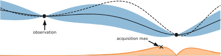{width="4.614583333333333in" height="1.1756944444444444in"}
  ---------------------------------------------------------------------------------------------

{width="0.4021106736657918in"
height="7.6583552055993e-2in"}

  ---------------------------------------------------------------------------------------------
  {width="4.614583333333333in" height="1.2702919947506561in"}
  ---------------------------------------------------------------------------------------------

{width="0.49948600174978125in"
height="7.658245844269466e-2in"}

  ---------------------------------------------------------------------------------------------
  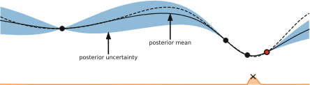{width="4.614583333333333in" height="1.2636493875765529in"}
  ---------------------------------------------------------------------------------------------

[]{#_bookmark97 .anchor}**Fig.** **1.2** Illustration of Bayesian
optimization on a 1-d function. Our goal is to minimize the dashed line
using a Gaussian process surrogate (predictions shown as black line,
with blue tube representing the uncertainty) by maximizing the
acquisition function represented by the lower orange curve. (Top) The
acquisition value is low around observations, and the highest
acquisition value is at a point where the predicted function value is
low and the predictive uncertainty is relatively high. (Middle) While
there is still a lot of variance to the left of the new observation, the
predicted mean to the right is much lower and the next observation is
conducted there. (Bottom) Although there is almost no uncertainty left
around the location of the true maximum, the next evaluation is done
there due to its expected improvement over the best point so far

> 1 Hyperparameter Optimization 11
>
> uncertainty estimates and closed-form computability of the predictive
> distribution. A Gaussian process G(m(**λ**), k(**λ** , **λ**\\)) is
> fully specified by a mean m(**λ**) and a covariance function k(**λ** ,
> **λ**\\), although the mean function is usually assumed to be constant
> in Bayesian optimization. Mean and variance predictions μ( ·) and σ2 (
> ·) for the noise-free case can be obtained by:

μ(**λ**) = **kK**−1**y**, σ 2 (**λ**) = k(**λ** , **λ**) −
**kK**−1**k**\*, (1.4)

> where **k**\* denotes the vector of covariances between **λ** and all
> previous observations, **K** is the covariance matrix of all
> previously evaluated configurations and **y** are the observed function
> values. The quality of the Gaussian process depends solely on the
> covariance function. A common choice is the Mátern 5/2 kernel, with
> its hyperparameters integrated out by Markov Chain Monte Carlo
> \[[140](#_bookmark22)\].

One downside of standard Gaussian processes is that they scale cubically
in the number of data points, limiting their applicability when one can
afford many function evaluations (e.g., with many parallel workers, or
when function evaluations are cheap due to the use of lower fidelities).
This cubic scaling can be avoided by scalable Gaussian process
approximations, such as sparse Gaussian processes. These approximate the
full Gaussian process by using only a subset of the original dataset as
*inducing* *points* to build the kernel matrix **K**. While they allowed
Bayesian optimization with GPs to scale to tens of thousands of
datapoints for optimizing the parameters of a randomized SAT solver
\[[62](#_bookmark100)\], there are criticism about the calibration of
their uncertainty estimates and their applicability to standard HPO has
not been tested \[[104](#_bookmark101), [154](#_bookmark102)\].

Another downside of Gaussian processes with standard kernels is their
poor scalability to high dimensions. As a result, many extensions have
been proposed to efficiently handle intrinsic properties of configuration
spaces with large number of hyperparameters, such as the use of random
embeddings \[[153](#_bookmark84)\], using Gaussian processes on
partitions of the configuration space \[[154](#_bookmark102)\], cylindric
kernels \[[114](#_bookmark103)\], and additive kernels
\[[40](#_bookmark104), [75](#_bookmark105)\].

> Since some other machine learning models are more scalable and flexible
> than Gaussian processes, there is also a large body of research on
> adapting these models to Bayesian optimization. Firstly, (deep) neural
> networks are a very flexible and scalable models. The simplest way to
> apply them to Bayesian optimization is as a feature extractor to
> preprocess inputs and then use the outputs of the final hidden layer as
> basis functions for Bayesian linear regression
> \[[141](#_bookmark90)\]. A more complex, fully Bayesian treatment of
> the network weights, is also possible by using a Bayesian neural
> network trained with stochastic gradient Hamiltonian Monte Carlo
> \[[144](#_bookmark106)\]. Neural networks tend to be faster than
> Gaussian processes for Bayesian optimization after ∼250 function
> evaluations, which also allows for large-scale parallelism. The
> flexibility of deep learning can also enable Bayesian optimization on
> more complex tasks. For example, a variational auto-encoder can be
> used to embed complex inputs (such as the structured configurations of
> the automated statistician, see Chap.[9](#_bookmark12)) into a
> real-valued vector such that a regular Gaussian process can handle it
> \[[92](#_bookmark107)\]. For multi-source Bayesian optimization, a
> neural network architecture built on
>
> 12 M. Feurer and F. Hutter

*factorization* *machines* \[[125](#_bookmark108)\] can include
information on previous tasks \[[131](#_bookmark109)\] and has also been
extended to tackle the CASH problem \[[132](#_bookmark110)\].

> Another alternative model for Bayesian optimization are random forests
> \[[59](#_bookmark82)\]. While GPs perform better than random forests
> on small, numerical configuration spaces \[[29](#_bookmark111)\],
> random forests natively handle larger, categorical and conditional
> configuration spaces where standard GPs do not work well
> \[[29](#_bookmark111), [70](#_bookmark112), [90](#_bookmark83)\].
> Further- more, the computational complexity of random forests scales
> far better to many data points: while the computational complexity of
> fitting and predicting variances with GPs for n data points scales as
> O(n3) and O(n2), respectively, for random forests, the scaling in n is
> only O(n log n) and O(log n), respectively. Due to these advantages,
> the SMAC framework for Bayesian optimization with random forests
> \[[59](#_bookmark82)\] enabled the prominent AutoML frameworks
> Auto-WEKA \[[149](#_bookmark33)\] and Auto-sklearn
> \[[34](#_bookmark48)\] (which are described in Chaps.[4](#_bookmark6)
> and [6](#_bookmark8)).
>
> Instead of modeling the probability p(**y**|**λ**) of observations
> **y** given the config- urations **λ**, the *Tree* *Parzen* *Estimator*
> (TPE \[[12](#_bookmark45), [14](#_bookmark23)\]) models density
> functions p(**λ**|**y** &lt; α) and p(**λ**|**y** ≥ α). Given a
> percentile α (usually set to 15%), the observations are divided in
> good observations and bad observations and simple 1-d Parzen windows
> are used to model the two distributions. The ratio
> {width="0.435in"
> height="0.23458333333333334in"} is related to the expected improvement
> acquisition function and is used to propose new hyperparameter
> configurations. TPE uses a tree of Parzen estimators for conditional
>
> hyperparameters and demonstrated good performance on such structured
> HPO tasks \[[12](#_bookmark45), [14](#_bookmark23),
> [29](#_bookmark111), [33](#_bookmark50), [143](#_bookmark113),
> [149](#_bookmark33), [160](#_bookmark95)\], is conceptually simple,
> and parallelizes naturally \[[91](#_bookmark85)\]. It is also the
> workhorse behind the AutoML framework Hyperopt- sklearn
> \[[83](#_bookmark49)\] (which is described in Chap.[5](#_bookmark7)).
>
> Finally, we note that there are also surrogate-based approaches which
> do not follow the Bayesian optimization paradigm: Hord
> \[[67](#_bookmark114)\] uses a deterministic RBF surrogate, and
> Harmonica \[[52](#_bookmark115)\] uses a compressed sensing technique,
> both to tune the hyperparameters of deep neural networks.
>
> **1.3.2.3** **Configuration** **Space** **Description**
>
> Bayesian optimization was originally designed to optimize
> box-constrained, real- valued functions. However, for many machine
> learning hyperparameters, such as the learning rate in neural networks
> or regularization in support vector machines, it is common to optimize
> the exponent of an exponential term to describe that changing it,
> e.g., from 0.001 to 0.01 is expected to have a similarly high impact
> as changing it from 0. 1 to 1. A technique known as *input* *warping*
> \[[142](#_bookmark116)\] allows to automatically learn such
> transformations during the optimization process by replacing each
> input dimension with the two parameters of a Beta distribution and
> optimizing these.
>
> One obvious limitation of the box-constraints is that the user needs
> to define these upfront. To avoid this, it is possible to dynamically
> expand the configura- tion space \[[113](#_bookmark46),
> [136](#_bookmark47)\]. Alternatively, the
> estimation-of-distribution-style algorithm TPE \[[12](#_bookmark45)\]
> is able to deal with infinite spaces on which a (typically Gaussian)
> prior is placed.
>
> 1 Hyperparameter Optimization 13

Integers and categorical hyperparameters require special treatment but
can be integrated fairly easily into regular Bayesian optimization by
small adaptations of the kernel and the optimization procedure (see
Sect. 12. 1.2 of \[[58](#_bookmark117)\], as well as
\[[42](#_bookmark118)\]). Other models, such as factorization machines
and random forests, can also naturally handle these data types.

> Conditional hyperparameters are still an active area of research (see
> Chaps.[5](#_bookmark7) and[6](#_bookmark8)for depictions of
> conditional configuration spaces in recent AutoML systems). They can be
> handled natively by tree-based methods, such as random forests
> \[[59](#_bookmark82)\] and tree Parzen estimators (TPE)
> \[[12](#_bookmark45)\], but due to the numerous advantages of Gaussian
> processes over other models, multiple kernels for structured
> configuration spaces have also been proposed \[[4](#_bookmark60),
> [12](#_bookmark45), [63](#_bookmark119), [70](#_bookmark112),
> [92](#_bookmark107), [96](#_bookmark120), [146](#_bookmark121)\].
>
> []{#_bookmark72 .anchor}**1.3.2.4** **Constrained** **Bayesian**
> **Optimization**

In realistic scenarios it is often necessary to satisfy constraints,
such as memory consumption \[[139](#_bookmark122),
[149](#_bookmark33)\], training time \[[149](#_bookmark33)\], prediction
time \[[41](#_bookmark123), [43](#_bookmark124)\], accuracy of a
compressed model \[[41](#_bookmark123)\], energy usage
\[[43](#_bookmark124)\] or simply to not fail during the training
procedure \[[43](#_bookmark124)\].

> Constraints can be *hidden* in that only a binary observation (success
> or failure) is available \[[88](#_bookmark125)\]. Typical examples in
> AutoML are memory and time constraints to allow training of the
> algorithms in a shared computing system, and to make sure that a
> single slow algorithm configuration does not use all the time available
> for HPO \[[34](#_bookmark48), [149](#_bookmark33)\] (see also
> Chaps.[4](#_bookmark6)and [6](#_bookmark8)).
>
> Constraints can also merely be *unknown*, meaning that we can observe
> and model an auxiliary constraint function, but only know about a
> constraint violation after evaluating the target function
> \[[46](#_bookmark126)\]. An example of this is the prediction time of
> a support vector machine, which can only be obtained by training it as
> it depends on the number of support vectors selected during training.
>
> The simplest approach to model violated constraints is to define a
> penalty value (at least as bad as the worst possible observable loss
> value) and use it as the observation for failed runs
> \[[34](#_bookmark48), [45](#_bookmark34), [59](#_bookmark82),
> [149](#_bookmark33)\]. More advanced approaches model the probability
> of violating one or more constraints and actively search for
> configurations with low loss values that are unlikely to violate any of
> the given constraints \[[41](#_bookmark123), [43](#_bookmark124),
> [46](#_bookmark126), [88](#_bookmark125)\].

Bayesian optimization frameworks using information theoretic acquisition
func- tions allow decoupling the evaluation of the target function and
the constraints to dynamically choose which of them to evaluate next
\[[43](#_bookmark124), [55](#_bookmark127)\]. This becomes advantageous
when evaluating the function of interest and the constraints require
vastly different amounts of time, such as evaluating a deep neural
network’s performance and memory consumption \[[43](#_bookmark124)\].

> 14 M. Feurer and F. Hutter
>
> []{#_bookmark42 .anchor}**1.4** **Multi-fidelity** **Optimization**

Increasing dataset sizes and increasingly complex models are a major
hurdle in HPO since they make blackbox performance evaluation more
expensive. Training a single hyperparameter configuration on large
datasets can nowadays easily exceed several hours and take up to several
days \[[85](#_bookmark128)\].

A common technique to speed up manual tuning is therefore to probe an
algorithm/hyperparameter configuration on a small subset of the data, by
training it only for a few iterations, by running it on a subset of
features, by only using one or a few of the cross-validation folds, or
by using down-sampled images in computer vision. Multi-fidelity methods
cast such manual heuristics into formal algorithms, using so-called low
fidelity approximations of the actual loss function to minimize. These
approximations introduce a tradeoff between optimization performance and
runtime, but in practice, the obtained speedups often outweigh the
approximation error.

> First, we review methods which model an algorithm’s learning curve
> during training and can stop the training procedure if adding further
> resources is predicted to not help. Second, we discuss simple
> selection methods which only choose one of a finite set of given
> algorithms/hyperparameter configurations. Third, we discuss
> multi-fidelity methods which can actively decide which fidelity will
> provide most information about finding the optimal hyperparameters. We
> also refer to Chap.[2](#_bookmark3) (which discusses how multi-fidelity
> methods can be used across datasets) and Chap.[3](#_bookmark4) (which
> describes low-fidelity approximations for neural architecture search).

***1.4.1*** ***Learning*** ***Curve-Based*** ***Predictionfor***
***Early*** ***Stopping***

We start this section on multi-fidelity methods in HPO with methods that
evaluate and model learning curves during HPO \[[82](#_bookmark26),
[123](#_bookmark129)\] and then decide whether to add further resources
or stop the training procedure for a given hyperparameter configuration.
Examples of learning curves are the performance of the same con-
figuration trained on increasing dataset subsets, or the performance of
an iterative algorithm measured for each iteration (or every i -th
iteration if the calculation of the performance is expensive).

> Learning curve extrapolation is used in the context of*predictive*
> *termination* \[[26](#_bookmark130)\], where a learning curve model is
> used to extrapolate a partially observed learning curve for a
> configuration, and the training process is stopped if the configuration
> is predicted to not reach the performance of the best model trained so
> far in the optimization process. Each learning curve is modeled as a
> weighted combination of 11 parametric functions from various scientific
> areas. These functions’ parameters and their weights are sampled via
> Markov chain Monte Carlo to minimize the loss of fitting the partially
> observed learning curve. This yields a predictive distribution,
>
> 1 Hyperparameter Optimization 15

which allows to stop training based on the probability of not beating
the best known model. When combined with Bayesian optimization, the
predictive termination cri- terion enabled lower error rates than
off-the-shelve blackbox Bayesian optimization for optimizing neural
networks. On average, the method sped up the optimization by a factor of
two and was able to find a (then) state-of-the-art neural network for
CIFAR- 10 (without data augmentation) \[[26](#_bookmark130)\].

While the method above is limited by not sharing information across
different hyperparameter configurations, this can be achieved by using
the basis functions as the output layer of a Bayesian neural network
\[[80](#_bookmark131)\]. The parameters and weights of the basis
functions, and thus the full learning curve, can thereby be predicted
for arbitrary hyperparameter configurations. Alternatively, it is
possible to use previous learning curves as basis function extrapolators
\[[21](#_bookmark132)\]. While the experimental results are inconclusive
on whether the proposed method is superior to pre-specified parametric
functions, not having to manually define them is a clear advantage.

> *Freeze-Thaw* Bayesian optimization \[[148](#_bookmark133)\] is a full
> integration of learning curves into the modeling and selection process
> of Bayesian optimization. Instead of terminating a configuration, the
> machine learning models are trained iteratively for a few iterations
> and then*frozen*. Bayesian optimization can then decide to *thaw* one
> of the frozen models, which means to continue training it.
> Alternatively, the method can also decide to start a new configuration.
> Freeze-Thaw models the performance of a converged algorithm with a
> regular Gaussian process and introduces a special covariance function
> corresponding to exponentially decaying functions to model the
> learning curves with per-learning curve Gaussian processes.

[]{#_bookmark134 .anchor}***1.4.2*** ***Bandit-Based*** ***Algorithm***
***Selection*** ***Methods***

> In this section, we describe methods that try to determine the best
> algorithm out of a given finite set of algorithms based on low-fidelity
> approximations of their performance; towards its end, we also discuss
> potential combinations with adaptive configuration strategies. We focus
> on variants of the bandit-based strategies *successive* *halving* and
> *Hyperband*, since these have shown strong performance, especially for
> optimizing deep learning algorithms. Strictly speaking, some of the
> methods which we will discuss in this subsection also model learning
> curves, but they provide no means of selecting new configurations based
> on these models.
>
> First, however, we briefly describe the historical evolution of
> multi-fidelity algorithm selection methods. In 2000, Petrak
> \[[120](#_bookmark135)\] noted that simply testing various algorithms
> on a small subset of the data is a powerful and cheap mechanism to
> select an algorithm. Later approaches used iterative algorithm
> elimination schemes to drop hyperparameter configurations if they
> perform badly on subsets of the data \[[17](#_bookmark136)\], if they
> perform significantly worse than a group of top-performing
> configurations \[[86](#_bookmark137)\], if they perform worse than the
> best configuration by a user- specified factor \[[143](#_bookmark113)\],
> or if even an optimistic performance bound for an algorithm is worse
> than the best known algorithm \[[128](#_bookmark138)\]. Likewise, it
> is possible to drop

{width="1.418332239720035in"
height="6.944444444444444e-3in"}

> 16 M. Feurer and F. Hutter
>
> hyperparameter configurations if they perform badly on one or a few
> cross- validation folds \[[149](#_bookmark33)\]. Finally, Jamieson and
> Talwalkar \[[69](#_bookmark139)\] proposed to use the *successive*
> *halving* algorithm originally introduced by Karnin et al.
> \[[76](#_bookmark140)\] for HPO.

{width="0.3560126859142607in"
height="0.10031824146981627in"}

> []{#_bookmark141 .anchor}**Fig.** **1.3** Illustration of successive
> halving for eight algorithms/configurations. After evaluating all
> algorithms on
> 1{width="1.399825021872266e-4in"
> height="6.666666666666667e-3in"}8 of the total budget, half of them
> are dropped and the budget given to the remaining algorithms is
> doubled

*Successive* *halving* is an extremely simple, yet powerful, and
therefore popular strategy for multi-fidelity algorithm selection: for a
given initial budget, query all algorithms for that budget; then, remove
the half that performed worst, double the budget [2](#_bookmark142) and
successively repeat until only a single algorithm is left. This process
is illustrated in Fig.[1.3](#_bookmark141). Jamieson and Talwalkar
\[[69](#_bookmark139)\] benchmarked several common bandit methods and
found that successive halving performs well both in terms of the number
of required iterations and in the required computation time, that the
algorithm theoretically outperforms a uniform budget allocation strategy
if the algorithms converge favorably, and that it is preferable to many
well-known bandit strategies from the literature, such as *UCB* and
*EXP3*.

While successive halving is an efficient approach, it suffers from the
budget- vs-number of configurations trade off. Given a total budget, the
user has to decide beforehand whether to try many configurations and only
assign a small budget to each, or to try only a few and assign them a
larger budget. Assigning too small a budget can result in prematurely
terminating good configurations, while assigning too large a budget can
result in running poor configurations too long and thereby
[]{#_bookmark142 .anchor}wasting resources.

> 2More precisely, drop the worst fraction
> {width="0.163332239720035in"
> height="0.1814938757655293in"} of algorithms and multiply the budget
> for the remaining algorithms by η, where η is a hyperparameter. Its
> default value was changed from 2 to 3 with the introduction of
> HyperBand \[[90](#_bookmark83)\].
>
> 1 Hyperparameter Optimization 17

HyperBand \[[90](#_bookmark83)\] is a hedging strategy designed to
combat this problem when selecting from randomly sampled configurations.
It divides the total budget into several combinations of number of
configurations vs. budget for each, to then call successive halving as a
subroutine on each set of random configurations. Due to the hedging
strategy which includes running some configurations only on the maximal
budget, in the worst case, HyperBand takes at most a constant factor
more time than vanilla random search on the maximal budget. In practice,
due to its use of cheap low-fidelity evaluations, HyperBand has been
shown to improve over vanilla random search and blackbox Bayesian
optimization for data subsets, feature subsets and iterative algorithms,
such as stochastic gradient descent for deep neural networks.

Despite HyperBand’s success for deep neural networks it is very limiting
to not adapt the configuration proposal strategy to the function
evaluations. To overcome this limitation, the recent approach BOHB
\[[33](#_bookmark50)\] combines Bayesian optimization and HyperBand to
achieve the best of both worlds: strong anytime performance (quick
improvements in the beginning by using low fidelities in HyperBand) and
strong final performance (good performance in the long run by replacing
HyperBand’s random search by Bayesian optimization). BOHB also uses
parallel resources effectively and deals with problem domains ranging
from a few to many dozen hyperparameters. BOHB’s Bayesian optimization
component resembles TPE \[[12](#_bookmark45)\], but differs by using
multidimensional kernel density estimators. It only fits a model on the
highest fidelity for which at least |**A**| + 1 evaluations have been
performed (the number of hyperparameters, plus one). BOHB’s first model
is therefore fitted on the lowest fidelity, and over time models trained
on higher fidelities take over, while still using the lower fidelities in
successive halving. Empirically, BOHB was shown to outperform several
state-of-the-art HPO methods for tuning support vector machines, neural
networks and reinforcement learning algorithms, including most methods
presented in this section \[[33](#_bookmark50)\]. Further approaches to
combine HyperBand and Bayesian optimization have also been proposed
\[[15](#_bookmark143), [151](#_bookmark144)\].

Multiple fidelity evaluations can also be combined with HPO in other
ways. Instead of switching between lower fidelities and the highest
fidelity, it is possible to perform HPO on a subset of the original data
and extract the best-performing con- figurations in order to use them as
an initial design for HPO on the full dataset \[[152](#_bookmark145)\].
To speed up solutions to the CASH problem, it is also possible to
iteratively remove entire algorithms (and their hyperparameters) from
the configuration space based on poor performance on small dataset
subsets \[[159](#_bookmark94)\].

***1.4.3*** ***Adaptive*** ***Choices*** ***of*** ***Fidelities***

> All methods in the previous subsection follow a predefined schedule for
> the fidelities. Alternatively, one might want to actively choose which
> fidelities to evaluate given previous observations to prevent a
> misspecification of the schedule.
>
> 18 M. Feurer and F. Hutter

Multi-task Bayesian optimization \[[147](#_bookmark55)\] uses a
multi-task Gaussian process to model the performance of related tasks
and to automatically learn the tasks’ correlation during the
optimization process. This method can dynamically switch between
cheaper, low-fidelity tasks and the expensive, high-fidelity target task
based on a cost-aware information-theoretic acquisition function. In
practice, the proposed method starts exploring the configuration space on
the cheaper task and only switches to the more expensive configuration
space in later parts of the optimization, approximately halving the time
required for HPO. Multi-task Bayesian optimization can also be used to
transfer information from previous optimization tasks, and we refer to
Chap.[2](#_bookmark3) for further details.

> Multi-task Bayesian optimization (and the methods presented in the
> previous subsection) requires an upfront specification of a set of
> fidelities. This can be suboptimal since these can be misspecified
> \[[74](#_bookmark146), [78](#_bookmark53)\] and because the number of
> fidelities that can be handled is low (usually five or less). Therefore,
> and in order to exploit the typically smooth dependence on the fidelity
> (such as, e.g., size of the data subset used), it often yields better
> results to treat the fidelity as continuous (and, e.g., choose a
> continuous percentage of the full data set to evaluate a configuration
> on), trading off the information gain and the time required for
> evaluation \[[78](#_bookmark53)\]. To exploit the domain knowledge
> that performance typically improves with more data, with diminishing
> returns, a special kernel can be constructed for the data subsets
> \[[78](#_bookmark53)\]. This generalization of multi-task Bayesian
> optimization improves performance and can achieve a 10– 100 fold
> speedup compared to blackbox Bayesian optimization.

Instead of using an information-theoretic acquisition function, Bayesian
opti- mization with the *Upper* *Confidence* *Bound* (UCB) acquisition
function can also be extended to multiple fidelities
\[[73](#_bookmark147), [74](#_bookmark146)\]. While the first such
approach, MF- GP-UCB \[[73](#_bookmark147)\], required upfront fidelity
definitions, the later BOCA algorithm \[[74](#_bookmark146)\] dropped
that requirement. BOCA has also been applied to optimization with more
than one continuous fidelity, and we expect HPO for more than one
continuous fidelity to be of further interest in the future.

> Generally speaking, methods that can adaptively choose their fidelity
> are very appealing and more powerful than the conceptually simpler
> bandit-based methods discussed in Sect.[1.4.2](#_bookmark134), but in
> practice we caution that strong models are required to make successful
> choices about the fidelities. When the models are not strong (since
> they do not have enough training data yet, or due to model mismatch),
> these methods may spend too much time evaluating higher fidelities, and
> the more robust fixed budget schedules discussed in
> Sect.[1.4.2](#_bookmark134)might yield better performance given a fixed
> time limit.
>
> []{#_bookmark43 .anchor}**1.5** **Applications** **to** **AutoML**
>
> In this section, we provide a historical overview of the most
> important hyperparam- eter optimization systems and applications to
> automated machine learning.
>
> 1 Hyperparameter Optimization 19
>
> Grid search has been used for hyperparameter optimization since the
> 1990s \[[71](#_bookmark148), [107](#_bookmark27)\] and was already
> supported by early machine learning tools in 2002
> \[[35](#_bookmark149)\]. The first adaptive optimization methods
> applied to HPO were greedy depth-first search \[[82](#_bookmark26)\]
> and pattern search \[[109](#_bookmark59)\], both improving over
> default hyperparam- eter configurations, and pattern search improving
> over grid search, too. Genetic algorithms were first applied to tuning
> the two hyperparameters C and γ of an RBF- SVM in 2004
> \[[119](#_bookmark150)\] and resulted in improved classification
> performance in less time than grid search. In the same year, an
> evolutionary algorithm was used to learn a composition of three
> different kernels for an SVM, the kernel hyperparameters and to
> jointly select a feature subset; the learned combination of kernels
> was able to outperform every single optimized kernel. Similar in
> spirit, also in 2004, a genetic algorithm was used to select both the
> features used by and the hyperparameters of either an SVM or a neural
> network \[[129](#_bookmark151)\].
>
> CMA-ES was first used for hyperparameter optimization in 2005
> \[[38](#_bookmark152)\], in that case to optimize an SVM’s
> hyperparameters C and γ , a kernel lengthscale li for each dimension
> of the input data, and a complete rotation and scaling matrix. Much
> more recently, CMA-ES has been demonstrated to be an excellent choice
> for parallel HPO, outperforming state-of-the-art Bayesian optimization
> tools when optimizing 19 hyperparameters of a deep neural network on
> 30 GPUs in parallel \[[91](#_bookmark85)\].

In 2009, Escalante et al. \[[30](#_bookmark29)\] extended the HPO
problem to the *Full* *Model* *Selection* problem, which includes
selecting a preprocessing algorithm, a feature selection algorithm, a
classifier and all their hyperparameters. By being able to construct a
machine learning pipeline from multiple off-the-shelf machine learning
algorithms using HPO, the authors empirically found that they can apply
their method to any data set as no domain knowledge is required, and
demonstrated the applicability of their approach to a variety of domains
\[[32](#_bookmark153), [49](#_bookmark154)\]. Their proposed method,
particle swarm model selection (PSMS), uses a modified particle swarm
optimizer to handle the conditional configuration space. To avoid
overfitting, PSMS was extended with a custom ensembling strategy which
combined the best solutions from multiple generations
\[[31](#_bookmark62)\]. Since particle swarm optimization was originally
designed to work on continuous configuration spaces, PSMS was later also
extended to use a genetic algorithm to optimize the pipeline structure
and only use particle swarm optimization to optimize the hyperparameters
of each pipeline \[[145](#_bookmark155)\].

To the best of our knowledge, the first application of Bayesian
optimization to HPO dates back to 2005, when Frohlich and Zell
\[[39](#_bookmark156)\] used an online Gaussian process together with EI
to optimize the hyperparameters of an SVM, achieving speedups of factor
10 (classification, 2 hyperparameters) and 100 (regression, 3
hyperparameters) over grid search. Tuned Data Mining
\[[84](#_bookmark157)\] proposed to tune the hyperparameters of a full
machine learning pipeline using Bayesian optimization; specifically, this
used a single fixed pipeline and tuned the hyperparameters of the
classifier as well as the per-class classification threshold and class
weights.

> In 2011, Bergstra et al. \[[12](#_bookmark45)\] were the first to apply
> Bayesian optimization to tune the hyperparameters of a deep neural
> network, outperforming both manual and random search. Furthermore,
> they demonstrated that TPE resulted in better
>
> 20 M. Feurer and F. Hutter
>
> performance than a Gaussian process-based approach. TPE, as well as
> Bayesian optimization with random forests, were also successful for
> joint neural architecture search and hyperparameter optimization
> \[[14](#_bookmark23), [106](#_bookmark158)\].

Another important step in applying Bayesian optimization to HPO was made
by Snoek et al. in the 2012 paper *Practical* *Bayesian* *Optimization*
*of* *Machine* *Learning* *Algorithms* \[[140](#_bookmark22)\], which
describes several tricks of the trade for Gaussian process- based HPO
implemented in the Spearmint system and obtained a new state-of-the- art
result for hyperparameter optimization of deep neural networks.

> Independently of the Full Model Selection paradigm, Auto-WEKA
> \[[149](#_bookmark33)\] (see also Chap.[4](#_bookmark6)) introduced
> the *Combined* *Algorithm* *Selection* *and* *Hyperparameter*
> *Optimization* (CASH) problem, in which the choice of a classification
> algorithm is modeled as a categorical variable, the algorithm
> hyperparameters are modeled as conditional hyperparameters, and the
> random-forest based Bayesian optimization system SMAC
> \[[59](#_bookmark82)\] is used for joint optimization in the resulting
> 786-dimensional configuration space.
>
> In recent years, multi-fidelity methods have become very popular,
> especially in deep learning. Firstly, using low-fidelity approximations
> based on data subsets, feature subsets and short runs of iterative
> algorithms, Hyperband \[[90](#_bookmark83)\] was shown to outperform
> blackbox Bayesian optimization methods that did not take these lower
> fidelities into account. Finally, most recently, in the 2018 paper
> *BOHB:* *Robust* *and* *Efficient* *Hyperparameter* *Optimization* *at*
> *Scale*, Falkner et al. \[[33](#_bookmark50)\] introduced a robust,
> flexible, and parallelizable combination of Bayesian optimiza- tion and
> Hyperband that substantially outperformed both Hyperband and blackbox
> Bayesian optimization for a wide range of problems, including tuning
> support vector machines, various types of neural networks, and
> reinforcement learning algorithms.
>
> At the time of writing, we make the following recommendations for
> which tools we would use in practical applications of HPO:
>
> • If multiple fidelities are applicable (i.e., if it is possible to
> define substantially cheaper versions of the objective function of
> interest, such that the performance for these roughly correlates with
> the performance for the full objective function of interest), we
> recommend BOHB \[[33](#_bookmark50)\] as a robust, efficient,
> versatile, and parallelizable default hyperparameter optimization
> method.
>
> • If multiple fidelities are not applicable:
>
> – If all hyperparameters are real-valued and one can only afford a few
> dozen function evaluations, we recommend the use of a Gaussian
> process-based Bayesian optimization tool, such as Spearmint
> \[[140](#_bookmark22)\].
>
> – For large and conditional configuration spaces we suggest either the
> random forest-based SMAC \[[59](#_bookmark82)\] or TPE
> \[[14](#_bookmark23)\], due to their proven strong performance on such
> tasks \[[29](#_bookmark111)\].
>
> – For purely real-valued spaces and relatively cheap objective
> functions, for which one can afford more than hundreds of evaluations,
> we recommend CMA-ES \[[51](#_bookmark86)\].
>
> 1 Hyperparameter Optimization 21
>
> []{#_bookmark44 .anchor}**1.6** **Open** **Problems** **and**
> **Future** **Research** **Directions**

We conclude this chapter with a discussion of open problems, current
research questions and potential further developments we expect to have
an impact on HPO in the future. Notably, despite their relevance, we
leave out discussions on hyperparameter importance and configuration
space definition as these fall under the umbrella of meta-learning and
can be found in Chap.[2](#_bookmark3).

***1.6.1*** ***Benchmarks*** ***and*** ***Comparability***

Given the breadth of existing HPO methods, a natural question is what
are the strengths and weaknesses of each of them. In order to allow for
a fair com- parison between different HPO approaches, the community
needs to design and agree upon a common set of benchmarks that expands
over time, as new HPO variants, such as multi-fidelity optimization,
emerge. As a particular example for what this could look like we would
like to mention the COCO platform (short for comparing continuous
optimizers), which provides benchmark and analysis tools for continuous
optimization and is used as a workbench for the yearly Black-Box
Optimization Benchmarking (BBOB) challenge \[[11](#_bookmark87)\].
Efforts along similar lines in HPO have already yielded the
hyperparameter optimization library (HPOlib \[[29](#_bookmark111)\]) and
a benchmark collection specifically for Bayesian optimization methods
\[[25](#_bookmark159)\]. However, neither of these has gained similar
traction as the COCO platform.

Additionaly, the community needs clearly defined metrics, but currently
different works use different metrics. One important dimension in which
evaluations differ is whether they report performance on the validation
set used for optimization or on a separate test set. The former helps to
study the strength of the optimizer in isolation, without the noise that
is added in the evaluation when going from validation to test set; on
the other hand, some optimizers may lead to more overfitting than others,
which can only be diagnosed by using the test set. Another important
dimension in which evaluations differ is whether they report perfor-
mance after a given number of function evaluations or after a given
amount of time. The latter accounts for the difference in time between
evaluating different hyperparameter configurations and includes
optimization overheads, and therefore reflects what is required in
practice; however, the former is more convenient and aids
reproducibility by yielding the same results irrespective of the
hardware used. To aid reproducibility, especially studies that use time
should therefore release an implementation.

> We note that it is important to compare against strong baselines when
> using new benchmarks, which is another reason why HPO methods should
> be published with an accompanying implementation. Unfortunately, there
> is no common software library as is, for example, available in deep
> learning research that implements all
>
> 22 M. Feurer and F. Hutter

the basic building blocks \[[2](#_bookmark160), [117](#_bookmark161)\].
As a simple, yet effective baseline that can be trivially included in
empirical studies, Jamieson and Recht \[[68](#_bookmark162)\] suggest to
compare against different parallelization levels of random search to
demonstrate the speedups over regular random search. When comparing to
other optimization techniques it is important to compare against a solid
implementation, since, e.g., simpler versions of Bayesian optimization
have been shown to yield inferior performance \[[79](#_bookmark163),
[140](#_bookmark22), [142](#_bookmark116)\].

***1.6.2*** ***Gradient-Based*** ***Optimization***

> In some cases (e.g., least-squares support vector machines and neural
> networks) it is possible to obtain the gradient of the model selection
> criterion with respect to some of the model hyperparameters. Different
> to blackbox HPO, in this case each evaluation of the target function
> results in an entire hypergradient vector instead of
>
> a single float value, allowing for faster HPO.

Maclaurin et al. \[[99](#_bookmark164)\] described a procedure to
compute the exact gradients of validation performance with respect to
all continuous hyperparameters of a neural network by backpropagating
through the entire training procedure of stochastic gradient descent
with momentum (using a novel, memory-efficient algorithm). Being able to
handle many hyperparameters efficiently through gradient-based methods
allows for a new paradigm of hyperparametrizing the model to obtain
flexibility over model classes, regularization, and training methods.
Maclaurin et al. demonstrated the applicability of gradient-based HPO to
many high-dimensional HPO problems, such as optimizing the learning rate
of a neural network for each iteration and layer separately, optimizing
the weight initialization scale hyperpa- rameter for each layer in a
neural network, optimizing the l2 penalty for each individual parameter
in logistic regression, and learning completely new training datasets.
As a small downside, backpropagating through the entire training proce-
dure comes at the price of doubling the time complexity of the training
procedure. The described method can also be generalized to work with
other parameter update algorithms \[[36](#_bookmark165)\]. To overcome
the necessity of backpropagating through the complete training
procedure, later work allows to perform hyperparameter updates with
respect to a separate validation set interleaved with the training
process \[[5](#_bookmark166), [10](#_bookmark167), [36](#_bookmark165),
[37](#_bookmark168), [93](#_bookmark169)\].

> Recent examples of gradient-based optimization of simple model’s
> hyperparam- eters \[[118](#_bookmark170)\] and of neural network
> structures (see Chap. [3](#_bookmark4)) show promising results,
> outperforming state-of-the-art Bayesian optimization models. Despite
> being highly model-specific, the fact that gradient-based
> hyperparemeter optimization allows tuning several hundreds of
> hyperparameters could allow substantial improvements
>
> in HPO.

{width="1.418332239720035in"
height="6.944444444444444e-3in"}

> 1 Hyperparameter Optimization 23
>
> ***1.6.3*** ***Scalability***
>
> Despite recent successes in multi-fidelity optimization, there are
> still machine learning problems which have not been directly tackled
> by HPO due to their scale, and which might require novel approaches.
> Here, scale can mean both the size of the configuration space and the
> expense of individual model evaluations. For example, there has not
> been any work on HPO for deep neural networks on the ImageNet
> challenge dataset \[[127](#_bookmark171)\] yet, mostly because of the
> high cost of training even a simple neural network on the dataset. It
> will be interesting to see whether methods going beyond the blackbox
> view from Sect.[1.3](#_bookmark41), such as the multi-fidelity methods
> described in Sect.[1.4](#_bookmark42), gradient-based methods, or
> meta-learning methods (described in Chap.[2](#_bookmark3)) allow to
> tackle such problems. Chap. [3](#_bookmark4) describes first successes
> in learning neural network building blocks on smaller datasets and
> applying them to ImageNet, but the hyperparameters of the training
> procedure are still set manually.

Given the necessity of parallel computing, we are looking forward to new
methods that fully exploit large-scale compute clusters. While there
exists much work on parallel Bayesian optimization \[[12](#_bookmark45),
[24](#_bookmark172), [33](#_bookmark50), [44](#_bookmark173),
[54](#_bookmark174), [60](#_bookmark175), [135](#_bookmark92),
[140](#_bookmark22)\], except for the neural networks described in
Sect.[1.3.2.2](#_bookmark98) \[[141](#_bookmark90)\], so far no method
has demonstrated scalability to hundreds of workers. Despite their
popularity, and with a single exception of HPO applied to deep neural
networks \[[91](#_bookmark85)\],[3](#_bookmark176) population- based
approaches have not yet been shown to be applicable to hyperparameter
optimization on datasets larger than a few thousand data points.

Overall, we expect that more sophisticated and specialized methods,
leaving the blackbox view behind, will be needed to further scale
hyperparameter to interesting problems.

> ***1.6.4*** ***Overfitting*** ***and*** ***Generalization***
>
> An open problem in HPO is overfitting. As noted in the problem
> statement (see Sect.[1.2](#_bookmark40)), we usually only have a finite
> number of data points available for calculating the validation loss to
> be optimized and thereby do not necessarily optimize for
> generalization to unseen test datapoints. Similarly to overfitting a
> machine learning algorithm to training data, this problem is about
> overfitting the hyperparameters to the finite validation set; this was
> also demonstrated to happen experimentally \[[20](#_bookmark177),
> [81](#_bookmark178)\].
>
> A simple strategy to reduce the amount of overfitting is to employ a
> different shuffling of the train and validation split for each function
> evaluation; this was shown to improve generalization performance for
> SVM tuning, both with a holdout and a cross-validation strategy
> \[[95](#_bookmark179)\]. The selection of the final configuration can
>
> 3 See also Chap. [3](#_bookmark4) where population-based methods are
> applied to Neural Architecture Search []{#_bookmark176
> .anchor}problems.
>
> 24 M. Feurer and F. Hutter

be further robustified by not choosing it according to the lowest
observed value, but according to the lowest predictive mean of the
Gaussian process model used in Bayesian optimization
\[[95](#_bookmark179)\].

> Another possibility is to use a separate holdout set to assess
> configurations found by HPO to avoid bias towards the standard
> validation set \[[108](#_bookmark180), [159](#_bookmark94)\].
> Different approximations of the generalization performance can lead to
> different test performances \[[108](#_bookmark180)\], and there have
> been reports that several resampling strategies can result in
> measurable performance differences for HPO of support vector machines
> \[[150](#_bookmark181)\].

A different approach to combat overfitting might be to find *stable*
*optima* instead of *sharp* *optima* of the objective function
\[[112](#_bookmark182)\]. The idea is that for stable optima, the
function value around an optimum does not change for slight
perturbations of the hyperparameters, whereas it *does* change for sharp
optima. Stable optima lead to better generalization when applying the
found hyperparameters to a new, unseen set of datapoints (i.e., the test
set). An acquisition function built around this was shown to only
slightly overfit for support vector machine HPO, while regular Bayesian
optimization exhibited strong overfitting \[[112](#_bookmark182)\].

Further approaches to combat overfitting are the ensemble methods and
Bayesian methods presented in Sect.[1.2.1](#_bookmark57). Given all
these different techniques, there is no commonly agreed-upon technique
for how to best avoid overfitting, though, and it remains up to the user
to find out which strategy performs best on their particular HPO problem.
We note that the best strategy might actually vary across HPO problems.

***1.6.5*** ***Arbitrary-Size*** ***Pipeline*** ***Construction***

> All HPO techniques we discussed so far assume a finite set of
> components for machine learning pipelines or a finite maximum number of
> layers in neural networks. For machine learning pipelines (see the
> AutoML systems covered in Part [II](#_bookmark5) of this book) it
> might be helpful to use more than one feature preprocessing algorithm
> and dynamically add them if necessary for a problem, enlarging the
> search space by a hyperparameter to select an appropriate
> preprocessing algorithm and its own hyperparameters. While a search
> space for standard blackbox optimization tools could easily include
> several extra such preprocessors (and their hyperparame- ters) as
> conditional hyperparameters, an unbounded number of these would be
> hard to support.
>
> One approach for handling arbitrary-sized pipelines more natively is
> the tree- structured pipeline optimization toolkit (TPOT
> \[[115](#_bookmark183)\], see also Chap.[8](#_bookmark11)), which uses
> genetic programming and describes possible pipelines by a grammar.
> TPOT uses multi-objective optimization to trade off pipeline
> complexity with performance to avoid generating unnecessarily complex
> pipelines.
>
> 1 Hyperparameter Optimization 25

A different pipeline creation paradigm is the usage of hierarchical
planning; the recent ML-Plan \[[101](#_bookmark184),
[108](#_bookmark180)\] uses hierarchical task networks and shows
competitive performance compared to Auto-WEKA \[[149](#_bookmark33)\]
and Auto-sklearn \[[34](#_bookmark48)\].

So far these approaches are not consistently outperforming AutoML
systems with a fixed pipeline length, but larger pipelines may provide
more improvement. Similarly, neural architecture search yields complex
configuration spaces and we refer to Chap.[3](#_bookmark4)for a
description of methods to tackle them.

**Acknowledgements** We would like to thank Luca Franceschi, Raghu
Rajan, Stefan Falkner and Arlind Kadra for valuable feedback on the
manuscript.

> [[]{#_bookmark160 .anchor}]{#_bookmark185 .anchor}**Bibliography**
>
> 1\. Proceedings of the International Conference on Learning
> Representations (ICLR’18) (2018), published online:
> [iclr.cc](www.iclr.cc)
>
> 2\. Abadi, M., Agarwal, A., Barham, P., Brevdo, E., Chen, Z., Citro, C.,
> Corrado, G., Davis, A., Dean, J., Devin, M., Ghemawat, S., Goodfellow,
> I., Harp, A., Irving, G., Isard, M., Jia, Y., Jozefowicz, R., Kaiser,
> L., Kudlur, M., Levenberg, J., Mané, D., Monga, R., Moore, S., Murray,
> D., Olah, C., Schuster, M., Shlens, J., Steiner, B., Sutskever, I.,
> Talwar, K., Tucker, P., Vanhoucke, V., Vasudevan, V., Viégas, F.,
> Vinyals, O., Warden, P., Wattenberg, M., Wicke, M., Yu, Y., Zheng, X.:
> TensorFlow: Large-scale machine learning on heterogeneous systems
>
> []{#_bookmark81 .anchor}(2015),
> [https:/www.tensorflow.org/](https:/www.tensorflow.org/)
>
> 3\. Ahmed, M., Shahriari, B., Schmidt, M.: Do we need “harmless” Bayesian
> optimization and “first-order” Bayesian optimization. In: NeurIPS
> Workshop on Bayesian Optimization []{#_bookmark60 .anchor}(BayesOpt’16)
> (2016)
>
> 4\. Alaa, A., van der Schaar, M.: AutoPrognosis: Automated Clinical
> Prognostic Modeling via Bayesian Optimization with Structured Kernel
> Learning. In: Dy and Krause \[[27](#_bookmark186)\], pp. 139– 148
>
> []{#_bookmark166 .anchor}5. Almeida, L.B., Langlois, T., Amaral, J.D.,
> Plakhov, A.: Parameter Adaptation in Stochastic []{#_bookmark35
> .anchor}Optimization, p. 111– 134. Cambridge University Press (1999)
>
> 6\. Amazon: Automatic model tuning (2018),
> [https:/docs.aws.amazon.com/sagemaker/latest/dg/](https:/docs.aws.amazon.com/sagemaker/latest/dg/automatic-model-tuning.html)
> []{#_bookmark187
> .anchor}[automatic-model-tuning.html](https:/docs.aws.amazon.com/sagemaker/latest/dg/automatic-model-tuning.html)
>
> 7\. Bach, F., Blei, D. (eds.): Proceedings of the 32nd International
> Conference on Machine []{#_bookmark188 .anchor}Learning (ICML’15), vol.
> 37. Omnipress (2015)
>
> 8\. Balcan, M., Weinberger, K. (eds.): Proceedings of the 33rd
> International Conference on Machine Learning (ICML’17), vol. 48.
> Proceedings of Machine Learning Research (2016)
>
> []{#_bookmark189 .anchor}9. Bartlett, P., Pereira, F., Burges, C.,
> Bottou, L., Weinberger, K. (eds.): Proceedings of the 26th
> International Conference on Advances in Neural Information Processing
> Systems []{#_bookmark167 .anchor}(NeurIPS’12) (2012)
>
> 10\. Baydin, A.G., Cornish, R., Rubio, D.M., Schmidt, M., Wood, F.:
> Online Learning Rate Adaption with Hypergradient Descent. In:
> Proceedings of the International Conference on []{#_bookmark87
> .anchor}Learning Representations (ICLR’18) \[[1](#_bookmark185)\],
> published online: [iclr.cc](www.iclr.cc)
>
> 11\. BBOBies: Black-box Optimization Benchmarking (BBOB) workshop series
> (2018), [http:/](http:/numbbo.github.io/workshops/index.html)
> []{#_bookmark45
> .anchor}[numbbo.github.io/workshops/index.html](http:/numbbo.github.io/workshops/index.html)
>
> 12\. Bergstra, J., Bardenet, R., Bengio, Y., Kégl, B.: Algorithms for
> hyper-parameter optimization. In: Shawe-Taylor, J., Zemel, R., Bartlett,
> P., Pereira, F., Weinberger, K. (eds.) Proceedings of the 25th
> International Conference on Advances in Neural Information Processing
> Systems []{#_bookmark76 .anchor}(NeurIPS’11). pp. 2546–2554 (2011)
>
> 13\. Bergstra, J., Bengio, Y.: Random search for hyper-parameter
> optimization. Journal of Machine Learning Research 13, 281–305 (2012)

26 M. Feurer and F. Hutter

> []{#_bookmark23 .anchor}14. Bergstra, J., Yamins, D., Cox, D.: Making
> a science of model search: Hyperparameter optimization in hundreds of
> dimensions for vision architectures. In: Dasgupta and McAllester
> []{#_bookmark143 .anchor}\[[23](#_bookmark190)\], pp. 115– 123
>
> 15\. Bertrand, H., Ardon, R., Perrot, M., Bloch, I.: Hyperparameter
> optimization of deep neural networks: Combining hyperband with Bayesian
> model selection. In: Conférence sur []{#_bookmark52
> .anchor}l’Apprentissage Automatique (2017)
>
> 16\. Bischl, B., Mersmann, O., Trautmann, H., Weihs, C.: Resampling
> methods for meta-model validation with recommendations for evolutionary
> computation. Evolutionary Computation []{#_bookmark136 .anchor}20(2),
> 249–275 (2012)
>
> 17\. Van den Bosch, A.: Wrapped progressive sampling search for
> optimizing learning algorithm parameters. In: Proceedings of the
> sixteenth Belgian-Dutch Conference on Artificial Intelli- []{#_bookmark93
> .anchor}gence. pp. 219–226 (2004)
>
> 18\. Brochu, E., Cora, V., de Freitas, N.: A tutorial on Bayesian
> optimization of expensive cost functions, with application to active
> user modeling and hierarchical reinforcement learning. []{#_bookmark61
> .anchor}arXiv:1012.2599v1 \[cs.LG\] (2010)
>
> 19\. Bürger, F., Pauli, J.: A Holistic Classification Optimization
> Framework with Feature Selec- tion, Preprocessing, Manifold Learning and
> Classifiers., pp. 52–68. Springer (2015)
>
> []{#_bookmark177 .anchor}20. Cawley, G., Talbot, N.: On Overfitting in
> Model Selection and Subsequent Selection Bias in []{#_bookmark132
> .anchor}Performance Evaluation. Journal of Machine Learning Research
> 11 (2010)
>
> 21\. Chandrashekaran, A., Lane, I.: Speeding up Hyper-parameter
> Optimization by Extrapolation of Learning Curves using Previous Builds.
> In: Ceci, M., Hollmen, J., Todorovski, L., Vens, C., Džeroski, S. (eds.)
> Machine Learning and Knowledge Discovery in Databases (ECML/PKDD’17).
> Lecture Notes in Computer Science, vol. 10534. Springer (2017)
>
> []{#_bookmark91 .anchor}22. Dahl, G., Sainath, T., Hinton, G.:
> Improving deep neural networks for LVCSR using rectified linear units
> and dropout. In: Adams, M., Zhao, V. (eds.) International Conference
> on Acoustics, Speech and Signal Processing (ICASSP’13). pp. 8609–8613.
> IEEE Computer []{#_bookmark190 .anchor}Society Press (2013)
>
> 23\. Dasgupta, S., McAllester, D. (eds.): Proceedings of the 30th
> International Conference on []{#_bookmark172 .anchor}Machine Learning
> (ICML’13). Omnipress (2014)
>
> 24\. Desautels, T., Krause, A., Burdick, J.: Parallelizing
> exploration-exploitation tradeoffs in Gaussian process bandit
> optimization. Journal of Machine Learning Research 15, 4053–4103
>
> []{#_bookmark159 .anchor}(2014)
>
> 25\. Dewancker, I., McCourt, M., Clark, S., Hayes, P., Johnson, A., Ke,
> G.: A stratified analysis of []{#_bookmark130 .anchor}Bayesian
> optimization methods. arXiv:1603.09441v1 \[cs.LG\] (2016)
>
> 26\. Domhan, T., Springenberg, J.T., Hutter, F.: Speeding up automatic
> hyperparameter optimiza- tion of deep neural networks by extrapolation
> of learning curves. In: Yang, Q., Wooldridge,
>
> M. (eds.) Proceedings of the 25th International Joint Conference on
> Artificial Intelligence []{#_bookmark186 .anchor}(IJCAI’15). pp.
> 3460–3468 (2015)
>
> 27\. Dy, J., Krause, A. (eds.): Proceedings of the 35th International
> Conference on Machine Learning (ICML’18), vol. 80. Proceedings of
> Machine Learning Research (2018)
>
> []{#_bookmark88 .anchor}28. Eberhart, R., Shi, Y.: Comparison between
> genetic algorithms and particle swarm optimiza- tion. In: Porto, V.,
> Saravanan, N., Waagen, D., Eiben, A. (eds.) 7th International
> conference []{#_bookmark111 .anchor}on evolutionary programming. pp.
> 611–616. Springer (1998)
>
> 29\. Eggensperger, K., Feurer, M., Hutter, F., Bergstra, J., Snoek, J.,
> Hoos, H., Leyton-Brown, K.: Towards an empirical foundation for
> assessing Bayesian optimization of hyperparameters. In: NeurIPS Workshop
> on Bayesian Optimization in Theory and Practice (BayesOpt’13) (2013)
>
> 30\. Escalante, H., Montes, M., Sucar, E.: Particle Swarm Model
> Selection. Journal of Machine [[]{#_bookmark29 .anchor}]{#_bookmark62
> .anchor}Learning Research 10, 405–440 (2009)
>
> 31\. Escalante, H., Montes, M., Sucar, E.: Ensemble particle swarm model
> selection. In: Proceed- ings of the 2010 IEEE International Joint
> Conference on Neural Networks (IJCNN). pp. 1–8. []{#_bookmark153
> .anchor}IEEE Computer Society Press (2010)
>
> 32\. Escalante, H., Montes, M., Villaseñor, L.: Particle swarm model
> selection for authorship verification. In: Bayro-Corrochano, E., Eklundh,
> J.O. (eds.) Progress in Pattern Recognition, Image Analysis, Computer
> Vision, and Applications. pp. 563–570 (2009)

1 Hyperparameter Optimization 27

> 33\. Falkner, S., Klein, A., Hutter, F.: BOHB: Robust and Efficient
> Hyperparameter Optimization [[]{#_bookmark48 .anchor}]{#_bookmark50
> .anchor}at Scale. In: Dy and Krause \[[27](#_bookmark186)\], pp. 1437–
> 1446
>
> 34\. Feurer, M., Klein, A., Eggensperger, K., Springenberg, J.T., Blum,
> M., Hutter, F.: Efficient and robust automated machine learning. In:
> Cortes, C., Lawrence, N., Lee, D., Sugiyama, M., Garnett, R. (eds.)
> Proceedings of the 29th International Conference on Advances in Neural
> []{#_bookmark149 .anchor}Information Processing Systems (NeurIPS’15).
> pp. 2962–2970 (2015)
>
> 35\. Fischer, S., Klinkenberg, R., Mierswa, I., Ritthoff, O.: Yale: Yet
> another learning environment
>
> []{#_bookmark165 .anchor}– tutorial. Tech. rep., University of
> Dortmund (2002)
>
> 36\. Franceschi, L., Donini, M., Frasconi, P., Pontil, M.: Forward and
> Reverse Gradient-Based []{#_bookmark168 .anchor}Hyperparameter
> Optimization. In: Precup and Teh \[[122](#_bookmark191)\], pp. 1165–
> 1173
>
> 37\. Franceschi, L., Frasconi, P., Salzo, S., Grazzi, R., Pontil, M.:
> Bilevel Programming for Hyperparameter Optimization and Meta-Learning.
> In: Dy and Krause \[[27](#_bookmark186)\], pp. 1568– 1577
>
> 38\. Friedrichs, F., Igel, C.: Evolutionary tuning of multiple SVM
> parameters. Neurocomputing [[]{#_bookmark156 .anchor}]{#_bookmark152
> .anchor}64, 107– 117 (2005)
>
> 39\. Frohlich, H., Zell, A.: Efficient parameter selection for support
> vector machines in classifica- tion and regression via model-based global
> optimization. In: Prokhorov, D., Levine, D., Ham, F., Howell, W. (eds.)
> Proceedings of the 2005 IEEE International Joint Conference on Neural
> []{#_bookmark104 .anchor}Networks (IJCNN). pp. 1431– 1436. IEEE Computer
> Society Press (2005)
>
> 40\. Gardner, J., Guo, C., Weinberger, K., Garnett, R., Grosse, R.:
> Discovering and Exploiting Additive Structure for Bayesian Optimization.
> In: Singh, A., Zhu, J. (eds.) Proceedings of the Seventeenth
> International Conference on Artificial Intelligence and Statistics
> (AISTATS). []{#_bookmark123 .anchor}vol. 54, pp. 1311– 1319. Proceedings
> of Machine Learning Research (2017)
>
> 41\. Gardner, J., Kusner, M., Xu, Z., Weinberger, K., Cunningham, J.:
> Bayesian Optimization with []{#_bookmark118 .anchor}Inequality
> Constraints. In: Xing and Jebara [\[157](#_bookmark192)\], pp. 937–945
>
> 42\. Garrido-Merchán, E., Hernández-Lobato, D.: Dealing with
> integer-valued variables in Bayesian optimization with Gaussian
> processes. arXiv:1706.03673v2 \[stats.ML\] (2017)
>
> []{#_bookmark124 .anchor}43. Gelbart, M., Snoek, J., Adams, R.:
> Bayesian optimization with unknown constraints. In: Zhang, N., Tian,
> J. (eds.) Proceedings of the 30th conference on Uncertainty in
> Artificial []{#_bookmark173 .anchor}Intelligence (UAI’14). AUAI Press
> (2014)
>
> 44\. Ginsbourger, D., Le Riche, R., Carraro, L.: Kriging Is Well-Suited
> to Parallelize Optimization. In: Computational Intelligence in Expensive
> Optimization Problems, pp. 131– 162. Springer
>
> []{#_bookmark34 .anchor}(2010)
>
> 45\. Golovin, D., Solnik, B., Moitra, S., Kochanski, G., Karro, J.,
> Sculley, D.: Google Vizier: A service for black-box optimization. In:
> Matwin, S., Yu, S., Farooq, F. (eds.) Proceedings of the 23rd ACM SIGKDD
> International Conference on Knowledge Discovery and Data Mining (KDD).
> pp. 1487– 1495. ACM Press (2017)
>
> 46\. Gramacy, R., Lee, H.: Optimization under unknown constraints.
> Bayesian Statistics 9(9), 229– [[]{#_bookmark126 .anchor}]{#_bookmark193
> .anchor}246 (2011)
>
> 47\. Gretton, A., Robert, C. (eds.): Proceedings of the Seventeenth
> International Conference on Artificial Intelligence and Statistics
> (AISTATS), vol. 51. Proceedings of Machine Learning []{#_bookmark194
> .anchor}Research (2016)
>
> 48\. Guyon, I., von Luxburg, U., Bengio, S., Wallach, H., Fergus, R.,
> Vishwanathan, S., Garnett, R. (eds.): Proceedings of the 31st
> International Conference on Advances in Neural Information
> []{#_bookmark154 .anchor}Processing Systems (NeurIPS’17) (2017)
>
> 49\. Guyon, I., Saffari, A., Dror, G., Cawley, G.: Analysis of the IJCNN
> 2007 agnostic learning vs. prior knowledge challenge. Neural Networks
> 21(2), 544–550 (2008)
>
> []{#_bookmark58 .anchor}50. Guyon, I., Saffari, A., Dror, G., Cawley,
> G.: Model Selection: Beyond the Bayesian/Frequen- []{#_bookmark86
> .anchor}tist Divide. Journal of Machine Learning Research 11, 61–87
> (2010)
>
> 51\. Hansen, N.: The CMA evolution strategy: A tutorial.
> arXiv:1604.00772v1 \[cs.LG\] (2016)
>
> []{#_bookmark115 .anchor}52. Hazan, E., Klivans, A., Yuan, Y.:
> Hyperparameter optimization: A spectral approach. In: Proceedings of
> the International Conference on Learning Representations (ICLR’18)
> \[[1](#_bookmark185)\], []{#_bookmark73 .anchor}published online:
> [iclr.cc](www.iclr.cc)
>
> 53\. Hernandez-Lobato, D., Hernandez-Lobato, J., Shah, A., Adams, R.:
> Predictive Entropy Search for Multi-objective Bayesian Optimization. In:
> Balcan and Weinberger \[[8](#_bookmark188)\], pp. 1492–

28 M. Feurer and F. Hutter

> []{#_bookmark174 .anchor}54. Hernández-Lobato, J., Requeima, J.,
> Pyzer-Knapp, E., Aspuru-Guzik, A.: Parallel and distributed Thompson
> sampling for large-scale accelerated exploration of chemical space.
> []{#_bookmark127 .anchor}In: Precup and Teh \[[122](#_bookmark191)\],
> pp. 1470– 1479
>
> 55\. Hernández-Lobato, J., Gelbart, M., Adams, R., Hoffman, M.,
> Ghahramani, Z.: A general framework for constrained Bayesian
> optimization using information-based search. The []{#_bookmark67
> .anchor}Journal of Machine Learning Research 17(1), 5549–5601 (2016)
>
> 56\. Hoeting, J., Madigan, D., Raftery, A., Volinsky, C.: Bayesian model
> averaging: a tutorial. []{#_bookmark71 .anchor}Statistical science pp.
> 382–401 (1999)
>
> 57\. Horn, D., Bischl, B.: Multi-objective parameter configuration of
> machine learning algorithms using model-based optimization. In: Likas,
> A. (ed.) 2016 IEEE Symposium Series on Computational Intelligence
> (SSCI). pp. 1–8. IEEE Computer Society Press (2016)
>
> []{#_bookmark117 .anchor}58. Hutter, F.: Automated Configuration of
> Algorithms for Solving Hard Computational Prob- lems. Ph.D. thesis,
> University of British Columbia, Department of Computer Science,
> []{#_bookmark82 .anchor}Vancouver, Canada (2009)
>
> 59\. Hutter, F., Hoos, H., Leyton-Brown, K.: Sequential model-based
> optimization for general algorithm configuration. In: Coello, C. (ed.)
> Proceedings of the Fifth International Conference on Learning and
> Intelligent Optimization (LION’11). Lecture Notes in Computer Science,
> []{#_bookmark175 .anchor}vol. 6683, pp. 507–523. Springer (2011)
>
> 60\. Hutter, F., Hoos, H., Leyton-Brown, K.: Parallel algorithm
> configuration. In: Hamadi, Y., Schoenauer, M. (eds.) Proceedings of the
> Sixth International Conference on Learning and Intelligent Optimization
> (LION’12). Lecture Notes in Computer Science, vol. 7219, pp. 55–
>
> []{#_bookmark78 .anchor}70. Springer (2012)
>
> 61\. Hutter, F., Hoos, H., Leyton-Brown, K.: An efficient approach for
> assessing hyperparameter []{#_bookmark100 .anchor}importance. In: Xing
> and Jebara [\[157](#_bookmark192)\], pp. 754–762
>
> 62\. Hutter, F., Hoos, H., Leyton-Brown, K., Murphy, K.: Time-bounded
> sequential parameter optimization. In: Blum, C. (ed.) Proceedings of the
> Fourth International Conference on Learning and Intelligent Optimization
> (LION’10). Lecture Notes in Computer Science, vol. []{#_bookmark119
> .anchor}6073, pp. 281–298. Springer (2010)
>
> 63\. Hutter, F., Osborne, M.: A kernel for hierarchical parameter spaces.
> arXiv:1310.5738v1 []{#_bookmark38 .anchor}\[stats.ML\] (2013)
>
> 64\. Hutter, F., Lücke, J., Schmidt-Thieme, L.: Beyond Manual Tuning of
> Hyperparameters. KI - []{#_bookmark70 .anchor}Künstliche Intelligenz
> 29(4), 329–337 (2015)
>
> 65\. Igel, C.: Multi-objective Model Selection for Support Vector
> Machines. In: Coello, C., Aguirre, A., Zitzler, E. (eds.) Evolutionary
> Multi-Criterion Optimization. pp. 534–546. []{#_bookmark195
> .anchor}Springer (2005)
>
> 66\. Ihler, A., Janzing, D. (eds.): Proceedings of the 32nd conference on
> Uncertainty in Artificial []{#_bookmark114 .anchor}Intelligence (UAI’16).
> AUAI Press (2016)
>
> 67\. Ilievski, I., Akhtar, T., Feng, J., Shoemaker, C.: Efficient
> Hyperparameter Optimization for Deep Learning Algorithms Using
> Deterministic RBF Surrogates. In: Sierra, C. (ed.) Proceedings of the
> 27th International Joint Conference on Artificial Intelligence (IJCAI’17)
>
> []{#_bookmark162 .anchor}(2017)
>
> 68\. Jamieson, K., Recht, B.: The news on auto-tuning (2016),
> [http:/www.argmin.net/2016/06/20/](http:/www.argmin.net/2016/06/20/hypertuning/)
> []{#_bookmark139
> .anchor}[hypertuning/](http:/www.argmin.net/2016/06/20/hypertuning/)
>
> 69\. Jamieson, K., Talwalkar, A.: Non-stochastic best arm identification
> and hyperparameter []{#_bookmark112 .anchor}optimization. In: Gretton
> and Robert \[[47](#_bookmark193)\], pp. 240–248
>
> 70\. Jenatton, R., Archambeau, C., González, J., Seeger, M.: Bayesian
> Optimization with Tree- structured Dependencies. In: Precup and Teh
> \[[122](#_bookmark191)\], pp. 1655– 1664
>
> []{#_bookmark148 .anchor}71. John, G.: Cross-Validated C4.5: Using
> Error Estimation for Automatic Parameter Selection. Tech. Rep.
> STAN-CS-TN-94- 12, Stanford University, Stanford University (1994)
>
> []{#_bookmark96 .anchor}72. Jones, D., Schonlau, M., Welch, W.:
> Efficient global optimization of expensive black box []{#_bookmark147
> .anchor}functions. Journal of Global Optimization 13, 455–492 (1998)
>
> 73\. Kandasamy, K., Dasarathy, G., Oliva, J., Schneider, J., Póczos, B.:
> Gaussian Process Bandit Optimisation with Multi-fidelity Evaluations. In:
> Lee et al. \[[87](#_bookmark196)\], pp. 992– 1000

1 Hyperparameter Optimization 29

> []{#_bookmark146 .anchor}74. Kandasamy, K., Dasarathy, G., Schneider,
> J., Póczos, B.: Multi-fidelity Bayesian Optimisa- []{#_bookmark105
> .anchor}tion with Continuous Approximations. In: Precup and Teh
> \[[122](#_bookmark191)\], pp. 1799– 1808
>
> 75\. Kandasamy, K., Schneider, J., Póczos, B.: High Dimensional Bayesian
> Optimisation and []{#_bookmark140 .anchor}Bandits via Additive Models.
> In: Bach and Blei \[[7](#_bookmark187)\], pp. 295–304
>
> 76\. Karnin, Z., Koren, T., Somekh, O.: Almost optimal exploration in
> multi-armed bandits. In: []{#_bookmark25 .anchor}Dasgupta and McAllester
> \[[23](#_bookmark190)\], pp. 1238– 1246
>
> 77\. King, R., Feng, C., Sutherland, A.: Statlog: comparison of
> classification algorithms on large real-world problems. Applied Artificial
> Intelligence an International Journal 9(3), 289–333
>
> []{#_bookmark53 .anchor}(1995)
>
> 78\. Klein, A., Falkner, S., Bartels, S., Hennig, P., Hutter, F.: Fast
> bayesian hyperparameter []{#_bookmark163 .anchor}optimization on large
> datasets. In: Electronic Journal of Statistics. vol. 11 (2017)
>
> 79\. Klein, A., Falkner, S., Mansur, N., Hutter, F.: RoBO: A flexible and
> robust Bayesian optimiza- tion framework in Python. In: NeurIPS workshop
> on Bayesian Optimization (BayesOpt’17)
>
> []{#_bookmark131 .anchor}(2017)
>
> 80\. Klein, A., Falkner, S., Springenberg, J.T., Hutter, F.: Learning
> curve prediction with Bayesian neural networks. In: Proceedings of the
> International Conference on Learning Representations []{#_bookmark178
> .anchor}(ICLR’17) (2017), published online: [iclr.cc](www.iclr.cc)
>
> 81\. Koch, P., Konen, W., Flasch, O., Bartz-Beielstein, T.: Optimizing
> support vector machines for stormwater prediction. Tech. Rep.
> TR10-2-007, Technische Universität Dortmund (2010)
>
> []{#_bookmark26 .anchor}82. Kohavi, R., John, G.: Automatic Parameter
> Selection by Minimizing Estimated Error. In: Prieditis, A., Russell,
> S. (eds.) Proceedings of the Twelfth International Conference on
> []{#_bookmark49 .anchor}Machine Learning, pp. 304–312. Morgan Kaufmann
> Publishers (1995)
>
> 83\. Komer, B., Bergstra, J., Eliasmith, C.: Hyperopt-sklearn: Automatic
> hyperparameter config- uration for scikit-learn. In: Hutter, F., Caruana,
> R., Bardenet, R., Bilenko, M., Guyon, I., Kégl, B., Larochelle, H.
> (eds.) ICML workshop on Automated Machine Learning (AutoML
> []{#_bookmark157 .anchor}workshop 2014) (2014)
>
> 84\. Konen, W., Koch, P., Flasch, O., Bartz-Beielstein, T., Friese, M.,
> Naujoks, B.: Tuned data mining: a benchmark study on different tuners.
> In: Krasnogor, N. (ed.) Proceedings of the 13th Annual Conference on
> Genetic and Evolutionary Computation (GECCO’11). pp. 1995–
>
> []{#_bookmark128 .anchor}2002. ACM (2011)
>
> 85\. Krizhevsky, A., Sutskever, I., Hinton, G.: Imagenet classification
> with deep convolutional []{#_bookmark137 .anchor}neural networks. In:
> Bartlett et al. \[[9](#_bookmark189)\], pp. 1097– 1105
>
> 86\. Krueger, T., Panknin, D., Braun, M.: Fast cross-validation via
> sequential testing. Journal of []{#_bookmark196 .anchor}Machine Learning
> Research (2015)
>
> 87\. Lee, D., Sugiyama, M., von Luxburg, U., Guyon, I., Garnett, R.
> (eds.): Proceedings of the 30th International Conference on Advances in
> Neural Information Processing Systems []{#_bookmark125
> .anchor}(NeurIPS’16) (2016)
>
> 88\. Lee, H., Gramacy, R.: Optimization Subject to Hidden Constraints via
> Statistical Emulation. []{#_bookmark36 .anchor}Pacific Journal of
> Optimization 7(3), 467–478 (2011)
>
> 89\. Li, F.F., Li, J.: Cloud AutoML: Making AI accessible to every
> business (2018),
> [https:/www](https:/www.blog.google/products/google-cloud/cloud-automl-making-ai-accessible-every-business/).
> [blog.google/products/google-cloud/cloud-automl-making-ai-accessible-every-business/](https:/www.blog.google/products/google-cloud/cloud-automl-making-ai-accessible-every-business/)
>
> []{#_bookmark83 .anchor}90. Li, L., Jamieson, K., DeSalvo, G.,
> Rostamizadeh, A., Talwalkar, A.: Hyperband: A novel bandit-based
> approach to hyperparameter optimization. Journal of Machine Learning
> []{#_bookmark85 .anchor}Research 18(185), 1–52 (2018)
>
> 91\. Loshchilov, I., Hutter, F.: CMA-ES for hyperparameter optimization
> of deep neural networks. In: International Conference on Learning
> Representations Workshop track (2016), published []{#_bookmark107
> .anchor}online: [iclr.cc](www.iclr.cc)
>
> 92\. Lu, X., Gonzalez, J., Dai, Z., Lawrence, N.: Structured
> Variationally Auto-encoded Optimiza- []{#_bookmark169 .anchor}tion. In:
> Dy and Krause \[[27](#_bookmark186)\], pp. 3273–3281
>
> 93\. Luketina, J., Berglund, M., Greff, K., Raiko, T.: Scalable
> Gradient-Based Tuning of Continu- ous Regularization Hyperparameters.
> In: Balcan and Weinberger \[[8](#_bookmark188)\], pp. 2952–2960
>
> []{#_bookmark39 .anchor}94. Luo, G.: A review of automatic selection
> methods for machine learning algorithms and hyper- parameter values.
> Network Modeling Analysis in Health Informatics and Bioinformatics
> 5(1)
>
> (2016)

30 M. Feurer and F. Hutter

> []{#_bookmark179 .anchor}95. Lévesque, J.C.: Bayesian Hyperparameter
> Optimization: Overfitting, Ensembles and Condi- []{#_bookmark120
> .anchor}tional Spaces. Ph.D. thesis, Université Laval (2018)
>
> 96\. Lévesque, J.C., Durand, A., Gagné, C., Sabourin, R.: Bayesian
> optimization for conditional hyperparameter spaces. In: Howell, B. (ed.)
> 2017 International Joint Conference on Neural []{#_bookmark65
> .anchor}Networks (IJCNN). pp. 286–293. IEEE (2017)
>
> 97\. Lévesque, J.C., Gagné, C., Sabourin, R.: Bayesian Hyperparameter
> Optimization for Ensem- []{#_bookmark66 .anchor}ble Learning. In: Ihler
> and Janzing \[[66](#_bookmark195)\], pp. 437–446
>
> []{#_bookmark164 .anchor}98. MacKay, D.: Hyperparameters: Optimize, or
> Integrate Out?, pp. 43–59. Springer (1996)
>
> 99\. Maclaurin, D., Duvenaud, D., Adams, R.: Gradient-based
> Hyperparameter Optimization []{#_bookmark30 .anchor}through Reversible
> Learning. In: Bach and Blei \[[7](#_bookmark187)\], pp. 2113–2122
>
> 100\. Mantovani, R., Horvath, T., Cerri, R., Vanschoren, J., Carvalho,
> A.: Hyper-Parameter Tuning of a Decision Tree Induction Algorithm. In:
> 2016 5th Brazilian Conference on Intelligent []{#_bookmark184
> .anchor}Systems (BRACIS). pp. 37–42. IEEE Computer Society Press (2016)
>
> 101\. Marcel Wever, F.M., Hüllermeier, E.: ML-Plan for unlimited-length
> machine learning pipelines. In: Garnett, R., Vanschoren, F.H.J.,
> Brazdil, P., Caruana, R., Giraud-Carrier, C., Guyon, I., Kégl, B. (eds.)
> ICML workshop on Automated Machine Learning (AutoML []{#_bookmark54
> .anchor}workshop 2018) (2018)
>
> 102\. Maron, O., Moore, A.: The racing algorithm: Model selection for
> lazy learners. Artificial []{#_bookmark69 .anchor}Intelligence Review
> 11(1–5), 193–225 (1997)
>
> 103\. McInerney, J.: An Empirical Bayes Approach to Optimizing Machine
> Learning Algorithms. []{#_bookmark101 .anchor}In: Guyon et al.
> \[[48](#_bookmark194)\], pp. 2712–2721
>
> 104\. McIntire, M., Ratner, D., Ermon, S.: Sparse Gaussian Processes for
> Bayesian Optimization. []{#_bookmark21 .anchor}In: Ihler and Janzing
> \[[66](#_bookmark195)\]
>
> 105\. Melis, G., Dyer, C., Blunsom, P.: On the state of the art of
> evaluation in neural language mod- els. In: Proceedings of the
> International Conference on Learning Representations (ICLR’18)
> []{#_bookmark158 .anchor}\[[1](#_bookmark185)\], published online:
> [iclr.cc](www.iclr.cc)
>
> 106\. Mendoza, H., Klein, A., Feurer, M., Springenberg, J., Hutter, F.:
> Towards automatically-tuned []{#_bookmark27 .anchor}neural networks. In:
> ICML 2016 AutoML Workshop (2016)
>
> 107\. Michie, D., Spiegelhalter, D., Taylor, C., Campbell, J. (eds.):
> Machine Learning, Neural and []{#_bookmark180 .anchor}Statistical
> Classification. Ellis Horwood (1994)
>
> 108\. Mohr, F., Wever, M., Höllermeier, E.: ML-Plan: Automated machine
> learning via hierarchical []{#_bookmark59 .anchor}planning. Machine
> Learning 107(8– 10), 1495– 1515 (2018)
>
> 109\. Momma, M., Bennett, K.: A Pattern Search Method for Model Selection
> of Support Vector Regression. In: Proceedings of the 2002 SIAM
> International Conference on Data Mining, []{#_bookmark75 .anchor}pp.
> 261–274 (2002)
>
> 110\. Montgomery, D.: Design and analysis of experiments. John Wiley &
> Sons, Inc, eighth edn.
>
> []{#_bookmark68 .anchor}(2013)
>
> 111\. Murray, I., Adams, R.: Slice sampling covariance hyperparameters of
> latent Gaussian models. In: Lafferty, J., Williams, C., Shawe-Taylor,
> J., Zemel, R., Culotta, A. (eds.) Proceedings of the 24th International
> Conference on Advances in Neural Information Processing Systems
> []{#_bookmark182 .anchor}(NeurIPS’10). pp. 1732– 1740 (2010)
>
> 112\. Nguyen, T., Gupta, S., Rana, S., Venkatesh, S.: Stable Bayesian
> Optimization. In: Kim, J., Shim, K., Cao, L., Lee, J.G., Lin, X., Moon,
> Y.S. (eds.) Advances in Knowledge Discovery and Data Mining (PAKDD’17).
> Lecture Notes in Artificial Intelligence, vol. 10235, pp. 578–
> []{#_bookmark46 .anchor}591 (2017)
>
> 113\. Nguyen, V., Gupta, S., Rana, S., Li, C., Venkatesh, S.: Filtering
> Bayesian optimization approach in weakly specified search space.
> Knowledge and Information Systems (2018)
>
> 114\. Oh, C., Gavves, E., Welling, M.: BOCK: Bayesian Optimization with
> Cylindrical Kernels. In: [[]{#_bookmark183 .anchor}]{#_bookmark103
> .anchor}Dy and Krause \[[27](#_bookmark186)\], pp. 3865–3874
>
> 115\. Olson, R., Bartley, N., Urbanowicz, R., Moore, J.: Evaluation of a
> Tree-based Pipeline Optimization Tool for Automating Data Science. In:
> Friedrich, T. (ed.) Proceedings of the Genetic and Evolutionary
> Computation Conference (GECCO’16). pp. 485–492. ACM (2016)
>
> []{#_bookmark31 .anchor}116. Olson, R., La Cava, W., Mustahsan, Z.,
> Varik, A., Moore, J.: Data-driven advice for applying machine learning
> to bioinformatics problems. In: Proceedings of the Pacific Symposium in
> Biocomputing 2018. pp. 192–203 (2018)

1 Hyperparameter Optimization 31

[]{#_bookmark161 .anchor}117. Paszke, A., Gross, S., Chintala, S.,
Chanan, G., Yang, E., DeVito, Z., Lin, Z., Desmaison, A., Antiga, L.,
Lerer, A.: Automatic differentiation in PyTorch. In: NeurIPS Autodiff
Workshop

> []{#_bookmark170 .anchor}(2017)

118\. Pedregosa, F.: Hyperparameter optimization with approximate
gradient. In: Balcan and []{#_bookmark150 .anchor}Weinberger
\[[8](#_bookmark188)\], pp. 737–746

119\. Peng-Wei Chen, Jung-Ying Wang, Hahn-Ming Lee: Model selection of
SVMs using GA approach. In: Proceedings of the 2004 IEEE International
Joint Conference on Neural []{#_bookmark135 .anchor}Networks (IJCNN).
vol. 3, pp. 2035–2040. IEEE Computer Society Press (2004)

120\. Petrak, J.: Fast subsampling performance estimates for
classification algorithm selection. Technical Report TR-2000-07, Austrian
Research Institute for Artificial Intelligence (2000)

121\. Poloczek, M., Wang, J., Frazier, P.: Multi-Information Source
Optimization. In: Guyon et al. [[]{#_bookmark56 .anchor}]{#_bookmark191
.anchor}\[[48](#_bookmark194)\], pp. 4288–4298

122\. Precup, D., Teh, Y. (eds.): Proceedings of the 34th International
Conference on Machine []{#_bookmark129 .anchor}Learning (ICML’17), vol.
70. Proceedings of Machine Learning Research (2017)

123\. Provost, F., Jensen, D., Oates, T.: Efficient progressive sampling.
In: Fayyad, U., Chaudhuri, S., Madigan, D. (eds.) The 5th ACM SIGKDD
International Conference on Knowledge Discovery and Data Mining
(KDD’99). pp. 23–32. ACM Press (1999)

124\. Rasmussen, C., Williams, C.: Gaussian Processes for Machine
Learning. The MIT Press

> [[]{#_bookmark108 .anchor}]{#_bookmark99 .anchor}(2006)

125\. Rendle, S.: Factorization machines. In: Webb, G., Liu, B., Zhang,
C., Gunopulos, D., Wu, X. (eds.) Proceedings of the 10th IEEE
International Conference on Data Mining (ICDM’06). []{#_bookmark28
.anchor}pp. 995– 1000. IEEE Computer Society Press (2010)

126\. Ripley, B.D.: Statistical aspects of neural networks. Networks and
chaos—statistical and []{#_bookmark171 .anchor}probabilistic aspects 50,
40– 123 (1993)

127\. Russakovsky, O., Deng, J., Su, H., Krause, J., Satheesh, S., Ma,
S., Huang, Z., Karpathy, A., Khosla, A., Bernstein, M., Berg, A.,
Fei-Fei, L.: Imagenet large scale visual recognition challenge.
International Journal of Computer Vision 115(3), 211–252 (2015)

[]{#_bookmark138 .anchor}128. Sabharwal, A., Samulowitz, H., Tesauro,
G.: Selecting Near-Optimal Learners via Incremen- tal Data Allocation.
In: Schuurmans, D., Wellman, M. (eds.) Proceedings of the Thirtieth
[]{#_bookmark151 .anchor}National Conference on Artificial Intelligence
(AAAI’16). AAAI Press (2016)

129\. Samanta, B.: Gear fault detection using artificial neural networks
and support vector machines with genetic algorithms. Mechanical Systems
and Signal Processing 18(3), 625–644 (2004)

[]{#_bookmark32 .anchor}130. Sanders, S., Giraud-Carrier, C.: Informing
the Use of Hyperparameter Optimization Through Metalearning. In:
Gottumukkala, R., Ning, X., Dong, G., Raghavan, V., Aluru, S., Karypis,
G., Miele, L., Wu, X. (eds.) 2017 IEEE International Conference on Big
Data (Big Data). []{#_bookmark109 .anchor}IEEE Computer Society Press
(2017)

131\. Schilling, N., Wistuba, M., Drumond, L., Schmidt-Thieme, L.:
Hyperparameter optimization with factorized multilayer perceptrons. In:
Appice, A., Rodrigues, P., Costa, V., Gama, J., Jorge, A., Soares, C.
(eds.) Machine Learning and Knowledge Discovery in Databases
(ECML/PKDD’15). Lecture Notes in Computer Science, vol. 9285, pp. 87–
103. Springer

> []{#_bookmark110 .anchor}(2015)

132\. Schilling, N., Wistuba, M., Drumond, L., Schmidt-Thieme, L.: Joint
Model Choice and Hyperparameter Optimization with Factorized Multilayer
Perceptrons. In: 2015 IEEE 27th International Conference on Tools with
Artificial Intelligence (ICTAI). pp. 72–79. IEEE []{#_bookmark24
.anchor}Computer Society Press (2015)

133\. Sculley, D., Snoek, J., Wiltschko, A., Rahimi, A.: Winner’s curse?
on pace, progress, and empirical rigor. In: International Conference on
Learning Representations Workshop track

> []{#_bookmark74 .anchor}(2018), published online:
> [iclr.cc](www.iclr.cc)

134\. Shah, A., Ghahramani, Z.: Pareto Frontier Learning with Expensive
Correlated Objectives. []{#_bookmark92 .anchor}In: Balcan and Weinberger
\[[8](#_bookmark188)\], pp. 1919– 1927

135\. Shahriari, B., Swersky, K., Wang, Z., Adams, R., de Freitas, N.:
Taking the human out of the loop: A review of Bayesian optimization.
Proceedings of the IEEE 104(1), 148– 175 (2016)

[]{#_bookmark47 .anchor}136. Shahriari, B., Bouchard-Cote, A., de
Freitas, N.: Unbounded Bayesian optimization via regularization. In:
Gretton and Robert \[[47](#_bookmark193)\], pp. 1168– 1176

32 M. Feurer and F. Hutter

> [[]{#_bookmark89 .anchor}]{#_bookmark37 .anchor}137. SIGOPT: Improve
> ML models 100x faster (2018), <https:/sigopt.com/>
>
> []{#_bookmark122 .anchor}138. Simon, D.: Evolutionary optimization
> algorithms. John Wiley & Sons (2013)
>
> 139\. Snoek, J.: Bayesian optimization and semiparametric models with
> applications to assistive []{#_bookmark22 .anchor}technology. PhD
> Thesis, University of Toronto (2013)
>
> 140\. Snoek, J., Larochelle, H., Adams, R.: Practical Bayesian
> optimization of machine learning []{#_bookmark90 .anchor}algorithms. In:
> Bartlett et al. \[[9](#_bookmark189)\], pp. 2960–2968
>
> 141\. Snoek, J., Rippel, O., Swersky, K., Kiros, R., Satish, N.,
> Sundaram, N., Patwary, M., Prabhat, Adams, R.: Scalable Bayesian
> optimization using deep neural networks. In: Bach and Blei
> []{#_bookmark116 .anchor}\[[7](#_bookmark187)\], pp. 2171–2180
>
> 142\. Snoek, J., Swersky, K., Zemel, R., Adams, R.: Input warping for
> Bayesian optimization of []{#_bookmark113 .anchor}non-stationary
> functions. In: Xing and Jebara [\[157](#_bookmark192)\], pp. 1674– 1682
>
> 143\. Sparks, E., Talwalkar, A., Haas, D., Franklin, M., Jordan, M.,
> Kraska, T.: Automating model search for large scale machine learning.
> In: Balazinska, M. (ed.) Proceedings of the Sixth ACM Symposium on Cloud
> Computing - SoCC ’15. pp. 368–380. ACM Press (2015)
>
> 144\. Springenberg, J., Klein, A., Falkner, S., Hutter, F.: Bayesian
> optimization with robust [[]{#_bookmark155 .anchor}]{#_bookmark106
> .anchor}Bayesian neural networks. In: Lee et al. \[[87](#_bookmark196)\]
>
> 145\. Sun, Q., Pfahringer, B., Mayo, M.: Towards a Framework for
> Designing Full Model Selection and Optimization Systems. In: Multiple
> Classifier Systems, vol. 7872, pp. 259–270. Springer
>
> []{#_bookmark121 .anchor}(2013)
>
> 146\. Swersky, K., Duvenaud, D., Snoek, J., Hutter, F., Osborne, M.:
> Raiders of the lost architecture: Kernels for Bayesian optimization in
> conditional parameter spaces. In: NeurIPS Workshop on []{#_bookmark55
> .anchor}Bayesian Optimization in Theory and Practice (BayesOpt’14)
> (2014)
>
> 147\. Swersky, K., Snoek, J., Adams, R.: Multi-task Bayesian
> optimization. In: Burges, C., Bottou, L., Welling, M., Ghahramani, Z.,
> Weinberger, K. (eds.) Proceedings of the 27th International Conference
> on Advances in Neural Information Processing Systems (NeurIPS’13). pp.
> 2004– []{#_bookmark133 .anchor}2012 (2013)
>
> 148\. Swersky, K., Snoek, J., Adams, R.: Freeze-thaw Bayesian
> optimization arXiv:1406.3896v1 []{#_bookmark33 .anchor}\[stats.ML\]
> (2014)
>
> 149\. Thornton, C., Hutter, F., Hoos, H., Leyton-Brown, K.: Auto-WEKA:
> combined selection and hyperparameter optimization of classification
> algorithms. In: Dhillon, I., Koren, Y., Ghani, R., Senator, T., Bradley,
> P., Parekh, R., He, J., Grossman, R., Uthurusamy, R. (eds.) The 19th ACM
> SIGKDD International Conference on Knowledge Discovery and Data Mining
> []{#_bookmark181 .anchor}(KDD’13). pp. 847–855. ACM Press (2013)
>
> 150\. Wainer, J., Cawley, G.: Empirical Evaluation of Resampling
> Procedures for Optimising SVM []{#_bookmark144 .anchor}Hyperparameters.
> Journal of Machine Learning Research 18, 1–35 (2017)
>
> 151\. Wang, J., Xu, J., Wang, X.: Combination of hyperband and Bayesian
> optimization for hyperparameter optimization in deep learning.
> arXiv:1801.01596v1 \[cs.CV\] (2018)
>
> []{#_bookmark145 .anchor}152. Wang, L., Feng, M., Zhou, B., Xiang, B.,
> Mahadevan, S.: Efficient Hyper-parameter Optimization for NLP
> Applications. In: Proceedings of the 2015 Conference on Empirical
> Methods in Natural Language Processing. pp. 2112–2117. Association for
> Computational []{#_bookmark84 .anchor}Linguistics (2015)
>
> 153\. Wang, Z., Hutter, F., Zoghi, M., Matheson, D., de Feitas, N.:
> Bayesian optimization in a billion dimensions via random embeddings.
> Journal of Artificial Intelligence Research 55, 361–387
>
> []{#_bookmark102 .anchor}(2016)
>
> 154\. Wang, Z., Gehring, C., Kohli, P., Jegelka, S.: Batched Large-scale
> Bayesian Optimization in High-dimensional Spaces. In: Storkey, A.,
> Perez-Cruz, F. (eds.) Proceedings of the 21st International Conference
> on Artificial Intelligence and Statistics (AISTATS). vol. 84.
> []{#_bookmark63 .anchor}Proceedings of Machine Learning Research (2018)
>
> 155\. Wistuba, M., Schilling, N., Schmidt-Thieme, L.: Automatic
> Frankensteining: Creating Com- plex Ensembles Autonomously. In:
> Proceedings of the 2017 SIAM International Conference []{#_bookmark64
> .anchor}on Data Mining (2017)
>
> 156\. Wolpert, D.: Stacked generalization. Neural Networks 5(2), 241–259
> (1992)
>
> []{#_bookmark192 .anchor}157. Xing, E., Jebara, T. (eds.): Proceedings
> of the 31th International Conference on Machine Learning, (ICML’14).
> Omnipress (2014)
>
> 1 Hyperparameter Optimization 33
>
> []{#_bookmark80 .anchor}158. Zabinsky, Z.: Pure Random Search and Pure
> Adaptive Search. In: Stochastic Adaptive Search []{#_bookmark94
> .anchor}for Global Optimization, pp. 25–54. Springer (2003)
>
> 159\. Zeng, X., Luo, G.: Progressive sampling-based Bayesian optimization
> for efficient and automatic machine learning model selection. Health
> Information Science and Systems 5(1)
>
> []{#_bookmark95 .anchor}(2017)
>
> 160\. Zhang, Y., Bahadori, M.T., Su, H., Sun, J.: FLASH: Fast Bayesian
> Optimization for Data Analytic Pipelines. In: Krishnapuram, B., Shah,
> M., Smola, A., Aggarwal, C., Shen, D., Rastogi, R. (eds.) Proceedings of
> the 22nd ACM SIGKDD International Conference on Knowledge Discovery and
> Data Mining (KDD). pp. 2065–2074. ACM Press (2016)
>
> **Open** **Access** This chapter is licensed under the terms of the
> Creative Commons Attribution 4.0 International License
> [(http:/creativecommons.org/licenses/by/4.0/](http:/creativecommons.org/licenses/by/4.0/)),
> which permits use, sharing, adaptation, distribution and reproduction
> in any medium or format, as long as you give appropriate credit to the
> original author(s) and the source, provide a link to the Creative
> Commons licence and indicate if changes were made.
>
> The images or other third party material in this chapter are included
> in the chapter’s Creative Commons licence, unless indicated otherwise
> in a credit line to the material. If material is not included in the
> chapter’s Creative Commons licence and your intended use is not
> permitted by statutory regulation or exceeds the permitted use, you
> will need to obtain permission directly from the copyright holder.

{width="0.787415791776028in"
height="0.275582895888014in"}

{width="0.42962489063867015in"
height="0.42963801399825025in"}{width="1.418332239720035in"
height="6.944444444444444e-3in"}

> []{#_bookmark3 .anchor}**Chapter** **2**
>
> **Meta-Learning**

> **Joaquin** **Vanschoren**
> [{width="0.13655621172353455in"
> height="0.12270778652668417in"}](https:/orcid.org/0000-0001-7044-9805)
>
> **Abstract** Meta-learning, or *learning* *to* *learn*, is the science
> of systematically observing how different machine learning approaches
> perform on a wide range of learning tasks, and then learning from this
> experience, or *meta-data*, to learn new tasks much faster than
> otherwise possible. Not only does this dramatically speed up and
> improve the design of machine learning pipelines or neural
> architectures, it also allows us to replace hand-engineered algorithms
> with novel approaches learned in a data-driven way. In this chapter,
> we provide an overview of the state of the art in this fascinating and
> continuously evolving field.
>
> **2.1** **Introduction**
>
> When we learn new skills, we rarely – if ever – start from scratch. We
> start from skills learned earlier in related tasks, reuse approaches
> that worked well before, and focus on what is likely worth trying
> based on experience \[[82](#_bookmark197)\]. With every skill learned,
> learning new skills becomes easier, requiring fewer examples and less
> trial- and-error. In short, we *learn* *how* *to* *learn* across
> tasks. Likewise, when building machine learning models for a specific
> task, we often build on experience with related tasks, or use our
> (often implicit) understanding of the behavior of machine learning
> techniques to help make the right choices.

The challenge in meta-learning is to learn from prior experience in a
systematic, data-driven way. First, we need to collect *meta-data* that
describe prior learning tasks and previously learned models. They
comprise the exact *algorithm* *con-* *figurations* used to train the
models, including hyperparameter settings, pipeline compositions and/or
network architectures, the resulting *model* *evaluations*, such as
accuracy and training time, the learned model parameters, such as the
trained weights of a neural net, as well as measurable properties of the
task itself, also

> J. Vanschoren (凶)
>
> Department of Mathematics and Computer Science, TU Eindhoven,
> Eindhoven, North Brabant, The Netherlands
>
> e-mail: <j.vanschoren@tue.nl>
>
> © The Author(s) 2019
>
> F. Hutter et al. (eds.), *Automated* *Machine* *Learning*, The
> Springer Series on Challenges in Machine Learning,
> <https:/doi.org/10.1007/978-3-030-05318-5_2>
>
> 36 J. Vanschoren

known as *meta-features*. Second, we need to *learn* from this prior
meta-data, to extract and transfer knowledge that guides the search for
optimal models for new tasks. This chapter presents a concise overview
of different meta-learning approaches to do this effectively.

> The term *meta-learning* covers any type of learning based on prior
> experience with other tasks. The more *similar* those previous tasks
> are, the more types of meta-data we can leverage, and defining task
> similarity will be a key overarching challenge. Perhaps needless to
> say, there is no free lunch \[[57](#_bookmark198),
> [188](#_bookmark199)\]. When a new task represents completely
> unrelated phenomena, or random noise, leveraging prior experience will
> not be effective. Luckily, in real-world tasks, there are plenty of
> opportunities to learn from prior experience.
>
> In the remainder of this chapter, we categorize meta-learning
> techniques based on the type of meta-data they leverage, from the most
> general to the most task- specific. First, in
> Sect.[2.2](#_bookmark200), we discuss how to *learn* *purely* *from*
> *model* *evaluations*. These techniques can be used to recommend
> generally useful configurations and configuration search spaces, as well
> as transfer knowledge from *empirically* *similar* tasks. In
> Sect.[2.3](#_bookmark201), we discuss how we can *characterize* tasks
> to more explicitly express task similarity and build meta-models that
> learn the relationships between data characteristics and learning
> performance. Finally, Sect.[2.4](#_bookmark202)covers how we can
> *transfer* *trained* *model* *parameters* between tasks that are
> inherently similar, e.g. sharing the same input features, which
> enables transfer learning \[[111](#_bookmark203)\] and few-shot
> learning \[[126](#_bookmark204)\] among others.
>
> Note that while *multi-task* *learning* \[[25](#_bookmark205)\]
> (learning multiple related tasks simulta- neously) and *ensemble*
> *learning* \[[35](#_bookmark206)\] (building multiple models on the
> same task), can often be meaningfully combined with meta-learning
> systems, they do not in themselves involve learning from prior
> experience on other tasks.
>
> This chapter is based on a very recent survey article
> \[[176](#_bookmark207)\].
>
> []{#_bookmark200 .anchor}**2.2** **Learning** **from** **Model**
> **Evaluations**

Consider that we have access to prior tasks tj ∈ T , the set of all
known tasks, as well as a set of learning algorithms, fully defined by
their *configurations* θi ∈ O; here O represents a discrete, continuous,
or mixed configuration space which can cover hyperparameter settings,
pipeline components and/or network architecture components. **P** is the
set of all prior scalar evaluations Pi,j = P(θi,tj) of configuration θi
on task tj, according to a predefined evaluation measure, e.g. accuracy,
and model evaluation technique, e.g. cross-validation. **P**new is the
set of known evaluations Pi,new on a new task tnew . We now want to
train a *meta-* *learner* L that predicts recommended configurations Oew
for a new task tnew . The meta-learner is trained on meta-data **P** ∪
**P**new . **P** is usually gathered beforehand, or extracted from
meta-data repositories \[[174](#_bookmark208), [177](#_bookmark209)\].
**P**new is learned by the meta- learning technique itself in an
iterative fashion, sometimes *warm-started* with an initial
**P**{width="5.774715660542432e-2in"
height="0.20850284339457567in"}ew generated by another method.

> 2 Meta-Learning 37
>
> []{#_bookmark210 .anchor}***2.2.1*** ***Task-Independent***
> ***Recommendations***
>
> First, imagine not having access to any evaluations on tnew, hence
> **P**new = ∅. We can then still learn a function f : O × T →
> {θ{width="6.777449693788276e-2in"
> height="0.1901629483814523in"}}, k = 1..K , yielding a set of
> recommended configurations *independent* of tnew . These
> θ{width="6.77930883639545e-2in"
> height="0.1901629483814523in"} can then be evaluated
>
> on tnew to select the best one, or to warm-start further optimization
> approaches, such as those discussed in Sect.[2.2.3](#_bookmark211).

Such approaches often produce a ranking, i.e. an *ordered* set
θ{width="6.77668416447944e-2in"
height="0.1947998687664042in"} . This is typically done by discretizing
O into a set of candidate configurations θi, also called a *portfolio*,
evaluated on a large number of tasks tj . We can then build a ranking
per task, for instance using *success* *rates*, *AUC*, or *significant*
*wins* \[[21](#_bookmark212), [34](#_bookmark213),
[85](#_bookmark214)\].

> However, it is often desirable that equally good but faster algorithms
> are ranked higher, and multiple methods have been proposed to trade
> off accuracy and training time \[[21](#_bookmark212),
> [134](#_bookmark215)\]. Next, we can aggregate these single-task
> rankings into a *global* *ranking*, for instance by computing the
> average rank \[[1](#_bookmark216), [91](#_bookmark217)\] across all
> tasks. When there is insufficient data to build a global ranking, one
> can recommend *subsets* *of* *configurations* based on the best known
> configurations for each prior task \[[70](#_bookmark218),
> [173](#_bookmark219)\], or return *quasi-linear* *rankings*
> \[[30](#_bookmark220)\].
>
> To find the best θ ∗ for a task tnew, never before seen, a simple
> anytime method is to select the top-K configurations
> \[[21](#_bookmark212)\], going down the list and evaluating each
> configuration on tnew in turn. This evaluation can be halted after a
> predefined value for K , a time budget, or when a sufficiently accurate
> model is found. In time- constrained settings, it has been shown that
> multi-objective rankings (including training time) converge to
> near-optimal models much faster \[[1](#_bookmark216),
> [134](#_bookmark215)\], and provide a strong baseline for algorithm
> comparisons \[[1](#_bookmark216), [85](#_bookmark214)\].
>
> A very different approach to the one above is to first fit a
> differentiable function
>
> fj(θi) = Pi,j on all prior evaluations of a specific task tj, and then
> use gradient descent to find an optimized configuration
> θ{width="6.775918635170604e-2in"
> height="0.1871522309711286in"} per prior task
> \[[186](#_bookmark221)\]. Assuming that
>
> some of the tasks tj will be similar to tnew, those
> θ{width="6.779855643044619e-2in"
> height="0.18634842519685038in"} will be useful for warm-starting
> Bayesian optimization approaches.
>
> ***2.2.2*** ***Configuration*** ***Space*** ***Design***
>
> Prior evaluations can also be used to learn a better *configuration*
> *space* O∗ . While again independent from tnew, this can radically
> speed up the search for optimal models, since only the more relevant
> regions of the configuration space are explored. This is critical when
> computational resources are limited, and has proven to be an important
> factor in practical comparisons of AutoML systems
> \[[33](#_bookmark222)\].
>
> First, in the functional ANOVA \[[67](#_bookmark223)\] approach,
> hyperparameters are deemed important if they explain most of the
> variance in algorithm performance on a given task. In
> \[[136](#_bookmark224)\], this was explored using 250,000 OpenML
> experiments with 3 algorithms across 100 datasets.
>
> 38 J. Vanschoren
>
> An alternative approach is to first *learn* an optimal hyperparameter
> default setting, and then define hyperparameter importance as the
> *performance* *gain* that can be achieved by tuning the hyperparameter
> instead of leaving it at that default value. Indeed, even though a
> hyperparameter may cause a lot of variance, it may also have one
> specific setting that always results in good performance. In
> \[[120](#_bookmark225)\], this was done using about 500,000 OpenML
> experiments on 6 algorithms and 38 datasets. Default values are
> learned *jointly* for all hyperparameters of an algorithm by first
> training surrogate models for that algorithm for a large number of
> tasks. Next, many configurations are sampled, and the configuration that
> minimizes the average risk across all tasks is the recommended default
> configuration. Finally, the importance (or *tunability*) of each
> hyperparameter is estimated by observing how much improvement can
> still be gained by tuning it.
>
> In \[[183](#_bookmark226)\], defaults are learned *independently* from
> other hyperparameters, and defined as the configurations that occur most
> frequently in the top-K configurations for every task. In the case that
> the optimal default value depends on meta-features (e.g. the number of
> training instances or features), simple functions are learned that
> include these meta-features. Next, a statistical test defines whether a
> hyperparameter can be safely left at this default, based on the
> *performance* *loss* observed when *not* tuning a hyperparameter (or a
> set of hyperparameters), while all other parameters are tuned. This
> was evaluated using 118,000 OpenML experiments with 2 algorithms (SVMs
> and Random Forests) across 59 datasets.

[]{#_bookmark211 .anchor}***2.2.3*** ***Configuration*** ***Transfer***

> If we want to provide recommendations for a specific task tnew, we need
> additional information on how similar tnew is to prior tasks tj . One
> waytodo this istoevaluate a number of recommended (or potentially
> random) configurations on tnew, yielding new evidence **P**new . If we
> then observe that the evaluations Pi,new are similar to Pi,j , then tj
> and tnew can be considered intrinsically similar, based on empirical
> evidence. We can include this knowledge to train a meta-learner that
> predicts a recommended set of configurations Oew for tnew . Moreover,
> every selected θew can be evaluated and included in **P**new,
> repeating the cycle and collecting more empirical evidence to learn
> which tasks are similar to each other.
>
> **2.2.3.1** **Relative** **Landmarks**
>
> A first measure for task similarity considers the relative (pairwise)
> performance differences, also called *relative* *landmarks*, RLa,b,j =
> Pa,j − Pb,j between two configurations θa and θb on a particular task
> tj \[[53](#_bookmark227)\]. *Active* *testing* \[[85](#_bookmark214)\]
> leverages these as follows: it warm-starts with the globally best
> configuration (see Sect.[2.2.1](#_bookmark210)), calls it θbest, and
> proceeds in a tournament-style fashion. In each round, it selects the
> ‘competitor’ θc that most convincingly outperforms θbest on similar
> tasks. It
>
> 2 Meta-Learning 39

deems tasks to be similar if the relative landmarks of all evaluated
configurations are similar, i.e., if the configurations perform similarly
on both tj and tnew then the tasks are deemed similar. Next, it
evaluates the competitor θc, yielding Pc,new , updates the task
similarities, and repeats. A limitation of this method is that it can
only consider configurations θi that were evaluated on many prior tasks.

> **2.2.3.2** **Surrogate** **Models**
>
> A more flexible way to transfer information is to build *surrogate*
> *models* sj(θi) = Pi,j for all prior tasks tj, trained using all
> available **P**. One can then define task similarity in terms of the
> error between sj(θi) and Pi,new: if the surrogate model for tj can
> generate accurate predictions for tnew, then those tasks are
> intrinsically similar. This is usually done in combination with
> Bayesian optimization (see
>
> Chap.[1](#_bookmark2)) to determine the next θi .

Wistuba et al. \[[187](#_bookmark228)\] train surrogate models based on
Gaussian Processes (GPs) for every prior task, plus one for tnew, and
combine them into a weighted, normalized sum, with the (new) predicted
mean μ defined as the weighted sum of the individual μj ’s (obtained from
prior tasks tj). The weights of the μj ’s are computed using the
Nadaraya-Watson kernel-weighted average, where each task is represented
as a vector of relative landmarks, and the Epanechnikov quadratic kernel
\[[104](#_bookmark229)\] is used to measure the similarity between the
relative landmark vectors of tj and tnew . The more similar tj is to
tnew, the larger the weight sj , increasing the influence of the
surrogate model for tj .

Feurer et al. \[[45](#_bookmark230)\] propose to combine the predictive
distributions of the individual Gaussian processes, which makes the
combined model a Gaussian process again. The weights are computed
following the agnostic Bayesian ensemble of Lacoste et al.
\[[81](#_bookmark231)\], which weights predictors according to an
estimate of their generalization performance.

Meta-data can also be transferred in the acquisition function rather
than the surrogate model \[[187](#_bookmark228)\]. The surrogate model
is only trained on Pi,new, but the next θi to evaluate is provided by an
acquisition function which is the weighted average of the expected
improvement \[[69](#_bookmark232)\] on Pi,new and the predicted
improvements on all prior Pi,j . The weights of the prior tasks can
again be defined via the accuracy of the surrogate model or via relative
landmarks. The weight of the expected improvement component is gradually
increased with every iteration as more evidence Pi,new is collected.

> **2.2.3.3** **Warm-Started** **Multi-task** **Learning**
>
> Another approach to relate prior tasks tj is to learn a joint task
> representation using **P** prior evaluations. In
> \[[114](#_bookmark233)\], task-specific Bayesian linear regression
> \[[20](#_bookmark234)\] surrogate models sj(θ) are trained in a novel
> configuration θz learned by a feedforward Neural Network *NN*(θi) which
> learns a suitable basis expansion θz of the original
>
> 40 J. Vanschoren
>
> configuration θ in which linear surrogate models can accurately predict
> Pi,new . The surrogate models are pre-trained on OpenML meta-data to
> provide a warm-start for optimizing *NN*(θi) in a multi-task learning
> setting. Earlier work on multi-task learning \[[166](#_bookmark235)\]
> assumed that we already have a set of ‘similar’ source tasks tj .

It transfers information between these tj and tnew by building a joint
GP model for Bayesian optimization that learns and exploits the exact
relationship between the tasks. Learning a joint GP tends to be less
scalable than building one GP per task, though. Springenberg et al.
\[[161](#_bookmark236)\] also assumes that the tasks are related and
similar, but learns the relationship between tasks during the
optimization process using Bayesian Neural Networks. As such, their
method is somewhat of a hybrid of the previous two approaches. Golovin
et al. \[[58](#_bookmark237)\] assume a sequence order (e.g., time)
across tasks. It builds a stack of GP regressors, one per task, training
each GP on the residuals relative to the regressor below it. Hence, each
task uses the tasks before it to define its priors.

> **2.2.3.4** **Other** **Techniques**

Multi-armed bandits \[[139](#_bookmark238)\] provide yet another
approach to find the source tasks tj most related to tnew
\[[125](#_bookmark239)\]. In this analogy, each tj is one arm, and the
(stochastic) reward for selecting (pulling) a particular prior task
(arm) is defined in terms of the error in the predictions of a GP-based
Bayesian optimizer that models the prior evaluations of tj as noisy
measurements and combines them with the existing evaluations on tnew .
The cubic scaling of the GP makes this approach less scalable, though.

> Another way to define task similarity is to take the existing
> evaluations Pi,j , use Thompson Sampling \[[167](#_bookmark240)\] to
> obtain the optima distribution ρax , and then measure the
> KL-divergence \[[80](#_bookmark241)\] between ρax and ρ
> \[[124](#_bookmark242)\]. These distributions are then merged into a
> mixture distribution based on the similarities and used to build an
> acquisition function that predicts the next most promising
> configuration to evaluate.
>
> It is so far only evaluated to tune 2 SVM hyperparameters using 5
> tasks.

Finally, a complementary way to leverage **P** is to recommend which
configu- rations should *not* be used. After training surrogate models
per task, we can look up which tj are most similar to tnew, and then use
sj(θi) to discover regions of O where performance is predicted to be
poor. Excluding these regions can speed up the search for
better-performing ones. Wistuba et al. \[[185](#_bookmark243)\], do this
using a task similarity measure based on the Kendall tau rank
correlation coefficient \[[73](#_bookmark244)\] between the ranks
obtained by ranking configurations θi using Pi,j and Pi,new,
respectively.

> 2 Meta-Learning 41

***2.2.4*** ***Learning*** ***Curves***

> We can also extract meta-data about the training process itself, such
> as how fast model performance improves as more training data is added.
> If we divide the training in steps st, usually adding a fixed number of
> training examples every step, we can measure the performance
> P(θi,tj,st) = Pi,j,t of configuration θi on task tj after step st,
> yielding a *learning* *curve* across the time steps st . As discussed
> in Chap.[1](#_bookmark2), learning curves are also used to speed up
> hyperparameter optimization on a given task. In meta-learning,
> learning curve information is transferred across tasks.
>
> While evaluating a configuration on new task tnew, we can halt the
> training after a certain number of iterations r &lt; t, and use the
> partially observed learning curve to predict how well the configuration
> will perform on the full dataset based on prior experience with other
> tasks, and decide whether to continue the training or not. This can
> significantly speed up the search for good configurations.
>
> One approach is to assume that similar tasks yield similar learning
> curves. First, define a distance between tasks based on how similar the
> partial learning curves are: dist(ta,tb) = f(Pi,a,t,Pi,b,t) with t =
> 1, . . . , r . Next, find the k most similar tasks t1...k and use their
> complete learning curves to predict how well the configuration will
> perform on the new complete dataset. Task similarity can be measured
> by comparing the shapes of the partial curves across all configurations
> tried, and the prediction is made by adapting the ‘nearest’ complete
> curve(s) to the new partial curve \[[83](#_bookmark245),
> [84](#_bookmark246)\]. This approach was also successful in
> combination with active testing \[[86](#_bookmark247)\], and can be
> sped up further by using multi-objective evaluation measures that
> include training time \[[134](#_bookmark215)\].
>
> Interestingly, while several methods aim to predict learning curves
> during neural architecture search (see Chap.[3](#_bookmark4)), as of
> yet none of this work leverages learning curves previously observed on
> other tasks.
>
> []{#_bookmark201 .anchor}**2.3** **Learning** **from** **Task**
> **Properties**
>
> Another rich source of meta-data are characterizations (meta-features)
> of the task at hand. Each task tj ∈ T is described with a vector m(tj)
> = (mj,1 , . . . , mj,K) of K meta-features mj,k ∈ M , the set of all
> known meta-features. This can be used to define a task similarity
> measure based on, for instance, the Euclidean distance between m(ti)
> and m(tj), so that we can transfer information from the most similar
> tasks to the new task tnew . Moreover, together with prior evaluations
> **P**, we can train a *meta-learner* L to predict the performance
> Pi,new of configurations θi on a new task tnew .
>
> 42 J. Vanschoren

***2.3.1*** ***Meta-Features***

> Table [2.1](#_bookmark248) provides a concise overview of the most
> commonly used meta-features, together with a short rationale for why
> they are indicative of model performance. Where possible, we also show
> the formulas to compute them. More complete surveys can be found in
> the literature \[[26](#_bookmark249), [98](#_bookmark250),
> [130](#_bookmark251), [138](#_bookmark252), [175](#_bookmark253)\].
>
> To build a meta-feature vector m(tj), one needs to select and further
> process these meta-features. Studies on OpenML meta-data have shown
> that the optimal set of meta-features depends on the application
> \[[17](#_bookmark254)\]. Many meta-features are computed on single
> features, or combinations of features, and need to be aggregated by
> summary statistics (min,max,μ,σ ,quartiles,*q*1... 4) or histograms
> \[[72](#_bookmark255)\]. One needs to systematically extract and
> aggregate them \[[117](#_bookmark256)\]. When computing task
> similarity, it is also important to normalize all meta-features
> \[[9](#_bookmark257)\], perform feature selection
> \[[172](#_bookmark258)\], or employ dimensionality reduction
> techniques (e.g. PCA) \[[17](#_bookmark254)\]. When learning
> meta-models, one can also use relational meta-learners
> \[[173](#_bookmark219)\] or case-based reasoning methods
> \[[63](#_bookmark259), [71](#_bookmark260), [92](#_bookmark261)\].
>
> Beyond these general-purpose meta-features, many more specific ones
> were formulated. For streaming data one can use streaming landmarks
> \[[135](#_bookmark262), [137](#_bookmark263)\], for time series data
> one can compute autocorrelation coefficients or the slope of regression
> models \[[7](#_bookmark264), [121](#_bookmark265),
> [147](#_bookmark266)\], and for unsupervised problems one can cluster
> the data in different ways and extract properties of these clusters
> \[[159](#_bookmark267)\]. In many applications, domain-specific
> information can be leveraged as well \[[109](#_bookmark268),
> [156](#_bookmark269)\].

***2.3.2*** ***Learning*** ***Meta-Features***

> Instead of manually defining meta-features, we can also *learn* a joint
> represen- tation for groups of tasks. One approach is to build
> meta-models that generate a landmark-like meta-feature representation
> M\\ given other task meta-features M and trained on performance
> meta-data **P**, or f : M l→ M\\ . Sun and Pfahringer
> \[[165](#_bookmark270)\] do this by evaluating a predefined set of
> configurations θi on all prior tasks tj, and generating a binary
> metafeature mj,a,b ∈ M\\ for every pairwise combination of
> configurations θa and θb, indicating whether θa outperformed θb or not,
> thus m\\(tj) = (mj,a,b,mj,a,c,mj,b,c , . . .). To compute mnew,a,b ,
> *meta-rules* are learned for every pairwise combination (a,b), each
> pre- dicting whether θa will outperform θb on task tj, given its other
> meta-features m(tj).
>
> We can also learn a joint representation based entirely on the
> available **P** meta- data, i.e. f : **P** × O l→ M\\ . We previously
> discussed how to do this with feed- forward neural nets
> \[[114](#_bookmark233)\] in Sect.[2.2.3](#_bookmark211). If the tasks
> share the same input space, e.g., they are images of the same
> resolution, one can also use deep metric learning to learn a
> meta-feature representation, for instance, using Siamese networks
> \[[75](#_bookmark271)\].
>
> 2 Meta-Learning 43
>
> []{#_bookmark248 .anchor}**Table** **2.1** Overview of commonly used
> meta-features. Groups from top to bottom: simple, statistical,
> information-theoretic, complexity, model-based, and landmarkers.
> Continuous features X and target Y have mean μX , stdev σX , variance
> σ . Categorical features X and class C have categorical values πi ,
> conditional probabilities πi|j , joint probabilities πi,j , marginal
> probabilities πi+ = 对j πij, entropy H(X) = − 对iπi+log2 (πi+)

  ----------------------- ----------------------------------------------------------------------------------------------------- ------------------------------------------------------------------------ ------------------------------------------------------------------------------------------------------------------------------------------------------
  > Name                  > Formula                                                                                             > Rationale                                                              > Variants

  > Nr instances          > n                                                                                                   > Speed, Scalability \[[99](#_bookmark272)\]                             > p/n, log(n), log(n/p)

  > Nr features           > p                                                                                                   > Curse of dimensionality \[[99](#_bookmark272)\]                        > log(p), % categorical

  > Nr classes            > c                                                                                                   > Complexity, imbalance \[[99](#_bookmark272)\]                          > ratio min/maj class

  > Nr missing values     > m                                                                                                   > Imputation effects \[[70](#_bookmark218)\]                             > % missing

  > Nr outliers           > o                                                                                                   > Data noisiness [\ 141[\]](#_bookmark273)              > o/n

  > Skewness              > {width="0.443332239720035in" height="0.10787182852143481in"}        > Feature normality \[[99](#_bookmark272)\]                              > min,max,μ,σ ,q1 ,q3
                          >                                                                                                                                                                              
                          > σ                                                                                                                                                                            

  > Kurtosis              > {width="0.443332239720035in" height="0.10787182852143481in"}        > Feature normality \[[99](#_bookmark272)\]                              > min,max,μ,σ ,q1 ,q3
                          >                                                                                                                                                                              
                          > σ                                                                                                                                                                            

  > Correlation           > ρX1X2                                                                                               > Feature interdependence \[[99](#_bookmark272)\]                        > min,max,μ,σ ,ρXY [\158[\]](#_bookmark274)

  > Covariance            > covX1X2                                                                                             > Feature interdependence \[[99](#_bookmark272)\]                        > min,max,μ,σ ,covXY

  > Concentration         > τX1X2                                                                                               > Feature interdependence \[[72](#_bookmark255)\]                        > min,max,μ,σ , τXY

  > Sparsity              > sparsity(X)                                                                                         > Degree of discreteness \[[143](#_bookmark275)\]                        > min,max,μ,σ

  > Gravity               > gravity(X)                                                                                          > Inter-class dispersion [\5[\]](#_bookmark276)         

  > ANOVA p-value         > pvalX1X2                                                                                            > Feature redundancy \[[70](#_bookmark218)\]                             > pvalXY [\158[\]](#_bookmark274)

  > Coeff. of variation   > σY                                                                                                  > Variation in target [\158[\]](#_bookmark274)          
                          >                                                                                                                                                                              
                          > μY                                                                                                                                                                           

  > PCA ρλ1               > \^ {width="0.20666666666666667in" height="0.17315398075240596in"}   > Variance in first PC [\99[\]](#_bookmark272)           > λ 1{width="7.288057742782152e-2in" height="6.666666666666667e-3in"}对iλi [\99[\]](#_bookmark272)

  > PCA skewness                                                                                                                > Skewness of first PC [\48[\]](#_bookmark277)           > PCA kurtosis [\48[\]](#_bookmark277)

  > PCA 95%               > dim95%var                                                                                           > Intrinsic dimensionality \[[9](#_bookmark257)\]                        
                          >                                                                                                                                                                              
                          > p                                                                                                                                                                            

  > Class probability     > P(C)                                                                                                > Class distribution [\99[\]](#_bookmark272)            > min,max,μ,σ

  > Class entropy         > H(C)                                                                                                > Class imbalance [\99[\]](#_bookmark272)               

  > Norm. entropy         > H(X)                                                                                                > Feature informativeness [\26[\]](#_bookmark249)       > min,max,μ,σ
                          >                                                                                                                                                                              
                          > log2n                                                                                                                                                                        

  > Mutual inform.        > MI (C, X)                                                                                           > Feature importance \[[99](#_bookmark272)\]                             > min,max,μ,σ

  > Uncertainty coeff.    > MI (C,X)                                                                                            > Feature importance \[[3](#_bookmark278)\]                              > min,max,μ,σ
                          >                                                                                                                                                                              
                          > H(C)                                                                                                                                                                         

  > Equiv. nr. feats      > H(C)                                                                                                > Intrinsic dimensionality \[[99](#_bookmark272)\]                       
                          >                                                                                                                                                                              
                          > MI (C,X)                                                                                                                                                                     

  > Noise-signal ratio    > H(X)−MI (C,X)                                                                                       > Noisiness of data [\99[\]](#_bookmark272)             
                          >                                                                                                                                                                              
                          > MI (C,X)                                                                                                                                                                     

  > Fisher’s discrimin.   > {width="0.45166666666666666in" height="0.10489391951006125in"}      > Separability classes c1 ,c2 [\64[\]](#_bookmark279)   > See [\64[\]](#_bookmark279)
                          >                                                                                                                                                                              
                          > σ1 −σ                                                                                                                                                                        

  > Volume of overlap                                                                                                           > Class distribution overlap \[[64](#_bookmark279)\]                     > See [\64[\]](#_bookmark279)

  > Concept variation                                                                                                           > Task complexity \[[180](#_bookmark280)\]                               > See [\179[,](#_bookmark281) [180](#_bookmark280)\]

  > Data consistency                                                                                                            > Data quality \[[76](#_bookmark282)\]                                   > See [\76[\]](#_bookmark282)

  > Nr nodes, leaves      > |η|, |ψ|                                                                                            > Concept complexity \[[113](#_bookmark283)\]                            > Tree depth

  > Branch length                                                                                                               > Concept complexity \[[113](#_bookmark283)\]                            > min,max,μ,σ

  > Nodes per feature     > |ηX |                                                                                               > Feature importance \[[113](#_bookmark283)\]                            > min,max,μ,σ

  > Leaves per class        -------                                                                                             > Class complexity \[[49](#_bookmark284)\]                               > min,max,μ,σ
                            > ψc|                                                                                                                                                                        
                            -------                                                                                                                                                                      
                                                                                                                                                                                                         

  > Leaves agreement      > nψi                                                                                                 > Class separability \[[16](#_bookmark285)\]                             > min,max,μ,σ
                          >                                                                                                                                                                              
                          > n                                                                                                                                                                            

  > Information gain                                                                                                            > Feature importance \[[16](#_bookmark285)\]                             > min,max,μ,σ , gini
  ----------------------- ----------------------------------------------------------------------------------------------------- ------------------------------------------------------------------------ ------------------------------------------------------------------------------------------------------------------------------------------------------

(continued)

> 44 J. Vanschoren
>
> **Table** **2.1** (continued)

  -------------------- ---------------- ------------------------------------------------------------------ ------------------------------------------------------------------------------
  > Name               > Formula        > Rationale                                                        > Variants
  > Landmarker(1NN)    > P(θ 1NN ,tj)   > Data sparsity [\115[\]](#_bookmark286)          > Elite 1NN [\115[\]](#_bookmark286)
  > Landmarker(Tree)   > P(θTree ,tj)   > Data separability [\115[\]](#_bookmark286)      > Stump,RandomTree
  > Landmarker(Lin)    > P(θLin ,tj)    > Linear separability [\115[\]](#_bookmark286)    > Lin.Disciminant
  > Landmarker(NB)     > P(θNB ,tj)     > Feature independence [\115[\]](#_bookmark286)   > More models [\ 14[,](#_bookmark288) [88](#_bookmark287)\]
  > Relative LM        > Pa,j − Pb,j    > Probing performance [\53[\]](#_bookmark227)     
  > Subsample LM       > P(θi,tj,st)    > Probing performance \[[160](#_bookmark289)\]                     
  -------------------- ---------------- ------------------------------------------------------------------ ------------------------------------------------------------------------------

> These are trained by feeding the data of two different tasks to two
> twin networks, and using the differences between the predicted and
> observed performance Pi,new as the error signal. Since the model
> parameters between both networks are tied in a Siamese network, two
> very similar tasks are mapped to the same regions in the latent
> meta-feature space. They can be used for warm starting Bayesian
> hyperparameter optimization \[[75](#_bookmark271)\] and neural
> architecture search \[[2](#_bookmark290)\].

[]{#_bookmark291 .anchor}***2.3.3*** ***Warm-Starting***
***Optimizationfrom*** ***Similar*** ***Tasks***

> Meta-features are a very natural way to estimate task similarity and
> initialize optimization procedures based on promising configurations on
> similar tasks. This is akin to how human experts start a manual search
> for good models, given experience on related tasks.
>
> First, starting a *genetic* *search* algorithm in regions of the
> search space with promising solutions can significantly speed up
> convergence to a good solution. Gomes et al. \[[59](#_bookmark292)\]
> recommend initial configurations by finding the k most similar prior
> tasks tj based on the L1 distance between vectors m(tj) and m(tnew),
> where each m(tj) includes 17 simple and statistical meta-features. For
> each of the k most similar tasks, the best configuration is evaluated
> on tnew, and used to initialize a genetic search algorithm (Particle
> Swarm Optimization), as well as Tabu Search. Reif et al.
> \[[129](#_bookmark293)\] follow a very similar approach, using 15
> simple, statistical, and landmarking meta-features. They use a forward
> selection technique to find the most useful meta-features, and
> warm-start a standard genetic algorithm (GAlib) with a modified
> Gaussian mutation operation. Variants of active testing (see
> Sect.[2.2.3](#_bookmark211)) that use meta-features were also tried
> \[[85](#_bookmark214), [100](#_bookmark294)\], but did not perform
> better than the approaches based on relative landmarks.
>
> Also model-based optimization approaches can benefit greatly from an
> initial set of promising configurations. SCoT \[[9](#_bookmark257)\]
> trains a single surrogate ranking model f : M × O → R, predicting the
> rank of θi on task tj . M contains 4 meta-features (3 simple ones and
> one based on PCA). The surrogate model is trained on all the rankings,
> including those on tnew . Ranking is used because the scale of
> evaluation
>
> 2 Meta-Learning 45

values can differ greatly between tasks. A GP regression converts the
ranks to probabilities to do Bayesian optimization, and each new Pi,new
is used to retrain the surrogate model after every step.

Schilling et al. \[[148](#_bookmark295)\] use a modified multilayer
perceptron as a surrogate model, of the form sj(θi,m(tj), b(tj)) = Pi,j
where m(tj) are the meta-features and b(tj) is a vector of j binary
indications which are 1 if the meta-instance is from tj and 0 otherwise.
The multi-layer perceptron uses a modified activation function based on
factorization machines \[[132](#_bookmark296)\] in the first layer, aimed
at learning a latent representation for each task to model task
similarities. Since this model cannot represent uncertainties, an
ensemble of 100 multilayer perceptrons is trained to get predictive
means and simulate variances.

> Training a single surrogate model on all prior meta-data is often less
> scalable. Yogatama and Mann \[[190](#_bookmark297)\] also build a
> single Bayesian surrogate model, but only include tasks similar to
> tnew, where task similarity is defined as the Euclidean distance
> between meta-feature vectors consisting of 3 simple meta-features. The
> Pi,j values are standardized to overcome the problem of different
> scales for each tj . The surrogate model learns a Gaussian process
> with a specific kernel combination on all instances.

Feurer et al. \[[48](#_bookmark277)\] offer a simpler, more scalable
method that warm-starts Bayesian optimization by sorting all prior tasks
tj similar to \[[59](#_bookmark292)\], but including 46 simple,
statistical, and landmarking meta-features, as well as H(C). The t best
configurations on the d most similar tasks are used to warm-start the
surrogate model. They search over many more hyperparameters than earlier
work, including preprocessing steps. This warm-starting approach was
also used in later work \[[46](#_bookmark298)\], which is discussed in
detail in Chap.[6](#_bookmark8).

Finally, one can also use *collaborative* *filtering* to recommend
promising con- figurations \[[162](#_bookmark299)\]. By analogy, the
tasks tj (users) provide ratings (Pi,j) for the configurations θi
(items), and matrix factorization techniques are used to predict unknown
Pi,j values and recommend the best configurations for any task. An
important issue here is the cold start problem, since the matrix
factorization requires at least some evaluations on tnew . Yang et al.
\[[189](#_bookmark300)\] use a D-optimal experiment design to sample an
initial set of evaluations Pi,new . They predict both the predictive
performance and runtime, to recommend a set of warm-start configurations
that are both accurate and fast. Misir and Sebag \[[102](#_bookmark301),
[103](#_bookmark302)\] leverage meta-features to solve the cold start
problem. Fusi et al. \[[54](#_bookmark303)\] also use meta-features,
following the same procedure as \[[46](#_bookmark298)\], and use a
probabilistic matrix factorization approach that

> allows them to perform Bayesian optimization to further optimize their
> pipeline configurations θi . This approach yields useful latent
> embeddings of both the tasks and configurations, in which the bayesian
> optimization can be performed more efficiently.
>
> 46 J. Vanschoren

***2.3.4*** ***Meta-Models***

> We can also *learn* the complex relationship between a task’s
> meta-features and the
>
> utility of specific configurations by building a meta-model L that
> recommends the
>
> most useful configurations Oew given the meta-features M of the new
> task tnew .
>
> There exists a rich body of earlier work \[[22](#_bookmark304),
> [56](#_bookmark305), [87](#_bookmark306), [94](#_bookmark307)\] on
> building meta-models
>
> for algorithm selection \[[15](#_bookmark308), [19](#_bookmark309),
> [70](#_bookmark218), [115](#_bookmark286)\] and hyperparameter
> recommendation \[[4](#_bookmark310),
>
> [79](#_bookmark311), [108](#_bookmark312), [158](#_bookmark274)\].
> Experiments showed that boosted and bagged trees often yielded the
>
> best predictions, although much depends on the exact meta-features
> used \[[72](#_bookmark255), [76](#_bookmark282)\].
>
> **2.3.4.1** **Ranking**
>
> Meta-models can also generate a *ranking* of the top-K most promising
> configura- tions. One approach is to build a k-nearest neighbor (kNN)
> meta-model to predict which tasks are similar, and then rank the best
> configurations on these similar tasks \[[23](#_bookmark313),
> [147](#_bookmark266)\]. This is similar to the work discussed in
> Sect.[2.3.3](#_bookmark291), but without ties to a follow-up
> optimization approach. Meta-models specifically meant for ranking, such
> as predictive clustering trees \[[171](#_bookmark314)\] and label
> ranking trees \[[29](#_bookmark315)\] were also shown to work well.
> Approximate Ranking Tree Forests (ART Forests)
> \[[165](#_bookmark270)\], ensembles of fast ranking trees, prove to be
> especially effective, since they have ‘built-in’ meta-feature
> selection, work well even if few prior tasks are available, and the
> ensembling makes the method more robust. *autoBagging*
> \[[116](#_bookmark316)\] ranks Bagging workflows including four
> different Bagging hyperparameters, using an XGBoost- based ranker,
> trained on 140 OpenML datasets and 146 meta-features. Lorena et al.
> \[[93](#_bookmark317)\] recommends SVM configurations for regression
> problems using a kNN meta- model and a new set of meta-features based
> on data complexity.
>
> **2.3.4.2** **Performance** **Prediction**
>
> Meta-models can also directly predict the performance, e.g. accuracy
> or training time, of a configuration on a given task, given its
> meta-features. This allows us to estimate whether a configuration will
> be interesting enough to evaluate in any optimization procedure. Early
> work used linear regression or rule-base regressors to predict the
> performance of a discrete set of configurations and then rank them
> accordingly \[[14](#_bookmark288), [77](#_bookmark318)\]. Guerra et
> al. \[[61](#_bookmark319)\] train an SVM meta-regressor per
> classification algorithm to predict its accuracy, under default
> settings, on a new task tnew given its meta-features. Reif et al.
> \[[130](#_bookmark251)\] train a similar meta-regressor on more
> meta-data to predict its *optimized* performance. Davis et al.
> \[[32](#_bookmark320)\] use a MultiLayer Perceptron based meta-learner
> instead, predicting the performance of a specific algorithm
> configuration.
>
> Instead of predicting predictive performance, a meta-regressor can
> also be trained to predict algorithm training/prediction time, for
> instance, using an SVM regressor
>
> 2 Meta-Learning 47
>
> trained on meta-features \[[128](#_bookmark321)\], itself tuned via
> genetic algorithms \[[119](#_bookmark322)\]. Yang et al.
> \[[189](#_bookmark300)\] predict configuration runtime using polynomial
> regression, based only on the number of instances and features. Hutter
> et al. \[[68](#_bookmark323)\] provide a general treatise on
> predicting algorithm runtime in various domains.
>
> Most of these meta-models generate promising configurations, but don’t
> actually tune these configurations to tnew themselves. Instead, the
> predictions can be used to warm-start or guide any other optimization
> technique, which allows for all kinds of combinations of meta-models
> and optimization techniques. Indeed, some of the work discussed in
> Sect.[2.3.3](#_bookmark291)can be seen as using a distance-based
> meta-model to warm-start Bayesian optimization \[[48](#_bookmark277),
> [54](#_bookmark303)\] or evolutionary algorithms
> \[[59](#_bookmark292), [129](#_bookmark293)\]. In principle, other
> meta-models could be used here as well.
>
> Instead of learning the relationship between a task’s meta-features
> and configu- ration performance, one can also build surrogate models
> predicting the performance of configurations on specific tasks
> \[[40](#_bookmark324)\]. One can then learn how to combine these
> per-task predictions to warm-start or guide optimization techniques on
> a new task tnew \[[45](#_bookmark230), [114](#_bookmark233),
> [161](#_bookmark236), [187](#_bookmark228)\], as discussed in
> Sect.[2.2.3](#_bookmark211). While meta-features could also be used to
> combine per-task predictions based on task similarity, it is
> ultimately more effective to gather new observations Pi,new, since
> these allow us to refine the task similarity estimates with every new
> observation \[[47](#_bookmark325), [85](#_bookmark214),
> [187](#_bookmark228)\].

***2.3.5*** ***Pipeline*** ***Synthesis***

> When creating entire machine learning pipelines
> \[[153](#_bookmark326)\], the number of configuration options grows
> dramatically, making it even more important to leverage prior
> experience. One can control the search space by imposing a fixed
> structure on the pipeline, fully described by a set of
> hyperparameters. One can then use the most promising pipelines on
> similar tasks to warm-start a Bayesian optimization
> \[[46](#_bookmark298),[54](#_bookmark303)\].
>
> Other approaches give recommendations for certain pipeline steps
> \[[118](#_bookmark327), [163](#_bookmark328)\], and can be leveraged
> in larger pipeline construction approaches, such as planning
> \[[55](#_bookmark329), [74](#_bookmark330), [105](#_bookmark331),
> [184](#_bookmark332)\] or evolutionary techniques
> \[[110](#_bookmark333), [164](#_bookmark334)\]. Nguyen et al.
> \[[105](#_bookmark331)\] con- struct new pipelines using a beam search
> focussed on components recommended by a meta-learner, and is itself
> trained on examples of successful prior pipelines. Bilalli et al.
> \[[18](#_bookmark335)\] predict which pre-processing techniques are
> recommended for a given classification algorithm. They build a
> meta-model per target classification algorithm that, given the tnew
> meta-features, predicts which preprocessing technique should be
> included in the pipeline. Similarly, Schoenfeld et al.
> \[[152](#_bookmark336)\] build meta-models predicting when a
> preprocessing algorithm will improve a particular classifier’s accuracy
> or runtime.
>
> AlphaD3M \[[38](#_bookmark337)\] uses a *self-play* reinforcement
> learning approach in which the current state is represented by the
> current pipeline, and actions include the addition, deletion, or
> replacement of pipeline components. A Monte Carlo Tree Search (MCTS)
> generates pipelines, which are evaluated to train a recurrent neural
> network (LSTM) that can predict pipeline performance, in turn
> producing the action
>
> 48 J. Vanschoren
>
> probabilities for the MCTS in the next round. The state description
> also includes meta-features of the current task, allowing the neural
> network to learn across tasks. Mosaic \[[123](#_bookmark338)\] also
> generates pipelines using MCTS, but instead uses a bandits-based
> approach to select promising pipelines.

***2.3.6*** ***To*** ***Tune*** ***or*** ***Not*** ***to*** ***Tune?***

> To reduce the number of configuration parameters to be optimized, and
> to save valuable optimization time in time-constrained settings,
> meta-models have also been proposed to predict whether or not it is
> worth tuning a given algorithm *given* *the* *meta-features* *of*
> *the* *task* *at* *hand* \[[133](#_bookmark339)\] and how much
> improvement we can expect from tuning a specific algorithm versus the
> additional time investment \[[144](#_bookmark340)\]. More focused
> studies on specific learning algorithms yielded meta-models predicting
> when it is necessary to tune SVMs \[[96](#_bookmark341)\], what are
> good default hyperparameters for SVMs given the task (including
> interpretable meta-models) \[[97](#_bookmark342)\], and how to tune
> decision trees \[[95](#_bookmark343)\].
>
> []{#_bookmark202 .anchor}**2.4** **Learning** **from** **Prior**
> **Models**
>
> The final type of meta-data we can learn from are prior machine
> learning models themselves, i.e., their structure and learned model
> parameters. In short, we want to train a *meta-learner* L that learns
> how to train a (base-) learner lnew for a new task tnew, given similar
> tasks tj ∈ T and the corresponding optimized models lj ∈ L, where L is
> the space of all possible models. The learner lj is typically defined
> by its model parameters W = {wk}, k = 1 . . . K and/or its
> configuration θi ∈ O.

***2.4.1*** ***Transfer*** ***Learning***

> In *transfer* *learning* \[[170](#_bookmark344)\], we take models
> trained on one or more *source* tasks tj , and use them as starting
> points for creating a model on a similar *target* task tnew . This can
> be done by forcing the target model to be structurally or otherwise
> similar to the source model(s). This is a generally applicable idea,
> and transfer learning approaches have been proposed for kernel methods
> \[[41](#_bookmark345), [42](#_bookmark346)\], parametric Bayesian
> models \[[8](#_bookmark347), [122](#_bookmark348),
> [140](#_bookmark349)\], Bayesian networks \[[107](#_bookmark350)\],
> clustering \[[168](#_bookmark351)\] and reinforcement learning
> \[[36](#_bookmark352), [62](#_bookmark353)\]. Neural networks,
> however, are exceptionally suitable for transfer learning because both
> the structure and the model parameters of the source models can be
> used as a good initialization for the target model, yielding a
> *pre-trained* model which can then be further fine-tuned using the
> available training data on tnew \[[11](#_bookmark354),
> [13](#_bookmark355), [24](#_bookmark356), [169](#_bookmark357)\]. In
> some cases, the source network may need to be modified before
> transferring it \[[155](#_bookmark358)\]. We will focus on neural
> networks in the remainder of this section.
>
> 2 Meta-Learning 49
>
> Especially large image datasets, such as ImageNet
> \[[78](#_bookmark359)\], have been shown to yield pre-trained models
> that transfer exceptionally well to other tasks
> \[[37](#_bookmark360),[154](#_bookmark361)\]. However, it has also
> been shown that this approach doesn’t work well when the target task
> is not so similar \[[191](#_bookmark362)\]. Rather than hoping that a
> pre-trained model ‘accidentally’ transfers well to a new problem, we
> can purposefully imbue meta-learners with an inductive bias (learned
> from many similar tasks) that allows them to learn new tasks much
> faster, as we will discuss below.

***2.4.2*** ***Meta-Learning*** ***in*** ***Neural*** ***Networks***

> An early meta-learning approach is to create recurrent neural networks
> (RNNs) able to modify their own weights \[[149](#_bookmark363),
> [150](#_bookmark364)\]. During training, they use their own weights as
> additional input data and observe their own errors to learn how to
> modify these weights in response to the new task at hand. The updating
> of the weights is defined in a parametric form that is differentiable
> end-to-end and can jointly optimize both the network and training
> algorithm using gradient descent, yet is also very difficult to train.
> Later work used reinforcement learning across tasks to adapt the
> search strategy \[[151](#_bookmark365)\] or the learning rate for
> gradient descent \[[31](#_bookmark366)\] to the task at hand.
>
> Inspired by the feeling that backpropagation is an unlikely learning
> mechanism for our own brains, Bengio et al. \[[12](#_bookmark367)\]
> replace backpropagation with simple biologically-inspired parametric
> rules (or evolved rules \[[27](#_bookmark368)\]) to update the
> synaptic weights. The parameters are optimized, e.g. using gradient
> descent or evolution, across a set of input tasks. Runarsson and
> Jonsson \[[142](#_bookmark369)\] replaced these parametric rules with
> a single layer neural network. Santoro et al. \[[146](#_bookmark370)\]
> instead use a memory- augmented neural network to learn how to store
> and retrieve ‘memories’ of prior classification tasks. Hochreiter et
> al. \[[65](#_bookmark371)\] use LSTMs \[[66](#_bookmark372)\] as a
> meta-learner to train multi-layer perceptrons.
>
> Andrychowicz et al. \[[6](#_bookmark373)\] also replace the optimizer,
> e.g. stochastic gradient descent, with an LSTM trained on multiple
> prior tasks. The loss of the meta-learner (optimizer) is defined as the
> sum of the losses of the base-learners (optimizees), and optimized
> using gradient descent. At every step, the meta-learner chooses the
> weight update estimated to reduce the optimizee’s loss the most, based
> on the learned model weights {wk} of the previous step as well as the
> current performance gradient. Later work generalizes this approach by
> training an optimizer on synthetic functions, using gradient descent
> \[[28](#_bookmark374)\]. This allows meta-learners to optimize
> optimizees even if these do not have access to gradients.
>
> In parallel, Li and Malik \[[89](#_bookmark375)\] proposed a framework
> for learning optimization algorithms from a reinforcement learning
> perspective. It represents any particular optimization algorithm as a
> policy, and then learns this policy via guided policy search.
> Follow-up work \[[90](#_bookmark376)\] shows how to leverage this
> approach to learn opti- mization algorithms for (shallow) neural
> networks.
>
> The field of *neural* *architecture* *search* includes many other
> methods that build a model of neural network performance for a specific
> task, for instance using Bayesian
>
> 50 J. Vanschoren
>
> optimization or reinforcement learning. See Chap.[3](#_bookmark4) for
> an in-depth discussion. However, most of these methods do not (yet)
> generalize across tasks and are therefore not discussed here.
>
> ***2.4.3*** ***Few-Shot*** ***Learning***

A particularly challenging meta-learning problem is to train an accurate
deep learning model using only a few training examples, given prior
experience with very similar tasks for which we have large training sets
available. This is called *few-shot* *learning*. Humans have an innate
ability to do this, and we wish to build machine learning agents that
can do the same \[[82](#_bookmark197)\]. A particular example of this is
‘K-shot N-way’ classification, in which we are given many examples (e.g.,
images)

> of certain classes (e.g., objects), and want to learn a classifier lnew
> able to classify N new classes using only K examples of each.
>
> Using prior experience, we can, for instance, learn a common feature
> represen- tation of all the tasks, start training lnew with a better
> model parameter initialization Winit and acquire an inductive bias
> that helps guide the optimization of the model parameters, so that
> lnew can be trained much faster than otherwise possible.
>
> Earlier work on *one-shot* learning is largely based on
> hand-engineered features \[[10](#_bookmark377), [43](#_bookmark378),
> [44](#_bookmark379), [50](#_bookmark380)\]. With meta-learning,
> however, we hope to learn a common feature representation for all
> tasks in an end-to-end fashion.
>
> Vinyals et al. \[[181](#_bookmark381)\] state that, to learn from very
> little data, one should look to non-parameteric models (such as
> k-nearest neighbors), which use a memory component rather than
> learning many model parameters. Their meta-learner is a Matching
> Network that applies the idea of a memory component in a neural net.
> It learns a common representation for the labelled examples, and
> *matches* each new test instance to the memorized examples using
> cosine similarity. The network is trained on minibatches with only a
> few examples of a specific task each.
>
> Snell et al. \[[157](#_bookmark382)\] propose Prototypical Networks,
> which map examples to a p- dimensional vector space such that examples
> of a given output class are close together. It then calculates a
> prototype (mean vector) for every class. New test instances are mapped
> to the same vector space and a distance metric is used to create a
> softmax over all possible classes. Ren et al. \[[131](#_bookmark383)\]
> extend this approach to semi-supervised learning.
>
> Ravi and Larochelle \[[126](#_bookmark204)\] use an LSTM-based
> meta-learner to learn an update rule for training a neural network
> learner. With every new example, the learner returns the current
> gradient and loss to the LSTM meta-learner, which then updates the
> model parameters {wk} of the learner. The meta-learner is trained
> across all prior tasks.
>
> Model-Agnostic Meta-Learning (MAML) \[[51](#_bookmark384)\], on the
> other hand, does not try to learn an update rule, but instead learns a
> model parameter initialization Winit that generalizes better to
> similar tasks. Starting from a random {wk}, it iteratively selects a
> batch of prior tasks, and for each it trains the learner on K examples
> to compute the
>
> 2 Meta-Learning 51
>
> gradient and loss (on a test set). It then backpropagates the
> *meta-gradient* to update the weights {wk} in the direction in which
> they would have been easier to update. In other words, after each
> iteration, the weights {wk} become a better Winit to start finetuning
> any of the tasks. Finn and Levine \[[52](#_bookmark385)\] also argue
> that MAML is able to approximate any learning algorithm when using a
> sufficiently deep fully connected ReLU network and certain losses. They
> also conclude that the MAML initializations are more resilient to
> overfitting on small samples, and generalize more widely than
> meta-learning approaches based on LSTMs.
>
> REPTILE \[[106](#_bookmark386)\] is an approximation of MAML that
> executes stochastic gradient descent for K iterations on a given task,
> and then gradually moves the initialization weights in the direction
> of the weights obtained after the K iterations. The intuition is that
> every task likely has more than one set of optimal weights {w}, and
> the goal is to find a Winit that is close to at least one of those {w}
> for every task.
>
> Finally, we can also derive a meta-learner from a black-box neural
> network. Santoro et al. \[[145](#_bookmark387)\] propose
> Memory-Augmented Neural Networks (MANNs), which train a Neural Turing
> Machine (NTM) \[[60](#_bookmark388)\], a neural network with augmented
> memory capabilities, as a meta-learner. This meta-learner can then
> memorize information about previous tasks and leverage that to learn a
> learner lnew . SNAIL \[[101](#_bookmark389)\] is a generic
> meta-learner architecture consisting of interleaved temporal con-
> volution and causal attention layers. The convolutional networks learn
> a common feature vector for the training instances (images) to
> aggregate information from past experiences. The causal attention
> layers learn which pieces of information to pick out from the gathered
> experience to generalize to new tasks.
>
> Overall, the intersection of deep learning and meta-learning proves to
> be particular fertile ground for groundbreaking new ideas, and we
> expect this field to become more important over time.

***2.4.4*** ***Beyond*** ***Supervised*** ***Learning***

> Meta-learning is certainly not limited to (semi-)supervised tasks, and
> has been successfully applied to solve tasks as varied as
> reinforcement learning, active learning, density estimation and item
> recommendation. The base-learner may be unsupervised while the
> meta-learner is supervised, but other combinations are certainly
> possible as well.
>
> Duan et al. \[[39](#_bookmark390)\] propose an end-to-end
> reinforcement learning (RL) approach consisting of a
> task-specific*fast* RL algorithm which is guided by a general-purpose
> *slow* meta-RL algorithm. The tasks are interrelated Markov Decision
> Processes (MDPs). The meta-RL algorithm is modeled as an RNN, which
> receives the observations, actions, rewards and termination flags. The
> activations of the RNN store the state of the fast RL learner, and the
> RNN’s weights are learned by observing the performance of fast
> learners across tasks.
>
> In parallel, Wang et al. \[[182](#_bookmark391)\] also proposed to use
> a deep RL algorithm to train an RNN, receiving the actions and rewards
> of the previous interval in order
>
> []{#_bookmark15 .anchor}52 J. Vanschoren
>
> to learn a base-level RL algorithm for specific tasks. Rather than
> using relatively unstructured tasks such as random MDPs, they focus on
> structured task distributions (e.g., dependent bandits) in which the
> meta-RL algorithm can exploit the inherent task structure.

Pang et al. \[[112](#_bookmark392)\] offer a meta-learning approach to
active learning (AL). The base-learner can be any binary classifier, and
the meta-learner is a deep RL network consisting of a deep neural
network that learns a representation of the AL problem across tasks, and
a policy network that learns the optimal policy, parameterized as
weights in the network. The meta-learner receives the current state (the
unlabeled point set and base classifier state) and reward (the
performance of the base classifier), and emits a query probability, i.e.
which points in the unlabeled set to query next.

Reed et al. \[[127](#_bookmark393)\] propose a few-shot approach for
density estimation (DE). The goal is to learn a probability distribution
over a small number of images of a certain concept (e.g., a handwritten
letter) that can be used to generate images of that concept, or compute
the probability that an image shows that concept. The approach uses
autoregressive image models which factorize the joint distribution into
per- pixel factors. Usually these are conditioned on (many) examples of
the target concept. Instead, a MAML-based few-shot learner is used,
trained on examples of many other (similar) concepts.

> Finally, Vartak et al. \[[178](#_bookmark394)\] address the cold-start
> problem in matrix factorization. They propose a deep neural network
> architecture that learns a (base) neural network whose biases are
> adjusted based on task information. While the structure and weights of
> the neural net recommenders remain fixed, the meta-learner learns how
> to adjust the biases based on each user’s item history.

All these recent new developments illustrate that it is often fruitful
to look at problems through a *meta-learning* *lens* and find new,
data-driven approaches to replace hand-engineered base-learners.

> **2.5** **Conclusion**

Meta-learning opportunities present themselves in many different ways,
and can be embraced using a wide spectrum of learning techniques. Every
time we try to learn a certain task, whether successful or not, we gain
useful experience that we can leverage to learn new tasks. We should
never have to start entirely from scratch. Instead, we should
systematically collect our ‘learning experiences’ and learn from them to
build AutoML systems that continuously improve over time, helping us
tackle new learning problems ever more efficiently. The more new tasks we
encounter, and the more similar those new tasks are, the more we can tap
into prior experience, to the point that most of the required learning
has already been done beforehand. The ability of computer systems to
store virtually infinite amounts of prior learning experiences (in the
form of meta-data) opens up a wide range of opportunities to use that
experience in completely new ways, and we are only

> 2 Meta-Learning 53
>
> starting to learn how to learn from prior experience effectively. Yet,
> this is a worthy goal: learning how to learn any task empowers us far
> beyond knowing how to learn any specific task.

**Acknowledgements** The author would like to thank Pavel Brazdil,
Matthias Feurer, Frank Hutter, Raghu Rajan, Erin Grant, Hugo Larochelle,
Jan van Rijn and Jane Wang for many invaluable discussions and feedback
on the manuscript.

> []{#_bookmark216 .anchor}**Bibliography**
>
> 1\. Abdulrahman, S., Brazdil, P., van Rijn, J., Vanschoren, J.: Speeding
> up Algorithm Selection using Average Ranking and Active Testing by
> Introducing Runtime. Machine Learning 107, []{#_bookmark290 .anchor}79–
> 108 (2018)
>
> 2\. Afif, I.N.: Warm-Starting Deep Learning Model Construction using
> Meta-Learning. Master’s []{#_bookmark278 .anchor}thesis, TU Eindhoven
> (2018)
>
> []{#_bookmark310 .anchor}3. Agresti, A.: Categorical Data Analysis.
> Wiley Interscience (2002)
>
> 4\. Ali, S., Smith-Miles, K.A.: Metalearning approach to automatic kernel
> selection for support []{#_bookmark276 .anchor}vector machines.
> Neurocomputing 70(1), 173– 186 (2006)
>
> 5\. Ali, S., Smith-Miles, K.A.: On learning algorithm selection for
> classification. Applied Soft []{#_bookmark373 .anchor}Computing 6(2),
> 119– 138 (2006)
>
> 6\. Andrychowicz, M., Denil, M., Gomez, S., Hoffman, M.W., Pfau, D.,
> Schaul, T., Shillingford, B., De Freitas, N.: Learning to learn by
> gradient descent by gradient descent. In: Advances in Neural Information
> Processing Systems. pp. 3981–3989 (2016)
>
> 7\. Arinze, B.: Selecting appropriate forecasting models using rule
> induction. Omega 22(6), 647– [[]{#_bookmark347 .anchor}]{#_bookmark264
> .anchor}658 (1994)
>
> 8\. Bakker, B., Heskes, T.: Task Clustering and Gating for Bayesian
> Multitask Learning. Journal []{#_bookmark257 .anchor}of Machine Learning
> Research 4, 83–999 (2003)
>
> 9\. Bardenet, R., Brendel, M., Kégl, B., Sebag, M.: Collaborative
> hyperparameter tuning. In: []{#_bookmark377 .anchor}Proceedings of ICML
> 2013. pp. 199–207 (2013)
>
> 10\. Bart, E., Ullman, S.: Cross-generalization: Learning novel classes
> from a single example by feature replacement. In: Proceedings of CVPR
> 2005. pp. 672–679 (2005)
>
> 11\. Baxter, J.: Learning Internal Representations. In: Advances in
> Neural Information Processing [[]{#_bookmark367 .anchor}]{#_bookmark354
> .anchor}Systems, NeurIPS (1996)
>
> 12\. Bengio, S., Bengio, Y., Cloutier, J.: On the search for new learning
> rules for anns. Neural []{#_bookmark355 .anchor}Processing Letters 2(4),
> 26–30 (1995)
>
> 13\. Bengio, Y.: Deep learning of representations for unsupervised and
> transfer learning. In: ICML []{#_bookmark288 .anchor}Workshop on
> Unsupervised and Transfer Learning. pp. 17–36 (2012)
>
> 14\. Bensusan, H., Kalousis, A.: Estimating the predictive accuracy of a
> classifier. Lecture Notes []{#_bookmark308 .anchor}in Computer Science
> 2167, 25–36 (2001)
>
> 15\. Bensusan, H., Giraud-Carrier, C.: Discovering task neighbourhoods
> through landmark learn- ing performances. In: Proceedings of PKDD 2000.
> pp. 325–330 (2000)
>
> []{#_bookmark285 .anchor}16. Bensusan, H., Giraud-Carrier, C.,
> Kennedy, C.: A higher-order approach to meta-learning. In:
> []{#_bookmark254 .anchor}Proceedings of ILP 2000. pp. 33–42 (2000)
>
> 17\. Bilalli, B., Abelló, A., Aluja-Banet, T.: On the predictive power of
> meta-features in OpenML. International Journal of Applied Mathematics
> and Computer Science 27(4), 697–712 (2017)
>
> []{#_bookmark335 .anchor}18. Bilalli, B., Abelló, A., Aluja-Banet, T.,
> Wrembel, R.: Intelligent assistance for data pre- []{#_bookmark309
> .anchor}processing. Computer Standards and Interfaces 57, 101– 109
> (2018)
>
> 19\. Bischl, B., Kerschke, P., Kotthoff, L., Lindauer, M., Malitsky, Y.,
> Fréchette, A., Hoos, H., Hutter, F., Leyton-Brown, K., Tierney, K.,
> Vanschoren, J.: ASLib: A benchmark library for algorithm selection.
> Artificial Intelligence 237, 41–58 (2016)
>
> []{#_bookmark234 .anchor}20. Bishop, C.M.: Pattern recognition and
> machine learning. Springer (2006)

54 J. Vanschoren

> []{#_bookmark212 .anchor}21. Brazdil, P., Soares, C., da Costa, J.P.:
> Ranking learning algorithms: Using IBL and meta- []{#_bookmark304
> .anchor}learning on accuracy and time results. Machine Learning 50(3),
> 251–277 (2003)
>
> 22\. Brazdil, P., Giraud-Carrier, C., Soares, C., Vilalta, R.:
> Metalearning: Applications to Data []{#_bookmark313 .anchor}Mining.
> Springer-Verlag Berlin Heidelberg (2009)
>
> 23\. Brazdil, P.B., Soares, C., Da Coasta, J.P.: Ranking learning
> algorithms: Using IBL and meta- []{#_bookmark356 .anchor}learning on
> accuracy and time results. Machine Learning 50(3), 251–277 (2003)
>
> 24\. Caruana, R.: Learning many related tasks at the same time with
> backpropagation. Neural []{#_bookmark205 .anchor}Information Processing
> Systems pp. 657–664 (1995)
>
> []{#_bookmark249 .anchor}25. Caruana, R.: Multitask Learning. Machine
> Learning 28(1), 41–75 (1997)
>
> 26\. Castiello, C., Castellano, G., Fanelli, A.M.: Meta-data:
> Characterization of input features for meta-learning. In: 2nd
> International Conference on Modeling Decisions for Artificial
> []{#_bookmark368 .anchor}Intelligence (MDAI). pp. 457–468 (2005)
>
> 27\. Chalmers, D.J.: The evolution of learning: An experiment in genetic
> connectionism. In: []{#_bookmark374 .anchor}Connectionist Models, pp.
> 81–90. Elsevier (1991)
>
> 28\. Chen, Y., Hoffman, M.W., Colmenarejo, S.G., Denil, M., Lillicrap,
> T.P., Botvinick, M., de Freitas, N.: Learning to learn without gradient
> descent by gradient descent. In: Proceedings []{#_bookmark315 .anchor}of
> ICML 2017, PMLR 70, pp. 748–756 (2017)
>
> 29\. Cheng, W., Hühn, J., Hüllermeier, E.: Decision tree and
> instance-based learning for label []{#_bookmark220 .anchor}ranking. In:
> Proceedings of ICML 2009. pp. 161– 168 (2009)
>
> 30\. Cook, W.D., Kress, M., Seiford, L.W.: A general framework for
> distance-based consensus in ordinal ranking models. European Journal of
> Operational Research 96(2), 392–397 (1996)
>
> []{#_bookmark366 .anchor}31. Daniel, C., Taylor, J., Nowozin, S.:
> Learning step size controllers for robust neural network
> []{#_bookmark320 .anchor}training. In: Proceedings of AAAI 2016. pp.
> 1519– 1525 (2016)
>
> 32\. Davis, C., Giraud-Carrier, C.: Annotative experts for hyperparameter
> selection. In: AutoML []{#_bookmark222 .anchor}Workshop at ICML 2018
> (2018)
>
> 33\. De Sa, A., Pinto, W., Oliveira, L.O., Pappa, G.: RECIPE: A
> grammar-based framework for automatically evolving classification
> pipelines. In: European Conference on Genetic []{#_bookmark213
> .anchor}Programming. pp. 246–261 (2017)
>
> 34\. Demšar, J.: Statistical Comparisons of Classifiers over Multiple Data
> Sets. Journal of Machine []{#_bookmark206 .anchor}Learning Research 7,
> 1–30 (2006)
>
> 35\. Dietterich, T.: Ensemble methods in machine learning. In:
> International workshop on multiple []{#_bookmark352 .anchor}classifier
> systems. pp. 1– 15 (2000)
>
> 36\. Dietterich, T., Busquets, D., Lopez de Mantaras, R., Sierra, C.:
> Action Refinement in Reinforcement Learning by Probability Smoothing. In:
> 19th International Conference on []{#_bookmark360 .anchor}Machine
> Learning. pp. 107– 114 (2002)
>
> 37\. Donahue, J., Jia, Y., Vinyals, O., Hoffman, J., Zhang, N., Tzeng,
> E., Darrell, T.: DeCAF: A deep convolutional activation feature for
> generic visual recognition. In: Proceedings of ICML
>
> []{#_bookmark337 .anchor}2014. pp. 647–655 (2014)
>
> 38\. Drori, I., Krishnamurthy, Y., Rampin, R., de Paula Lourenco, R.,
> Ono, J.P., Cho, K., Silva, C., Freire, J.: AlphaD3M: Machine learning
> pipeline synthesis. In: AutoML Workshop at ICML
>
> []{#_bookmark390 .anchor}(2018)
>
> 39\. Duan, Y., Schulman, J., Chen, X., Bartlett, P.L., Sutskever, I.,
> Abbeel, P.: RL2: Fast reinforcement learning via slow reinforcement
> learning. arXiv preprint arXiv:1611.02779
>
> []{#_bookmark324 .anchor}(2016)
>
> 40\. Eggensperger, K., Lindauer, M., Hoos, H., Hutter, F., Leyton-Brown,
> K.: Efficient Bench- marking of Algorithm Configuration Procedures via
> Model-Based Surrogates . Machine []{#_bookmark345 .anchor}Learning 107,
> 15–41 (2018)
>
> 41\. Evgeniou, T., Micchelli, C., Pontil, M.: Learning Multiple Tasks
> with Kernel Methods. []{#_bookmark346 .anchor}Journal of Machine
> Learning Research 6, 615–637 (2005)
>
> 42\. Evgeniou, T., Pontil, M.: Regularized multi-task learning. In: Tenth
> Conference on Knowl- []{#_bookmark378 .anchor}edge Discovery and Data
> Mining (2004)
>
> 43\. Fei-Fei, L.: Knowledge transfer in learning to recognize visual
> objects classes. In: Interna- []{#_bookmark379 .anchor}tional Conference
> on Development and Learning. Art. 51 (2006)
>
> 44\. Fei-Fei, L., Fergus, R., Perona, P.: One-shot learning of object
> categories. Pattern analysis and machine intelligence 28(4), 594–611
> (2006)

2 Meta-Learning 55

> 45\. Feurer, M., Letham, B., Bakshy, E.: Scalable meta-learning for
> Bayesian optimization. arXiv
>
> [[]{#_bookmark230 .anchor}]{#_bookmark298 .anchor}1802.02219 (2018)
>
> 46\. Feurer, M., Klein, A., Eggensperger, K., Springenberg, J., Blum, M.,
> Hutter, F.: Efficient and robust automated machine learning. In: Advances
> in Neural Information Processing Systems
>
> []{#_bookmark325 .anchor}28. pp. 2944–2952 (2015)
>
> 47\. Feurer, M., Letham, B., Bakshy, E.: Scalable meta-learning for
> Bayesian optimization using ranking-weighted gaussian process ensembles.
> In: AutoML Workshop at ICML 2018 (2018)
>
> []{#_bookmark277 .anchor}48. Feurer, M., Springenberg, J.T., Hutter,
> F.: Using meta-learning to initialize Bayesian opti- mization of
> hyperparameters. In: International Conference on Metalearning and
> Algorithm []{#_bookmark284 .anchor}Selection. pp. 3– 10 (2014)
>
> 49\. Filchenkov, A., Pendryak, A.: Dataset metafeature description for
> recommending feature []{#_bookmark380 .anchor}selection. In: Proceedings
> of AINL-ISMW FRUCT 2015. pp. 11– 18 (2015)
>
> 50\. Fink, M.: Object classification from a single example utilizing class
> relevance metrics. In: Advances in Neural information processing
> systems, NeurIPS 2005. pp. 449–456 (2005)
>
> []{#_bookmark384 .anchor}51. Finn, C., Abbeel, P., Levine, S.:
> Model-agnostic meta-learning for fast adaptation of deep
> []{#_bookmark385 .anchor}networks. In: Proceedings of ICML 2017. pp.
> 1126– 1135 (2017)
>
> 52\. Finn, C., Levine, S.: Meta-learning and universality: Deep
> representations and Gradient Descent can Approximate any Learning
> Algorithm. In: Proceedings of ICLR 2018 (2018)
>
> []{#_bookmark227 .anchor}53. Fürnkranz, J., Petrak, J.: An evaluation
> of landmarking variants. ECML/PKDD 2001 Work- shop on Integrating
> Aspects of Data Mining, Decision Support and Meta-Learning pp. 57–68
>
> []{#_bookmark303 .anchor}(2001)
>
> 54\. Fusi, N., Sheth, R., Elibol, H.M.: Probabilistic matrix
> factorization for automated machine learning. In: Advances in Neural
> information processing systems, NeurIPS 2018, pp. 3352– []{#_bookmark329
> .anchor}3361 (2018)
>
> 55\. Gil, Y., Yao, K.T., Ratnakar, V., Garijo, D., Ver Steeg, G.,
> Szekely, P., Brekelmans, R., Kejriwal, M., Luo, F., Huang, I.H.: P4ML: A
> phased performance-based pipeline planner for automated machine
> learning. In: AutoML Workshop at ICML 2018 (2018)
>
> []{#_bookmark305 .anchor}56. Giraud-Carrier, C.: Metalearning-a
> tutorial. In: Tutorial at the International Conference on
> []{#_bookmark198 .anchor}Machine Learning and Applications. pp. 1–45
> (2008)
>
> 57\. Giraud-Carrier, C., Provost, F.: Toward a justification of
> meta-learning: Is the no free lunch theorem a show-stopper. In:
> Proceedings of the ICML-2005 Workshop on Meta-learning. []{#_bookmark237
> .anchor}pp. 12– 19 (2005)
>
> 58\. Golovin, D., Solnik, B., Moitra, S., Kochanski, G., Karro, J.,
> Sculley, D.: Google vizier: A service for black-box optimization. In:
> Proceedings of ICDM 2017. pp. 1487– 1495 (2017)
>
> []{#_bookmark292 .anchor}59. Gomes, T.A., Prudêncio, R.B., Soares, C.,
> Rossi, A.L., Carvalho, A.: Combining meta- learning and search
> techniques to select parameters for support vector machines. Neurocom-
> []{#_bookmark388 .anchor}puting 75(1), 3– 13 (2012)
>
> 60\. Graves, A., Wayne, G., Danihelka, I.: Neural turing machines. arXiv
> preprint []{#_bookmark319 .anchor}arXiv:1410.5401 (2014)
>
> 61\. Guerra, S.B., Prudêncio, R.B., Ludermir, T.B.: Predicting the
> performance of learning algorithms using support vector machines as
> meta- regressors. In: Proceedings of ICANN. []{#_bookmark353 .anchor}pp.
> 523–532 (2008)
>
> 62\. Hengst, B.: Discovering Hierarchy in Reinforcement Learning with
> HEXQ. In: International []{#_bookmark259 .anchor}Conference on Machine
> Learning. pp. 243–250 (2002)
>
> 63\. Hilario, M., Kalousis, A.: Fusion of meta-knowledge and meta-data
> for case-based model []{#_bookmark279 .anchor}selection. Lecture Notes
> in Computer Science 2168, 180– 191 (2001)
>
> 64\. Ho, T.K., Basu, M.: Complexity measures of supervised classification
> problems. Pattern []{#_bookmark371 .anchor}Analysis and Machine
> Intelligence. 24(3), 289–300 (2002)
>
> 65\. Hochreiter, S., Younger, A., Conwell, P.: Learning to learn using
> gradient descent. In: Lecture Notes on Computer Science, 2130. pp. 87–94
> (2001)
>
> 66\. Hochreiter, S., Schmidhuber, J.: Long short-term memory. Neural
> computation 9(8), 1735– [[]{#_bookmark372 .anchor}]{#_bookmark223
> .anchor}1780 (1997)
>
> 67\. Hutter, F., Hoos, H., Leyton-Brown, K.: An Efficient Approach for
> Assessing Hyperparameter Importance. In: Proceedings of ICML (2014)

56 J. Vanschoren

> []{#_bookmark323 .anchor}68. Hutter, F., Xu, L., Hoos, H.,
> Leyton-Brown, K.: Algorithm runtime prediction: Methods &
> []{#_bookmark232 .anchor}evaluation. Artificial Intelligence 206, 79–
> 111 (2014)
>
> 69\. Jones, D.R., Schonlau, M., Welch, W.J.: Efficient global optimization
> of expensive black-box []{#_bookmark218 .anchor}functions. Journal of
> Global Optimization 13(4), 455–492 (1998)
>
> 70\. Kalousis, A.: Algorithm Selection via Meta-Learning. Ph.D. thesis,
> University of Geneva, []{#_bookmark260 .anchor}Department of Computer
> Science (2002)
>
> 71\. Kalousis, A., Hilario, M.: Representational issues in meta-learning.
> Proceedings of ICML
>
> []{#_bookmark255 .anchor}2003 pp. 313–320 (2003)
>
> 72\. Kalousis, A., Hilario, M.: Model selection via meta-learning: a
> compara- tive study. Interna- []{#_bookmark244 .anchor}tional Journal on
> Artificial Intelligence Tools 10(4), 525–554 (2001)
>
> []{#_bookmark330 .anchor}73. Kendall, M.G.: A new measure of rank
> correlation. Biometrika 30(1/2), 81–93 (1938)
>
> 74\. Kietz, J.U., Serban, F., Bernstein, A., Fischer, S.: Designing
> KDD-workflows via HTN- planning for intelligent discovery assistance. In:
> 5th Planning to Learn Workshop at ECAI []{#_bookmark271 .anchor}2012
> (2012)
>
> 75\. Kim, J., Kim, S., Choi, S.: Learning to warm-start Bayesian
> hyperparameter optimization. []{#_bookmark282 .anchor}arXiv preprint
> arXiv:1710.06219 (2017)
>
> 76\. Köpf, C., Iglezakis, I.: Combination of task description strategies
> and case base properties for meta-learning. ECML/PKDD Workshop on
> Integration and Collaboration Aspects of Data []{#_bookmark318
> .anchor}Mining pp. 65–76 (2002)
>
> 77\. Köpf, C., Taylor, C., Keller, J.: Meta-analysis: From data
> characterization for meta-learning to meta-regression. In: PKDD Workshop
> on Data Mining, Decision Support, Meta-Learning []{#_bookmark359
> .anchor}and ILP. pp. 15–26 (2000)
>
> 78\. Krizhevsky, A., Sutskever, I., Hinton, G.E.: Imagenet classification
> with deep convolutional neural networks. In: Advances in neural
> information processing systems. pp. 1097– 1105
>
> []{#_bookmark311 .anchor}(2012)
>
> 79\. Kuba, P., Brazdil, P., Soares, C., Woznica, A.: Exploiting sampling
> and meta-learning for parameter setting support vector machines. In:
> Proceedings of IBERAMIA 2002. pp. 217– []{#_bookmark241 .anchor}225
> (2002)
>
> 80\. Kullback, S., Leibler, R.A.: On information and sufficiency. The
> annals of mathematical []{#_bookmark231 .anchor}statistics 22(1), 79–86
> (1951)
>
> 81\. Lacoste, A., Marchand, M., Laviolette, F., Larochelle, H.: Agnostic
> Bayesian learning of []{#_bookmark197 .anchor}ensembles. In: Proceedings
> of ICML. pp. 611–619 (2014)
>
> 82\. Lake, B.M., Ullman, T.D., Tenenbaum, J.B., Gershman, S.J.: Building
> machines that learn []{#_bookmark245 .anchor}and think like people.
> Behavior and Brain Science 40 (2017)
>
> 83\. Leite, R., Brazdil, P.: Predicting relative performance of
> classifiers from samples. Proceedings []{#_bookmark246 .anchor}of ICML
> pp. 497–504 (2005)
>
> 84\. Leite, R., Brazdil, P.: An iterative process for building learning
> curves and predicting relative performance of classifiers. Lecture Notes
> in Computer Science 4874, 87–98 (2007)
>
> []{#_bookmark214 .anchor}85. Leite, R., Brazdil, P., Vanschoren, J.:
> Selecting Classification Algorithms with Active Testing.
> []{#_bookmark247 .anchor}Lecture Notes in Artificial Intelligence
> 10934, 117– 131 (2012)
>
> 86\. Leite, R., Brazdil, P.: Active testing strategy to predict the best
> classification algorithm via sampling and metalearning. In: Proceedings
> of ECAI 2010. pp. 309–314 (2010)
>
> []{#_bookmark306 .anchor}87. Lemke, C., Budka, M., Gabrys, B.:
> Metalearning: a survey of trends and technologies. []{#_bookmark287
> .anchor}Artificial intelligence review 44(1), 117– 130 (2015)
>
> 88\. Ler, D., Koprinska, I., Chawla, S.: Utilizing regression-based
> landmarkers within a meta- learning framework for algorithm selection.
> Technical Report 569. University of Sydney [[]{#_bookmark376
> .anchor}]{#_bookmark375 .anchor}pp. 44–51 (2005)
>
> 89\. Li, K., Malik, J.: Learning to optimize. In: Proceedings of ICLR
> 2017 (2017)
>
> 90\. Li, K., Malik, J.: Learning to optimize neural nets. arXiv preprint
> arXiv:1703.00441 (2017)
>
> []{#_bookmark217 .anchor}91. Lin, S.: Rank aggregation methods. WIREs
> Computational Statistics 2, 555–570 (2010)
>
> []{#_bookmark261 .anchor}92. Lindner, G., Studer, R.: AST: Support for
> algorithm selection with a CBR approach. In: ICML Workshop on Recent
> Advances in Meta-Learning and Future Work. pp. 38–47. J. Stefan
> []{#_bookmark317 .anchor}Institute (1999)
>
> 93\. Lorena, A.C., Maciel, A.I., de Miranda, P.B.C., Costa, I.G.,
> Prudêncio, R.B.C.: Data complexity meta-features for regression
> problems. Machine Learning 107(1), 209–246 (2018)

2 Meta-Learning 57

> []{#_bookmark307 .anchor}94. Luo, G.: A review of automatic selection
> methods for machine learning algorithms and hyper- parameter values.
> Network Modeling Analysis in Health Informatics and Bioinformatics
> 5(1), []{#_bookmark343 .anchor}18 (2016)
>
> 95\. Mantovani, R.G., Horváth, T., Cerri, R., Vanschoren, J., de
> Carvalho, A.C.: Hyper-parameter tuning of a decision tree induction
> algorithm. In: Brazilian Conference on Intelligent Systems.
> []{#_bookmark341 .anchor}pp. 37–42 (2016)
>
> 96\. Mantovani, R.G., Rossi, A.L., Vanschoren, J., Bischl, B., Carvalho,
> A.C.: To tune or not to tune: recommending when to adjust SVM
> hyper-parameters via meta-learning. In: []{#_bookmark342
> .anchor}Proceedings of IJCNN. pp. 1–8 (2015)
>
> 97\. Mantovani, R.G., Rossi, A.L., Vanschoren, J., Carvalho, A.C.:
> Meta-learning recommenda- tion of default hyper-parameter values for
> SVMs in classifications tasks. In: ECML PKDD []{#_bookmark250
> .anchor}Workshop on Meta-Learning and Algorithm Selection (2015)
>
> 98\. Mantovani, R.: Use of meta-learning for hyperparameter tuning of
> classification problems. []{#_bookmark272 .anchor}Ph.D. thesis,
> University of Sao Carlos, Brazil (2018)
>
> 99\. Michie, D., Spiegelhalter, D.J., Taylor, C.C., Campbell, J.: Machine
> Learning, Neural and []{#_bookmark294 .anchor}Statistical Classification.
> Ellis Horwood (1994)
>
> 100\. Miranda, P., Prudêncio, R.: Active testing for SVM parameter
> selection. In: Proceedings of []{#_bookmark389 .anchor}IJCNN. pp. 1–8
> (2013)
>
> 101\. Mishra, N., Rohaninejad, M., Chen, X., Abbeel, P.: A simple neural
> attentive meta-learner. []{#_bookmark301 .anchor}In: Proceedings of ICLR
> (2018)
>
> 102\. Misir, M., Sebag, M.: Algorithm Selection as a Collaborative
> Filtering Problem. Research []{#_bookmark302 .anchor}report, INRIA
> (2013)
>
> 103\. Mısır, M., Sebag, M.: Alors: An algorithm recommender system.
> Artificial Intelligence 244, []{#_bookmark229 .anchor}291–314 (2017)
>
> 104\. Nadaraya, E.A.: On estimating regression. Theory of Probability &
> Its Applications 9(1), []{#_bookmark331 .anchor}141– 142 (1964)
>
> 105\. Nguyen, P., Hilario, M., Kalousis, A.: Using meta-mining to support
> data mining workflow planning and optimization. Journal of Artificial
> Intelligence Research 51, 605–644 (2014)
>
> 106\. Nichol, A., Achiam, J., Schulman, J.: On first-order meta-learning
> algorithms. arXiv [[]{#_bookmark350 .anchor}]{#_bookmark386
> .anchor}1803.02999v2 (2018)
>
> 107\. Niculescu-Mizil, A., Caruana, R.: Learning the Structure of Related
> Tasks. In: Proceedings []{#_bookmark312 .anchor}of NIPS Workshop on
> Inductive Transfer (2005)
>
> 108\. Nisioti, E., Chatzidimitriou, K., Symeonidis, A.: Predicting
> hyperparameters from meta- features in binary classification problems.
> In: AutoML Workshop at ICML (2018)
>
> []{#_bookmark268 .anchor}109. Olier, I., Sadawi, N., Bickerton, G.,
> Vanschoren, J., Grosan, C., Soldatova, L., King, R.: Meta- QSAR:
> learning how to learn QSARs. Machine Learning 107, 285–311 (2018)
>
> []{#_bookmark333 .anchor}110. Olson, R.S., Bartley, N., Urbanowicz,
> R.J., Moore, J.H.: Evaluation of a tree-based pipeline optimization
> tool for automating data science. In: Proceedings of GECCO. pp.
> 485–492
>
> []{#_bookmark203 .anchor}(2016)
>
> 111\. Pan, S.J., Yang, Q.: A survey on transfer learning. IEEE
> Transactions on knowledge and data []{#_bookmark392 .anchor}engineering
> 22(10), 1345– 1359 (2010)
>
> 112\. Pang, K., Dong, M., Wu, Y., Hospedales, T.: Meta-learning
> transferable active learning policies by deep reinforcement learning.
> In: AutoML Workshop at ICML (2018)
>
> []{#_bookmark283 .anchor}113. Peng, Y., Flach, P., Soares, C.,
> Brazdil, P.: Improved dataset characterisation for meta-
> []{#_bookmark233 .anchor}learning. Lecture Notes in Computer Science
> 2534, 141– 152 (2002)
>
> 114\. Perrone, V., Jenatton, R., Seeger, M., Archambeau, C.: Multiple
> adaptive Bayesian linear regression for scalable Bayesian optimization
> with warm start. In: Advances in Neural []{#_bookmark286
> .anchor}information processing systems, NeurIPS 2018 (2018)
>
> 115\. Pfahringer, B., Bensusan, H., Giraud-Carrier, C.G.: Meta-learning
> by landmarking various learning algorithms. In: 17th International
> Conference on Machine Learning (ICML). []{#_bookmark316 .anchor}pp.
> 743–750 (2000)
>
> 116\. Pinto, F., Cerqueira, V., Soares, C., Mendes-Moreira, J.:
> autoBagging: Learning to rank []{#_bookmark256 .anchor}bagging workflows
> with metalearning. arXiv 1706.09367 (2017)
>
> 117\. Pinto, F., Soares, C., Mendes-Moreira, J.: Towards automatic
> generation of metafeatures. In: Proceedings of PAKDD. pp. 215–226 (2016)

58 J. Vanschoren

> []{#_bookmark327 .anchor}118. Post, M.J., van der Putten, P., van
> Rijn, J.N.: Does Feature Selection Improve Classification? A Large
> Scale Experiment in OpenML. In: Advances in Intelligent Data Analysis
> XV. []{#_bookmark322 .anchor}pp. 158– 170 (2016)
>
> 119\. Priya, R., De Souza, B.F., Rossi, A., Carvalho, A.: Using genetic
> algorithms to improve prediction of execution times of ML tasks. In:
> Lecture Notes in Computer Science. vol. 7208, []{#_bookmark225
> .anchor}pp. 196–207 (2012)
>
> 120\. Probst, P., Bischl, B., Boulesteix, A.L.: Tunability: Importance of
> hyperparameters of machine []{#_bookmark265 .anchor}learning algorithms.
> ArXiv 1802.09596 (2018)
>
> 121\. Prudêncio, R., Ludermir, T.: Meta-learning approaches to selecting
> time series models. []{#_bookmark348 .anchor}Neurocomputing 61, 121– 137
> (2004)
>
> 122\. Raina, R., Ng, A.Y., Koller, D.: Transfer Learning by Constructing
> Informative Priors. In: []{#_bookmark338 .anchor}Proceedings of ICML
> (2006)
>
> 123\. Rakotoarison, H., Sebag, M.: AutoML with Monte Carlo Tree Search.
> In: ICML Workshop []{#_bookmark242 .anchor}on AutoML 2018 (2018)
>
> 124\. Ramachandran, A., Gupta, S., Rana, S., Venkatesh, S.:
> Information-theoretic transfer learning []{#_bookmark239
> .anchor}framework for Bayesian optimisation. In: Proceedings of ECMLPKDD
> (2018)
>
> 125\. Ramachandran, A., Gupta, S., Rana, S., Venkatesh, S.: Selecting
> optimal source for transfer learning in Bayesian optimisation. In:
> Proceedings of PRICAI. pp. 42–56 (2018)
>
> 126\. Ravi, S., Larochelle, H.: Optimization as a model for few-shot
> learning. In: Proceedings of [[]{#_bookmark393 .anchor}]{#_bookmark204
> .anchor}ICLR (2017)
>
> 127\. Reed, S., Chen, Y., Paine, T., Oord, A.v.d., Eslami, S., Rezende,
> D., Vinyals, O., de Freitas, N.: Few-shot autoregressive density
> estimation: Towards learning to learn distributions. In:
> []{#_bookmark321 .anchor}Proceedings of ICLR 2018 (2018)
>
> 128\. Reif, M., Shafait, F., Dengel, A.: Prediction of classifier training
> time including parameter []{#_bookmark293 .anchor}optimization. In:
> Proceedings of GfKI 2011. pp. 260–271 (2011)
>
> 129\. Reif, M., Shafait, F., Dengel, A.: Meta-learning for evolutionary
> parameter optimization of []{#_bookmark251 .anchor}classifiers. Machine
> learning 87(3), 357–380 (2012)
>
> 130\. Reif, M., Shafait, F., Goldstein, M., Breuel, T., Dengel, A.:
> Automatic classifier selection for []{#_bookmark383 .anchor}non-experts.
> Pattern Analysis and Applications 17(1), 83–96 (2014)
>
> 131\. Ren, M., Triantafillou, E., Ravi, S., Snell, J., Swersky, K.,
> Tenenbaum, J.B., Larochelle, H., Zemel, R.S.: Meta-learning for
> semi-supervised few- shot classification. In: Proceedings of
> [[]{#_bookmark339 .anchor}]{#_bookmark296 .anchor}ICLR 2018 (2018)
>
> 132\. Rendle, S.: Factorization machines. In: Proceedings of ICDM 2015.
> pp. 995– 1000 (2010)
>
> 133\. Ridd, P., Giraud-Carrier, C.: Using metalearning to predict when
> parameter optimization is likely to improve classification accuracy. In:
> ECAI Workshop on Meta-learning and []{#_bookmark215 .anchor}Algorithm
> Selection. pp. 18–23 (2014)
>
> 134\. van Rijn, J., Abdulrahman, S., Brazdil, P., Vanschoren, J.: Fast
> Algorithm Selection Using []{#_bookmark262 .anchor}Learning Curves. In:
> Proceedings of IDA (2015)
>
> 135\. van Rijn, J., Holmes, G., Pfahringer, B., Vanschoren, J.: The
> Online Performance Estimation Framework. Heterogeneous Ensemble Learning
> for Data Streams. Machine Learning 107, []{#_bookmark224 .anchor}149–
> 176 (2018)
>
> 136\. van Rijn, J.N., Hutter, F.: Hyperparameter importance across
> datasets. In: Proceedings of []{#_bookmark263 .anchor}KDD. pp. 2367–2376
> (2018)
>
> 137\. van Rijn, J.N., Holmes, G., Pfahringer, B., Vanschoren, J.:
> Algorithm selection on data []{#_bookmark252 .anchor}streams. In:
> Discovery Science. pp. 325–336 (2014)
>
> 138\. Rivolli, A., Garcia, L., Soares, C., Vanschoren, J., de Carvalho,
> A.: Towards reproducible empirical research in meta-learning. arXiv
> preprint 1808. 10406 (2018)
>
> []{#_bookmark238 .anchor}139. Robbins, H.: Some aspects of the
> sequential design of experiments. In: Herbert Robbins []{#_bookmark349
> .anchor}Selected Papers, pp. 169– 177. Springer (1985)
>
> 140\. Rosenstein, M.T., Marx, Z., Kaelbling, L.P.: To Transfer or Not To
> Transfer. In: NIPS []{#_bookmark273 .anchor}Workshop on transfer
> learning (2005)
>
> 141\. Rousseeuw, P.J., Hubert, M.: Robust statistics for outlier
> detection. Wiley Interdisciplinary Reviews: Data Mining and Knowledge
> Discovery 1(1), 73–79 (2011)

2 Meta-Learning 59

> []{#_bookmark369 .anchor}142. Runarsson, T.P., Jonsson, M.T.:
> Evolution and design of distributed learning rules. In: IEEE Symposium
> on Combinations of Evolutionary Computation and Neural Networks. pp.
> 59–63
>
> []{#_bookmark275 .anchor}(2000)
>
> 143\. Salama, M.A., Hassanien, A.E., Revett, K.: Employment of neural
> network and rough set in []{#_bookmark340 .anchor}meta-learning. Memetic
> Computing 5(3), 165– 177 (2013)
>
> 144\. Sanders, S., Giraud-Carrier, C.: Informing the use of
> hyperparameter optimization through []{#_bookmark387
> .anchor}metalearning. In: Proceedings of ICDM 2017. pp. 1051– 1056
> (2017)
>
> 145\. Santoro, A., Bartunov, S., Botvinick, M., Wierstra, D., Lillicrap,
> T.: Meta-learning with memory-augmented neural networks. In:
> International conference on machine learning. []{#_bookmark370
> .anchor}pp. 1842– 1850 (2016)
>
> 146\. Santoro, A., Bartunov, S., Botvinick, M., Wierstra, D., Lillicrap,
> T.: One-shot learning with []{#_bookmark266 .anchor}memory-augmented
> neural networks. arXiv preprint arXiv:1605.06065 (2016)
>
> 147\. dos Santos, P., Ludermir, T., Prudêncio, R.: Selection of time
> series forecasting models based on performance information. 4th
> International Conference on Hybrid Intelligent Systems []{#_bookmark295
> .anchor}pp. 366–371 (2004)
>
> 148\. Schilling, N., Wistuba, M., Drumond, L., Schmidt-Thieme, L.:
> Hyperparameter optimization with factorized multilayer perceptrons. In:
> Proceedings of ECML PKDD. pp. 87– 103 (2015)
>
> []{#_bookmark363 .anchor}149. Schmidhuber, J.: Learning to control
> fast-weight memories: An alternative to dynamic recurrent networks.
> Neural Computing 4(1), 131– 139 (1992)
>
> 150\. Schmidhuber, J.: A neural network that embeds its own meta-levels.
> In: Proceedings of ICNN. [[]{#_bookmark365 .anchor}]{#_bookmark364
> .anchor}pp. 407–412 (1993)
>
> 151\. Schmidhuber, J., Zhao, J., Wiering, M.: Shifting inductive bias
> with success-story algorithm, adaptive levin search, and incremental
> self-improvement. Machine Learning 28(1), 105– 130
>
> []{#_bookmark336 .anchor}(1997)
>
> 152\. Schoenfeld, B., Giraud-Carrier, C., Poggeman, M., Christensen, J.,
> Seppi, K.: Feature selection for high-dimensional data: A fast
> correlation-based filter solution. In: AutoML []{#_bookmark326
> .anchor}Workshop at ICML (2018)
>
> 153\. Serban, F., Vanschoren, J., Kietz, J., Bernstein, A.: A survey of
> intelligent assistants for data []{#_bookmark361 .anchor}analysis. ACM
> Computing Surveys 45(3), Art.31 (2013)
>
> 154\. Sharif Razavian, A., Azizpour, H., Sullivan, J., Carlsson, S.: Cnn
> features off-the-shelf: an astounding baseline for recognition. In:
> Proceedings of CVPR 2014. pp. 806–813 (2014)
>
> 155\. Sharkey, N.E., Sharkey, A.J.C.: Adaptive Generalization. Artificial
> Intelligence Review 7, [[]{#_bookmark269 .anchor}]{#_bookmark358
> .anchor}313–328 (1993)
>
> 156\. Smith-Miles, K.A.: Cross-disciplinary perspectives on meta-learning
> for algorithm selection. []{#_bookmark382 .anchor}ACM Computing Surveys
> 41(1), 1–25 (2009)
>
> 157\. Snell, J., Swersky, K., Zemel, R.: Prototypical networks for
> few-shot learning. In: Neural []{#_bookmark274 .anchor}Information
> Processing Systems. pp. 4077–4087 (2017)
>
> 158\. Soares, C., Brazdil, P., Kuba, P.: A meta-learning method to select
> the kernel width in support []{#_bookmark267 .anchor}vector regression.
> Machine Learning 54, 195–209 (2004)
>
> 159\. Soares, C., Ludermir, T., Carvalho, F.D.: An analysis of
> meta-learning techniques for ranking clustering algorithms applied to
> artificial data. Lecture Notes in Computer Science 5768, 131–
> []{#_bookmark289 .anchor}140 (2009)
>
> 160\. Soares, C., Petrak, J., Brazdil, P.: Sampling based relative
> landmarks: Systematically testdriv- ing algorithms before choosing.
> Lecture Notes in Computer Science 3201, 250–261 (2001)
>
> []{#_bookmark236 .anchor}161. Springenberg, J., Klein, A., Falkner,
> S., Hutter, F.: Bayesian optimization with robust Bayesian neural
> networks. In: Advances in Neural Information Processing Systems (2016)
>
> []{#_bookmark299 .anchor}162. Stern, D.H., Samulowitz, H., Herbrich,
> R., Graepel, T., Pulina, L., Tacchella, A.: Collaborative expert
> portfolio management. In: Proceedings of AAAI. pp. 179– 184 (2010)
>
> []{#_bookmark328 .anchor}163. Strang, B., van der Putten, P., van
> Rijn, J.N., Hutter, F.: Don’t Rule Out Simple Models []{#_bookmark334
> .anchor}Prematurely. In: Advances in Intelligent Data Analysis (2018)
>
> 164\. Sun, Q., Pfahringer, B., Mayo, M.: Towards a Framework for
> Designing Full Model Selection and Optimization Systems. In:
> International Workshop on Multiple Classifier Systems. pp. 259–270 (2013)

60 J. Vanschoren

> []{#_bookmark270 .anchor}165. Sun, Q., Pfahringer, B.: Pairwise
> meta-rules for better meta-learning-based algorithm ranking.
> []{#_bookmark235 .anchor}Machine Learning 93(1), 141– 161 (2013)
>
> 166\. Swersky, K., Snoek, J., Adams, R.P.: Multi-task Bayesian
> optimization. In: Advances in []{#_bookmark240 .anchor}neural
> information processing systems. pp. 2004–2012 (2013)
>
> 167\. Thompson, W.R.: On the likelihood that one unknown probability
> exceeds another in view of []{#_bookmark351 .anchor}the evidence of two
> samples. Biometrika 25(3/4), 285–294 (1933)
>
> 168\. Thrun, S.: Lifelong Learning Algorithms. In: Learning to Learn,
> chap. 8, pp. 181–209. Kluwer []{#_bookmark357 .anchor}Academic
> Publishers, MA (1998)
>
> 169\. Thrun, S., Mitchell, T.: Learning One More Thing. In: Proceedings
> of IJCAI. pp. 1217– 1223
>
> []{#_bookmark344 .anchor}(1995)
>
> 170\. Thrun, S., Pratt, L.: Learning to Learn: Introduction and Overview.
> In: Learning to Learn, []{#_bookmark314 .anchor}pp. 3– 17. Kluwer (1998)
>
> 171\. Todorovski, L., Blockeel, H., Džeroski, S.: Ranking with predictive
> clustering trees. Lecture []{#_bookmark258 .anchor}Notes in Artificial
> Intelligence 2430, 444–455 (2002)
>
> 172\. Todorovski, L., Brazdil, P., Soares, C.: Report on the experiments
> with feature selection in meta-level learning. PKDD 2000 Workshop on
> Data mining, Decision support, Meta-learning []{#_bookmark219
> .anchor}and ILP pp. 27–39 (2000)
>
> 173\. Todorovski, L., Dzeroski, S.: Experiments in meta-level learning
> with ILP. Lecture Notes in []{#_bookmark208 .anchor}Computer Science
> 1704, 98– 106 (1999)
>
> 174\. Vanschoren, J., van Rijn, J.N., Bischl, B., Torgo, L.: OpenML:
> networked science in machine []{#_bookmark253 .anchor}learning. ACM
> SIGKDD Explorations Newsletter 15(2), 49–60 (2014)
>
> 175\. Vanschoren, J.: Understanding Machine Learning Performance with
> Experiment Databases. []{#_bookmark207 .anchor}Ph.D. thesis, Leuven
> Univeristy (2010)
>
> []{#_bookmark209 .anchor}176. Vanschoren, J.: Meta-learning: A survey.
> arXiv:1810.03548 (2018)
>
> 177\. Vanschoren, J., Blockeel, H., Pfahringer, B., Holmes, G.:
> Experiment databases. Machine []{#_bookmark394 .anchor}Learning 87(2),
> 127– 158 (2012)
>
> 178\. Vartak, M., Thiagarajan, A., Miranda, C., Bratman, J., Larochelle,
> H.: A meta-learning perspective on cold-start recommendations for items.
> In: Advances in Neural Information []{#_bookmark281 .anchor}Processing
> Systems. pp. 6904–6914 (2017)
>
> 179\. Vilalta, R.: Understanding accuracy performance through concept
> characterization and algorithm analysis. ICML Workshop on Recent
> Advances in Meta-Learning and Future Work
>
> []{#_bookmark280 .anchor}(1999)
>
> 180\. Vilalta, R., Drissi, Y.: A characterization of difficult problems in
> classification. Proceedings []{#_bookmark381 .anchor}of ICMLA (2002)
>
> 181\. Vinyals, O., Blundell, C., Lillicrap, T., Wierstra, D., et al.:
> Matching networks for one shot learning. In: Advances in Neural
> Information Processing Systems. pp. 3630–3638 (2016)
>
> []{#_bookmark391 .anchor}182. Weerts, H., Meuller, M., Vanschoren, J.:
> Importance of tuning hyperparameters of machine []{#_bookmark226
> .anchor}learning algorithms. Technical report, TU Eindhoven (2018)
>
> 183\. Weerts, H., Meuller, M., Vanschoren, J.: Importance of tuning
> hyperparameters of machine []{#_bookmark332 .anchor}learning algorithms.
> Tech. rep., TU Eindhoven (2018)
>
> 184\. Wever, M., Mohr, F., Hüllermeier, E.: Ml-plan for unlimited-length
> machine learning []{#_bookmark243 .anchor}pipelines. In: AutoML Workshop
> at ICML 2018 (2018)
>
> 185\. Wistuba, M., Schilling, N., Schmidt-Thieme, L.: Hyperparameter
> search space pruning, a new component for sequential model-based
> hyperparameter optimization. In: ECML PKDD 2015. []{#_bookmark221
> .anchor}pp. 104– 119 (2015)
>
> 186\. Wistuba, M., Schilling, N., Schmidt-Thieme, L.: Learning
> hyperparameter optimization initializations. In: 2015 IEEE International
> Conference on Data Science and Advanced []{#_bookmark228
> .anchor}Analytics (DSAA). pp. 1– 10 (2015)
>
> 187\. Wolpert, D., Macready, W.: No free lunch theorems for search.
> Technical Report SFI-TR-95- 02-010, The Santa Fe Institute (1996)
>
> 2 Meta-Learning 61
>
> []{#_bookmark199 .anchor}188. Yang, C., Akimoto, Y., Kim, D., Udell,
> M.: OBOE: Collaborative filtering for automl []{#_bookmark300
> .anchor}initialization. In: NeurIPS 2018 Workshop on Metalearning
> (2018)
>
> 189\. Yang, C., Akimoto, Y., Kim, D., Udell, M.: Oboe: Collaborative
> filtering for automl []{#_bookmark297 .anchor}initialization. arXiv
> preprint arXiv:1808.03233 (2018)
>
> 190\. Yogatama, D., Mann, G.: Efficient transfer learning method for
> automatic hyperparameter []{#_bookmark362 .anchor}tuning. In: AI and
> Statistics. pp. 1077– 1085 (2014)
>
> 191\. Yosinski, J., Clune, J., Bengio, Y., Lipson, H.: How transferable
> are features in deep neural networks? In: Advances in neural information
> processing systems. pp. 3320–3328 (2014)
>
> **Open** **Access** This chapter is licensed under the terms of the
> Creative Commons Attribution 4.0 International License
> [(http:/creativecommons.org/licenses/by/4.0/](http:/creativecommons.org/licenses/by/4.0/)),
> which permits use, sharing, adaptation, distribution and reproduction
> in any medium or format, as long as you give appropriate credit to the
> original author(s) and the source, provide a link to the Creative
> Commons licence and indicate if changes were made.
>
> The images or other third party material in this chapter are included
> in the chapter’s Creative Commons licence, unless indicated otherwise
> in a credit line to the material. If material is not included in the
> chapter’s Creative Commons licence and your intended use is not
> permitted by statutory regulation or exceeds the permitted use, you
> will need to obtain permission directly from the copyright holder.

{width="0.787415791776028in"
height="0.275582895888014in"}

{width="0.42962489063867015in"
height="0.42963801399825025in"}{width="1.418332239720035in"
height="6.944444444444444e-3in"}

> []{#_bookmark4 .anchor}**Chapter** **3**
>
> **Neural** **Architecture** **Search**

> **Thomas** **Elsken,** **Jan** **Hendrik** **Metzen,** **and**
> **Frank** **Hutter**
>
> **Abstract** Deep Learning has enabled remarkable progress over the
> last years on a variety of tasks, such as image recognition, speech
> recognition, and machine translation. One crucial aspect for this
> progress are novel neural architectures. Currently employed
> architectures have mostly been developed manually by human experts,
> which is a time-consuming and error-prone process. Because of this,
> there is growing interest in automated *neural* *architecture*
> *search* methods. We provide an overview of existing work in this field
> of research and categorize them according to three dimensions: search
> space, search strategy, and performance estimation strategy.
>
> **3.1** **Introduction**

The success of deep learning in perceptual tasks is largely due to its
automation of the feature engineering process: hierarchical feature
extractors are learned in an end-to-end fashion from data rather than
manually designed. This success has been accompanied, however, by a
rising demand for *architecture* *engineering*, where increasingly more
complex neural architectures are designed manually. *Neural*
*Architecture* *Search* (NAS), the process of automating architecture
engineering, is thus a logical next step in automating machine learning.
NAS can be seen as subfield of AutoML and has significant overlap with
hyperparameter optimization and meta-learning (which are described in
Chaps.[1](#_bookmark2)and[2](#_bookmark3)of this book, respectively).

> T. Elsken (凶)
>
> Institut für Informatik, University of Freiburg, Freiburg,
> Baden-Württemberg, Germany e-mail:
> <elsken@informatik.uni-freiburg.de>; <thomas.elsken@de.bosch.com>
>
> J. H. Metzen
>
> Bosch Center for Artificial Intelligence, Robert Bosch GmbH, Renningen,
> Baden-Württemberg, Germany
>
> F. Hutter
>
> Department of Computer Science, University of Freiburg, Freiburg,
> Germany
>
> © The Author(s) 2019
>
> F. Hutter et al. (eds.), *Automated* *Machine* *Learning*, The
> Springer Series on Challenges in Machine Learning,
> <https:/doi.org/10.1007/978-3-030-05318-5_3>
>
> 64 T. Elsken et al.

We categorize methods for NAS according to three dimensions: search
space, search strategy, and performance estimation strategy:

> • **Search** **Space.** The search space defines which architectures
> can be represented in principle. Incorporating prior knowledge about
> properties well-suited for a task can reduce the size of the search
> space and simplify the search. However, this also introduces a human
> bias, which may prevent finding novel architectural building blocks
> that go beyond the current human knowledge.
>
> architecture

  ------------------ --------------------------------------------------------------------------------------------------- -------------------
  > Search Space A                                                                                                       > Search Strategy
                     {width="4.306211723534558e-2in" height="2.4020122484689415e-2in"}   
  ------------------ --------------------------------------------------------------------------------------------------- -------------------

> []{#_bookmark395 .anchor}**Fig.** **3.1** Abstract illustration of
> Neural Architecture Search methods. A search strategy selects an
> architecture A from a predefined search space A. The architecture is
> passed to a performance estimation strategy, which returns the
> estimated performance of A to the search strategy
>
> • **Search** **Strategy.** The search strategy details how to explore
> the search space. It encompasses the classical
> exploration-exploitation trade-off since, on the one hand, it is
> desirable to find well-performing architectures quickly, while on the
> other hand, premature convergence to a region of suboptimal
> architectures should be avoided.
>
> • **Performance** **Estimation** **Strategy.** The objective of NAS is
> typically to find architectures that achieve high predictive
> performance on unseen data. *Per-* *formance* *Estimation* refers to
> the process of estimating this performance: the simplest option is to
> perform a standard training and validation of the architecture on
> data, but this is unfortunately computationally expensive and limits
> the number of architectures that can be explored. Much recent research
> therefore focuses on developing methods that reduce the cost of these
> performance estimations.
>
> We refer to Fig.[3.1](#_bookmark395) for an illustration. The chapter
> is also structured according to these three dimensions: we start with
> discussing search spaces in Sect.[3.2](#_bookmark396), cover search
> strategies in Sect.[3.3](#_bookmark397), and outline approaches to
> performance estimation in Sect.[3.4](#_bookmark398). We conclude with
> an outlook on future directions in Sect.[3.5](#_bookmark399).
>
> This chapter is based on a very recent survey article
> \[[23](#_bookmark400)\].
>
> []{#_bookmark396 .anchor}**3.2** **Search** **Space**
>
> The search space defines which neural architectures a NAS approach
> might discover in principle. We now discuss common search spaces from
> recent works.
>
> A relatively simple search space is the space of *chain-structured*
> *neural* *networks*, as illustrated in Fig.[3.2](#_bookmark401)
> (left). A chain-structured neural network architecture A

{width="0.48206911636045496in"
height="0.21455489938757655in"}{width="0.48206911636045496in"
height="0.5625688976377953in"}{width="6.586067366579178e-2in"
height="0.20165135608048995in"}{width="0.2992727471566054in"
height="0.19611876640419948in"}{width="0.6019324146981627in"
height="0.21987642169728783in"}{width="0.6097003499562554in"
height="0.20502952755905512in"}{width="0.4651520122484689in"
height="0.20355424321959756in"}

> 3 Neural Architecture Search
>
> []{#_bookmark401 .anchor}**Fig.** **3.2** An illustration of
>
> different architecture spaces.
>
> Each node in the graphs
>
> corresponds to a layer in a
>
> neural network, e.g., a
>
> convolutional or pooling
>
> layer. Different layer types
>
> are visualized by different
>
> colors. An edge from layer Li
>
> to layer Lj denotes that Lj

receives the output of Li as

> input. Left: an element of a
>
> chain-structured space. Right:
>
> an element of a more
>
> complex search space with
>
> additional layer types and
>
> multiple branches and skip
>
> connections

  --------- --
  > input
  > L0
  > L1
  --------- --

{width="6.586067366579178e-2in"
height="0.23334864391951007in"}

  ---------- --
             
  > Ln − 1
             
  > Ln
             
  > output
  ---------- --

65

  ---------
  > input
  ---------

{width="0.30898731408573926in"
height="0.1841272965879265in"}

  ------ --
  > L1
  > L3
  ------ --

  ---------- --
  > L10
  > output
  ---------- --

> can be written as a sequence of n layers, where the i’th layer Li
> receives its input from layer i − 1 and its output serves as the input
> for layer i + 1, i.e., A = Ln ◦ . . . L1 ◦ L0 . The search space is
> then parametrized by: (i) the (maximum) number of layers n (possibly
> unbounded); (ii) the type of operation every layer can execute, e.g.,
> pooling, convolution, or more advanced layer types like depthwise
> separable convolutions \[[13](#_bookmark402)\] or dilated convolutions
> \[[68](#_bookmark403)\]; and (iii) hyperparameters associated with the
> operation, e.g., number of filters, kernel size and strides for a
> convolutional layer \[[4](#_bookmark404), [10](#_bookmark405),
> [59](#_bookmark406)\], or simply number of units for fully-connected
> networks \[[41](#_bookmark407)\]. Note that the parameters from (iii)
> are conditioned on (ii), hence the parametrization of the search space
> is not fixed-length but rather a conditional space.
>
> Recent work on NAS \[[9](#_bookmark408), [11](#_bookmark409),
> [21](#_bookmark410), [22](#_bookmark411), [49](#_bookmark412),
> [75](#_bookmark413)\] incorporate modern design elements

known from hand-crafted architectures such as skip connections, which
allow to

build complex, *multi-branch* *networks*, as illustrated in
Fig.[3.2](#_bookmark401) (right). In this case

> the input of layer i can be formally described as a function
> gi(L{width="0.409245406824147in"
> height="0.1789905949256343in"} , L)
>
> combining previous layer outputs. Employing such a function results in
> significantly
>
> more degrees of freedom. Special cases of these multi-branch
> architectures are (i)
>
> the chain-structured networks (by setting
> gi(L{width="0.4101738845144357in"
> height="0.17898950131233596in"} , L) =
> L{width="0.17117563429571303in"
> height="0.17898950131233596in"}), (ii) Residual
>
> Networks \[[28](#_bookmark414)\], where previous layer outputs are
> summed
> (gi(L{width="6.77755905511811e-2in"
> height="0.16500984251968503in"}t1 , . . . , L) =
>
> L{width="6.77755905511811e-2in"
> height="0.17738626421697287in"}t1 + Lut,j &lt; i) and (iii) DenseNets
> \[[29](#_bookmark415)\], where previous layer outputs are
>
> concatenated
> (gi(L{width="0.41092082239720035in"
> height="0.1631178915135608in"} , L) = concat
> (L{width="0.4058934820647419in"
> height="0.1631178915135608in"} , L)).
>
> Motivated by hand-crafted architectures consisting of repeated motifs
> \[[28](#_bookmark414), [29](#_bookmark415), [62](#_bookmark416)\],
> Zoph et al. \[[75](#_bookmark413)\] and Zhong et al.
> \[[71](#_bookmark417)\] propose to search for such motifs, dubbed
> *cells* or *blocks*, respectively, rather than for whole
> architectures. Zoph et al. \[[75](#_bookmark413)\] optimize two
> different kind of cells: a *normal* *cell* that preservers the
> dimensionality of the input and a *reduction* *cell* which reduces the
> spatial dimension. The final architecture is then built by stacking
> these cells in a predefined manner, as illustrated

{width="0.1055686789151356in"
height="0.3820538057742782in"}{width="1.9589446631671041in"
height="3.445110454943132in"}{width="7.266622922134733e-2in"
height="6.176399825021872e-2in"}{width="7.26246719160105e-2in"
height="6.19575678040245e-2in"}{width="7.259623797025372e-2in"
height="6.215223097112861e-2in"}{width="1.6617629046369204in"
height="0.337325021872266in"}{width="0.14515201224846894in"
height="6.237423447069116e-2in"}{width="0.10495734908136482in"
height="0.37948600174978125in"}{width="7.22769028871391e-2in"
height="6.286089238845144e-2in"}{width="0.4790551181102362in"
height="0.16455489938757656in"}{width="0.4790551181102362in"
height="0.16456911636045493in"}{width="0.10473534558180228in"
height="0.37872156605424323in"}{width="6.544400699912511e-2in"
height="0.7880960192475941in"}{width="1.6617629046369204in"
height="0.9385925196850393in"}{width="7.038823272090988e-2in"
height="6.441601049868767e-2in"}{width="6.542979002624671e-2in"
height="0.7880971128608923in"}{width="7.220800524934383e-2in"
height="6.590223097112861e-2in"}{width="0.1051104549431321in"
height="0.38004155730533684in"}{width="7.222222222222222e-2in"
height="6.251312335958005e-2in"}{width="7.255468066491688e-2in"
height="6.19575678040245e-2in"}{width="7.259623797025372e-2in"
height="6.215223097112861e-2in"}{width="6.544400699912511e-2in"
height="0.18126202974628172in"}{width="7.230533683289589e-2in"
height="6.268044619422572e-2in"}{width="7.224956255468067e-2in"
height="6.268044619422572e-2in"}{width="0.4790551181102362in"
height="0.337415791776028in"}{width="0.4790551181102362in"
height="0.35702646544181976in"}{width="7.222112860892388e-2in"
height="6.588801399825021e-2in"}{width="7.224956255468067e-2in"
height="6.268044619422572e-2in"}{width="0.4790551181102362in"
height="0.3374300087489064in"}{width="0.8243110236220472in"
height="0.33704615048118985in"}{width="0.4790551181102362in"
height="0.33740266841644795in"}{width="0.4790551181102362in"
height="0.35704068241469816in"}

T. Elsken et al.

  --------- --
  > input
  --------- --

  -- --
  -- --

  -- --
  -- --

  ---------- --
             
  > output
  ---------- --

  ----------
  > output
  ----------

[]{#_bookmark418 .anchor}**Fig.** **3.3** Illustration of the cell
search space. Left: Two different cells, e.g., a normal cell (top) and a
reduction cell (bottom) [\[75](#_bookmark413)\]. Right: an architecture
built by stacking the cells sequentially. Note that cells can also be
combined in a more complex manner, such as in multi-branch spaces, by
simply replacing layers with cells

> in Fig.[3.3](#_bookmark418). This search space has two major
> advantages compared to the ones discussed above:
>
> 1\. The size of the search space is drastically reduced since cells can
> be comparably small. For example, Zoph et al. \[[75](#_bookmark413)\]
> estimate a seven-times speed-up compared to their previous work
> \[[74](#_bookmark419)\] while achieving better performance.
>
> 2\. Cells can more easily be transferred to other datasets by adapting
> the number of cells used within a model. Indeed, Zoph et al.
> \[[75](#_bookmark413)\] transfer cells optimized on CIFAR- 10 to
> ImageNet and achieve state-of-the-art performance.

Consequently, this cell-based search space was also successfully
employed by many later works \[[11](#_bookmark409), [22](#_bookmark411),
[37](#_bookmark420), [39](#_bookmark421), [46](#_bookmark422),
[49](#_bookmark412), [72](#_bookmark423)\]. However, a new design-choice
arises when using a cell-based search space, namely how to choose the
*meta-architecture*: how many cells shall be used and how should they be
connected to build the actual model? For example, Zoph et al.
\[[75](#_bookmark413)\] build a sequential model from cells, in which
each cell receives the outputs of the two preceding cells as input,
while Cai et al. \[[11](#_bookmark409)\] employ the high-level structure
of well-known manually designed

> 3 Neural Architecture Search 67

architectures, such as DenseNet \[[29](#_bookmark415)\], and use their
cells within these models. In principle, cells can be combined
arbitrarily, e.g., within the multi-branch space described above by
simply replacing layers with cells. Ideally, the meta-architecture
should be optimized automatically as part of NAS; otherwise one easily
ends up doing meta-architecture engineering and the search for the cell
becomes overly simple if most of the complexity is already accounted for
by the meta-architecture.

> One step in the direction of optimizing meta-architectures is the
> hierarchical search space introduced by Liu et al.
> \[[38](#_bookmark424)\], which consists of several levels of motifs.
> The first level consists of the set of primitive operations, the second
> level of different motifs that connect primitive operations via a
> direct acyclic graphs, the third level of motifs that encode how to
> connect second-level motifs, and so on. The cell-based search space
> can be seen as a special case of this hierarchical search space where
> the number of levels is three, the second level motifs corresponds to
> the cells, and the third level is the hard-coded meta-architecture.

The choice of the search space largely determines the difficulty of the
optimiza- tion problem: even for the case of the search space based on a
single cell with fixed meta-architecture, the optimization problem
remains (i) non-continuous and (ii) relatively high-dimensional (since
more complex models tend to perform better, resulting in more design
choices). We note that the architectures in many search spaces can be
written as fixed-length vectors; e.g., the search space for each of the
two cells by Zoph et al. \[[75](#_bookmark413)\] can be written as a
40-dimensional search space with categorical dimensions, each of which
chooses between a small number of different building blocks and inputs.
Similarly, unbounded search spaces can be constrained to have a maximal
depth, giving rise to fixed-size search spaces with (potentially many)
conditional dimensions.

In the next section, we discuss Search Strategies that are well-suited
for these kinds of search spaces.

> []{#_bookmark397 .anchor}**3.3** **Search** **Strategy**

Many different search strategies can be used to explore the space of
neural archi- tectures, including random search, Bayesian optimization,
evolutionary methods, reinforcement learning (RL), and gradient-based
methods. Historically, evolution- ary algorithms were already used by
many researchers to evolve neural architectures (and often also their
weights) decades ago \[see,
e.g.,[2](#_bookmark425),[25](#_bookmark426),[55](#_bookmark427),[56](#_bookmark428)\].
Yao \[[67](#_bookmark429)\] provides

> a literature review of work earlier than 2000.

Bayesian optimization celebrated several early successes in NAS since
2013, leading to state-of-the-art vision architectures
\[[7](#_bookmark430)\], state-of-the-art performance for CIFAR- 10
without data augmentation \[[19](#_bookmark431)\], and the first
automatically-tuned neural networks to win competition datasets against
human experts \[[41](#_bookmark407)\]. NAS became a mainstream research
topic in the machine learning community after Zoph and Le
\[[74](#_bookmark419)\] obtained competitive performance on the CIFAR-
10 and Penn Treebank benchmarks with a search strategy based on
reinforcement learning. While Zoph

> 68 T. Elsken et al.

and Le \[[74](#_bookmark419)\] use vast computational resources to
achieve this result (800 GPUs for three to four weeks), after their
work, a wide variety of methods have been published in quick succession
to reduce the computational costs and achieve further improvements in
performance.

To frame NAS as a *reinforcement* *learning* (RL) problem
\[[4](#_bookmark404), [71](#_bookmark417), [74](#_bookmark419),
[75](#_bookmark413)\], the generation of a neural architecture can be
considered to be the agent’s action, with the action space identical to
the search space. The agent’s reward is based on an estimate of the
performance of the trained architecture on unseen data (see
Sect.[3.4](#_bookmark398)). Different RL approaches differ in how they
represent the agent’s policy and how they optimize it: Zoph and Le
\[[74](#_bookmark419)\] use a recurrent neural network (RNN) policy to
sequentially sample a string that in turn encodes the neural
architecture. They initially trained this network with the REINFORCE
policy gradient algorithm, but in follow-up work use Proximal Policy
Optimization (PPO) instead \[[75](#_bookmark413)\]. Baker et al.
\[[4](#_bookmark404)\] use Q-learning to train a policy which
sequentially chooses a layer’s type and corresponding hyperparameters.
An alternative view of these approaches is as sequential decision
processes in which the policy samples actions to generate the
architecture sequentially, the environment’s “state” contains a summary
of the actions sampled so far, and the (undiscounted) reward is obtained
only after the final action. However, since no interaction with an
environment occurs during this sequential process (no external state is
observed, and there are no intermediate rewards), we find it more
intuitive to interpret the architecture sampling process as the
sequential generation of a single action; this simplifies the RL problem
to a stateless multi-armed bandit problem.

> A related approach was proposed by Cai et al. \[[10](#_bookmark405)\],
> who frame NAS as a sequential decision process: in their approach the
> state is the current (partially trained) architecture, the reward is
> an estimate of the architecture’s performance, and the action
> corresponds to an application of function-preserving mutations, dubbed
> network morphisms \[[12](#_bookmark432), [63](#_bookmark433)\], see
> also Sect.[3.4](#_bookmark398), followed by a phase of training the
> network. In order to deal with variable-length network architectures,
> they use a bi- directional LSTM to encode architectures into a
> fixed-length representation. Based on this encoded representation,
> actor networks decide on the sampled action. The combination of these
> two components constitute the policy, which is trained end- to-end
> with the REINFORCE policy gradient algorithm. We note that this
> approach will not visit the same state (architecture) twice so that
> strong generalization over the architecture space is required from the
> policy.

An alternative to using RL are *neuro-evolutionary* approaches that use
evolu- tionary algorithms for optimizing the neural architecture. The
first such approach for designing neural networks we are aware of dates
back almost three decades: Miller et al. \[[44](#_bookmark434)\] use
genetic algorithms to propose architectures and use back- propagation to
optimize their weights. Many neuro-evolutionary approaches since then
\[[2](#_bookmark425), [55](#_bookmark427), [56](#_bookmark428)\] use
genetic algorithms to optimize both the neural architecture and its
weights; however, when scaling to contemporary neural architectures with
millions of weights for supervised learning tasks, SGD-based weight
optimization

{width="1.418332239720035in"
height="6.944444444444444e-3in"}

> 3 Neural Architecture Search 69
>
> methods currently outperform evolutionary ones.[1](#_bookmark435) More
> recent neuro-evolutionary approaches \[[22](#_bookmark411),
> [38](#_bookmark424), [43](#_bookmark436), [49](#_bookmark412),
> [50](#_bookmark437), [59](#_bookmark406), [66](#_bookmark438)\]
> therefore again use gradient-based methods for optimizing weights and
> solely use evolutionary algorithms for optimizing the neural
> architecture itself. Evolutionary algorithms evolve a population of
> models, i.e., a set of (possibly trained) networks; in every evolution
> step, at least one model from the population is sampled and serves as
> a parent to generate offsprings by applying mutations to it. In the
> context of NAS, mutations are local operations, such as adding or
> removing a layer, altering the hyperparameters of a layer, adding skip
> connections, as well as altering training hyperparameters. After
> training the offsprings, their fitness (e.g., performance on a
> validation set) is evaluated and they are added to the population.

Neuro-evolutionary methods differ in how they sample parents, update
popula- tions, and generate offsprings. For example, Real et al.
\[[50](#_bookmark437)\], Real et al. \[[49](#_bookmark412)\], and Liu et
al. \[[38](#_bookmark424)\] use tournament selection
\[[27](#_bookmark439)\] to sample parents, whereas Elsken et al.
\[[22](#_bookmark411)\] sample parents from a multi-objective Pareto
front using an inverse density. Real et al. \[[50](#_bookmark437)\]
remove the worst individual from a population, while Real et al.
\[[49](#_bookmark412)\] found it beneficial to remove the oldest
individual (which decreases greediness), and Liu et al.
\[[38](#_bookmark424)\] do not remove individuals at all. To generate
offspring, most approaches initialize child networks randomly, while
Elsken et al. \[[22](#_bookmark411)\] employ Lamarckian inheritance,
i.e, knowledge (in the form of learned weights) is passed on from a
parent network to its children by using network morphisms. Real et al.
\[[50](#_bookmark437)\] also let an offspring inherit all parameters of
its parent that are not affected by the applied mutation; while this
inheritance is not strictly function-preserving it might also speed up
learning compared to a random initialization. Moreover, they also allow
mutating the learning rate which can be seen as a way for optimizing the
learning rate schedule during NAS.

Real et al. \[[49](#_bookmark412)\] conduct a case study comparing RL,
evolution, and random search (RS), concluding that RL and evolution
perform equally well in terms of final test accuracy, with evolution
having better anytime performance and finding smaller models. Both
approaches consistently perform better than RS in their experiments, but
with a rather small margin: RS achieved test errors of approximately 4%
on CIFAR- 10, while RL and evolution reached approximately 3.5% (after
“model augmentation” where depth and number of filters was increased; the
difference on the actual, non-augmented search space was approx. 2%).
The difference was even smaller for Liu et al. \[[38](#_bookmark424)\],
who reported a test error of 3.9% on CIFAR- 10 and a top- 1 validation
error of 21.0% on ImageNet for RS, compared to 3.75% and 20.3% for their
evolution-based method, respectively.

> *Bayesian* *Optimization* (BO, see, e.g., \[[53](#_bookmark440)\]) is
> one of the most popular methods for hyperparameter optimization (see
> also Chap.[1](#_bookmark2) of this book), but it has not

[]{#_bookmark435 .anchor}1 Some recent work shows that evolving even
millions of weights is competitive to gradient- based optimization when
only high-variance estimates of the gradient are available, e.g., for
reinforcement learning tasks
[\[15](#_bookmark441),[51](#_bookmark442),[57](#_bookmark443)\].
Nonetheless, for supervised learning tasks gradient-based optimization
is by far the most common approach.

> 70 T. Elsken et al.

been applied to NAS by many groups since typical BO toolboxes are based
on Gaussian processes and focus on low-dimensional continuous
optimization problems. Swersky et al. \[[60](#_bookmark444)\] and
Kandasamy et al. \[[31](#_bookmark445)\] derive kernel functions for
architecture search spaces in order to use classic GP-based BO methods,
but so far without achieving new state-of-the-art performance. In
contrast, several works use tree-based models (in particular, treed
Parzen estimators \[[8](#_bookmark446)\], or random forests
\[[30](#_bookmark447)\]) to effectively search very high-dimensional
conditional spaces and achieve state-of-the-art performance on a wide
range of problems, optimizing both

> neural architectures and their hyperparameters jointly
> \[[7](#_bookmark430), [19](#_bookmark431), [41](#_bookmark407),
> [69](#_bookmark448)\]. While a full comparison is lacking, there is
> preliminary evidence that these approaches can also outperform
> evolutionary algorithms \[[33](#_bookmark449)\].
>
> Architectural search spaces have also been explored in a
> *hierarchical* manner, e.g., in combination with evolution
> \[[38](#_bookmark424)\] or by sequential model-based optimization
> \[[37](#_bookmark420)\]. Negrinho and Gordon \[[45](#_bookmark450)\]
> and Wistuba \[[65](#_bookmark451)\] exploit the tree-structure of
> their search space and use *Monte* *Carlo* *Tree* *Search*. Elsken et
> al. \[[21](#_bookmark410)\] propose a simple yet well performing
> *hill* *climbing* algorithm that discovers high-quality architectures
> by greedily moving in the direction of better performing architectures
> without requiring more sophisticated exploration mechanisms.

In contrast to the gradient-free optimization methods above, Liu et al.
\[[39](#_bookmark421)\] propose a continuous relaxation of the search
space to enable *gradient-based* *optimization*: instead of fixing a
single operation oi (e.g., convolution or pooling) to be executed at a
specific layer, the authors compute a convex combination from a set of
operations {o1 , . . . , om}. More specifically, given a layer input x,
the layer output y is computed as y =
对{width="0.12076443569553806in"
height="0.19723972003499562in"}1 λioi(x), λi ≥ 0,
对{width="0.12076443569553806in"
height="0.19723972003499562in"}1 λi = 1, where the convex coefficients λi
effectively parameterize the network architecture. Liu et al.
\[[39](#_bookmark421)\] then optimize both the network weights and the
network architecture by alternating gradient descent steps on training
data for weights and on validation data for architectural parameters
such as λ . Eventually, a discrete architecture is obtained by choosing
the operation i with i = arg maxi λi for every layer. Shin et al.
\[[54](#_bookmark452)\] and Ahmed and Torresani \[[1](#_bookmark453)\]
also employ gradient-based optimization of neural architectures, however
they only consider optimizing layer hyperparameters or connectivity
patterns, respectively.

> []{#_bookmark398 .anchor}**3.4** **Performance** **Estimation**
> **Strategy**
>
> The search strategies discussed in Sect.[3.3](#_bookmark397) aim at
> finding a neural architecture A that maximizes some performance
> measure, such as accuracy on unseen data. To guide their search
> process, these strategies need to estimate the performance of a given
> architecture A they consider. The simplest way of doing this is to
> train A on training data and evaluate its performance on validation
> data. However, training each architecture to be evaluated from scratch
> frequently yields computational demands in the order of thousands of
> GPU days for NAS \[[49](#_bookmark412), [50](#_bookmark437),
> [74](#_bookmark419), [75](#_bookmark413)\].
>
> []{#_bookmark16 .anchor}3 Neural Architecture Search 71

To reduce this computational burden, performance can be estimated based
on *lower* *fidelities* of the actual performance after full training
(also denoted as proxy metrics). Such lower fidelities include shorter
training times \[[69](#_bookmark448), [75](#_bookmark413)\], training on
a subset of the data \[[34](#_bookmark454)\], on lower-resolution images
\[[14](#_bookmark455)\], or with less filters per layer
\[[49](#_bookmark412), [75](#_bookmark413)\]. While these low-fidelity
approximations reduce the computational cost, they also introduce bias
in the estimate as performance will typically be underestimated. This
may not be problematic as long as the search strategy only relies on
ranking different architectures and the relative ranking remains stable.
However, recent results indicate that this relative ranking can change
dramatically when the difference between the cheap approximations and
the “full” evaluation is too big \[[69](#_bookmark448)\], arguing for a
gradual increase in fidelities \[[24](#_bookmark456),
[35](#_bookmark457)\].

Another possible way of estimating an architecture’s performance builds
upon learning curve extrapolation \[[5](#_bookmark458),
[19](#_bookmark431), [32](#_bookmark459), [48](#_bookmark460),
[61](#_bookmark461)\]. Domhan et al. \[[19](#_bookmark431)\] propose to
extrapolate initial learning curves and terminate those predicted to
perform poorly to speed up the architecture search process. Baker et al.
\[[5](#_bookmark458)\], Klein et al. \[[32](#_bookmark459)\], Rawal and
Miikkulainen \[[48](#_bookmark460)\], Swersky et al.
\[[61](#_bookmark461)\] also consider architectural hyperparameters for
predicting which partial learning curves are most promising. Training a
surrogate model for predicting the performance of novel architectures is
also proposed by Liu et al. \[[37](#_bookmark420)\], who do not employ
learning curve extrapolation but support predicting performance based on
architectural/cell properties and extrapolate to architectures/cells
with larger size than seen during training. The main challenge for
predicting the performances of neural architectures is that, in order to
speed up the search process, good predictions in a relatively large
search space need to be made based on relatively few evaluations.

> Another approach to speed up performance estimation is to initialize
> the weights of novel architectures based on weights of other
> architectures that have been trained before. One way of achieving
> this, dubbed *network* *morphisms* \[[64](#_bookmark462)\], allows
> modifying an architecture while leaving the function represented by
> the network unchanged
> \[[10](#_bookmark405),[11](#_bookmark409),[21](#_bookmark410),[22](#_bookmark411)\].
> This allows increasing capacity of networks successively and retaining
> high performance without requiring training from scratch. Continuing
> training for a few epochs can also make use of the additional capacity
> introduced by network morphisms. An advantage of these approaches is
> that they allow search spaces without an inherent upper bound on the
> architecture’s size \[[21](#_bookmark410)\]; on the other hand, strict
> network morphisms can only make architectures larger and may thus lead
> to overly complex architectures. This can be attenuated by employing
> approximate network morphisms that allow shrinking architectures
> \[[22](#_bookmark411)\].

*One-Shot* *Architecture* *Search* is another promising approach for
speeding up performance estimation, which treats all architectures as
different subgraphs of a supergraph (the one-shot model) and shares
weights between architectures that have edges of this supergraph in
common \[[6](#_bookmark463), [9](#_bookmark408), [39](#_bookmark421),
[46](#_bookmark422), [52](#_bookmark464)\]. Only the weights of a single
one-shot model need to be trained (in one of various ways), and
architectures (which are just subgraphs of the one-shot model) can then
be evaluated without any separate training by inheriting trained weights
from the one-shot model. This greatly speeds up performance estimation
of architectures, since no training is required (only evaluating
performance on validation data). This approach typically

> 72 T. Elsken et al.
>
> incurs a large bias as it underestimates the actual performance of
> architectures severely; nevertheless, it allows ranking architectures
> reliably, since the estimated

performance correlates strongly with the actual performance
\[[6](#_bookmark463)\]. Different one-shot NAS methods differ in how the
one-shot model is trained: ENAS \[[46](#_bookmark422)\] learns an RNN
controller that samples architectures from the search space and trains
the one-shot model based on approximate gradients obtained through
REINFORCE. DARTS \[[39](#_bookmark421)\] optimizes all weights of the
one-shot model jointly with a continuous relaxation of the search space
obtained by placing a mixture of candidate operations on each edge of
the one-shot model. Bender et al. \[[6](#_bookmark463)\] only train the
one-shot model once and show that this is sufficient when deactivating
parts of this model stochastically during training using path dropout.
While ENAS and DARTS optimize a distribution over architectures during
training, the approach of Bender et al. \[[6](#_bookmark463)\] can be
seen as using a fixed distribution. The high performance obtainable by
the approach of Bender et al. \[[6](#_bookmark463)\] indicates that the
combination of weight sharing and a fixed (carefully chosen) distribution
might (perhaps surprisingly) be the only required ingredients for
one-shot NAS. Related to these approaches is meta-learning of
hypernetworks that generate weights for novel architectures and thus
requires only training the hypernetwork but not the architectures
themselves \[[9](#_bookmark408)\]. The main difference here is that
weights are not strictly shared but generated by the shared hypernetwork
(conditional on the sampled architecture).

A general limitation of one-shot NAS is that the supergraph defined
a-priori restricts the search space to its subgraphs. Moreover,
approaches which require that the entire supergraph resides in GPU
memory during architecture search will be restricted to relatively small
supergraphs and search spaces accordingly and are thus typically used in
combination with cell-based search spaces. While approaches based on
weight-sharing have substantially reduced the computational resources
required for NAS (from thousands to a few GPU days), it is currently not
well understood which biases they introduce into the search if the
sampling distribution of architectures is optimized along with the
one-shot model. For instance, an initial bias in exploring certain parts
of the search space more than others might lead to the weights of the
one-shot model being better adapted for these architectures, which in
turn would reinforce the bias of the search to these parts of the search
space. This might result in premature convergence of NAS and might be
one advantage of a fixed sampling distribution as used by Bender et al.
\[[6](#_bookmark463)\]. In general, a more systematic analysis of biases
introduced by different performance estimators would be a desirable
direction for future work.

> []{#_bookmark399 .anchor}**3.5** **Future** **Directions**
>
> In this section, we discuss several current and future directions for
> research on NAS.
>
> Most existing work has focused on NAS for image classification. On the
> one hand, this provides a challenging benchmark since a lot of manual
> engineering has been devoted to finding architectures that perform well
> in this domain and are not easily outperformed by NAS. On the other
> hand, it is relatively easy to define a well-suited search space by
> utilizing knowledge from manual engineering. This in turn makes
>
> 3 Neural Architecture Search 73

it unlikely that NAS will find architectures that substantially
outperform existing ones considerably since the found architectures
cannot differ fundamentally. We thus consider it important to go beyond
image classification problems by applying NAS to less explored domains.
Notable first steps in this direction are applying NAS to language
modeling \[[74](#_bookmark419)\], music modeling
\[[48](#_bookmark460)\], image restoration \[[58](#_bookmark465)\] and
network compression \[[3](#_bookmark466)\]; applications to
reinforcement learning, generative adversarial networks, semantic
segmentation, or sensor fusion could be further promising future
directions.

An alternative direction is developing NAS methods for multi-task
problems \[[36](#_bookmark467), [42](#_bookmark468)\] and for
multi-objective problems \[[20](#_bookmark469), [22](#_bookmark411),
[73](#_bookmark470)\], in which measures of resource efficiency are used
as objectives along with the predictive performance on unseen data.
Likewise, it would be interesting to extend RL/bandit approaches, such
as those discussed in Sect.[3.3](#_bookmark397), to learn policies that
are conditioned on a state that encodes task properties/resource
requirements (i.e., turning the setting into a contextual bandit). A
similar direction was followed by Ramachandran and Le
\[[47](#_bookmark471)\] in extending one-shot NAS to generate different
architectures depending on the task or instance on-the-fly. Moreover,
applying NAS to searching for architectures that are more robust to
adversarial examples \[[17](#_bookmark472)\] is an intriguing recent
direction.

Related to this is research on defining more general and flexible search
spaces. For instance, while the cell-based search space provides high
transferability between different image classification tasks, it is
largely based on human experience on image classification and does not
generalize easily to other domains where the hard- coded hierarchical
structure (repeating the same cells several times in a chain-like
structure) does not apply (e.g., semantic segmentation or object
detection). A search space which allows representing and identifying
more general hierarchical structure would thus make NAS more broadly
applicable, see Liu et al. \[[38](#_bookmark424)\] for first work in this
direction. Moreover, common search spaces are also based on predefined
building blocks, such as different kinds of convolutions and pooling,
but do not allow identifying novel building blocks on this level; going
beyond this limitation might substantially increase the power of NAS.

The comparison of different methods for NAS is complicated by the fact
that measurements of an architecture’s performance depend on many
factors other than the architecture itself. While most authors report
results on the CIFAR- 10 dataset, experiments often differ with regard
to search space, computational budget, data augmentation, training
procedures, regularization, and other factors. For example, for CIFAR-
10, performance substantially improves when using a cosine annealing
learning rate schedule \[[40](#_bookmark473)\], data augmentation by
CutOut \[[18](#_bookmark474)\], by MixUp \[[70](#_bookmark475)\] or by a
combination of factors \[[16](#_bookmark476)\], and regularization by
Shake-Shake regularization \[[26](#_bookmark477)\] or scheduled
drop-path \[[75](#_bookmark413)\]. It is therefore conceivable that
improvements in these ingredients have a larger impact on reported
performance numbers than the better architectures found by NAS. We thus
consider the definition of common benchmarks to be crucial for a fair
comparison of different NAS methods. A first step in this direction is
the definition of a benchmark for joint architecture and hyperparameter
search for a fully connected neural network with two hidden layers
\[[33](#_bookmark449)\]. In this benchmark, nine discrete
hyperparameters need to be optimized

> 74 T. Elsken et al.
>
> that control both architecture and optimization/regularization. All
> 62.208 possible hyperparameter combinations have been pre-evaluated
> such that different methods can be compared with low computational
> resources. However, the search space is still very simple compared to
> the spaces employed by most NAS methods. It would also be interesting
> to evaluate NAS methods not in isolation but as part of a full
> open-source AutoML system, where also hyperparameters
> \[[41](#_bookmark407), [50](#_bookmark437), [69](#_bookmark448)\], and
> data augmentation pipeline \[[16](#_bookmark476)\] are optimized along
> with NAS.
>
> While NAS has achieved impressive performance, so far it provides
> little insights into why specific architectures work well and how
> similar the architectures derived in independent runs would be.
> Identifying common motifs, providing an understand- ing why those
> motifs are important for high performance, and investigating if these
> motifs generalize over different problems would be desirable.

**Acknowledgements** We would like to thank Esteban Real, Arber Zela,
Gabriel Bender, Kenneth Stanley and Thomas Pfeil for feedback on earlier
versions of this survey. This work has partly been supported by the
European Research Council (ERC) under the European Union’s Horizon 2020
research and innovation programme under grant no. 716721.

> []{#_bookmark453 .anchor}**Bibliography**
>
> 1\. Ahmed, K., Torresani, L.: Maskconnect: Connectivity learning by
> gradient descent. In: []{#_bookmark425 .anchor}European Conference on
> Computer Vision (ECCV) (2018)
>
> 2\. Angeline, P.J., Saunders, G.M., Pollack, J.B.: An evolutionary
> algorithm that constructs recurrent neural networks. IEEE transactions
> on neural networks 5 1, 54–65 (1994)
>
> []{#_bookmark466 .anchor}3. Ashok, A., Rhinehart, N., Beainy, F.,
> Kitani, K.M.: N2n learning: Network to network compression via policy
> gradient reinforcement learning. In: International Conference on
> []{#_bookmark404 .anchor}Learning Representations (2018)
>
> 4\. Baker, B., Gupta, O., Naik, N., Raskar, R.: Designing neural network
> architectures using reinforcement learning. In: International Conference
> on Learning Representations (2017a)
>
> []{#_bookmark458 .anchor}5. Baker, B., Gupta, O., Raskar, R., Naik,
> N.: Accelerating Neural Architecture Search using []{#_bookmark463
> .anchor}Performance Prediction. In: NIPS Workshop on Meta-Learning
> (2017b)
>
> 6\. Bender, G., Kindermans, P.J., Zoph, B., Vasudevan, V., Le, Q.:
> Understanding and simplifying one-shot architecture search. In:
> International Conference on Machine Learning (2018)
>
> []{#_bookmark430 .anchor}7. Bergstra, J., Yamins, D., Cox, D.D.:
> Making a science of model search: Hyperparameter optimization in
> hundreds of dimensions for vision architectures. In: ICML (2013)
>
> []{#_bookmark446 .anchor}8. Bergstra, J.S., Bardenet, R., Bengio, Y.,
> Kégl, B.: Algorithms for hyper-parameter optimiza- tion. In:
> Shawe-Taylor, J., Zemel, R.S., Bartlett, P.L., Pereira, F.,
> Weinberger, K.Q. (eds.) Advances in Neural Information Processing
> Systems 24. pp. 2546–2554 (2011)
>
> []{#_bookmark408 .anchor}9. Brock, A., Lim, T., Ritchie, J.M., Weston,
> N.: SMASH: one-shot model architecture search []{#_bookmark405
> .anchor}through hypernetworks. In: NIPS Workshop on Meta-Learning
> (2017)
>
> 10\. Cai, H., Chen, T., Zhang, W., Yu, Y., Wang, J.: Efficient
> architecture search by network transformation. In: Association for the
> Advancement of Artificial Intelligence (2018a)
>
> []{#_bookmark409 .anchor}11. Cai, H., Yang, J., Zhang, W., Han, S.,
> Yu, Y.: Path-Level Network Transformation for Efficient Architecture
> Search. In: International Conference on Machine Learning (Jun 2018b)
>
> []{#_bookmark432 .anchor}12. Chen, T., Goodfellow, I.J., Shlens, J.:
> Net2net: Accelerating learning via knowledge transfer. In:
> International Conference on Learning Representations (2016)
>
> 13\. Chollet, F.: Xception: Deep learning with depthwise separable
> convolutions. arXiv:1610.02357
>
> [[]{#_bookmark402 .anchor}]{#_bookmark455 .anchor}(2016)
>
> 14\. Chrabaszcz, P., Loshchilov, I., Hutter, F.: A downsampled variant of
> imagenet as an alternative to the CIFAR datasets. CoRR abs/1707.08819
> (2017)
>
> 3 Neural Architecture Search 75
>
> []{#_bookmark441 .anchor}15. Chrabaszcz, P., Loshchilov, I., Hutter,
> F.: Back to basics: Benchmarking canonical evolution strategies for
> playing atari. In: Proceedings of the Twenty-Seventh International
> Joint Confer- ence on Artificial Intelligence, IJCAI-18. pp. 1419–
> 1426. International Joint Conferences on []{#_bookmark476
> .anchor}Artificial Intelligence Organization (Jul 2018)
>
> 16\. Cubuk, E.D., Zoph, B., Mane, D., Vasudevan, V., Le, Q.V.:
> AutoAugment: Learning Augmen- []{#_bookmark472 .anchor}tation Policies
> from Data. In: arXiv:1805.09501 (May 2018)
>
> 17\. Cubuk, E.D., Zoph, B., Schoenholz, S.S., Le, Q.V.: Intriguing
> Properties of Adversarial []{#_bookmark474 .anchor}Examples. In:
> arXiv:1711.02846 (Nov 2017)
>
> 18\. Devries, T., Taylor, G.W.: Improved regularization of convolutional
> neural networks with []{#_bookmark431 .anchor}cutout. arXiv preprint
> abs/1708.04552 (2017)
>
> 19\. Domhan, T., Springenberg, J.T., Hutter, F.: Speeding up automatic
> hyperparameter optimiza- tion of deep neural networks by extrapolation
> of learning curves. In: Proceedings of the 24th []{#_bookmark469
> .anchor}International Joint Conference on Artificial Intelligence (IJCAI)
> (2015)

20\. Dong, J.D., Cheng, A.C., Juan, D.C., Wei, W., Sun, M.: Dpp-net:
Device-aware progressive search for pareto-optimal neural architectures.
In: European Conference on Computer Vision

> []{#_bookmark410 .anchor}(2018)

21\. Elsken, T., Metzen, J.H., Hutter, F.: Simple And Efficient
Architecture Search for Convolu- []{#_bookmark411 .anchor}tional Neural
Networks. In: NIPS Workshop on Meta-Learning (2017)

22\. Elsken, T., Metzen, J.H., Hutter, F.: Efficient Multi-objective
Neural Architecture Search via Lamarckian Evolution. In: International
Conference on Learning Representations (2019)

23\. Elsken, T., Metzen, J.H., Hutter, F.: Neural architecture search: A
survey. arXiv:1808.05377

> [[]{#_bookmark456 .anchor}]{#_bookmark400 .anchor}(2018)

24\. Falkner, S., Klein, A., Hutter, F.: BOHB: Robust and efficient
hyperparameter optimization at scale. In: Dy, J., Krause, A. (eds.)
Proceedings of the 35th International Conference on Machine Learning.
Proceedings of Machine Learning Research, vol. 80, pp. 1436– 1445.
[]{#_bookmark426 .anchor}PMLR, Stockholmsmässan, Stockholm Sweden (10–
15 Jul 2018)

25\. Floreano, D., Dürr, P., Mattiussi, C.: Neuroevolution: from
architectures to learning. Evolu- []{#_bookmark477 .anchor}tionary
Intelligence 1(1), 47–62 (2008)

26\. Gastaldi, X.: Shake-shake regularization. In: International
Conference on Learning Represen- []{#_bookmark439 .anchor}tations
Workshop (2017)

27\. Goldberg, D.E., Deb, K.: A comparative analysis of selection schemes
used in genetic algorithms. In: Foundations of Genetic Algorithms. pp.
69–93. Morgan Kaufmann (1991)

[]{#_bookmark414 .anchor}28. He, K., Zhang, X., Ren, S., Sun, J.: Deep
Residual Learning for Image Recognition. In: []{#_bookmark415
.anchor}Conference on Computer Vision and Pattern Recognition (2016)

29\. Huang, G., Liu, Z., Weinberger, K.Q.: Densely Connected
Convolutional Networks. In: []{#_bookmark447 .anchor}Conference on
Computer Vision and Pattern Recognition (2017)

> 30\. Hutter, F., Hoos, H., Leyton-Brown, K.: Sequential model-based
> optimization for general []{#_bookmark445 .anchor}algorithm
> configuration. In: LION. pp. 507–523 (2011)
>
> 31\. Kandasamy, K., Neiswanger, W., Schneider, J., Poczos, B., Xing, E.:
> Neural Architecture Search with Bayesian Optimisation and Optimal
> Transport. arXiv:1802.07191 (Feb 2018)
>
> []{#_bookmark459 .anchor}32. Klein, A., Falkner, S., Springenberg,
> J.T., Hutter, F.: Learning curve prediction with Bayesian neural
> networks. In: International Conference on Learning Representations
> (2017a)
>
> []{#_bookmark449 .anchor}33. Klein, A., Christiansen, E., Murphy, K.,
> Hutter, F.: Towards reproducible neural architecture and
> hyperparameter search. In: ICML 2018 Workshop on Reproducibility in ML
> (RML 2018)
>
> []{#_bookmark454 .anchor}(2018)
>
> 34\. Klein, A., Falkner, S., Bartels, S., Hennig, P., Hutter, F.: Fast
> Bayesian Optimization of Machine Learning Hyperparameters on Large
> Datasets. In: Singh, A., Zhu, J. (eds.) Proceedings of the 20th
> International Conference on Artificial Intelligence and Statistics.
> Proceedings of Machine Learning Research, vol. 54, pp. 528–536. PMLR,
> Fort Lauderdale, []{#_bookmark457 .anchor}FL, USA (20–22 Apr 2017b)
>
> 35\. Li, L., Jamieson, K., DeSalvo, G., Rostamizadeh, A., Talwalkar, A.:
> Hyperband: bandit-based configuration evaluation for hyperparameter
> optimization. In: International Conference on []{#_bookmark467
> .anchor}Learning Representations (2017)
>
> 36\. Liang, J., Meyerson, E., Miikkulainen, R.: Evolutionary Architecture
> Search For Deep Multitask Networks. In: arXiv:1803.03745 (Mar 2018)
>
> 76 T. Elsken et al.
>
> []{#_bookmark420 .anchor}37. Liu, C., Zoph, B., Neumann, M., Shlens,
> J., Hua, W., Li, L.J., Fei-Fei, L., Yuille, A., Huang, J., Murphy, K.:
> Progressive Neural Architecture Search. In: European Conference on
> Computer []{#_bookmark424 .anchor}Vision (2018a)
>
> 38\. Liu, H., Simonyan, K., Vinyals, O., Fernando, C., Kavukcuoglu, K.:
> Hierarchical Rep- resentations for Efficient Architecture Search. In:
> International Conference on Learning []{#_bookmark421
> .anchor}Representations (2018b)
>
> 39\. Liu, H., Simonyan, K., Yang, Y.: Darts: Differentiable architecture
> search. In: International []{#_bookmark473 .anchor}Conference on
> Learning Representations (2019)

40\. Loshchilov, I., Hutter, F.: Sgdr: Stochastic gradient descent with
warm restarts. In: International []{#_bookmark407 .anchor}Conference on
Learning Representations (2017)

41\. Mendoza, H., Klein, A., Feurer, M., Springenberg, J., Hutter, F.:
Towards Automatically-Tuned Neural Networks. In: International
Conference on Machine Learning, AutoML Workshop (Jun []{#_bookmark468
.anchor}2016)

42\. Meyerson, E., Miikkulainen, R.: Pseudo-task Augmentation: From Deep
Multitask Learning []{#_bookmark436 .anchor}to Intratask Sharing and
Back. In: arXiv:1803.03745 (Mar 2018)

43\. Miikkulainen, R., Liang, J., Meyerson, E., Rawal, A., Fink, D.,
Francon, O., Raju, B., Shahrzad, H., Navruzyan, A., Duffy, N., Hodjat,
B.: Evolving Deep Neural Networks. In: []{#_bookmark434
.anchor}arXiv:1703.00548 (Mar 2017)

44\. Miller, G., Todd, P., Hedge, S.: Designing neural networks using
genetic algorithms. In: 3rd []{#_bookmark450 .anchor}International
Conference on Genetic Algorithms (ICGA’89) (1989)

45\. Negrinho, R., Gordon, G.: DeepArchitect: Automatically Designing and
Training Deep []{#_bookmark422 .anchor}Architectures. arXiv:1704.08792
(2017)

46\. Pham, H., Guan, M.Y., Zoph, B., Le, Q.V., Dean, J.: Efficient neural
architecture search via parameter sharing. In: International Conference
on Machine Learning (2018)

47\. Ramachandran, P., Le, Q.V.: Dynamic Network Architectures. In:
AutoML 2018 (ICML [[]{#_bookmark460 .anchor}]{#_bookmark471
.anchor}workshop) (2018)

48\. Rawal, A., Miikkulainen, R.: From Nodes to Networks: Evolving
Recurrent Neural Networks. []{#_bookmark412 .anchor}In: arXiv:1803.04439
(Mar 2018)

49\. Real, E., Aggarwal, A., Huang, Y., Le, Q.V.: Aging Evolution for
Image Classifier Architecture []{#_bookmark437 .anchor}Search. In: AAAI
Conference on Artificial Intelligence (2019)

> 50\. Real, E., Moore, S., Selle, A., Saxena, S., Suematsu, Y.L., Le,
> Q.V., Kurakin, A.: Large-scale evolution of image classifiers.
> International Conference on Machine Learning (2017)
>
> 51\. Salimans, T., Ho, J., Chen, X., Sutskever, I.: Evolution strategies
> as a scalable alternative to [[]{#_bookmark442 .anchor}]{#_bookmark464
> .anchor}reinforcement learning. arXiv preprint (2017)
>
> 52\. Saxena, S., Verbeek, J.: Convolutional neural fabrics. In: Lee,
> D.D., Sugiyama, M., Luxburg, U.V., Guyon, I., Garnett, R. (eds.)
> Advances in Neural Information Processing Systems 29, []{#_bookmark440
> .anchor}pp. 4053–4061. Curran Associates, Inc. (2016)
>
> 53\. Shahriari, B., Swersky, K., Wang, Z., Adams, R.P., de Freitas, N.:
> Taking the human out of the loop: A review of bayesian optimization.
> Proceedings of the IEEE 104(1), 148– 175 (Jan 2016)
>
> []{#_bookmark452 .anchor}54. Shin, R., Packer, C., Song, D.:
> Differentiable neural network architecture search. In:
> []{#_bookmark427 .anchor}International Conference on Learning
> Representations Workshop (2018)
>
> 55\. Stanley, K.O., D’Ambrosio, D.B., Gauci, J.: A hypercube-based
> encoding for evolving large- scale neural networks. Artif. Life 15(2),
> 185–212 (Apr 2009), URL
> [https:/doi.org/10.1162/](https:/doi.org/10.1162/artl.2009.15.2.15202)
> []{#_bookmark428
> .anchor}[artl.2009.15.2.15202](https:/doi.org/10.1162/artl.2009.15.2.15202)
>
> 56\. Stanley, K.O., Miikkulainen, R.: Evolving neural networks through
> augmenting topologies. []{#_bookmark443 .anchor}Evolutionary Computation
> 10, 99– 127 (2002)
>
> 57\. Such, F.P., Madhavan, V., Conti, E., Lehman, J., Stanley, K.O.,
> Clune, J.: Deep neuroevolution: Genetic algorithms are a competitive
> alternative for training deep neural networks for []{#_bookmark465
> .anchor}reinforcement learning. arXiv preprint (2017)
>
> 58\. Suganuma, M., Ozay, M., Okatani, T.: Exploiting the potential of
> standard convolutional autoencoders for image restoration by
> evolutionary search. In: Dy, J., Krause, A. (eds.) Proceedings of the
> 35th International Conference on Machine Learning. Proceedings of
> Machine Learning Research, vol. 80, pp. 4771–4780. PMLR,
> Stockholmsmässan, Stockholm Sweden (10– 15 Jul 2018)
>
> 3 Neural Architecture Search 77
>
> []{#_bookmark406 .anchor}59. Suganuma, M., Shirakawa, S., Nagao, T.: A
> genetic programming approach to designing convolutional neural network
> architectures. In: Genetic and Evolutionary Computation
> []{#_bookmark444 .anchor}Conference (2017)
>
> 60\. Swersky, K., Duvenaud, D., Snoek, J., Hutter, F., Osborne, M.:
> Raiders of the lost architecture: Kernels for bayesian optimization in
> conditional parameter spaces. In: NIPS Workshop on []{#_bookmark461
> .anchor}Bayesian Optimization in Theory and Practice (2013)
>
> []{#_bookmark416 .anchor}61. Swersky, K., Snoek, J., Adams, R.P.:
> Freeze-thaw bayesian optimization (2014)
>
> 62\. Szegedy, C., Vanhoucke, V., Ioffe, S., Shlens, J., Wojna, Z.:
> Rethinking the Inception Archi- tecture for Computer Vision. In:
> Conference on Computer Vision and Pattern Recognition
>
> []{#_bookmark433 .anchor}(2016)
>
> 63\. Wei, T., Wang, C., Chen, C.W.: Modularized morphing of neural
> networks. arXiv:1701.03281
>
> []{#_bookmark462 .anchor}(2017)
>
> 64\. Wei, T., Wang, C., Rui, Y., Chen, C.W.: Network morphism. In:
> International Conference on []{#_bookmark451 .anchor}Machine Learning
> (2016)
>
> 65\. Wistuba, M.: Finding Competitive Network Architectures Within a Day
> Using UCT. In: []{#_bookmark438 .anchor}arXiv:1712.07420 (Dec 2017)
>
> 66\. Xie, L., Yuille, A.: Genetic CNN. In: International Conference on
> Computer Vision (2017)
>
> 67\. Yao, X.: Evolving artificial neural networks. Proceedings of the IEEE
> 87(9), 1423– 1447 (Sept [[[]{#_bookmark429 .anchor}]{#_bookmark448
> .anchor}]{#_bookmark403 .anchor}1999)
>
> 68\. Yu, F., Koltun, V.: Multi-scale context aggregation by dilated
> convolutions (2016)
>
> 69\. Zela, A., Klein, A., Falkner, S., Hutter, F.: Towards automated deep
> learning: Efficient joint neural architecture and hyperparameter search.
> In: ICML 2018 Workshop on AutoML []{#_bookmark475 .anchor}(AutoML 2018)
> (2018)
>
> 70\. Zhang, H., Cissé, M., Dauphin, Y.N., Lopez-Paz, D.: mixup: Beyond
> empirical risk minimiza- []{#_bookmark417 .anchor}tion. arXiv preprint
> abs/1710.09412 (2017)
>
> 71\. Zhong, Z., Yan, J., Wu, W., Shao, J., Liu, C.L.: Practical
> block-wise neural network architecture generation. In: Proceedings of
> the IEEE Conference on Computer Vision and Pattern []{#_bookmark423
> .anchor}Recognition. pp. 2423–2432 (2018a)
>
> 72\. Zhong, Z., Yang, Z., Deng, B., Yan, J., Wu, W., Shao, J., Liu, C.L.:
> Blockqnn: Efficient block- []{#_bookmark470 .anchor}wise neural network
> architecture generation. arXiv preprint (2018b)
>
> 73\. Zhou, Y., Ebrahimi, S., Arik, S., Yu, H., Liu, H., Diamos, G.:
> Resource-efficient neural []{#_bookmark419 .anchor}architect. In:
> arXiv:1806.07912 (2018)
>
> 74\. Zoph, B., Le, Q.V.: Neural architecture search with reinforcement
> learning. In: International []{#_bookmark413 .anchor}Conference on
> Learning Representations (2017)
>
> 75\. Zoph, B., Vasudevan, V., Shlens, J., Le, Q.V.: Learning transferable
> architectures for scalable image recognition. In: Conference on Computer
> Vision and Pattern Recognition (2018)
>
> **Open** **Access** This chapter is licensed under the terms of the
> Creative Commons Attribution 4.0 International License
> [(http:/creativecommons.org/licenses/by/4.0/](http:/creativecommons.org/licenses/by/4.0/)),
> which permits use, sharing, adaptation, distribution and reproduction
> in any medium or format, as long as you give appropriate credit to the
> original author(s) and the source, provide a link to the Creative
> Commons licence and indicate if changes were made.
>
> The images or other third party material in this chapter are included
> in the chapter’s Creative Commons licence, unless indicated otherwise
> in a credit line to the material. If material is not included in the
> chapter’s Creative Commons licence and your intended use is not
> permitted by statutory regulation or exceeds the permitted use, you
> will need to obtain permission directly from the copyright holder.

{width="0.787415791776028in"
height="0.275582895888014in"}

[]{#_bookmark5 .anchor}**Part** **II**

**AutoML** **Systems**

{width="0.42962489063867015in"
height="0.42963801399825025in"}{width="1.418332239720035in"
height="6.944444444444444e-3in"}

> []{#_bookmark6 .anchor}**Chapter** **4**
>
> **Auto-WEKA:** **Automatic** **Model** **Selection**
>
> **and** **Hyperparameter** **Optimization** **in** **WEKA**

> **Lars** **Kotthoff,** **Chris** **Thornton,** **Holger** **H.**
> **Hoos,** **Frank** **Hutter,** **and** **Kevin** **Leyton-Brown**
>
> **Abstract** Many different machine learning algorithms exist; taking
> into account each algorithm’s hyperparameters, there is a staggeringly
> large number of possible alternatives overall. We consider the problem
> of simultaneously selecting a learning algorithm and setting its
> hyperparameters. We show that this problem can be addressed by a fully
> automated approach, leveraging recent innovations in Bayesian
> optimization. Specifically, we consider feature selection techniques
> and all machine learning approaches implemented in WEKA’s standard
> distribution, spanning 2 ensemble methods, 10 meta-methods, 28 base
> learners, and hyperparameter settings for each learner. On each of 21
> popular datasets from the UCI repository, the KDD Cup 09, variants of
> the MNIST dataset and CIFAR- 10, we show performance often much better
> than using standard selection and hyperparameter optimization methods.
> We hope that our approach will help non-expert users to more
> effectively identify machine learning algorithms and hyperparameter
> settings appropriate to their applications, and hence to achieve
> improved performance.
>
> **4.1** **Introduction**
>
> Increasingly, users of machine learning tools are non-experts who
> require off-the- shelf solutions. The machine learning community has
> much aided such users by making available a wide variety of
> sophisticated learning algorithms and feature
>
> L. Kotthoff (凶)
>
> University of Wyoming, Laramie, WY, USA
>
> e-mail: <larsko@uwyo.edu>
>
> C. Thornton · K. Leyton-Brown
>
> Department of Computer Science, University of British Columbia,
> Vancouver, BC, Canada
>
> H. H. Hoos
>
> Leiden Institute for Advanced Computer Science, Leiden University,
> Leiden, The Netherlands
>
> F. Hutter
>
> Department of Computer Science, University of Freiburg, Freiburg,
> Germany
>
> © The Author(s) 2019
>
> F. Hutter et al. (eds.), *Automated* *Machine* *Learning*, The
> Springer Series on Challenges in Machine Learning,
> <https:/doi.org/10.1007/978-3-030-05318-5_4>
>
> 82 L. Kotthoff et al.

selection methods through open source packages, such as WEKA
\[[15](#_bookmark478)\] and mlr \[[7](#_bookmark479)\]. Such packages
ask a user to make two kinds of choices: selecting a learning algorithm
and customizing it by setting hyperparameters (which also control
feature selection, if applicable). It can be challenging to make the
right choice when faced with these degrees of freedom, leaving many
users to select algorithms based on reputation or intuitive appeal,
and/or to leave hyperparameters set to default values. Of course,
adopting this approach can yield performance far worse than that of the
best method and hyperparameter settings.

This suggests a natural challenge for machine learning: given a dataset,
auto- matically and simultaneously choosing a learning algorithm and
setting its hyperpa- rameters to optimize empirical performance. We dub
this the *combined* *algorithm* *selection* *and* *hyperparameter*
*optimization* *(CASH)* *problem*; we formally define it in
Sect.[4.3](#_bookmark480). There has been considerable past work
separately addressing model selection, e.g., \[[1](#_bookmark481),
[6](#_bookmark482), [8](#_bookmark483), [9](#_bookmark484),
[11](#_bookmark485), [24](#_bookmark486), [25](#_bookmark487),
[33](#_bookmark488)\], and hyperparameter optimization, e.g.,
\[[3](#_bookmark489)– [5](#_bookmark490), [14](#_bookmark491),
[23](#_bookmark492), [28](#_bookmark493), [30](#_bookmark494)\]. In
contrast, despite its practical importance, we are surprised to find only
limited variants of the CASH problem in the literature; furthermore,
these consider a fixed and relatively small number of parameter
configurations for each algorithm, see e.g., \[[22](#_bookmark495)\].

> A likely explanation is that it is very challenging to search the
> combined space of learning algorithms and their hyperparameters: the
> response function is noisy and the space is high dimensional, involves
> both categorical and continuous choices, and contains hierarchical
> dependencies (e.g., , the hyperparameters of a learning algorithm are
> only meaningful if that algorithm is chosen; the algorithm choices in
> an ensemble method are only meaningful if that ensemble method is
> chosen; etc). Another related line of work is on meta-learning
> procedures that exploit characteristics of the dataset, such as the
> performance of so-called landmarking algorithms, to predict which
> algorithm or hyperparameter configuration will per- form well
> \[[2](#_bookmark496), [22](#_bookmark495), [26](#_bookmark497),
> [32](#_bookmark498)\]. While the CASH algorithms we study in this
> chapter start from scratch for each new dataset, these meta-learning
> procedures exploit information from previous datasets, which may not
> always be available.

In what follows, we demonstrate that CASH can be viewed as a single
hierarchi- cal hyperparameter optimization problem, in which even the
choice of algorithm itself is considered a hyperparameter. We also show
that—based on this prob- lem formulation—recent Bayesian optimization
methods can obtain high quality results in reasonable time and with
minimal human effort. After discussing some preliminaries
(Sect.[4.2](#_bookmark499)), we define the CASH problem and discuss
methods for tackling it (Sect.[4.3](#_bookmark480)). We then define a
concrete CASH problem encompassing a wide range of learners and feature
selectors in the open source package WEKA (Sect.[4.4](#_bookmark500)),
and show that a search in the combined space of algorithms and
hyperparameters yields better-performing models than standard algorithm
selection and hyperparameter optimization methods
(Sect.[4.5](#_bookmark501)). More specifically, we show that the recent
Bayesian optimization procedures TPE \[[4](#_bookmark502)\] and SMAC
\[[16](#_bookmark503)\] often find combinations of algorithms and
hyperparameters that outperform existing baseline methods, especially on
large datasets.

{width="1.418332239720035in"
height="6.944444444444444e-3in"}

> 4 Auto-WEKA: Automatic Model Selection and Hyperparameter... 83
>
> This chapter is based on two previous papers, published in the
> *proceedings* *of* *KDD* *2013* \[[31](#_bookmark504)\] and in the
> *journal* *of* *machine* *learning* *research* *(JMLR)* in 2017
> \[[20](#_bookmark505)\].
>
> []{#_bookmark499 .anchor}**4.2** **Preliminaries**
>
> We consider learning a function f : X →I Y, where Y is either finite
> (for classification), or continuous (for regression). A *learning*
> *algorithm* A maps a set {d1 , . . . , dn} of training data points di
> = (**x**i,yi) ∈ X × Y to such a function, which is often expressed via
> a vector of *model* *parameters*. Most learning algorithms A further
> expose *hyperparameters* **λ** ∈ **A**, which change the way the
> learning algorithm A**λ** itself works. For example, hyperparameters
> are used to describe a description-length penalty, the number of
> neurons in a hidden layer, the number of data points that a leaf in a
> decision tree must contain to be eligible for splitting, etc. These
> hyperparameters are typically optimized in an “outer loop” that
> evaluates the performance of each hyperparameter configuration using
> cross-validation.

***4.2.1*** ***Model*** ***Selection***

> Given a set of learning algorithms A and a limited amount of training
> data D = {(**x**1 ,y1), . . . , (**x**n,yn)}, the goal of model
> selection is to determine the algorithm A\* ∈ A with optimal
> generalization performance. Generalization performance is estimated by
> splitting D into disjoint training and validation sets
> D{width="7.568897637795276e-2in"
> height="0.20943788276465442in"}in and
> D{width="5.19258530183727e-2in"
> height="0.20943788276465442in"}id, learning functions fi by applying
> A\* to
> D{width="7.633530183727034e-2in"
> height="0.20943788276465442in"}in, and evaluating the predictive
> performance of these functions on
> D{width="5.252843394575678e-2in"
> height="0.20776574803149606in"}id . This allows for the model
> selection problem to be written as:
>
> A\* ∈
> argA{width="0.1368591426071741in"
> height="0.2758125546806649in"}n
> 1{width="5.972331583552056e-2in"
> height="6.665573053368329e-3in"}k
> {width="0.16043853893263343in"
> height="0.438908573928259in"} L(A,
> D{width="6.34426946631671e-2in"
> height="0.20943788276465442in"}in ,
> D{width="4.3156167979002624e-2in"
> height="0.20943788276465442in"}id),
>
> where L(A,
> D{width="7.6084864391951e-2in"
> height="0.20555227471566054in"}in ,
> D{width="5.175634295713036e-2in"
> height="0.20555227471566054in"}id) is the loss achieved by A when
> trained on
> D{width="7.6084864391951e-2in"
> height="0.20555227471566054in"}in and
>
> evaluated on
> D{width="5.2539370078740155e-2in"
> height="0.19195975503062118in"}id .
>
> We use k-fold cross-validation \[[19](#_bookmark506)\], which splits
> the training data into k equal- sized partitions
> D{width="5.220909886264217e-2in"
> height="0.20192366579177604in"}id , . . . ,
> D{width="5.220909886264217e-2in"
> height="0.20192366579177604in"}id, and sets
> D{width="7.675087489063867e-2in"
> height="0.20192366579177604in"}in = D /
> D{width="5.220909886264217e-2in"
> height="0.20192366579177604in"}id for i = 1, . . . , k
> .[1](#_bookmark507)
>
> []{#_bookmark507 .anchor}1There are other ways of estimating
> generalization performance; e.g., we also experimented with repeated
> random subsampling validation \[[19](#_bookmark506)\], and obtained
> similar results.
>
> 84 L. Kotthoff et al.

***4.2.2*** ***Hyperparameter*** ***Optimization***

> The problem of optimizing the hyperparameters **λ** ∈ **A** of a given
> learning algorithm A is conceptually similar to that of model
> selection. Some key differences are that hyperparameters are often
> continuous, that hyperparameter spaces are often high dimensional, and
> that we can exploit correlation structure between different
> hyperparameter settings **λ** 1 , **λ**2 ∈ **A**. Given n
> hyperparameters λ 1 , . . . , λn with domains \^1 , . . . , \^n, the
> hyperparameter space **A** is a subset of the crossproduct of these
> domains: **A** ⊂ \^1 × · · · × \^n . This subset is often strict, such
> as when certain settings of one hyperparameter render other
> hyperparameters inactive. For example, the parameters determining the
> specifics of the third layer of a deep belief network are not relevant
> if the network depth is set to one or two. Likewise, the parameters of
> a support vector machine’s polynomial kernel are not relevant if we
> use a different kernel instead.
>
> More formally, following \[[17](#_bookmark508)\], we say that a
> hyperparameter λi is *conditional* on another hyperparameter λj , if
> λi is only active if hyperparameter λj takes values from a given set
> Vi(j ) 车 \^j ; in this case we call λj a *parent* of λi . Conditional
> hyperparameters can in turn be parents of other conditional
> hyperparameters, giving rise to a tree-structured space
> \[[4](#_bookmark502)\] or, in some cases, a directed acyclic graph
> (DAG) \[[17](#_bookmark508)\]. Given such a structured space **A**,
> the (hierarchical) hyperparameter optimization problem can be written
> as:
>
> **λ**\* ∈
> a{width="0.2114643482064742in"
> height="0.2711286089238845in"}in
> 1{width="6.264763779527559e-2in"
> height="6.666666666666667e-3in"}k
> {width="0.1682950568678915in"
> height="0.44057524059492564in"} L(A**λ** ,
> D{width="6.654965004374454e-2in"
> height="0.20943788276465442in"}in ,
> D{width="4.5270122484689417e-2in"
> height="0.20943788276465442in"}id).
>
> []{#_bookmark480 .anchor}**4.3** **Combined** **Algorithm**
> **Selection** **and** **Hyperparameter**
>
> **Optimization** **(CASH)**
>
> Given a set of algorithms A = {A(1) , . . . , A(k)} with associated
> hyperparameter spaces **A**(1) , . . . , **A**(k), we define the
> combined algorithm selection and hyperpa- rameter optimization problem
> (CASH) as computing
>
> []{#_bookmark509 .anchor}A\***λ**\* ∈
> A(j{width="0.10464457567804024in"
> height="0.29748031496062993in"}{width="0.13718503937007873in"
> height="0.29748031496062993in"}(j)
> 1{width="6.516185476815398e-2in"
> height="6.665573053368329e-3in"}k
> {width="0.17504811898512687in"
> height="0.44057524059492564in"}
> L(A{width="0.12493110236220473in"
> height="0.2117202537182852in"} ,
> D{width="6.921916010498688e-2in"
> height="0.20943788276465442in"}in ,
> D{width="4.708661417322835e-2in"
> height="0.20943788276465442in"}id).
>
> (4. 1)
>
> We note that this problem can be reformulated as a single combined
> hierarchical hyperparameter optimization problem with parameter space
> **A** = **A**(1) ∪ · · · ∪ **A**(k) ∪ {λr}, where λr is a new
> root-level hyperparameter that selects between algorithms A(1) , . . .
> , A(k) . The root-level parameters of each subspace **A**(i) are made
> conditional on λr being instantiated to Ai .
>
> 4 Auto-WEKA: Automatic Model Selection and Hyperparameter... 85
>
> [In principle, problem (4.1](#_bookmark509)) can be tackled in various
> ways. A promising approach is Bayesian Optimization
> \[[10](#_bookmark510)\], and in particular Sequential Model-Based
> Optimization (SMBO) \[[16](#_bookmark503)\], a versatile stochastic
> optimization framework that can work with both categorical and
> continuous hyperparameters, and that can exploit hierarchical
> structure stemming from conditional parameters. SMBO (outlined in
> Algorithm [1](#_bookmark511)) first builds a model ML that captures the
> dependence of loss function L on hyperparameter settings **λ** (line 1
> in Algorithm[1](#_bookmark511)). It then iterates the following steps:
> use ML to determine a promising candidate configuration of
> hyperparameters **λ** to evaluate next (line 3); evaluate the loss c
> of **λ** (line 4); and update the model ML with the new data point
> (**λ**,c) thus obtained (lines 5–6).

  ----------------------------------------------------------------------------------------------------------------------------------------------------------------------------------------------------------------------------------------
  > []{#_bookmark511 .anchor}**Algorithm** **1** SMBO

  > 1: initialise model ML; H ← ∅
  >
  > 2: **while** time budget for optimization has not been exhausted **do**
  >
  > 3: **λ** ← candidate configuration from ML
  >
  > 4: Compute c = L(A**λ** , D{width="6.566819772528434e-2in" height="0.17307195975503062in"}in , D{width="4.479002624671916e-2in" height="0.17307195975503062in"}id)
  >
  > 5: H ← H ∪ {(**λ**,c)}
  >
  > 6: Update ML given H
  >
  > 7: **end** **while**
  >
  > 8: **return** **λ** from H with minimal c
  ----------------------------------------------------------------------------------------------------------------------------------------------------------------------------------------------------------------------------------------

> In order to select its next hyperparameter configuration **λ** using
> model ML , SMBO uses a so-called *acquisition* *function* aML : **A**
> f→ R, which uses the predictive distribution of model ML at arbitrary
> hyperparameter configurations **λ** ∈ **A** to quantify (in closed
> form) how useful knowledge about **λ** would be. SMBO then simply
> maximizes this function over **A** to select the most useful
> configuration **λ** to evaluate next. Several well-studied acquisition
> functions exist
> \[[18](#_bookmark512),[27](#_bookmark513),[29](#_bookmark514)\]; all
> aim to automatically trade off exploitation (locally optimizing
> hyperparameters in regions known to perform well) versus exploration
> (trying hyperparameters in a relatively unexplored region of the
> space) in order to avoid premature convergence. In this work, we
> maximized *positive* *expected* *improvement* *(EI)* attainable over
> an existing given loss cmin \[[27](#_bookmark513)\]. Let c(**λ**)
> denote the loss of hyperparameter configuration **λ** . Then, the
> positive improvement function over cmin is defined as
>
> Icmin (**λ**) := max{cmin − c(**λ**), 0}.
>
> Of course, we do not know c(**λ**). We can, however, compute its
> expectation with respect to the current model ML:
>
> []{#_bookmark515 .anchor}EML \[Icmin (**λ**)\] =
> \\−{width="0.16821522309711287in"
> height="0.36639982502187224in"} max{cmin − c, 0} · pML (c | λ) dc .
> (4.2)
>
> We briefly review the SMBO approach used in this chapter.
>
> 86 L. Kotthoff et al.
>
> ***4.3.1*** ***Sequential*** ***Model-Based*** ***Algorithm***
> ***Configuration***
>
> ***(SMAC)***

Sequential model-based algorithm configuration (SMAC)
\[[16](#_bookmark503)\] supports a variety of models p(c | **λ**) to
capture the dependence of the loss function c on hyper- parameters
**λ**, including approximate Gaussian processes and random forests. In
this chapter we use random forest models, since they tend to perform
well with discrete and high-dimensional input data. SMAC handles
conditional parameters by instantiating inactive conditional parameters
in **λ** to default values for model training and prediction. This
allows the individual decision trees to include splits of the kind “is
hyperparameter λi active?”, allowing them to focus on active
hyperparameters. While random forests are not usually treated as
probabilistic models, SMAC obtains a predictive mean μ**λ** and variance
σ**λ**2 of p(c | **λ**) as frequentist estimates over the predictions of
its individual trees for **λ**; it then models pML (c | **λ**) as a
Gaussian N(μ**λ**,σ**λ** 2).

> SMAC uses the expected improvement criterion defined in
> Eq.[4.2](#_bookmark515), instantiating cmin to the loss of the best
> hyperparameter configuration measured so far. Under SMAC’s predictive
> distribution pML (c | **λ**) = N(μ**λ**,σ**λ** 2), this expectation is
> the closed-form expression
>
> EML \[Icmin (**λ**)\] = σ**λ** · \[u · 免(u) + ϕ(u)\],
>
> where u =
> {width="0.39166557305336835in"
> height="0.2039041994750656in"}, and ϕ and 免 denote the probability
> density function and
>
> cumulative distribution function of a standard normal distribution,
> respectively \[[18](#_bookmark512)\].
>
> SMAC is designed for robust optimization under noisy function
> evaluations, and as such implements special mechanisms to keep track
> of its best known configuration and assure high confidence in its
> estimate of that configuration’s performance. This robustness against
> noisy function evaluations can be exploited in combined algorithm
> selection and hyperparameter optimization, since the function to be
> optimized in Eq. ([4.1](#_bookmark509)) is a mean over a set of loss
> terms (each corresponding
>
> to one pair of
> D{width="7.632983377077865e-2in"
> height="0.19667869641294838in"}in and
> D{width="5.192257217847769e-2in"
> height="0.19667869641294838in"}id constructed from the training set).
> A key idea in
>
> SMAC is to make progressively better estimates of this mean by
> evaluating these terms one at a time, thus trading off accuracy and
> computational cost. In order for a new configuration to become a new
> incumbent, it must outperform the previous incumbent in every
> comparison made: considering only one fold, two folds, and so on up to
> the total number of folds previously used to evaluate the incumbent.
> Furthermore, every time the incumbent survives such a comparison, it
> is evaluated on a new fold, up to the total number available, meaning
> that the number of folds used to evaluate the incumbent grows over
> time. A poorly performing configuration can thus be discarded after
> considering just a single fold.
>
> Finally, SMAC also implements a diversification mechanism to achieve
> robust performance even when its model is misled, and to explore new
> parts of the space: every second configuration is selected at random.
> Because of the evaluation procedure just described, this requires less
> overhead than one might imagine.
>
> 4 Auto-WEKA: Automatic Model Selection and Hyperparameter... 87
>
> []{#_bookmark500 .anchor}**4.4** **Auto-WEKA**

To demonstrate the feasibility of an automatic approach to solving the
CASH problem, we built Auto-WEKA, which solves this problem for the
learners and feature selectors implemented in the WEKA machine learning
package \[[15](#_bookmark478)\]. Note that while we have focused on
classification algorithms in WEKA, there is no obstacle to extending our
approach to other settings. Indeed, another successful system that uses
the same underlying technology is auto-sklearn \[[12](#_bookmark516)\].

Fig. [4.1](#_bookmark517) shows all supported learning algorithms and
feature selectors with the number of hyperparameters. algorithms.
Meta-methods take a single base classifier and its parameters as an
input, and the ensemble methods can take any number of base learners as
input. We allowed the meta-methods to use any base learner with any
hyperparameter settings, and allowed the ensemble methods to use up to
five

> **Base** **Learners**
>
> BayesNet
>
> DecisionStump\*
>
> DecisionTable\*
>
> GaussianProcesses\*
>
> IBk\*
>
> J48
>
> JRip
>
> KStar\*
>
> LinearRegression\*
>
> LMT
>
> Logistic
>
> M5P
>
> M5Rules
>
> MultilayerPerceptron\*
>
> **Ensemble** **Methods**
>
> Stacking
>
> **Meta-Methods**
>
> LWL
>
> AdaBoostM1 AdditiveRegression AttributeSelectedClassifier
>
> []{#_bookmark517 .anchor}**Feature** **Selection** **Methods**
>
> BestFirst
>
> 2
>
> 0
>
> 4
>
> 10
>
> 5
>
> 9
>
> 4
>
> 3
>
> 3
>
> 9
>
> 1
>
> 4
>
> 4
>
> 8
>
> 2
>
> 5
>
> 6
>
> 4
>
> 2
>
> 2
>
> NaiveBayes NaiveBayesMultinomial OneR
>
> PART
>
> RandomForest
>
> RandomTree\*
>
> REPTree\*
>
> SGD\* SimpleLinearRegression\* SimpleLogistic
>
> SMO
>
> SMOreg\*

VotedPerceptron

> ZeroR\*

Vote

> Bagging
>
> RandomCommittee
>
> RandomSubSpace
>
> GreedyStepwise
>
> 2
>
> 0
>
> 1
>
> 4
>
> 7
>
> 11
>
> 6
>
> 5
>
> 0
>
> 5
>
> 11
>
> 13
>
> 3
>
> 0
>
> 2
>
> 4
>
> 2
>
> 3
>
> 4
>
> **Fig.** **4.1** Learners and methods supported by Auto-WEKA, along
> with number of hyperparameters |\^|. Every learner supports
> classification; starred learners also support regression
>
> 88 L. Kotthoff et al.
>
> learners, again with any hyperparameter settings. Not all learners are
> applicable on all datasets (e.g., due to a classifier’s inability to
> handle missing data). For a given dataset, our Auto-WEKA
> implementation automatically only considers the subset of applicable
> learners. Feature selection is run as a preprocessing phase before
> building any model.

The algorithms in Fig.[4.1](#_bookmark517) have a wide variety of
hyperparameters, which take values from continuous intervals, from
ranges of integers, and from other discrete sets. We associated either a
uniform or log uniform prior with each numerical parameter, depending on
its semantics. For example, we set a log uniform prior for the ridge
regression penalty, and a uniform prior for the maximum depth for a tree
in a random forest. Auto-WEKA works with continuous hyperparameter
values directly up to the precision of the machine. We emphasize that
this combined hyperparameter space is *much* larger than a simple union
of the base learners’ hyperparameter spaces, since the ensemble methods
allow up to 5 *independent* base learners. The meta- and ensemble
methods as well as the feature selection contribute further to the total
size of AutoWEKA’s hyperparameter space.

Auto-WEKA uses the SMAC optimizer described above to solve the CASH
problem and is available to the public through the WEKA package manager;
the source code can be found at <https:/github.com/automl/autoweka> and
the official project website is at
<http:/www.cs.ubc.ca/labs/beta/Projects/autoweka>. For the experiments
described in this chapter, we used Auto-WEKA version 0.5. The results
the more recent versions achieve are similar; we did not replicate the
full set of experiments because of the large computational cost.

> []{#_bookmark501 .anchor}**4.5** **Experimental** **Evaluation**

We evaluated Auto-WEKA on 21 prominent benchmark datasets (see Table
[4.1](#_bookmark518)): 15 sets from the UCI repository
\[[13](#_bookmark519)\]; the ‘convex’, ‘MNIST basic’ and ‘rotated MNIST
with background images’ tasks used in \[[5](#_bookmark490)\]; the
appentency task from the KDD Cup ’09; and two versions of the CIFAR- 10
image classification task \[[21](#_bookmark520)\] (CIFAR- 10-Small is a
subset of CIFAR- 10, where only the first 10,000 training data points are
used rather than the full 50,000.) Note that in the experimental
evaluation, we focus on classification. For datasets with a predefined
training/test split, we used that split. Otherwise, we randomly split
the dataset into 70% training and 30% test data. We withheld the test
data from all optimization method; it was only used once in an offline
analysis stage to evaluate the models found by the various optimization
methods.

For each dataset, we ran Auto-WEKA with each hyperparameter optimization
algorithm with a total time budget of 30 h. For each method, we
performed 25 runs of this process with different random seeds and
then—in order to simulate parallelization on a typical workstation—used
bootstrap sampling to repeatedly select four random runs and report the
performance of the one with best cross- validation performance.

> []{#_bookmark17 .anchor}4 Auto-WEKA: Automatic Model Selection and
> Hyperparameter... 89
>
> []{#_bookmark518 .anchor}**Table** **4.1** Datasets used; *Num.*
> *Discr.*. and *Num.* *Cont*. refer to the number of discrete and
> continuous attributes of elements in the dataset, respectively

  -------------------- ----------- --------- ----------- ------------ ----------
  > Name               > Num       > Num     > Num       > Num        > Num
                       >           >         >           >            >
                       > Discr.    > Cont.   > classes   > training   > test

  > Dexter             > 20,000    > 0       > 2         > 420        > 180

  > GermanCredit       > 13        > 7       > 2         > 700        > 300

  > Dorothea           > 100,000   > 0       > 2         > 805        > 345

  > Yeast              > 0         > 8       > 10        > 1,038      > 446

  > Amazon             > 10,000    > 0       > 49        > 1,050      > 450

  > Secom              > 0         > 591     > 2         > 1,096      > 471

  > Semeion            > 256       > 0       > 10        > 1,115      > 478

  > Car                > 6         > 0       > 4         > 1,209      > 519

  > Madelon            > 500       > 0       > 2         > 1,820      > 780

  > KR-vs-KP           > 37        > 0       > 2         > 2,237      > 959

  > Abalone            > 1         > 7       > 28        > 2,923      > 1,254

  > Wine Quality       > 0         > 11      > 11        > 3,425      > 1,469

  > Waveform           > 0         > 40      > 3         > 3,500      > 1,500

  > Gisette            > 5,000     > 0       > 2         > 4,900      > 2,100

  > Convex             > 0         > 784     > 2         > 8,000      > 50,000

  > CIFAR-10-Small     > 3,072     > 0       > 10        > 10,000     > 10,000

  > MNIST Basic        > 0         > 784     > 10        > 12,000     > 50,000

  > Rot. MNIST + BI    > 0         > 784     > 10        > 12,000     > 50,000

  > Shuttle            > 9         > 0       > 7         > 43,500     > 14,500

  > KDD09-Appentency   > 190       > 40      > 2         > 35,000     > 15,000

  > CIFAR-10           > 3,072     > 0       > 10        > 50,000     > 10,000
  -------------------- ----------- --------- ----------- ------------ ----------

> In early experiments, we observed a few cases in which Auto-WEKA’s
> SMBO method picked hyperparameters that had excellent training
> performance, but turned out to generalize poorly. To enable Auto-WEKA
> to detect such overfitting, we partitioned its training set into two
> subsets: 70% for use inside the SMBO method, and 30% of validation
> data that we only used after the SMBO method finished.

***4.5.1*** ***Baseline*** ***Methods***

> Auto-WEKA aims to aid non-expert users of machine learning techniques.
> A natural approach that such a user might take is to perform 10-fold
> cross validation on the training set for each technique with unmodified
> hyperparameters, and select the classifier with the smallest average
> misclassification error across folds. We will refer to this method
> applied to our set of WEKA learners as *Ex-Def* ; it is the best
> choice that can be made for WEKA with default hyperparameters.
>
> 90 L. Kotthoff et al.
>
> For each dataset, the second and third columns in Table
> [4.2](#_bookmark521) present the best and worst “oracle performance”
> of the default learners when prepared given all the training data and
> evaluated on the test set. We observe that the gap between the best
> and worst learner was huge, e.g., misclassification rates of 4.93% vs.
> 99.24% on the Dorothea dataset. This suggests that some form of
> algorithm selection is essential for achieving good performance.
>
> A stronger baseline we will use is an approach that in addition to
> selecting the learner, also sets its hyperparameters optimally from a
> predefined set. More precisely, this baseline performs an exhaustive
> search over a grid of hyperparameter settings for each of the base
> learners, discretizing numeric parameters into three points. We refer
> to this baseline as *grid* *search* and note that—as an optimization
> approach in the joint space of algorithms and hyperparameter
> settings—it is a simple CASH algorithm. However, it is quite
> expensive, requiring more than 10,000 CPU hours on each of Gisette,
> Convex, MNIST, Rot MNIST + BI, and both CIFAR variants, rendering it
> infeasible to use in most practical applications. (In contrast, we
> gave Auto-WEKA only 120 CPU hours.)
>
> Table [4.2](#_bookmark521)(columns four and five) shows the best and
> worst “oracle performance” on the test set across the classifiers
> evaluated by grid search. Comparing these performances to the default
> performance obtained using Ex-Def, we note that in most cases, even
> WEKA’s best default algorithm could be improved by selecting better
> hyperparameter settings, sometimes rather substantially: e.g., , in
> the CIFAR- 10 small task, grid search offered a 13% reduction in error
> over Ex-Def.
>
> It has been demonstrated in previous work that, holding the overall
> time budget constant, grid search is outperformed by random search
> over the hyperparameter space \[[5](#_bookmark490)\]. Our final
> baseline, *random* *search*, implements such a method, picking
> algorithms and hyperparameters sampled at random, and computes their
> perfor- mance on the 10 cross-validation folds until it exhausts its
> time budget. For each dataset, we first used 750 CPU hours to compute
> the cross-validation performance of randomly sampled combinations of
> algorithms and hyperparameters. We then simulated runs of random
> search by sampling combinations without replacement from these results
> that consumed 120 CPU hours and returning the sampled combination with
> the best performance.

***4.5.2*** ***Resultsfor*** ***Cross-Validation*** ***Performance***

> The middle portion of Table [4.2](#_bookmark521) reports our main
> results. First, we note that grid search over the hyperparameters of
> all base-classifiers yielded better results than Ex-Def in 17/21 cases,
> which underlines the importance of not only choosing the right
> algorithm but of also setting its hyperparameters well.
>
> However, we note that we gave grid search a very large time budget
> (often in excess 10,000 CPU hours for each dataset, in total more than
> 10 CPU years), meaning that it would often be infeasible to use in
> practice.
>
> **Table** **4.2** Performance on both 10-fold cross-validation and
> test data. Ex-Def and Grid Search are deterministic. Random search had
> a time budget of 120 CPU hours. For Auto-WEKA, we performed 25 runs of
> 30 h each. We report results as mean loss across 100,000 bootstrap
> samples simulating 4 parallel runs. We determined test loss
> (misclassification rate) by training the selected model/hyperparameters
> on the entire 70% training data and computing accuracy on the
> previously unused 30% test data. Bold face indicates the lowest error
> within a block of comparable methods that was statistically significant

  -------------------- -------------------- -------------------------------- ------------------------------------------ --------------- ---------------- ----------------- ---------------- ------------------ ---------------- ----------------- ---------------- ------------------
  > Dataset            > Oracle Perf. (%)   > 10-Fold C.V. performance (%)   > Test performance (%)
                       > Ex-Def             > Grid search                    > Ex-Def
                       > Best               > Worst                          > Best
  > Dexter             > 7.78               > 52.78                          > **3**.**89**
  > GermanCredit       > 26.00              > 38.00                          > **25**.**00**
  > Dorothea           > 4.93               > 99.24                          > **4**.**64**
  > Yeast              > 40.00              > 68.99                          > **36**.**85**
  > Amazon             > 28.44              > 99.33                          > **17**.**56**
  > Secom              > 7.87               > 14.26                          > **7**.**66**
  > Semeion            > 8.18               > 92.45                          > **5**.**24**
  > Car                > 0.77               > 29.15                          > **0**.**00**
  > Madelon            > **17**.**05**      > 50.26                          > **17**.**05**
  > KR-vs-KP           > 0.31               > 48.96                          > **0**.**21**
  > Abalone            > 73.18              > 84.04                          > []{#_bookmark521 .anchor}**72**.**15**
  > Wine Quality       > 36.35              > 60.99                          > **32**.**88**
  > Waveform           > 14.27              > 68.80                          > **13**.**47**
  > Gisette            > 2.52               > 50.91                          > **1**.**81**
  > Convex             > 25.96              > 50.00                          > **19**.**94**
  > CIFAR-10-Small     > 65.91              > 90.00                          > **52**.**16**
  > MNIST Basic        > 5.19               > 88.75                          > **2**.**58**
  > Rot. MNIST + BI    > 63.14              > 88.88                          > **55**.**34**
  > Shuttle            > 0.0138             > 20.8414                        > **0**.**0069**
  > KDD09-Appentency   > 1.7400             > 6.9733                         > **1**.**6332**
  > CIFAR-10           > 64.27              > 90.00                          > **55**.**27**
  -------------------- -------------------- -------------------------------- ------------------------------------------ --------------- ---------------- ----------------- ---------------- ------------------ ---------------- ----------------- ---------------- ------------------

> 92 L. Kotthoff et al.
>
> In contrast, we gave each of the other methods only 4×30 CPU hours per
> dataset; nevertheless, they still yielded substantially better
> performance than grid search, outperforming it in 14/21 cases. Random
> search outperforms grid search in 9/21 cases, highlighting that even
> exhaustive grid search with a large time budget is not always the
> right thing to do. We note that sometimes Auto-WEKA’s performance
> improvements over the baselines were substantial, with relative
> reductions of the cross-validation loss (in this case the
> misclassification rate) exceeding 10% in 6/21 cases.

***4.5.3*** ***Resultsfor*** ***Test*** ***Performance***

> The results just shown demonstrate that Auto-WEKA is effective at
> optimizing its given objective function; however, this is not
> sufficient to allow us to conclude that it fits models that generalize
> well. As the number of hyperparameters of a machine learning algorithm
> grows, so does its potential for overfitting. The use of cross-
> validation substantially increases Auto-WEKA’s robustness against
> overfitting, but since its hyperparameter space is much larger than
> that of standard classification algorithms, it is important to
> carefully study whether (and to what extent) overfitting poses a
> problem.
>
> To evaluate generalization, we determined a combination of algorithm
> and hyperparameter settings Aλ by running Auto-WEKA as before
> (cross-validating on the training set), trained Aλ on the entire
> training set, and then evaluated the resulting model on the test set.
> The right portion of Table [4.2](#_bookmark521) reports the test
> performance obtained with all methods.
>
> Broadly speaking, similar trends held as for cross-validation
> performance: Auto- WEKA outperforms the baselines, with grid search
> and random search performing better than Ex-Def. However, the
> performance differences were less pronounced: grid search only yields
> better results than Ex-Def in 15/21 cases, and random search in turn
> outperforms grid search in 7/21 cases. Auto-WEKA outperforms the
> baselines in 15/21 cases. Notably, on 12 of the 13 largest datasets,
> Auto- WEKA outperforms our baselines; we attribute this to the fact
> that the risk of overfitting decreases with dataset size. Sometimes,
> Auto-WEKA’s performance improvements over the other methods were
> substantial, with relative reductions of the test misclassification
> rate exceeding 16% in 3/21 cases.
>
> As mentioned earlier, Auto-WEKA only used 70% of its training set
> during the optimization of cross-validation performance, reserving the
> remaining 30% for assessing the risk of overfitting. At any point in
> time, Auto-WEKA’s SMBO method keeps track of its *incumbent* (the
> hyperparameter configuration with the lowest cross-validation
> misclassification rate seen so far). After its SMBO procedure has
> finished, Auto-WEKA extracts a trajectory of these incumbents from it
> and computes their generalization performance on the withheld 30%
> validation data.
>
> 4 Auto-WEKA: Automatic Model Selection and Hyperparameter... 93
>
> It then computes the Spearman rank coefficient between the sequence of
> training performances (evaluated by the SMBO method through
> cross-validation) and this generalization performance.
>
> **4.6** **Conclusion**
>
> In this work, we have shown that the daunting problem of combined
> algorithm selection and hyperparameter optimization (CASH) can be
> solved by a practical, fully automated tool. This is made possible by
> recent Bayesian optimization tech- niques that iteratively build
> models of the algorithm/hyperparameter landscape and leverage these
> models to identify new points in the space that deserve investigation.
> We built a tool, Auto-WEKA, that draws on the full range of learning
> algorithms in WEKA and makes it easy for non-experts to build
> high-quality classifiers for given application scenarios. An extensive
> empirical comparison on 21 prominent
>
> datasets showed that Auto-WEKA often outperformed standard algorithm
> selection and hyperparameter optimization methods, especially on large
> datasets.

***4.6.1*** ***Community*** ***Adoption***

> Auto-WEKA was the first method to use Bayesian optimization to
> automatically instantiate a highly parametric machine learning
> framework at the push of a button. Since its initial release, it has
> been adopted by many users in industry and academia; the 2.0 line,
> which integrates with the WEKA package manager, has been downloaded
> more than 30,000 times, averaging more than 550 downloads a week. It
> is under active development, with new features added recently and in
> the pipeline.
>
> []{#_bookmark481 .anchor}**Bibliography**
>
> 1\. Adankon, M., Cheriet, M.: Model selection for the LS-SVM. application
> to handwriting recognition. Pattern Recognition 42(12), 3264–3270 (2009)
>
> 2\. Bardenet, R., Brendel, M., Kégl, B., Sebag, M.: Collaborative
> hyperparameter tuning. In: [[]{#_bookmark489 .anchor}]{#_bookmark496
> .anchor}Proc. of ICML- 13 (2013)
>
> 3\. Bengio, Y.: Gradient-based optimization of hyperparameters. Neural
> Computation 12(8), []{#_bookmark502 .anchor}1889– 1900 (2000)
>
> 4\. Bergstra, J., Bardenet, R., Bengio, Y., Kégl, B.: Algorithms for
> Hyper-Parameter Optimization. []{#_bookmark490 .anchor}In: Proc. of
> NIPS- 11 (2011)
>
> 5\. Bergstra, J., Bengio, Y.: Random search for hyper-parameter
> optimization. JMLR 13, 281–305
>
> []{#_bookmark482 .anchor}(2012)
>
> 6\. Biem, A.: A model selection criterion for classification: Application
> to HMM topology optimization. In: Proc. of ICDAR-03. pp. 104– 108. IEEE
> (2003)

94 L. Kotthoff et al.

> []{#_bookmark479 .anchor}7. Bischl, B., Lang, M., Kotthoff, L.,
> Schiffner, J., Richter, J., Studerus, E., Casalicchio, G., Jones,
>
> Z.M.: mlr: Machine Learning in R. Journal of Machine Learning Research
> 17(170), 1–5 (2016),
>
> []{#_bookmark483 .anchor}<http:/jmlr.org/papers/v17/15-066.html>
>
> 8\. Bozdogan, H.: Model selection and Akaike’s information criterion
> (AIC): The general theory []{#_bookmark484 .anchor}and its analytical
> extensions. Psychometrika 52(3), 345–370 (1987)
>
> 9\. Brazdil, P., Soares, C., Da Costa, J.: Ranking learning algorithms:
> Using IBL and meta-learning []{#_bookmark510 .anchor}on accuracy and
> time results. Machine Learning 50(3), 251–277 (2003)
>
> 10\. Brochu, E., Cora, V.M., de Freitas, N.: A tutorial on Bayesian
> optimization of expensive cost functions, with application to active
> user modeling and hierarchical reinforcement learning. Tech. Rep. UBC
> TR-2009-23 and arXiv:1012.2599v1, Department of Computer Science,
> []{#_bookmark485 .anchor}University of British Columbia (2009)
>
> 11\. Chapelle, O., Vapnik, V., Bengio, Y.: Model selection for small
> sample regression. Machine []{#_bookmark516 .anchor}Learning (2001)
>
> 12\. Feurer, M., Klein, A., Eggensperger, K., Springenberg, J., Blum, M.,
> Hutter, F.: Efficient and robust automated machine learning. In: Cortes,
> C., Lawrence, N.D., Lee, D.D., Sugiyama, M., Garnett, R. (eds.) Advances
> in Neural Information Processing Systems 28, pp. 2962–
>
> 2970\. Curran Associates, Inc. (2015),
> [http:/papers.nips.cc/paper/5872-efficient-and-robust-](http:/papers.nips.cc/paper/5872-efficient-and-robust-automated-machine-learning.pdf)
> []{#_bookmark519
> .anchor}[automated-machine-learning.pdf](http:/papers.nips.cc/paper/5872-efficient-and-robust-automated-machine-learning.pdf)
>
> 13\. Frank, A., Asuncion, A.: UCI machine learning repository (2010),
> [http:/archive.ics.uci.edu/](http:/archive.ics.uci.edu/ml)
> [ml](http:/archive.ics.uci.edu/ml), uRL:
> <http:/archive.ics.uci.edu/ml>. University of California, Irvine,
> School of Information []{#_bookmark491 .anchor}and Computer Sciences
>
> 14\. Guo, X., Yang, J., Wu, C., Wang, C., Liang, Y.: A novel LS-SVMs
> hyper-parameter selection based on particle swarm optimization.
> Neurocomputing 71(16), 3211–3215 (2008)
>
> []{#_bookmark478 .anchor}15. Hall, M., Frank, E., Holmes, G.,
> Pfahringer, B., Reutemann, P., Witten, I.: The WEKA data mining
> software: an update. ACM SIGKDD Explorations Newsletter 11(1), 10– 18
> (2009)
>
> []{#_bookmark503 .anchor}16. Hutter, F., Hoos, H., Leyton-Brown, K.:
> Sequential model-based optimization for general []{#_bookmark508
> .anchor}algorithm configuration. In: Proc. of LION-5. pp. 507–523
> (2011)
>
> 17\. Hutter, F., Hoos, H., Leyton-Brown, K., Stützle, T.: ParamILS: an
> automatic algorithm []{#_bookmark512 .anchor}configuration framework.
> JAIR 36(1), 267–306 (2009)
>
> 18\. Jones, D.R., Schonlau, M., Welch, W.J.: Efficient global optimization
> of expensive black box []{#_bookmark506 .anchor}functions. Journal of
> Global Optimization 13, 455–492 (1998)
>
> 19\. Kohavi, R.: A study of cross-validation and bootstrap for accuracy
> estimation and model []{#_bookmark505 .anchor}selection. In: Proc. of
> IJCAI-95. pp. 1137– 1145 (1995)

20\. Kotthoff, L., Thornton, C., Hoos, H.H., Hutter, F., Leyton-Brown,
K.: Auto-WEKA 2.0: Automatic model selection and hyperparameter
optimization in WEKA. Journal of Machine Learning Research 18(25), 1–5
(2017), <http:/jmlr.org/papers/v18/16-261.html>

[]{#_bookmark520 .anchor}21. Krizhevsky, A., Hinton, G.: Learning
multiple layers of features from tiny images. Master’s []{#_bookmark495
.anchor}thesis, Department of Computer Science, University of Toronto
(2009)

22\. Leite, R., Brazdil, P., Vanschoren, J.: Selecting classification
algorithms with active testing. In: []{#_bookmark492 .anchor}Proc. of
MLDM-12. pp. 117– 131 (2012)

23\. López-Ibáñez, M., Dubois-Lacoste, J., Stützle, T., Birattari, M.:
The irace package, iterated race for automatic algorithm configuration.
Tech. Rep. TR/IRIDIA/2011-004, IRIDIA, Uni- versité Libre de Bruxelles,
Belgium (2011),
[http:/iridia.ulb.ac.be/IridiaTrSeries/IridiaTr2011-](http:/iridia.ulb.ac.be/IridiaTrSeries/IridiaTr2011-004.pdf)
[]{#_bookmark486
.anchor}[004.pdf](http:/iridia.ulb.ac.be/IridiaTrSeries/IridiaTr2011-004.pdf)

24\. Maron, O., Moore, A.: Hoeffding races: Accelerating model selection
search for classification []{#_bookmark487 .anchor}and function
approximation. In: Proc. of NIPS-94. pp. 59–66 (1994)

25\. McQuarrie, A., Tsai, C.: Regression and time series model selection.
World Scientific (1998)

[]{#_bookmark497 .anchor}26. Pfahringer, B., Bensusan, H.,
Giraud-Carrier, C.: Meta-learning by landmarking various
[]{#_bookmark513 .anchor}learning algorithms. In: Proc. of ICML-00. pp.
743–750 (2000)

27\. Schonlau, M., Welch, W.J., Jones, D.R.: Global versus local search
in constrained optimization of computer models. In: Flournoy, N.,
Rosenberger, W., Wong, W. (eds.) New Developments and Applications in
Experimental Design, vol. 34, pp. 11–25. Institute of Mathematical
Statistics, Hayward, California (1998)

> 4 Auto-WEKA: Automatic Model Selection and Hyperparameter... 95
>
> 28\. Snoek, J., Larochelle, H., Adams, R.P.: Practical bayesian
> optimization of machine learning [[]{#_bookmark493
> .anchor}]{#_bookmark514 .anchor}algorithms. In: Proc. of NIPS- 12 (2012)
>
> 29\. Srinivas, N., Krause, A., Kakade, S., Seeger, M.: Gaussian process
> optimization in the bandit setting: No regret and experimental design.
> In: Proc. of ICML- 10. pp. 1015– 1022 (2010)
>
> []{#_bookmark494 .anchor}30. Strijov, V., Weber, G.: Nonlinear
> regression model generation using hyperparameter optimiza-
> []{#_bookmark504 .anchor}tion. Computers & Mathematics with
> Applications 60(4), 981–988 (2010)
>
> 31\. Thornton, C., Hutter, F., Hoos, H.H., Leyton-Brown, K.: Auto-WEKA:
> Combined selection and hyperparameter optimization of classification
> algorithms. In: KDD (2013)
>
> 32\. Vilalta, R., Drissi, Y.: A perspective view and survey of
> meta-learning. Artif. Intell. Rev. 18(2), [[]{#_bookmark488
> .anchor}]{#_bookmark498 .anchor}77–95 (Oct 2002)
>
> 33\. Zhao, P., Yu, B.: On model selection consistency of lasso. JMLR 7,
> 2541–2563 (Dec 2006)
>
> **Open** **Access** This chapter is licensed under the terms of the
> Creative Commons Attribution 4.0 International License
> [(http:/creativecommons.org/licenses/by/4.0/](http:/creativecommons.org/licenses/by/4.0/)),
> which permits use, sharing, adaptation, distribution and reproduction
> in any medium or format, as long as you give appropriate credit to the
> original author(s) and the source, provide a link to the Creative
> Commons licence and indicate if changes were made.
>
> The images or other third party material in this chapter are included
> in the chapter’s Creative Commons licence, unless indicated otherwise
> in a credit line to the material. If material is not included in the
> chapter’s Creative Commons licence and your intended use is not
> permitted by statutory regulation or exceeds the permitted use, you
> will need to obtain permission directly from the copyright holder.

{width="0.787415791776028in"
height="0.275582895888014in"}

{width="0.42962489063867015in"
height="0.42963801399825025in"}{width="1.418332239720035in"
height="6.944444444444444e-3in"}

> []{#_bookmark7 .anchor}**Chapter** **5**
>
> **Hyperopt-Sklearn**

> **Brent** **Komer,** **James** **Bergstra,** **and** **Chris**
> **Eliasmith**

**Abstract** Hyperopt-sklearn is a software project that provides
automated algorithm configuration of the Scikit-learn machine learning
library. Following Auto-Weka, we take the view that the choice of
classifier and even the choice of preprocessing module can be taken
together to represent a single large hyperparameter optimiza- tion
problem. We use Hyperopt to define a search space that encompasses many
standard components (e.g. SVM, RF, KNN, PCA, TFIDF) and common patterns
of composing them together. We demonstrate, using search algorithms in
Hyperopt and standard benchmarking data sets (MNIST, 20-Newsgroups,
Convex Shapes), that searching this space is practical and effective. In
particular, we improve on best-known scores for the model space for both
MNIST and Convex Shapes at the time of release.

> **5.1** **Introduction**
>
> Relative to deep networks, algorithms such as Support Vector Machines
> (SVMs) and Random Forests (RFs) have a small-enough number of
> hyperparameters that manual tuning and grid or random search provides
> satisfactory results. Taking a step back though, there is often no
> particular reason to use either an SVM or an RF when they are both
> computationally viable. A model-agnostic practitioner may simply
> prefer to go with the one that provides greater accuracy. In this
> light, the choice of classifier can be seen as hyperparameter alongside
> the C-value in the SVM and the max-tree- depth of the RF. Indeed the
> choice and configuration of preprocessing components may likewise be
> seen as part of the model selection/hyperparameter optimization
> problem.
>
> B. Komer (凶) · J. Bergstra · C. Eliasmith
>
> Center for Theoretical Neuroscience, University of Waterloo, Waterloo,
> ON, Canada e-mail: <bjkomer@uwaterloo.ca>
>
> © The Author(s) 2019
>
> F. Hutter et al. (eds.), *Automated* *Machine* *Learning*, The
> Springer Series on Challenges in Machine Learning,
> <https:/doi.org/10.1007/978-3-030-05318-5_5>
>
> 98 B. Komer et al.
>
> The Auto-Weka project \[[19](#_bookmark522)\] was the first to show
> that an entire library of machine learning approaches (Weka
> \[[8](#_bookmark523)\]) can be searched within the scope of a single
> run of hyperparameter tuning. However, Weka is a GPL-licensed Java
> library, and was not written with scalability in mind, so we feel
> there is a need for alternatives to Auto-Weka. Scikit-learn
> \[[16](#_bookmark524)\] is another library of machine learning
> algorithms. It is written in Python (with many modules in C for
> greater speed), and is BSD-licensed. Scikit-learn is widely used in
> the scientific Python community and supports many machine learning
> application areas.

This chapter introduces Hyperopt-Sklearn: a project that brings the
bene- fits of automated algorithm configuration to users of Python and
scikit-learn. Hyperopt-Sklearn uses Hyperopt \[[3](#_bookmark525)\] to
describe a search space over possible configurations of scikit-learn
components, including preprocessing, classification, and regression
modules. One of the main design features of this project is to provide
an interface that is familiar to users of scikit-learn. With very little
changes, hyperparameter search can be applied to an existing code base.
This chapter begins with a background of Hyperopt and the configuration
space it uses within scikit-learn, followed by example usage and
experimental results with this software.

> This chapter is an extended version of our 2014 paper introducing
> hyperopt- sklearn, presented at the *2014* *ICML* *Workshop* *on*
> *AutoML* \[[10](#_bookmark526)\].
>
> **5.2** **Background:** **Hyperopt** **for** **Optimization**

The Hyperopt library \[[3](#_bookmark525)\] offers optimization
algorithms for search spaces that arise in algorithm configuration. These
spaces are characterized by a variety of types of variables (continuous,
ordinal, categorical), different sensitivity profiles (e.g. uniform vs.
log scaling), and conditional structure (when there is a choice between
two classifiers, the parameters of one classifier are irrelevant when the
other classifier is chosen). To use Hyperopt, a user must define/choose
three things:

> • A search domain,
>
> • An objective function,
>
> • An optimization algorithm.

The search domain is specified via random variables, whose distributions
should be chosen so that the most promising combinations have high prior
probability. The search domain can include Python operators and
functions that combine random variables into more convenient data
structures for the objective function. Any conditional structure is
defined within this domain. The objective function maps a joint sampling
of these random variables to a scalar-valued score that the optimization
algorithm will try to minimize.

{width="4.606665573053369in"
height="6.944444444444444e-3in"}{width="4.606665573053369in"
height="6.944444444444444e-3in"}{width="1.1242563429571304in"
height="0.34207786526684164in"}{width="0.30787401574803147in"
height="0.10663385826771654in"}{width="0.4708333333333333in"
height="0.10663385826771654in"}{width="0.5521106736657918in"
height="0.10218503937007874in"}{width="0.2723326771653543in"
height="9.318022747156605e-2in"}{width="0.29080489938757653in"
height="0.139915791776028in"}{width="9.080489938757655e-2in"
height="9.902777777777778e-2in"}{width="0.2044575678040245in"
height="9.804133858267716e-2in"}{width="9.080489938757655e-2in"
height="9.922134733158355e-2in"}{width="0.3415551181102362in"
height="5.376312335958005e-2in"}

> 5 Hyperopt-Sklearn 99
>
> An example search domain using Hyperopt is depicted below.
>
> from hyperopt import hp
>
> space = hp .choice(’my\_conditional’ ,
>
> \[
>
> (’case 1’ , 1 + hp .lognormal(’c1’ , 0, 1)),
>
> (’case 2’ , hp .uniform(’c2’ , -10, 10))
>
> (’case 3’ , hp .choice( ’c3’ , \[ ’a’ , ’b’ , ’c’\]))
>
> \])

  -----------------------------------------------------------------------------------------------
  {width="0.6881944444444444in" height="0.1284722222222222in"}
  -----------------------------------------------------------------------------------------------

  -------------------------------------------------------------------------------------------------
  {width="0.40902668416447946in" height="0.13055446194225723in"}
  -------------------------------------------------------------------------------------------------

  ------------------------------------------------------------------------------------------------
  {width="0.4861111111111111in" height="0.13611001749781276in"}
  ------------------------------------------------------------------------------------------------

{width="0.7357349081364829in"
height="0.10663385826771654in"}

{width="0.6262084426946631in"
height="9.802712160979878e-2in"}

{width="4.140693350831146in"
height="0.3336800087489064in"}

[]{#_bookmark527 .anchor}**Fig.** **5.1** An example hyperopt-sklearn
search space consisting of a preprocessing step followed by a classifier.
There are six possible preprocessing modules and six possible
classifiers. Choosing a model within this configuration space means
choosing paths in an ancestral sampling process. The highlighted light
blue nodes represent a (PCA, K-Nearest Neighbor) model. The white leaf
nodes at the bottom depict example values for their parent
hyperparameters. The number of active hyperparameters in a model is the
sum of parenthetical numbers in the selected boxes. For the PCA + KNN
combination, eight hyperparameters are activated

> Here there are four parameters, one for selecting which case is
> active, and one for each of the three cases. The first case contains a
> positive valued parameter that is sensitive to log scaling. The second
> case contains a bounded real valued parameter. The third case contains
> a categorical parameter with three options.
>
> Having chosen a search domain, an objective function, and an
> optimization algorithm, Hyperopt’s fminfunction carries out the
> optimization, and stores results of the search to a database (e.g.
> either a simple Python list or a MongoDB instance). The fmin call
> carries out the simple analysis of finding the best-performing
> configuration, and returns that to the caller. The fmin call can use
> multiple workers when using the MongoDB backend, to implement parallel
> model selection on a compute cluster.
>
> 100 B. Komer et al.
>
> **5.3** **Scikit-Learn** **Model** **Selection** **as** **a**
> **Search** **Problem**

Model selection is the process of estimating which machine learning
model performs best from among a possibly infinite set of options. As an
optimization problem, the search domain is the set of valid assignments
to the configuration parameters (hyperparameters) of the machine learning
model.The objective function is typically the measure of success (e.g.
accuracy, F1-Score, etc) on held-out examples. Often the negative degree
of success (loss) is used to set up the task as a minimization problem,
and cross-validation is applied to produce a more robust final score.
Practitioners usually address this optimization by hand, by grid search,
or by random search. In this chapter we discuss solving it with the
Hyperopt optimization library. The basic approach is to set up a search
space with random variable hyperparameters, use scikit-learn to
implement the objective function that performs model training and model
validation, and use Hyperopt to optimize the hyperparameters.

Scikit-learn includes many algorithms for learning from data
(classification or regression), as well as many algorithms for
preprocessing data into the vectors expected by these learning
algorithms. Classifiers include for example, K-Nearest- Neighbors,
Support Vector Machines, and Random Forest algorithms. Prepro- cessing
algorithms include transformations such as component-wise Z-scaling
(Normalizer) and Principle Components Analysis (PCA). A full
classification algorithm typically includes a series of preprocessing
steps followed by a classifier. For this reason, scikit-learn provides a
pipeline data structure to represent and use a sequence of preprocessing
steps and a classifier as if they were just one component (typically with
an API similar to the classifier). Although hyperopt-sklearn does not
formally use scikit-learn’s pipeline object, it provides related
functionality. Hyperopt-sklearn provides a parameterization of a search
space over pipelines, that is, of sequences of preprocessing steps and
classifiers or regressors.

The configuration space provided at the time of this writing currently
includes 24 classifiers, 12 regressors, and 7 preprocessing methods.
Being an open-source project, this space is likely to expand in the
future as more users contribute. Upon initial release, only a subset of
the search space was available, consisting of six classifiers and five
preprocessing algorithms. This space was used for initial performance
analysis and is illustrated in Fig.[5.1](#_bookmark527). In total, this
parameterization contains 65 hyperparameters: 15 boolean variables, 14
categorical, 17 discrete, and 19 real-valued variables.

> Although the total number of hyperparameters in the full configuration
> space is large, the number of active hyperparameters describing any
> one model is much smaller: a model consisting of PCA and a
> RandomForest for example, would have only 12 active hyperparameters (1
> for the choice of preprocessing, 2 internal to PCA, 1 for the choice
> of classifier and 8 internal to the RF). Hyperopt description language
> allows us to differentiate between conditional hyperparameters (which
> must always be assigned) and non-conditional hyperparameters (which
> may remain unassigned when they would be unused). We make use of this

{width="4.606665573053369in"
height="6.944444444444444e-3in"}

> 5 Hyperopt-Sklearn 101

mechanism extensively so that Hyperopt’s search algorithms do not waste
time learning by trial and error that e.g. RF hyperparameters have no
effect on SVM performance. Even internally within classifiers, there are
instances of conditional parameters: KNN has conditional parameters
depending on the distance metric, and LinearSVC has 3 binary parameters
(loss, penalty, and dual) that admit only 4 valid joint assignments.
Hyperopt-sklearn also includes a blacklist of (preprocessing, classifier)
pairs that do not work together, e.g. PCA and MinMaxScaler were
incompatible with MultinomialNB, TF-IDF could only be used for text
data, and the tree-based classifiers were not compatible with the sparse
features produced by the TF-IDF preprocessor. Allowing for a 10-way
discretization of real-valued hyperparameters, and taking these
conditional hyperparameters into account, a grid search of our search
space would still require an infeasible number of evalutions (on the
order of 1012).

> Finally, the search space becomes an optimization problem when we also
> define a scalar-valued search objective. By default, Hyperopt-sklearn
> uses scikit-learn’s score method on validation data to define the
> search criterion. For classifiers, this is the so-called “Zero-One
> Loss”: the number of correct label predictions among data that has
> been withheld from the data set used for training (and also from the
> data used for testing after the model selection search process).
>
> **5.4** **Example** **Usage**
>
> Following Scikit-learn’s convention, hyperopt-sklearn provides an
> Estimator class with a fit method and a predict method. The fit method
> of this class performs hyperparameter optimization, and after it has
> completed, the predict method applies the best model to given test
> data. Each evaluation during optimization performs training on a large
> fraction of the training set, estimates test set accuracy on a
> validation set, and returns that validation set score to the
> optimizer. At the end of search, the best configuration is retrained on
> the whole data set to produce the classifier that handles subsequent
> predict calls.
>
> One of the important goals of hyperopt-sklearn is that it is easy to
> learn and to use. To facilitate this, the syntax for fitting a
> classifier to data and making predictions is very similar to
> scikit-learn. Here is the simplest example of using this software.
>
> from hpsklearn import HyperoptEstimator
>
> \# Load data
>
> train\_data, train\_label, test\_data, test\_label =
>
> load\_my\_data()
>
> \# Create the estimator object
>
> estim = HyperoptEstimator()
>
> 102 B. Komer et al.
>
> \# Search the space of classifiers and preprocessing steps and
>
> their
>
> \# respective hyperparameters in scikit-learn to fit a model
>
> to the data
>
> estim.fit (train\_data, train\_label)
>
> \# Make a prediction using the optimized model
>
> prediction = estim .predict(test\_data)
>
> \# Report the accuracy of the classifier on a given set of data
>
> score = estim .score(test\_data, test\_label)
>
> \# Return instances of the classifier and preprocessing steps
>
> model = estim.best\_model ()

  -------------------------------------------------------------------------------------------------------------------------------------------------------------------------------------------------------------------------------------------------------------------------------------------------------------------------------------------------------------------------------------------------------------------------------------------------------------------------------------------------------------
  > The HyperoptEstimator object contains the information of what space to search as well as how to search it. It can be configured to use a variety of hyperparameter search algorithms and also supports using a combination of algorithms. Any algorithm that supports the same interface as the algorithms in hyperopt can be used here. This is also where you, the user, can specify the maximum number of function evaluations you would like to be run as well as a timeout (in seconds) for each run.

  > from hpsklearn import HyperoptEstimator
  >
  > from hyperopt import tpe
  >
  > estim = HyperoptEstimator(algo=tpe .suggest,
  >
  > max\_evals=150,
  >
  > trial\_timeout=60)

  Each search algorithm can bring its own bias to the search space, and it may not be clear that one particular strategy is the best in all cases. Sometimes it can be helpful to use a mixture of search algorithms.

  > from hpsklearn import HyperoptEstimator
  >
  > from hyperopt import anneal, rand, tpe, mix
  >
  > \# define an algorithm that searches randomly 5% of the time,
  >
  > \# uses TPE 75% of the time, and uses annealing 20% of the time
  >
  > mix\_algo = partial(mix .suggest, p\_suggest=\[
  >
  > (0 .05, rand .suggest),
  >
  > (0 .75, tpe .suggest),
  >
  > (0 .20, anneal .suggest)\])
  >
  > estim = HyperoptEstimator(algo=mix\_algo,
  >
  > max\_evals=150,
  >
  > trial\_timeout=60)
  -------------------------------------------------------------------------------------------------------------------------------------------------------------------------------------------------------------------------------------------------------------------------------------------------------------------------------------------------------------------------------------------------------------------------------------------------------------------------------------------------------------

> Searching effectively over the entire space of classifiers available in
> scikit-learn can use a lot of time and computational resources.
> Sometimes you might have a particular subspace of models that they are
> more interested in. With hyperopt- sklearn it is possible to specify a
> more narrow search space to allow it to be explored in greater depth.
>
> 5 Hyperopt-Sklearn 103

  -----------------------------------------------------------------------------------------------------------------------------------------------------------------------------------------------------------------------------------------------------------------------------------------------------------------------------------------------------------------------------------------------------------------------------------------------------------------------------------------------------------------------------------------------------------------------------------
  > from hpsklearn import HyperoptEstimator, svc
  >
  > \# limit the search to only SVC models
  >
  > estim = HyperoptEstimator(classifier=svc( ’my\_svc’ ))

  > Combinations of different spaces can also be used.

  > from hpsklearn import HyperoptEstimator, svc, knn
  >
  > from hyperopt import hp
  >
  > \# restrict the space to contain only random forest,
  >
  > \# k-nearest neighbors, and SVC models .
  >
  > clf = hp .choice(’my\_name’ ,
  >
  > \[random\_forest( ’my\_name .random\_forest’ ),
  >
  > svc( ’my\_name .svc’ ),
  >
  > knn( ’my\_name .knn’ )\])
  >
  > estim = HyperoptEstimator(classifier=clf)

  > The support vector machine provided by scikit-learn has a number of different kernels that can be used (linear, rbf, poly, sigmoid). Changing the kernel can have a large effect on the performance of the model, and each kernel has its own unique hyperparameters. To account for this, hyperopt-sklearn treats each kernel choice as a unique model in the search space. If you already know which kernel works best for your data, or you are just interested in exploring models with a particular kernel, you may specify it directly rather than going through the svc.

  > from hpsklearn import HyperoptEstimator, svc\_rbf
  >
  > estim = HyperoptEstimator(classifier=svc\_rbf(’my\_svc’ ))

  > It is also possible to specify which kernels you are interested in by passing a list to the svc.

  > from hpsklearn import HyperoptEstimator, svc
  >
  > estim = HyperoptEstimator(
  >
  > classifier=svc(’my\_svc’ ,
  >
  > kernels=\[ ’linear’ ,
  >
  > ’sigmoid’\]))

  > In a similar manner to classifiers, the space of preprocessing modules can be fine tuned. Multiple successive stages of preprocessing can be specified through an ordered list. An empty list means that no preprocessing will be done on the data.

  > from hpsklearn import HyperoptEstimator, pca
  >
  > estim = HyperoptEstimator(preprocessing=\[pca(’my\_pca’)\])
  -----------------------------------------------------------------------------------------------------------------------------------------------------------------------------------------------------------------------------------------------------------------------------------------------------------------------------------------------------------------------------------------------------------------------------------------------------------------------------------------------------------------------------------------------------------------------------------

> 104 B. Komer et al.
>
> Combinations of different spaces can be used here as well.

  --------------------------------------------------------------------------------------------------------------------------------------------------------------------------------------------------------------------------------------------------------------------------------------------------------------------------------------------------------------------------
  > from hpsklearn import HyperoptEstimator, tfidf, pca
  >
  > from hyperopt import hp
  >
  > preproc = hp .choice( ’my\_name’ ,
  >
  > \[\[pca(’my\_name .pca’)\],
  >
  > \[pca( ’my\_name .pca’ ), normalizer(’my\_name .norm’ )\]
  >
  > \[standard\_scaler(’my\_name .std\_scaler’ )\],
  >
  > \[\]\])
  >
  > estim = HyperoptEstimator(preprocessing=preproc)

  > Some types of preprocessing will only work on specific types of data. For example, the TfidfVectorizer that scikit-learn provides is designed to work with text data and would not be appropriate for other types of data. To address this, hyperopt- sklearn comes with a few pre-defined spaces of classifiers and preprocessing tailored to specific data types.

  > from hpsklearn import HyperoptEstimator, \\
  >
  > any\_sparse\_classifier, \\
  >
  > any\_text\_preprocessing
  >
  > from hyperopt import tpe
  >
  > estim = HyperoptEstimator(
  >
  > algo=tpe .suggest,
  >
  > classifier=any\_sparse\_classifier( ’my\_clf’ )
  >
  > preprocessing=any\_text\_preprocessing(’my\_pp’ )
  >
  > max\_evals=200,
  >
  > trial\_timeout=60)

  So far in all of these examples, every hyperparameter available to the model is being searched over. It is also possible for you to specify the values of specific hyperparameters, and those parameters will remain constant during the search. This could be useful, for example, if you knew you wanted to use whitened PCA data and a degree-3 polynomial kernel SVM.

  > from hpsklearn import HyperoptEstimator, pca, svc\_poly
  >
  > estim = HyperoptEstimator(
  >
  > preprocessing=\[pca(’my\_pca’ , whiten=True)\],
  >
  > classifier=svc\_poly(’my\_poly’ , degree=3))

  > It is also possible to specify ranges of individual parameters. This is done using the standard hyperopt syntax. These will override the defaults defined within hyperopt-sklearn.
  --------------------------------------------------------------------------------------------------------------------------------------------------------------------------------------------------------------------------------------------------------------------------------------------------------------------------------------------------------------------------

> from hpsklearn import HyperoptEstimator, pca, sgd
>
> from hyperopt import hp
>
> import numpy as np
>
> 5 Hyperopt-Sklearn 105
>
> sgd\_loss = hp .pchoice(’loss’ ,
>
> \[(0 .50, ’hinge’ ),
>
> (0 .25, ’log’ ),
>
> (0 .25, ’huber’)\])
>
> sgd\_penalty = hp .choice( ’penalty’ ,
>
> \[’l2’ , ’elasticnet’\])
>
> sgd\_alpha = hp .loguniform( ’alpha’ ,
>
> low=np .log(1e-5),
>
> high=np .log(1) )
>
> estim = HyperoptEstimator(
>
> classifier=sgd( ’my\_sgd’ ,
>
> loss=sgd\_loss,
>
> penalty=sgd\_penalty,
>
> alpha=sgd\_alpha) )

  ---------------------------------------------------------------------------------------------------------------------------------------------------------------------------------------------------------
  > All of the components available to the user can be found in the components.py file. A complete working example of using hyperopt-sklearn to find a model for the 20 newsgroups data set is shown below.

  > from hpsklearn import HyperoptEstimator, tfidf,
  >
  > any\_sparse\_classifier
  >
  > from sklearn .datasets import fetch\_20newsgroups
  >
  > from hyperopt import tpe
  >
  > import numpy as np
  >
  > \# Download data and split training and test sets
  >
  > train = fetch\_20newsgroups(subset=’train’ )
  >
  > test = fetch\_20newsgroups(subset= ’test’ )
  >
  > X\_train = train.data
  >
  > y\_train = train.target
  >
  > X\_test = test.data
  >
  > y\_test = test.target
  >
  > estim = HyperoptEstimator(
  >
  > classifier=any\_sparse\_classifier( ’clf’ ),
  >
  > preprocessing=\[tfidf( ’tfidf’)\],
  >
  > algo=tpe .suggest,
  >
  > trial\_timeout=180)
  >
  > estim.fit (X\_train, y\_train)
  >
  > print (estim .score(X\_test, y\_test))
  >
  > print (estim .best\_model())
  ---------------------------------------------------------------------------------------------------------------------------------------------------------------------------------------------------------

> **5.5** **Experiments**
>
> We conducted experiments on three data sets to establish that
> hyperopt-sklearn can find accurate models on a range of data sets in a
> reasonable amount of time. Results were collected on three data sets:
> MNIST, 20-Newsgroups, and Convex Shapes. MNIST is a well-known data
> set of 70 K 28 × 28 greyscale images of hand-drawn digits
> \[[12](#_bookmark528)\]. 20-Newsgroups is a 20-way classification data
> set of 20 K newsgroup
>
> []{#_bookmark18 .anchor}106 B. Komer et al.

messages (\[[13](#_bookmark529)\], we did not remove the headers for our
experiments). Convex Shapes is a binary classification task of
distinguishing pictures of convex white-colored regions in small (32 ×
32) black-and-white images \[[11](#_bookmark530)\].

Fig. [5.2](#_bookmark531) (left) shows that there was no penalty for
searching broadly. We performed optimization runs of up to 300 function
evaluations searching the subset of the space depicted in
Fig.[5.1](#_bookmark527), and compared the quality of solu- tion with
specialized searches of specific classifier types (including best known
classifiers).

Fig. [5.2](#_bookmark531) (right) shows that search could find different,
good models. This figure was constructed by running hyperopt-sklearn with
different initial con- ditions (number of evaluations, choice of
optimization algorithm, and random number seed) and keeping track of
what final model was chosen after each run. Although support vector
machines were always among the best, the parameters of best SVMs looked
very different across data sets. For example, on the image data sets
(MNIST and Convex) the SVMs chosen never had a sigmoid or lin- ear
kernel, while on 20 newsgroups the linear and sigmoid kernel were often
best.

Sometimes researchers not familiar with machine learning techniques may
simply use the default parameters of the classifiers available to them.
To look at the effectiveness of hyperopt-sklearn as a drop-in
replacement for this approach, a comparison between the performance of
the default scikit-learn parameters and a small search (25 evaluations)
of the default hyperopt-sklearn space was conducted. The results on the
20 Newsgroups dataset are shown in Fig.[5.3](#_bookmark532). Improved
performance over the baseline is observed in all cases, which sug- gests
that this search technique is valuable even with a small computational
budget.

> **5.6** **Discussion** **and** **Future** **Work**

Table [5.1](#_bookmark533) lists the test set scores of the best models
found by cross-validation, as well as some points of reference from
previous work. Hyperopt-sklearn’s scores are relatively good on each
data set, indicating that with hyperopt-sklearn’s parameterization,
Hyperopt’s optimization algorithms are competitive with human experts.

The model with the best performance on the MNIST Digits data set uses
deep artificial neural networks. Small receptive fields of convolutional
winner- take-all neurons build up the large network. Each neural column
becomes an expert on inputs preprocessed in different ways, and the
average prediction of 35 deep neural columns to come up with a single
final prediction \[[4](#_bookmark534)\]. This model is much more advanced
than those available in scikit-learn. The previously best known model in
the scikit-learn search space is a radial-basis SVM on centered data
that scores 98.6%, and hyperopt-sklearn matches that performance
\[[15](#_bookmark535)\].

> 5 Hyperopt-Sklearn 107
>
> []{#_bookmark533 .anchor}**Table** **5.1** Hyperopt-sklearn scores
> relative to selections from literature on the three data sets used in
> our experiments. On MNIST, hyperopt-sklearn is one of the best-scoring
> methods that does not use image-specific domain knowledge (these scores
> and others may be found at
> [http:/yann.lecun.](http:/yann.lecun.com/exdb/mnist/)
> [com/exdb/mnist/](http:/yann.lecun.com/exdb/mnist/)). On 20
> Newsgroups, hyperopt-sklearn is competitive with similar approaches
> from the literature (scores taken from \[[7](#_bookmark536)\]). In the
> 20 Newsgroups data set, the score reported for hyperopt-sklearn is the
> weighted-average F1 score provided by sklearn. The other approaches
>
> shown here use the macro-average F1 score. On Convex Shapes,
> hyperopt-sklearn outperforms previous automated algorithm configuration
> approaches \[[6](#_bookmark537)\] and manual tuning
> \[[11](#_bookmark530)\]

  ------------------------- ----------------- ------------------------ ------------- ------------------------ -------------
  > MNIST                   > 20 Newsgroups   > Convex shapes
  > Approach                > Accuracy        > Approach
  > Committee of convnets   > 99.8%           > CFC
  > **hyperopt-sklearn**    > **98.7%**       > **hyperopt-sklearn**
  > libSVM grid search      > 98.6%           > SVMTorch
  > Boosted trees           > 98.5%           > LibSVM
  ------------------------- ----------------- ------------------------ ------------- ------------------------ -------------

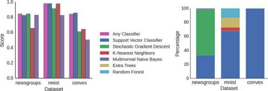{width="4.606665573053369in"
height="1.5683333333333334in"}

> []{#_bookmark531 .anchor}**Fig.** **5.2** Left: Best model
> performance. For each data set, searching the full configuration space
> (“Any Classifier”) delivered performance approximately on par with a
> search that was restricted to the best classifier type. Each bar
> represents the score obtained from a search restricted to that
> particular classifier. For the “Any Classifier” case there is no
> restriction on the search space. In all cases 300 hyperparameter
> evaluations were performed. Score is F1 for 20 Newsgroups, and
> accuracy for MNIST and Convex Shapes.
>
> Right: Model selection distribution. Looking at the best models from
> all optimization runs performed on the full search space (Any
> Classifier, using different initial conditions, and different
> optimization algorithms) we see that different data sets are handled
> best by different classifiers. SVC was the only classifier ever chosen
> as the best model for Convex Shapes, and was often found to be best on
> MNIST and 20 Newsgroups, however the best SVC parameters were very
> different across data sets

The CFC model that performed quite well on the 20 newsgroups document
classification data set is a Class-Feature-Centroid classifier. Centroid
approaches are typically inferior to an SVM, due to the centroids found
during training being far from the optimal location. The CFC method
reported here uses a centroid built from the inter-class term index and
the inner-class term index. It uses a novel combination of these indices
along with a denormalized cosine measure to calculate the similarity
score between the centroid and a text vector \[[7](#_bookmark536)\].
This style of model is not currently implemented in hyperopt-sklearn,
and our experiments

{width="7.219378827646544e-2in"
height="0.2613604549431321in"}{width="9.509623797025372e-2in"
height="6.44575678040245e-2in"}{width="0.25015201224846895in"
height="1.838801399825022e-2in"}{width="0.14384623797025373in"
height="1.794569116360455in"}{width="0.4863188976377953in"
height="1.4499857830271217in"}{width="0.4863188976377953in"
height="1.7947911198600175in"}{width="0.4863331146106737in"
height="1.8365135608048995in"}{width="0.6713462379702537in"
height="5.396872265966754e-2in"}{width="0.5024300087489064in"
height="7.554133858267717e-2in"}{width="0.2029440069991251in"
height="7.539260717410323e-2in"}{width="5.0249343832020996e-2in"
height="7.379155730533683e-2in"}{width="0.14970800524934383in"
height="5.5999562554680665e-2in"}{width="6.631999125109361e-2in"
height="6.862423447069116e-2in"}{width="0.2324015748031496in"
height="7.555118110236221e-2in"}{width="0.2029440069991251in"
height="7.541338582677165e-2in"}{width="0.11190179352580927in"
height="7.494422572178477e-2in"}{width="4.791666666666667e-2in"
height="7.493000874890639e-2in"}{width="0.11217957130358705in"
height="7.555555555555556e-2in"}

> 108 B. Komer et al.
>
> suggest that existing hyperopt-sklearn components cannot be assembled
> to match its level of performance. Perhaps when it is implemented,
> Hyperopt may find a set of parameters that provides even greater
> classification accuracy.

{width="2.0297353455818024in"
height="0.21779199475065616in"}

[]{#_bookmark532 .anchor}**Fig.** **5.3** Comparison of F1-Score on the
20 Newsgroups dataset using either the default parameters of
scikit-learn or the default search space of hyperopt-sklearn. The
results from hyperopt-sklearn were obtained from a single run with 25
evaluations, restricted to either Support Vector Classifier, Stochastic
Gradient Descent, K-Nearest Neighbors, or Multinomial Naive Bayes

> On the Convex Shapes data set, our Hyperopt-sklearn experiments
> revealed a more accurate model than was previously believed to exist
> in any search space, let alone a search space of such standard
> components. This result underscores the difficulty and importance of
> hyperparameter search.
>
> Hyperopt-sklearn provides many opportunities for future work: more
> classifiers and preprocessing modules could be included in the search
> space, and there are more ways to combine even the existing
> components. Other types of data require different preprocessing, and
> other prediction problems exist beyond classification. In expanding the
> search space, care must be taken to ensure that the benefits of new
> models outweigh the greater difficulty of searching a larger space.
> There are some parameters that scikit-learn exposes that are more
> implementation details than actual hyperparameters that affect the fit
> (such as algorithm and leaf\_sizein the KNN model). Care should be
> taken to identify these parameters in each model and they may need to
> be treated differently during exploration.

It is possible for a user to add their own classifier to the search space
as long as it fits the scikit-learn interface. This currently requires
some understanding of how hyperopt-sklearn’s code is structured and it
would be nice to improve the support for this so minimal effort is
required by the user. It is also possible for the user to specify
alternate scoring methods besides the default accuracy or F-measure, as
there can be cases where these are not best suited to the particular
problem.

{width="1.9857633420822398in"
height="4.0667104111986e-2in"}{width="0.18766622922134732in"
height="1.3902635608048994in"}{width="0.18768044619422572in"
height="1.3902635608048994in"}{width="0.4873053368328959in"
height="6.665244969378828e-2in"}{width="1.2939435695538057in"
height="0.16726596675415573in"}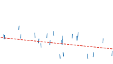{width="1.9233048993875765in"
height="1.0970275590551182in"}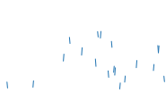{width="1.9232491251093613in"
height="1.1747211286089239in"}{width="5.270778652668416e-2in"
height="8.331911636045494e-2in"}{width="3.6762904636920384e-2in"
height="7.565288713910762e-2in"}{width="7.187445319335083e-2in"
height="7.85553368328959e-2in"}{width="7.198600174978127e-2in"
height="7.85553368328959e-2in"}{width="4.894356955380577e-2in"
height="7.85553368328959e-2in"}{width="7.187445319335083e-2in"
height="7.85553368328959e-2in"}{width="7.198600174978127e-2in"
height="7.85553368328959e-2in"}{width="5.2693569553805775e-2in"
height="8.331911636045494e-2in"}{width="3.677712160979878e-2in"
height="7.565288713910762e-2in"}{width="4.893044619422572e-2in"
height="7.85553368328959e-2in"}{width="1.9257622484689414in"
height="3.944444444444444e-2in"}{width="0.2479440069991251in"
height="1.4300973315835521in"}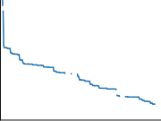{width="1.8731660104986876in"
height="1.3975962379702538in"}{width="0.4725546806649169in"
height="6.465223097112861e-2in"}{width="6.972112860892389e-2in"
height="7.619422572178478e-2in"}{width="8.340223097112862e-2in"
height="5.851268591426072e-2in"}{width="8.340223097112862e-2in"
height="5.851268591426072e-2in"}{width="6.981846019247594e-2in"
height="7.619422572178478e-2in"}{width="5.1111111111111114e-2in"
height="8.079068241469817e-2in"}{width="3.562445319335083e-2in"
height="7.336067366579177e-2in"}{width="4.745734908136483e-2in"
height="7.619422572178478e-2in"}{width="1.2548468941382327in"
height="0.16220800524934384in"}{width="0.24795713035870517in"
height="1.4300973315835521in"}{width="1.8731517935258093in"
height="1.3975831146106736in"}{width="1.0093667979002625in"
height="0.187749343832021in"}{width="1.850596019247594in"
height="1.0395964566929135in"}{width="6.970800524934383e-2in"
height="7.619422572178478e-2in"}{width="8.340223097112862e-2in"
height="5.852690288713911e-2in"}{width="8.341535433070867e-2in"
height="5.852690288713911e-2in"}{width="6.983267716535434e-2in"
height="7.619422572178478e-2in"}{width="5.1111111111111114e-2in"
height="8.07917760279965e-2in"}{width="3.562445319335083e-2in"
height="7.337379702537183e-2in"}{width="4.745734908136483e-2in"
height="7.619422572178478e-2in"}

> 5 Hyperopt-Sklearn 109

{width="1.4372900262467192in"
height="0.16726596675415573in"}

{width="1.9857633420822398in"
height="4.0680227471566056e-2in"}

{width="0.4873053368328959in"
height="6.666666666666667e-2in"}

{width="1.393888888888889in"
height="0.1622222222222222in"}

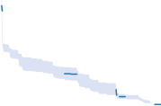{width="1.850624453193351in"
height="1.217554680664917in"}

{width="1.9257917760279966in"
height="3.944444444444444e-2in"}

{width="0.4725546806649169in"
height="6.4666447944007e-2in"}

[]{#_bookmark538 .anchor}**Fig.** **5.4** Validation loss of models
found for each successive parameter evaluation using the 20 Newsgroups
dataset and the Any Classifier search domain. **Upper** **Left**: Mean
validation loss at each step across different random number seeds for
the TPE algorithm. Downward trend indicates more promising regions are
explored more often over time. **Upper** **Right**: Mean validation loss
for the random algorithm. Flat trend illustrates no learning from
previous trials. Large variation in performance across evaluations
indicates the problem is very sensitive to hyperparameter tunings.
**Lower** **Left**: Minimum validation loss of models found so far for
the TPE algorithm. Gradual progress is made on 20 Newsgroups over 300
iterations and gives no indication of convergence. **Lower** **Right**:
Minimum validation loss for the random algorithm. Progress is initially
rapid for the first 40 or so evaluations and then settles for long
periods. Improvement still continues, but becomes less likely as time
goes on

We have shown here that Hyperopt’s random search, annealing search, and
TPE algorithms make Hyperopt-sklearn viable, but the slow convergence in
Fig.[5.4](#_bookmark538) suggests that other optimization algorithms
might be more call-efficient. The devel- opment of Bayesian optimization
algorithms is an active research area, and we look forward to looking at
how other search algorithms interact with hyperopt-sklearn’s search
spaces. Hyperparameter optimization opens up a new art of matching the
parameterization of search spaces to the strengths of search algorithms.

> Computational wall time spent on search is of great practical
> importance, and hyperopt-sklearn currently spends a significant amount
> of time evaluating points that are un-promising. Techniques for
> recognizing bad performers early could speed up search enormously
> \[[5](#_bookmark539), [18](#_bookmark540)\].
>
> 110 B. Komer et al.
>
> **5.7** **Conclusions**

This chapter has introduced Hyperopt-sklearn, a Python package for
automated algorithm configuration of standard machine learning algorithms
provided by Scikit-Learn. Hyperopt-sklearn provides a unified interface
to a large subset of the machine learning algorithms available in
scikit-learn and with the help of Hyperopt’s optimization functions it
is able to both rival and surpass human experts in algorithm
configuration. We hope that it provides practitioners with a useful tool
for the development of machine learning systems, and automated machine
learning researchers with benchmarks for future work in algorithm
configuration.

**Acknowledgements** This research was supported by the NSERC Banting
Fellowship program, the NSERC Engage Program and by D-Wave Systems.
Thanks also to Hristijan Bogoevski for early drafts of a
hyperopt-to-scikit-learn bridge.

> **Bibliography**
>
> 1\. J. Bergstra, R. Bardenet, Y. Bengio, and B. Kegl. Algorithms for
> hyper-parameter optimization, NIPS, 24:2546–2554, 2011.
>
> 2\. J. Bergstra, D. Yamins, and D. D. Cox. Making a science of model
> search: Hyperparameter []{#_bookmark525 .anchor}optimization in hundreds
> of dimensions for vision architectures, In Proc. ICML, 2013a.
>
> 3\. J. Bergstra, D. Yamins, and D. D. Cox. Hyperopt: A Python library for
> optimizing the []{#_bookmark534 .anchor}hyperparameters of machine
> learning algorithms, SciPy’13, 2013b.
>
> 4\. D. Ciresan, U. Meier, and J. Schmidhuber. Multi-column Deep Neural
> Networks for Image Classification, IEEE Conference on Computer Vision and
> Pattern Recognition (CVPR), 3642–
>
> []{#_bookmark539 .anchor}3649. 2012.
>
> 5\. T. Domhan, T. Springenberg, F. Hutter. Extrapolating Learning Curves
> of Deep Neural []{#_bookmark537 .anchor}Networks, ICML AutoML Workshop,
> 2014.
>
> 6\. K. Eggensperger, M. Feurer, F. Hutter, J. Bergstra, J. Snoek, H.
> Hoos, and K. Leyton-Brown. Towards an empirical foundation for assessing
> bayesian optimization of hyperparameters, []{#_bookmark536 .anchor}NIPS
> workshop on Bayesian Optimization in Theory and Practice, 2013.
>
> 7\. H. Guan, J. Zhou, and M. Guo. A class-feature-centroid classifier for
> text categorization, Proceedings of the 18th international conference on
> World wide web, 201–210. ACM, 2009.
>
> []{#_bookmark523 .anchor}8. M. Hall, E. Frank, G. Holmes, B.
> Pfahringer, P. Reutemann, and I. H. Witten. The weka data mining
> software: an update, ACM SIGKDD explorations newsletter, 11(1):10– 18,
> 2009.
>
> 9\. F. Hutter, H. Hoos, and K. Leyton-Brown. Sequential model-based
> optimization for general
>
> algorithm configuration, LION-5, 2011. Extended version as UBC Tech
> report TR-2010- 10.
>
> []{#_bookmark526 .anchor}10. B. Komer, J. Bergstra, and C. Eliasmith.
> Hyperopt-sklearn: automatic hyperparameter config- []{#_bookmark530
> .anchor}uration for scikit-learn, ICML AutoML Workshop, 2014.
>
> 11\. H. Larochelle, D. Erhan, A. Courville, J. Bergstra, and Y. Bengio.
> An empirical evaluation of deep architectures on problems with many
> factors of variation, ICML, 473–480, 2007.
>
> []{#_bookmark528 .anchor}12. Y. LeCun, L. Bottou, Y. Bengio, and P.
> Haffner. Gradient-based learning applied to document recognition,
> Proceedings of the IEEE, 86(11):2278–2324, November 1998.
>
> []{#_bookmark529 .anchor}13. T. Mitchell. 20 newsgroups data set,
> <http:/qwone.com/jason/20Newsgroups/>, 1996.
>
> 14\. J. Mockus, V. Tiesis, and A. Zilinskas. The application of Bayesian
> methods for seeking the extremum, L.C.W. Dixon and G.P. Szego, editors,
> Towards Global Optimization, volume 2, []{#_bookmark535 .anchor}pages
> 117– 129. North Holland, New York, 1978.
>
> 15\. The MNIST Database of handwritten digits:
> <http:/yann.lecun.com/exdb/mnist/>
>
> 5 Hyperopt-Sklearn 111
>
> []{#_bookmark524 .anchor}16. F. Pedregosa, G. Varoquaux, A. Gramfort,
> V. Michel, B. Thirion, O. Grisel, M. Blondel, P. Prettenhofer, R.
> Weiss, V. Dubourg, J. Vanderplas, A. Passos, D. Cournapeau, M.
> Brucher,
>
> M. Perrot, and E. Duchesnay. Scikit-learn: Machine Learning in Python,
> Journal of Machine Learning Research, 12:2825–2830, 2011.
>
> 17\. J. Snoek, H. Larochelle, and R. P. Adams. Practical Bayesian
> optimization of machine learning algorithms, Neural Information
> Processing Systems, 2012.
>
> 18\. K. Swersky, J. Snoek, R.P. Adams. Freeze-Thaw Bayesian Optimization,
> arXiv:1406.3896, [[]{#_bookmark522 .anchor}]{#_bookmark540 .anchor}2014.
>
> 19\. C. Thornton, F. Hutter, H. H. Hoos, and K. Leyton-Brown. AutoWEKA:
> Automated selection and hyper-parameter optimization of classification
> algorithms, KDD 847–855, 2013.
>
> **Open** **Access** This chapter is licensed under the terms of the
> Creative Commons Attribution 4.0 International License
> [(http:/creativecommons.org/licenses/by/4.0/](http:/creativecommons.org/licenses/by/4.0/)),
> which permits use, sharing, adaptation, distribution and reproduction
> in any medium or format, as long as you give appropriate credit to the
> original author(s) and the source, provide a link to the Creative
> Commons licence and indicate if changes were made.
>
> The images or other third party material in this chapter are included
> in the chapter’s Creative Commons licence, unless indicated otherwise
> in a credit line to the material. If material is not included in the
> chapter’s Creative Commons licence and your intended use is not
> permitted by statutory regulation or exceeds the permitted use, you
> will need to obtain permission directly from the copyright holder.

{width="0.787415791776028in"
height="0.275582895888014in"}

{width="0.42962489063867015in"
height="0.42963801399825025in"}{width="1.418332239720035in"
height="6.944444444444444e-3in"}

> []{#_bookmark8 .anchor}**Chapter** **6**
>
> **Auto-sklearn:** **Efficient** **and** **Robust**
>
> **Automated** **Machine** **Learning**

> **Matthias** **Feurer,** **Aaron** **Klein,** **Katharina**
> **Eggensperger,**
>
> **Jost** **Tobias** **Springenberg,** **Manuel** **Blum,** **and**
> **Frank** **Hutter**

**Abstract** The success of machine learning in a broad range of
applications has led to an ever-growing demand for machine learning
systems that can be used off the shelf by non-experts. To be effective
in practice, such systems need to automatically choose a good algorithm
and feature preprocessing steps for a new dataset at hand, and also set
their respective hyperparameters. Recent work has started to tackle this
*automated* *machine* *learning* *(AutoML)* problem with the help of
efficient Bayesian optimization methods. Building on this, we introduce a
robust new AutoML system based on the Python machine learning package
scikit-learn (using 15 classifiers, 14 feature preprocessing methods, and
4 data preprocessing methods, giving rise to a structured hypothesis
space with 110 hyperparameters). This system, which we dub
*Auto-sklearn*, improves on existing AutoML methods by automatically
taking into account past performance on similar datasets, and by
constructing ensembles from the models evaluated during the
optimization. Our system won six out of ten phases of the first ChaLearn
AutoML challenge, and our comprehensive analysis on over 100 diverse
datasets shows that it substantially outperforms the previous state of
the art in AutoML. We also demonstrate the performance gains due to each
of our contributions and derive insights into the effectiveness of the
individual components of Auto-sklearn.

> **6.1** **Introduction**
>
> Machine learning has recently made great strides in many application
> areas, fueling a growing demand for machine learning systems that can
> be used effectively by novices in machine learning. Correspondingly, a
> growing number of commercial
>
> M. Feurer (凶) · A. Klein · K. Eggensperger · J. T. Springenberg · M.
> Blum
>
> Department of Computer Science, University of Freiburg, Freiburg,
> Baden-Württemberg, Germany
>
> e-mail: <feurerm@informatik.uni-freiburg.de>
>
> F. Hutter
>
> Department of Computer Science, University of Freiburg, Freiburg,
> Germany
>
> © The Author(s) 2019
>
> F. Hutter et al. (eds.), *Automated* *Machine* *Learning*, The
> Springer Series on Challenges in Machine Learning,
> <https:/doi.org/10.1007/978-3-030-05318-5_6>
>
> 114 M. Feurer et al.
>
> enterprises aim to satisfy this demand (e.g., BigML.com, Wise.io,
> H2O.ai, feedzai.com, RapidMiner.com, Prediction.io, DataRobot.com,
> Microsoft’s Azure Machine Learning, Google’s Cloud Machine Learning
> Engine, and Amazon Machine Learning). At its core, every effective
> machine learning service needs to solve the fundamental problems of
> deciding which machine learning algorithm to use on a given dataset,
> whether and how to preprocess its features, and how to set all
> hyperparameters. This is the problem we address in this work.

More specifically, we investigate automated machine learning (AutoML),
the problem of automatically (without human input) producing test set
predictions for a new dataset within a fixed computational budget.
Formally, this AutoML problem can be stated as follows:

**Definition** **1** **(AutoML** **problem)** For i = 1, . . . , n + m,
let **x**i denote a feature vector and yi the corresponding target
value. Given a training dataset Dtrain = {(**x**1 ,y1), . . . ,
(**x**n,yn)} and the feature vectors **x**n+1 , . . . , **x**n+m of a
test dataset Dtest = {(**x**n+1,yn+1), . . . , (**x**n+m,yn+m)} drawn
from the same underlying data distribution, as well as a resource budget
b and a loss metric L(·, ·), the AutoML problem is to (automatically)
produce accurate test set predictions
{width="6.364938757655293e-2in"
height="0.13131233595800526in"}n+1 , . . . ,
{width="6.364938757655293e-2in"
height="0.13131233595800526in"}n+m . The loss of a solution
{width="6.364938757655293e-2in"
height="0.13131233595800526in"}n+1 , . . . ,
{width="6.364938757655293e-2in"
height="0.13131233595800526in"}n+m to the AutoML problem is given by
1{width="6.560804899387576e-2in"
height="6.666666666666667e-3in"}m
对{width="0.10819553805774278in"
height="0.19723972003499562in"}1
L({width="5.011154855643045e-2in"
height="0.13131233595800526in"}n+j,yn+j).

> In practice, the budget b would comprise computational resources, such
> as CPU and/or wallclock time and memory usage. This problem definition
> reflects the setting of the first ChaLearn AutoML challenge
> \[[23](#_bookmark541)\] (also, see Chap.[10](#_bookmark13) for a
> description and analysis of the first AutoML challenge). The AutoML
> system we describe here won six out of ten phases of that challenge.

Here, we follow and extend the AutoML approach first introduced by Auto-
WEKA \[[42](#_bookmark542)\]. At its core, this approach combines a
highly parametric machine learning framework F with a Bayesian
optimization \[[7](#_bookmark543),[40](#_bookmark544)\] method for
instantiating F well for a given dataset.

The contribution of this paper is to extend this AutoML approach in
various ways that considerably improve its *efficiency* and *robustness*,
based on principles that apply to a wide range of machine learning
frameworks (such as those used by the machine learning service providers
mentioned above). First, following successful previous work for low
dimensional optimization problems \[[21](#_bookmark545),
[22](#_bookmark546), [38](#_bookmark547)\], we reason across datasets to
identify instantiations of machine learning frameworks that perform well
on a new dataset and warmstart Bayesian optimization with them
(Sect.[6.3.1](#_bookmark548)). Second, we automatically construct
ensembles of the models considered by Bayesian optimization
(Sect.[6.3.2](#_bookmark549)). Third, we carefully design a highly
parameterized machine learning framework from high-performing classifiers
and preprocessors implemented in the popular machine learning framework
scikit- learn \[[36](#_bookmark550)\] (Sect.[6.4](#_bookmark551)).
Finally, we perform an extensive empirical analysis using a diverse
collection of datasets to demonstrate that the resulting Auto-sklearn
system outperforms previous state-of-the-art AutoML methods
(Sect.[6.5](#_bookmark552)), to show that each of our contributions
leads to substantial performance improvements

> 6 Auto-sklearn: Efficient and Robust Automated Machine Learning 115
>
> (Sect.[6.6](#_bookmark553)), and to gain insights into the performance
> of the individual classifiers and preprocessors used in Auto-sklearn
> (Sect.[6.7](#_bookmark554)).

This chapter is an extended version of our 2015 paper introducing
Auto-sklearn, published in the *proceedings* *of* *NeurIPS* *2015*
\[[20](#_bookmark555)\].

> **6.2** **AutoML** **as** **a** **CASH** **Problem**

We first review the formalization of AutoML as a *Combined* *Algorithm*
*Selec-* *tion* *and* *Hyperparameter* *optimization* *(CASH)* problem
used by Auto-WEKA’s AutoML approach. Two important problems in AutoML
are that (1) no single machine learning method performs best on all
datasets and (2) some machine learn- ing methods (e.g., non-linear SVMs)
crucially rely on hyperparameter optimization. The latter problem has
been successfully attacked using Bayesian optimization
\[[7](#_bookmark543), [40](#_bookmark544)\], which nowadays forms a core
component of many AutoML systems. The former problem is intertwined with
the latter since the rankings of algorithms depend on whether their
hyperparameters are tuned properly. Fortunately, the two problems can
efficiently be tackled as a single, structured, joint optimization
problem:

**Definition** **2** **(CASH)** Let A = {A(1) , . . . , A(R)} be a set of
algorithms, and let the hyperparameters of each algorithm A(j) have
domain **A**(j) . Further, let Dtrain = {(x1 ,y1), . . . , (xn,yn)} be a
training set which is split into K cross-validation folds
{D{width="0.4835214348206474in"
height="0.20891294838145233in"} ,
D{width="0.17813648293963255in"
height="0.20891294838145233in"}d} and
{D{width="0.4820734908136483in"
height="0.20891294838145233in"} ,
D{width="0.1798578302712161in"
height="0.20891294838145233in"}n} such that
D{width="0.24414260717410324in"
height="0.20891294838145233in"} =
Dtrain/D{width="0.24040135608048993in"
height="0.20891294838145233in"} for i = 1, . . . , K . Finally, let
L(A{width="0.1393274278215223in"
height="0.21004811898512685in"},D{width="0.1440977690288714in"
height="0.20724081364829397in"}in,D{width="4.55249343832021e-2in"
height="0.20724081364829397in"}lid) denote the loss that algorithm A(j)
achieves on
D{width="0.2413451443569554in"
height="0.20891294838145233in"} when trained on
D{width="0.24511154855643044in"
height="0.20891294838145233in"} with hyperparameters **λ** . Then, the
*Combined* *Algorithm* *Selection* *and* *Hyperparameter* *optimization*
*(CASH)* problem is to find the joint algorithm and hyperparameter
setting that minimizes this loss:

> K
>
> A\* , **λ**\* ∈ argmin
> 1{width="9.740594925634295e-2in"
> height="6.472003499562555e-3in"}K 对
> L(A{width="0.10893700787401575in"
> height="0.2055653980752406in"},D{width="0.11265857392825897in"
> height="0.20284011373578303in"}in,D{width="3.559492563429571e-2in"
> height="0.20284011373578303in"}lid).
>
> (6. 1)

This CASH problem was first tackled by Thornton et al.
\[[42](#_bookmark542)\] in the Auto- WEKA system using the machine
learning framework WEKA \[[25](#_bookmark556)\] and tree-based Bayesian
optimization methods \[[5](#_bookmark557),[27](#_bookmark558)\]. In a
nutshell, Bayesian optimization \[[7](#_bookmark543)\] fits a
probabilistic model to capture the relationship between hyperparameter
settings and their measured performance; it then uses this model to
select the most promising hyperparameter setting (trading off
exploration of new parts of the space vs. exploitation in known good
regions), evaluates that hyperparameter setting, updates the model with
the result, and iterates. While Bayesian optimization based on Gaussian
process models (e.g., Snoek et al. \[[41](#_bookmark559)\]) performs
best in low-dimensional problems with numerical hyperparameters,
tree-based models have been shown to be more successful in
high-dimensional, structured, and partly discrete prob-

> 116 M. Feurer et al.
>
> lems \[[15](#_bookmark560)\]— such as the CASH problem—and are also
> used in the AutoML system HYPEROPT-SKLEARN \[[30](#_bookmark561)\].
> Among the tree-based Bayesian optimization methods, Thornton et al.
> \[[42](#_bookmark542)\] found the random-forest-based SMAC
> \[[27](#_bookmark558)\] to outperform the tree Parzen estimator TPE
> \[[5](#_bookmark557)\], and we therefore use SMAC to solve the CASH
> problem in this paper. Next to its use of random forests
> \[[6](#_bookmark562)\], SMAC’s main distinguishing feature is that it
> allows fast cross-validation by evaluating one fold at a time and
> discarding poorly-performing hyperparameter settings early.
>
> **6.3** **New** **Methods** **for** **Increasing** **Efficiency**
> **and** **Robustness**
>
> **of** **AutoML**
>
> We now discuss our two improvements of the AutoML approach. First, we
> include a meta-learning step to warmstart the Bayesian optimization
> procedure, which results in a considerable boost in efficiency. Second,
> we include an automated ensemble construction step, allowing us to use
> all classifiers that were found by Bayesian optimization.
>
> Fig. [6.1](#_bookmark563) summarizes the overall AutoML workflow,
> including both of our improvements. We note that we expect their
> effectiveness to be greater for flexible ML frameworks that offer many
> degrees of freedom (e.g., many algorithms, hyperparameters, and
> preprocessing methods).
>
> []{#_bookmark548 .anchor}***6.3.1*** ***Meta-learningfor***
> ***Finding*** ***Good*** ***Instantiations***
>
> ***of*** ***Machine*** ***Learning*** ***Frameworks***

Domain experts derive knowledge from previous tasks: They *learn*
*about* *the* *per-* *formance* *of* *machine* *learning* *algorithms*.
The area of meta-learning (see Chap.[2](#_bookmark3)) mimics this
strategy by reasoning about the performance of learning algorithms
across datasets. In this work, we apply meta-learning to select
instantiations of our given machine learning framework that are likely
to perform well on a new dataset. More specifically, for a large number
of datasets, we collect both performance data

> []{#_bookmark563 .anchor}**Fig.** **6.1** Our improved AutoML
> approach. We add two components to Bayesian hyperparameter
> optimization of an ML framework: meta-learning for initializing the
> Bayesian optimizer and automated ensemble construction from
> configurations evaluated during optimization
>
> 6 Auto-sklearn: Efficient and Robust Automated Machine Learning 117
>
> and a set of *meta-features*, i.e., characteristics of the dataset
> that can be computed efficiently and that help to determine which
> algorithm to use on a new dataset.

This meta-learning approach is complementary to Bayesian optimization
for optimizing an ML framework. Meta-learning can quickly suggest some
instan- tiations of the ML framework that are likely to perform quite
well, but it is unable to provide fine-grained information on
performance. In contrast, Bayesian optimization is slow to start for
hyperparameter spaces as large as those of entire ML frameworks, but can
fine-tune performance over time. We exploit this complementarity by
selecting k configurations based on meta-learning and use their result to
seed Bayesian optimization. This approach of warmstarting optimization
by meta-learning has already been successfully applied before
\[[21](#_bookmark545), [22](#_bookmark546), [38](#_bookmark547)\], but
never to an optimization problem as complex as that of searching the
space of instantiations of a full-fledged ML framework. Likewise,
learning across datasets has also been applied in collaborative Bayesian
optimization methods \[[4](#_bookmark564), [45](#_bookmark565)\]; while
these approaches are promising, they are so far limited to very few
meta-features and cannot yet cope with the high-dimensional partially
discrete configuration spaces

> faced in AutoML.

More precisely, our meta-learning approach works as follows. In an
offline phase, for each machine learning dataset in a dataset repository
(in our case 140 datasets from the OpenML \[[43](#_bookmark566)\]
repository), we evaluated a set of meta-features (described below) and
used Bayesian optimization to determine and store an instantiation of
the given ML framework with strong empirical performance for that
dataset. (In detail, we ran SMAC \[[27](#_bookmark558)\] for 24 h with
10-fold cross-validation on two thirds of the data and stored the
resulting ML framework instantiation which exhibited best performance on
the remaining third). Then, given a new dataset D, we compute its
meta-features, rank all datasets by their L1 distance to D in
meta-feature space and select the stored ML framework instantiations for
the k = 25 nearest datasets for evaluation before starting Bayesian
optimization with their results.

> To characterize datasets, we implemented a total of 38 meta-features
> from the literature, including simple, information-theoretic and
> statistical meta-features \[[29](#_bookmark567),
> [33](#_bookmark568)\], such as statistics about the number of data
> points, features, and classes, as well as data skewness, and the
> entropy of the targets. All meta-features are listed in Table 1 of the
> original publication’s supplementary material \[[20](#_bookmark555)\].
> Notably, we had to exclude the prominent and effective category of
> landmarking meta-features \[[37](#_bookmark569)\] (which measure the
> performance of simple base learners), because they were
> computationally too expensive to be helpful in the online evaluation
> phase. We note that this meta-learning approach draws its power from
> the availability of a repository of datasets; due to recent
> initiatives, such as OpenML \[[43](#_bookmark566)\], we expect the
> number of available datasets to grow ever larger over time, increasing
> the importance of meta-learning.

{width="1.418332239720035in"
height="6.944444444444444e-3in"}

> 118 M. Feurer et al.
>
> []{#_bookmark549 .anchor}***6.3.2*** ***Automated*** ***Ensemble***
> ***Construction*** ***of*** ***Models*** ***Evaluated***
>
> ***During*** ***Optimization***
>
> While Bayesian hyperparameter optimization is data-efficient in finding
> the best- performing hyperparameter setting, we note that it is a very
> wasteful procedure when the goal is simply to make good predictions:
> all the models it trains during the course of the search are lost,
> usually including some that perform almost as well as the best. Rather
> than discarding these models, we propose to store them and to use an
> efficient post-processing method (which can be run in a second process
> on-the-fly) to construct an ensemble out of them. This automatic
> ensemble construction avoids to commit itself to a single
> hyperparameter setting and is thus more robust (and less prone to
> overfitting) than using the point estimate that standard hyperparameter
> optimization yields. To our best knowledge, we are the first to make
> this simple observation, which can be applied to improve any Bayesian
> hyperparameter optimization method.[1](#_bookmark570)
>
> It is well known that ensembles often outperform individual models
> \[[24](#_bookmark571), [31](#_bookmark572)\], and that effective
> ensembles can be created from a library of models
> \[[9](#_bookmark573), [10](#_bookmark574)\]. Ensembles perform
> particularly well if the models they are based on (1) are individually
> strong and (2) make uncorrelated errors \[[6](#_bookmark562)\]. Since
> this is much more likely when the individual models are different in
> nature, ensemble building is particularly well suited for combining
> strong instantiations of a flexible ML framework.

However, simply building a uniformly weighted ensemble of the models
found by Bayesian optimization does *not* work well. Rather, we found it
crucial to adjust these weights using the predictions of all individual
models on a hold-out set. We experimented with different approaches to
optimize these weights: *stacking* \[[44](#_bookmark575)\],
gradient-free numerical optimization, and the method *ensemble*
*selection* \[[10](#_bookmark574)\]. While we found both numerical
optimization and stacking to overfit to the validation set and to be
computationally costly, ensemble selection was fast and robust. In a
nutshell, ensemble selection (introduced by Caruana et al.
\[[10](#_bookmark574)\]) is a greedy procedure that starts from an empty
ensemble and then iteratively adds the model that minimizes ensemble
validation loss (with uniform weight, but allowing for repetitions). We
used this technique in all our experiments—building an ensemble of size
50 using selection with replacement \[[10](#_bookmark574)\]. We
calculated the ensemble loss using the same validation set that we use
for Bayesian optimization.

> []{#_bookmark570 .anchor}1 Since the original publication
> \[[20](#_bookmark555)\] we have learned that Escalante et al.
> \[[16](#_bookmark576)\] and Bürger and Pauli \[[8](#_bookmark577)\]
> applied ensembles as a post-processing step of an AutoML system to
> improve generalization as well. However, both works combined the
> learned models with a pre-defined strategy and did not adapt the
> ensemble construction based on the performance of the individual
> models.

{width="1.7299715660542432in"
height="0.14938867016622923in"}{width="0.5918602362204725in"
height="7.063867016622923e-2in"}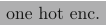{width="1.0997911198600174in"
height="0.2484711286089239in"}{width="0.1823611111111111in"
height="1.9430227471566055e-2in"}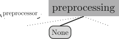{width="2.0260968941382327in"
height="0.6702777777777778in"}{width="0.7066382327209099in"
height="0.20799978127734034in"}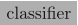{width="0.796832895888014in"
height="0.24845800524934383in"}{width="0.26765201224846896in"
height="9.472222222222222e-2in"}{width="0.473416447944007in"
height="9.473534558180227e-2in"}{width="0.16836067366579177in"
height="9.048556430446195e-2in"}{width="0.2523742344706912in"
height="8.908245844269466e-2in"}{width="0.33609689413823274in"
height="0.203665791776028in"}{width="0.609666447944007in"
height="0.22644356955380576in"}{width="0.5857906824146981in"
height="0.22644356955380576in"}{width="0.2426104549431321in"
height="0.22644356955380576in"}{width="0.4991940069991251in"
height="0.22644356955380576in"}{width="0.6274715660542433in"
height="0.22644356955380576in"}{width="0.38156824146981627in"
height="0.22644356955380576in"}

> 6 Auto-sklearn: Efficient and Robust Automated Machine Learning 119
>
> []{#_bookmark551 .anchor}**6.4** **A** **Practical** **Automated**
> **Machine** **Learning** **System**
>
> To design a robust AutoML system, as our underlying ML framework we
> chose scikit-learn \[[36](#_bookmark550)\], one of the best known and
> most widely used machine learning libraries. It offers a wide range of
> well established and efficiently-implemented ML algorithms and is easy
> to use for both experts and beginners. Since our AutoML system closely
> resembles Auto-WEKA, but—like HYPEROPT-SKLEARN—is based on
> scikit-learn, we dub it Auto-sklearn.

Fig. [6.2](#_bookmark578) is an illustration Auto-sklearn’s machine
learning pipeline and its com- ponents. It comprises 15 classification
algorithms, 14 preprocessing methods, and 4 data preprocessing methods.
We parameterized each of them, which resulted in a space of 110
hyperparameters. Most of these are conditional hyperparameters that are
only active if their respective component is selected. We note that SMAC
\[[27](#_bookmark558)\] can handle this conditionality natively.

All 15 classification algorithms in Auto-sklearn are listed in Table
[6.1](#_bookmark579). They fall into different categories, such as
general linear models (2 algorithms), support vector machines (2),
discriminant analysis (2), nearest neighbors (1), naïve Bayes (3),
decision trees (1) and ensembles (4). In contrast to Auto-WEKA
\[[42](#_bookmark542)\] (also, see Chap.[4](#_bookmark6)for a
description of Auto-WEKA), we focused our configuration space on base
classifiers and excluded meta-models and ensembles that are themselves
parameterized by one or more base classifiers. While such ensembles
increased Auto-WEKA’s number of hyperparameters by almost a factor of
five (to 786), Auto-sklearn “only” features 110 hyperparameters. We
instead construct complex ensembles using our post-hoc method from
Sect.[6.3.2](#_bookmark549). Compared to Auto-WEKA, this is much more
data-efficient: in Auto-WEKA, evaluating the performance of an ensemble
with five components requires the construction and evaluation of five

{width="0.3705686789151356in"
height="0.17167979002624673in"}

{width="1.707267060367454in"
height="0.38694991251093613in"}

  -------------------------------------------------------------------------------------------------
  {width="0.24652668416447945in" height="0.11023512685914261in"}
  -------------------------------------------------------------------------------------------------

  -------------------------------------------------------------------------------------
  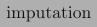{width="1.0013888888888889in" height="0.26875in"}
  -------------------------------------------------------------------------------------

{width="0.7293471128608924in"
height="0.22232830271216097in"}

**Fig.** **6.2** Structured configuration space. Squared boxes denote
parent hyperparameters whereas []{#_bookmark578 .anchor}boxes with
rounded edges are leaf hyperparameters. Grey colored boxes mark active
hyperparame- ters which form an example configuration and machine
learning pipeline. Each pipeline comprises one *feature* *preprocessor*,
*classifier* and up to three *data* *preprocessor* methods plus
respective hyperparameters

> 120 M. Feurer et al.

[]{#_bookmark579 .anchor}**Table** **6.1** Number of hyperparameters for
each classifier (top) and feature preprocessing method (bottom) for a
**binary** **classification** dataset in **dense** representation. Tables
for sparse binary classification and sparse/dense multiclass
classification datasets can be found in Section E of the original
publication’s supplementary material \[[20](#_bookmark555)\], Tables 2a,
3a, 4a, 2b, 3b and 4b. We distinguish between categorical (cat)
hyperparameters with discrete values and continuous (cont) numerical
hyperparameters. Numbers in brackets are conditional hyperparameters,
which are only relevant when another hyperparameter has a certain value

  ----------------------------------------- ------- -------------- ---------------
  > Type of Classifier                       > \#λ   > cat (cond)   > cont (cond)
  > AdaBoost (AB)                           > 4     > 1 (–)        > 3 (–)
  > Bernoulli naïve Bayes                   > 2     > 1 (–)        > 1 (–)
  > Decision tree (DT)                      > 4     > 1 (–)        > 3 (–)
  > Extremely randomized trees              > 5     > 2 (–)        > 3 (–)
  > Gaussian naïve Bayes                    > –     > –            > –
  > Gradient boosting (GB)                  > 6     > –            > 6 (–)
  > k-nearest neighbors (kNN)               > 3     > 2 (–)        > 1 (–)
  > Linear discriminant analysis (LDA)      > 4     > 1 (–)        > 3 (1)
  > Linear SVM                              > 4     > 2 (–)        > 2 (–)
  > Kernel SVM                              > 7     > 2 (-)        > 5 (2)
  > Multinomial naïve Bayes                 > 2     > 1 (–)        > 1 (–)
  > Passive aggressive                      > 3     > 1 (–)        > 2 (–)
  > Quadratic discriminant analysis (QDA)   > 2     > –            > 2 (–)
  > Random forest (RF)                      > 5     > 2 (–)        > 3 (–)
  > Linear Classifier (SGD)                  > 10    > 4 (–)        > 6 (3)
  ----------------------------------------- ------- -------------- ---------------

  -------------------------------------------- ------- -------------- ---------------
  > Preprocessing method                       > \#λ   > cat (cond)   > cont (cond)
  > Extremely randomized trees preprocessing   > 5     > 2 (–)        > 3 (–)
  > Fast ICA                                   > 4     > 3 (–)        > 1 (1)
  > Feature agglomeration                      > 4     > 3 ()         > 1 (–)
  > Kernel PCA                                 > 5     > 1 (–)        > 4 (3)
  > Rand. kitchen sinks                        > 2     > –            > 2 (–)
  > Linear SVM preprocessing                   > 3     > 1 (–)        > 2 (–)
  > No preprocessing                           > –     > –            > –
  > Nystroem sampler                           > 5     > 1 (–)        > 4 (3)
  > Principal component analysis (PCA)         > 2     > 1 (–)        > 1 (–)
  > Polynomial                                 > 3     > 2 (–)        > 1 (–)
  > Random trees embed.                        > 4     > –            > 4 (–)
  > Select percentile                          > 2     > 1 (–)        > 1 (–)
  > Select rates                               > 3     > 2 (–)        > 1 (–)
  > One-hot encoding                           > 2     > 1 (–)        > 1 (1)
  > Imputation                                 > 1     > 1 (–)        > –
  > Balancing                                  > 1     > 1 (–)        > –
  > Rescaling                                  > 1     > 1 (–)        > –
  -------------------------------------------- ------- -------------- ---------------

> 6 Auto-sklearn: Efficient and Robust Automated Machine Learning 121
>
> models; in contrast, in Auto-sklearn, ensembles come largely for free,
> and it is pos- sible to mix and match models evaluated at arbitrary
> times during the optimization.
>
> The preprocessing methods for datasets in dense representation in
> Auto-sklearn are listed in Table [6.1](#_bookmark579). They comprise
> data preprocessors (which change the feature values and are always
> used when they apply) and feature preprocessors (which change the
> actual set of features, and only one of which \[or none\] is used).
> Data preprocessing includes rescaling of the inputs, imputation of
> missing values, one-hot encoding and balancing of the target classes.
> The 14 possible feature preprocessing methods can be categorized into
> feature selection (2), kernel approximation (2), matrix decomposition
> (3), embeddings (1), feature clustering (1), polynomial feature
> expansion (1) and methods that use a classifier for feature selection
> (2). For example, L1 -regularized linear SVMs fitted to the data can be
> used for feature selection by eliminating features corresponding to
> zero-valued model coefficients.
>
> For detailed descriptions of the machine learning algorithms used in
> Auto- sklearn we refer to Sect. A. 1 and A.2 of the original paper’s
> supplementary material \[[20](#_bookmark555)\], the scikit-learn
> documentation \[[36](#_bookmark550)\] and the references therein.

To make the most of our computational power and not get stuck in a very
slow run of a certain combination of preprocessing and machine learning
algorithm, we implemented several measures to prevent such long runs.
First, we limited the time for each evaluation of an instantiation of
the ML framework. We also limited the memory of such evaluations to
prevent the operating system from swapping or freezing. When an
evaluation went over one of those limits, we automatically terminated it
and returned the worst possible score for the given evaluation metric.
For some of the models we employed an iterative training procedure; we
instrumented these to still return their current performance value when
a limit was reached before they were terminated. To further reduce the
amount of overly long runs, we forbade several combinations of
preprocessors and classification methods: in particular, kernel
approximation was forbidden to be active in conjunction with non-linear
and tree-based methods as well as the KNN algorithm. (SMAC handles such
forbidden combinations natively.) For the same reason we also left out
feature learning algorithms, such as dictionary learning.

Another issue in hyperparameter optimization is overfitting and data
resampling since the training data of the AutoML system must be divided
into a dataset for training the ML pipeline (training set) and a dataset
used to calculate the loss function for Bayesian optimization
(validation set). Here we had to trade off between running a more robust
cross-validation (which comes at little additional overhead in SMAC) and
evaluating models on all cross-validation folds to allow for ensemble
construction with these models. Thus, for the tasks with a rigid time
limit of 1 h in Sect.[6.6](#_bookmark553), we employed a simple
train/test split. In contrast, we were able to employ ten-fold
crossvalidation in our 24 and 30 h runs in Sects.[6.5](#_bookmark552)and
[6.7](#_bookmark554).

> Finally, not every supervised learning task (for example classification
> with multiple targets), can be solved by all of the algorithms
> available in Auto-sklearn. Thus, given a new dataset, Auto-sklearn
> preselects the methods that are suitable for the dataset’s properties.
> Since scikit-learn methods are restricted to numerical input values,
> we always transformed data by applying a one-hot encoding to
> categorical features. In order to keep the number of dummy features
> low, we configured a
>
> 122 M. Feurer et al.

percentage threshold and a value occurring more rarely than this
percentage was transformed to a special *other* value
\[[35](#_bookmark580)\].

> []{#_bookmark552 .anchor}**6.5** **Comparing** **Auto-sklearn** **to**
> **Auto-WEKA**
>
> **and** **HYPEROPT-SKLEARN**

As a baseline experiment, we compared the performance of vanilla
Auto-sklearn (without our improvements meta-learning and ensemble
building) to Auto-WEKA (see Chap. [4](#_bookmark6)) and Hyperopt-Sklearn
(see Chap. [5](#_bookmark7)), reproducing the experimental setup with
the 21 datasets of the paper introducing Auto-WEKA
\[[42](#_bookmark542)\] (see Table [4.1](#_bookmark518) in
Chap.[4](#_bookmark6)for a description of the datasets). Following the
original setup of the Auto- WEKA paper, we used the same train/test
splits of the datasets \[[1](#_bookmark581)\], a walltime limit of 30 h,
10-fold cross validation (where the evaluation of each fold was allowed
to take 150 min), and 10 independent optimization runs with SMAC on each
dataset. As in Auto-WEKA, the evaluation is sped up by SMAC’s intensify
procedure, which only schedules runs on new cross validation folds if
the configuration currently being evaluated is likely to outperform the
so far best performing configuration \[[27](#_bookmark558)\]. We did not
modify HYPEROPT-SKLEARN which always uses a 80/20 train/test split. All
our experiments ran on Intel Xeon E5-2650 v2 eight-core processors with
2.60 GHz and 4 GiB of RAM. We allowed the machine learning framework to
use 3 GiB and reserved the rest for SMAC. All experiments used Auto-WEKA
0.5 and scikit-learn 0. 16. 1.

We present the results of this experiment in Table [6.2](#_bookmark582).
Since our setup followed exactly that of the original Auto-WEKA paper,
as a sanity check we compared the numbers we achieved for Auto-WEKA
ourselves (first line in Fig.[6.2](#_bookmark582)) to the ones presented
by the authors of Auto-WEKA (see Chap.[4](#_bookmark6)) and found that
overall the results were reasonable. Furthermore, the table shows that
Auto-sklearn performed significantly better than Auto-WEKA in 6/21 cases,
tied it in 12 cases, and lost against it in 3. For the three datasets
where Auto-WEKA performed best, we found that in more than 50% of its
runs the best classifier it chose is not implemented in scikit-learn
(trees with a pruning component). So far, HYPEROPT-SKLEARN is more of a
proof-of-concept—inviting the user to adapt the configuration space to
her own needs—than a full AutoML system. The current version crashes
when presented with sparse data and missing values. It also crashes on
Cifar- 10 due to a memory limit which we set for all optimizers to
enable a fair comparison. On the 16 datasets on which it ran, it
statistically tied the best competing AutoML system in 9 cases and lost
against it in 7.

> []{#_bookmark553 .anchor}**6.6** **Evaluation** **of** **the**
> **Proposed** **AutoML** **Improvements**
>
> In order to evaluate the robustness and general applicability of our
> proposed AutoML system on a broad range of datasets, we gathered 140
> binary and multiclass classification datasets from the OpenML
> repository \[[43](#_bookmark566)\], only selecting
>
> 6 Auto-sklearn: Efficient and Robust Automated Machine Learning 123
>
> []{#_bookmark582 .anchor}**Table** **6.2** Test set classification
> error of Auto-WEKA (AW), vanilla Auto-sklearn (AS) and
> HYPEROPT-SKLEARN (HS), as in the original evaluation of Auto-WEKA
> \[[42](#_bookmark542)\] (see also Sect.[4.5](#_bookmark501)). We show
> median percent test error rate across 100,000 bootstrap samples (based
> on 10 runs), each sample simulating 4 parallel runs and always picking
> the best one according to cross-validation performance. Bold numbers
> indicate the best result. Underlined results are not statistically
> significantly different from the best according to a bootstrap test
> with p = 0.05

  ------ ------------- ------------- ------------ ------------- ------------- ------------- ------------ ------------- ------------- ------------- -------------
                                                                > Cifar-10                               > Dorothea    > German                    > KDD09
                                                                                                                                                   >
                                                                                                                                                   > appetency

  > AS   > **73.50**   > **16.00**   > 0.39       > **51.70**   > **54.81**   > **17.53**   > **5.56**   > **5.51**    > **27.00**   > **1.62**    > **1.74**

  > AW   > **73.50**   > 30.00       > **0.00**   > 56.95       > 56.20       > 21.80       > 8.33       > 6.38        > 28.33       > 2.29        > **1.74**

  > HS   > 76.21       > 16.22       > 0.39       > –           > 57.95       > 19.18       > –          > –           > 27.67       > 2.29        > –

         > KR-vs-KP                  > MNIST                                                             > Waveform    > Wine                      

  > AS   > 0.42        > **12.44**   > 2.84       > **46.92**   > **7.87**    > **5.24**    > **0.01**   > 14.93       > 33.76       > 40.67       

  > AW   > **0.31**    > 18.21       > 2.84       > 60.34       > 8.09        > 5.24        > **0.01**   > 14.13       > **33.36**   > **37.75**   

  > HS   > 0.42        > 14.74       > **2.82**   > 55.79       > –           > 5.87        > 0.05       > **14.07**   > 34.72       > 38.45       
  ------ ------------- ------------- ------------ ------------- ------------- ------------- ------------ ------------- ------------- ------------- -------------

datasets with at least 1000 data points to allow robust performance
evaluations. These datasets cover a diverse range of applications, such
as text classification, digit and letter recognition, gene sequence and
RNA classification, advertisement, particle classification for telescope
data, and cancer detection in tissue samples. We list all datasets in
Table 7 and 8 in the supplementary material of the original publication
\[[20](#_bookmark555)\] and provide their unique OpenML identifiers for
reproducibility. We randomly split each dataset into a two-thirds
training and a one-thirds test set. Auto-sklearn could only access the
training set, and split this further into two thirds for training and a
one third holdout set for computing the validation loss for SMAC. All in
all, we used four-ninths of the data to train the machine learning
models, two-ninths to calculate their validation loss and the final
three-ninths to report the test performance of the different AutoML
systems we compared. Since the class distribution in many of these
datasets is quite imbalanced we evaluated all AutoML methods using a
measure called *balanced* *classification* *error* *rate* (BER). We define
balanced error rate as the average of the proportion of wrong
classifications in each class. In comparison to standard classification
error (the average overall error), this measure (the average of the
*class-wise* error) assigns equal weight to all classes. We note that
balanced error or accuracy measures are often used in machine learning
competitions, such as the AutoML challenge \[[23](#_bookmark541)\],
which is described in Chap.[10](#_bookmark13).

> We performed 10 runs of Auto-sklearn both with and without
> meta-learning and with and without ensemble building on each of the
> datasets. To study their

{width="6.944444444444444e-3in"
height="1.7700404636920386in"}{width="6.944444444444444e-3in"
height="1.7700404636920386in"}{width="6.944444444444444e-3in"
height="1.7700404636920386in"}{width="6.944444444444444e-3in"
height="3.074912510936133e-2in"}{width="6.944444444444444e-3in"
height="3.074912510936133e-2in"}{width="6.944444444444444e-3in"
height="1.7700393700787402in"}{width="4.219248687664042in"
height="6.944444444444444e-3in"}{width="4.219248687664042in"
height="6.944444444444444e-3in"}{width="3.074912510936133e-2in"
height="6.944444444444444e-3in"}{width="3.074912510936133e-2in"
height="6.944444444444444e-3in"}{width="4.194930008748907in"
height="6.944444444444444e-3in"}{width="3.074912510936133e-2in"
height="6.944444444444444e-3in"}{width="3.074912510936133e-2in"
height="6.944444444444444e-3in"}{width="1.1769717847769028in"
height="7.685914260717411e-3in"}{width="4.22501312335958in"
height="1.7719575678040245in"}{width="1.1769717847769028in"
height="0.30080489938757654in"}{width="1.8904297900262468in"
height="0.1656386701662292in"}{width="1.9058048993875765in"
height="0.17333770778652668in"}{width="0.12298228346456692in"
height="1.5371828521434821e-2in"}{width="0.12298228346456692in"
height="0.1281496062992126in"}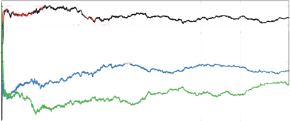{width="4.241999125109361in"
height="1.7757491251093613in"}{width="1.9058333333333333in"
height="0.48181867891513563in"}

> 124 M. Feurer et al.

{width="4.239318678915136in"
height="0.9793471128608924in"}

> 2.2
>
> 2.0
>
> 1.8

500 1000 1500 2000 2500 3000 3500

> ime \[sec\]

  ------- -----------------------------------
  3.0     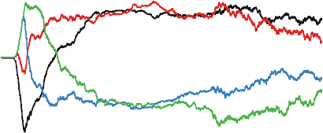
          
  > 2.8   > 1
  >       >
  > 2.6   > 10
          >
  2.4     > ime \[sec\]
          
  > 2.2   
  >       
  > 2.0   
  >       
  > 1.8   
  ------- -----------------------------------

> []{#_bookmark583 .anchor}**Fig.** **6.3** Average rank of all four
> Auto-sklearn variants (ranked by balanced test error rate (BER))
> across 140 datasets. Note that ranks are a relative measure of
> performance (here, the rank of all methods has to add up to 10), and
> hence an improvement in BER of one method can worsen the rank of
> another. (Top) Data plotted on a linear x scale. (Bottom) This is the
> same data as for the upper plot, but on a log x scale. Due to the
> small additional overhead that meta-learning and ensemble selection
> cause, vanilla Auto-sklearn is able to achieve the best rank within
> the first 10 s as it produces predictions before the other Auto-sklearn
> variants finish training their first model. After this, meta-learning
> quickly takes off
>
> performance under rigid time constraints, and also due to
> computational resource constraints, we limited the CPU time for each
> run to 1 h; we also limited the runtime
>
> for evaluating a single model to a tenth of this (6 min).
>
> To not evaluate performance on data sets already used for
> meta-learning, we performed a leave-one-dataset-out validation: when
> evaluating on dataset D, we only used meta-information from the 139
> other datasets.
>
> Fig. [6.3](#_bookmark583) shows the average ranks over time of the
> four Auto-sklearn versions we tested. We observe that both of our new
> methods yielded substantial improvements over vanilla Auto-sklearn.
> The most striking result is that meta-learning yielded
>
> 6 Auto-sklearn: Efficient and Robust Automated Machine Learning 125
>
> drastic improvements starting with the first configuration it selected
> and lasting until the end of the experiment. We note that the
> improvement was most pronounced in the beginning and that over time,
> vanilla Auto-sklearn also found good solutions without meta-learning,
> letting it catch up on some datasets (thus improving its overall
> rank).
>
> Moreover, both of our methods complement each other: our automated
> ensemble construction improved both vanilla Auto-sklearn and
> Auto-sklearn with meta- learning. Interestingly, the ensemble’s
> influence on the performance started earlier for the meta-learning
> version. We believe that this is because meta-learning produces better
> machine learning models earlier, which can be directly combined into a
> strong ensemble; but when run longer, vanilla Auto-sklearn without
> meta- learning also benefits from automated ensemble construction.
>
> []{#_bookmark554 .anchor}**6.7** **Detailed** **Analysis** **of**
> **Auto-sklearn** **Components**
>
> We now study Auto-sklearn’s individual classifiers and preprocessors,
> compared to jointly optimizing all methods, in order to obtain
> insights into their peak performance and robustness. Ideally, we would
> have liked to study all combinations of a single classifier and a
> single preprocessor in isolation, but with 15 classifiers and 14
> preprocessors this was infeasible; rather, when studying the
> performance of a single classifier, we still optimized over all
> preprocessors, and vice versa. To obtain a more detailed analysis, we
> focused on a subset of datasets but extended the configuration budget
> for optimizing all methods from one hour to one day and to two days
> for Auto-sklearn. Specifically, we clustered our 140 datasets with
> g-means \[[26](#_bookmark584)\] based on the dataset meta-features and
> used one dataset from each of the resulting 13 clusters. We give a
> basic description of the datasets in Table [6.3](#_bookmark585). In
> total, these
>
> extensive experiments required 10.7 CPU years.

Table [6.4](#_bookmark586) compares the results of the various
classification methods against Auto-sklearn. Overall, as expected, random
forests, extremely randomized trees, AdaBoost, and gradient boosting,
showed the most robust performance, and SVMs showed strong peak
performance for some datasets. Besides a variety of strong classifiers,
there are also several models which could not compete: The decision
tree, passive aggressive, kNN, Gaussian NB, LDA and QDA were
statistically significantly inferior to the best classifier on most
datasets. Finally, the table indicates that no single method was the
best choice for all datasets. As shown in the table and also visualized
for two example datasets in Fig.[6.4](#_bookmark587), optimizing the
joint configuration space of Auto-sklearn led to the most robust
performance. A plot of ranks over time (Fig. 2 and 3 in the
supplementary material of the original publication
\[[20](#_bookmark555)\]) quantifies this across all 13 datasets, showing
that Auto-sklearn starts with reasonable but not optimal performance and
effectively searches its more general configuration space to converge to
the best overall performance over time.

> Table [6.5](#_bookmark588)compares the results of the various
> preprocessors against Auto-sklearn. As for the comparison of
> classifiers above, Auto-sklearn showed the most robust
>
> 126 M. Feurer et al.
>
> []{#_bookmark585 .anchor}**Table** **6.3** Representative datasets for
> the 13 clusters obtained via g-means clustering of the 140 datasets’
> meta-feature vectors

  ---------------------------------------- ---------------------------------- ---------- --------- ----------- ---------- ------------------ -------------- -----------
  > ID                                     > Name                             > \#Cont   > \#Nom   > \#Class   > Sparse   > Missing Values   > |Training|   > |Test|

  > [38](http:/www.openml.org/d/38)       > Sick                             > 7        > 22      > 2         > –        > X                > 2527         > 1245

  > [46](http:/www.openml.org/d/46)       > Splice                           > 0        > 60      > 3         > –        > –                > 2137         > 1053

  > [179](http:/www.openml.org/d/179)     > Adult                            > 2        > 12      > 2         > –        > X                > 32,724       > 16,118

  > [184](http:/www.openml.org/d/184)     > KROPT                            > 0        > 6       > 18        > –        > –                > 18,797       > 9259

  > [554](http:/www.openml.org/d/554)     > MNIST                            > 784      > 0       > 10        > –        > –                > 46,900       > 23,100

  > [772](http:/www.openml.org/d/772)     > Quake                            > 3        > 0       > 2         > –        > –                > 1459         > 719

  > [917](http:/www.openml.org/d/917)     > fri\_c1\_ 1000\_25 (binarized)   > 25       > 0       > 2         > –        > –                > 670          > 330

  > [1049](http:/www.openml.org/d/1049)   > pc4                              > 37       > 0       > 2         > –        > –                > 976          > 482

  > [1111](http:/www.openml.org/d/1111)   > KDDCup09                         > 192      > 38      > 2         > –        > X                > 33,500       > 16,500
                                           >                                                                                                                
                                           > Appetency                                                                                                      

  > [1120](http:/www.openml.org/d/1120)   > Magic Telescope                  > 10       > 0       > 2         > –        > –                > 12,743       > 6277

  > [1128](http:/www.openml.org/d/1128)   > OVA Breast                       > 10935    > 0       > 2         > –        > –                > 1035         > 510

  > [293](http:/www.openml.org/d/293)     > Covertype                        > 54       > 0       > 2         > X        > –                > 389,278      > 191,734
                                           >                                                                                                                
                                           > (binarized)                                                                                                    

  > [389](http:/www.openml.org/d/389)     > fbis\_wc                         > 2000     > 0       > 17        > X        > –                > 1651         > 812
  ---------------------------------------- ---------------------------------- ---------- --------- ----------- ---------- ------------------ -------------- -----------

> performance: It performed best on three of the datasets and was not
> statistically significantly worse than the best preprocessor on another
> 8 of 13.
>
> **6.8** **Discussion** **and** **Conclusion**

Having presented our experimental validation, we now conclude this
chapter with a brief discussion, a simple usage example of Auto-sklearn,
a short review of recent extensions, and concluding remarks.

> ***6.8.1*** ***Discussion***
>
> We demonstrated that our new AutoML system Auto-sklearn performs
> favorably against the previous state of the art in AutoML, and that
> our meta-learning and ensemble improvements for AutoML yield further
> efficiency and robustness. This finding is backed by the fact that
> Auto-sklearn won three out of five auto-tracks, including the final two,
> in ChaLearn’s first AutoML challenge. In this paper, we did not
> evaluate the use of Auto-sklearn for interactive machine learning with
> an expert in the loop and weeks of CPU power, but we note that mode
> has led to three first places in the human (aka Final) track of the
> first ChaLearn AutoML challenge (in
>
> **Table** **6.4** Median balanced test error rate (BER) of optimizing
> Auto-sklearn subspaces for each classification method (and all
> preprocessors), as well as the whole configuration space of
> Auto-sklearn, on 13 datasets. All optimization runs were allowed to
> run for 24 h except for Auto-sklearn which ran for 48 h. Bold numbers
> indicate the best result; underlined results are not statistically
> significantly different from the best according to a bootstrap test
> using the same setup as for Table [6.2](#_bookmark582)

  ---------------------------------------- ----------------- ------------- ---------------------------------- ------------ ------------- ------------ ------------- --------- --------- -------------- -------------- ---------------------- ------------- --------- ------------ -----------------------
  > OpenML dataset                         > AUTO- SKLEARN   > AdaBoost    > Bernoulli                        > Decision   > Extreml.    > Gaussian   > Gradient    > kNN     > LDA     > Linear SVM   > Kernel SVM   > Multi-               > Passive     > QDA     > Random     > Linear Class. (SGD)
  >                                                                        >                                  >            >             >            >                                                               >                      >                       >            
  > ID                                                                     > naïve                            > tree       > rand.       > naïve      > boosting                                                      > nomial naïve Bayes   > aggresive             > forest     
                                                                           >                                               >             >                                                                                                                                        
                                                                           > Bayes                                         > trees       > Bayes                                                                                                                                  

  > [38](http:/www.openml.org/d/38)       > 2.15            > 2.68        > 50.22                            > 2.15       > 18.06       > 11.22      > **1.77**    > 50.00   > 8.55    > 16.29        > 17.89        > 46.99                > 50.00       > 8.78    > 2.34       > 15.82

  > [46](http:/www.openml.org/d/46)       > 3.76            > 4.65        > –                                > 5.62       > 4.74        > 7.88       > **3.49**    > 7.57    > 8.67    > 8.31         > 5.36         > 7.55                 > 9.23        > 7.57    > 4.20       > 7.31

  > [179](http:/www.openml.org/d/179)     > **16.99**       > 17.03       > 19.27                            > 18.31      > 17.09       > 21.77      > 17.00       > 22.23   > 18.93   > 17.30        > 17.57        > 18.97                > 22.29       > 19.06   > 17.24      > 17.01

  > [184](http:/www.openml.org/d/184)     > **10.32**       > 10.52       > –                                > 17.46      > 11.10       > 64.74      > 10.42       > 31.10   > 35.44   > 15.76        > 12.52        > 27.13                > 20.01       > 47.18   > 10.98      > 12.76

  > [554](http:/www.openml.org/d/554)     > 1.55            > 2.42        > –                                > 12.00      > 2.91        > 10.52      > 3.86        > 2.68    > 3.34    > 2.23         > **1.50**     > 10.37                > 100.00      > 2.75    > 3.08       > 2.50

  > [772](http:/www.openml.org/d/772)     > 46.85           > 49.68       > 47.90                            > 47.75      > **45.62**   > 48.83      > 48.15       > 48.00   > 46.74   > 48.38        > 48.66        > 47.21                > 48.75       > 47.67   > 47.71      > 47.93

  > [917](http:/www.openml.org/d/917)     > 10.22           > 9.11        > []{#_bookmark586 .anchor}25.83   > 11.00      > 10.22       > 33.94      > 10.11       > 11.11   > 34.22   > 18.67        > **6.78**     > 25.50                > 20.67       > 30.44   > 10.83      > 18.33

  > [1049](http:/www.openml.org/d/1049)   > 12.93           > **12.53**   > 15.50                            > 19.31      > 17.18       > 26.23      > 13.38       > 23.80   > 25.12   > 17.28        > 21.44        > 26.40                > 29.25       > 21.38   > 13.75      > 19.92

  > [1111](http:/www.openml.org/d/1111)   > 23.70           > 23.16       > 28.40                            > 24.40      > 24.47       > 29.59      > **22.93**   > 50.30   > 24.11   > 23.99        > 23.56        > 27.67                > 43.79       > 25.86   > 28.06      > 23.36

  > [1120](http:/www.openml.org/d/1120)   > 13.81           > **13.54**   > 18.81                            > 17.45      > 13.86       > 21.50      > 13.61       > 17.23   > 15.48   > 14.94        > 14.17        > 18.33                > 16.37       > 15.62   > 13.70      > 14.66

  > [1128](http:/www.openml.org/d/1128)   > 4.21            > 4.89        > 4.71                             > 9.30       > 3.89        > 4.77       > 4.58        > 4.59    > 4.58    > 4.83         > 4.59         > 4.46                 > 5.65        > 5.59    > **3.83**   > 4.33

  > [293](http:/www.openml.org/d/293)     > 2.86            > 4.07        > 24.30                            > 5.03       > 3.59        > 32.44      > 24.48       > 4.86    > 24.40   > 14.16        > 100.00       > 24.20                > 21.34       > 28.68   > **2.57**   > 15.54

  > [389](http:/www.openml.org/d/389)     > 19.65           > 22.98       > –                                > 33.14      > 19.38       > 29.18      > 19.20       > 30.87   > 19.68   > **17.95**    > 22.04        > 20.04                > 20.14       > 39.57   > 20.66      > 17.99
  ---------------------------------------- ----------------- ------------- ---------------------------------- ------------ ------------- ------------ ------------- --------- --------- -------------- -------------- ---------------------- ------------- --------- ------------ -----------------------

{width="0.3015409011373578in"
height="7.005577427821523e-2in"}{width="0.18936023622047243in"
height="7.568022747156605e-2in"}{width="8.586067366579178e-2in"
height="5.4777996500437444e-2in"}{width="0.8694860017497813in"
height="9.463910761154856e-2in"}{width="0.5429724409448818in"
height="7.567913385826772e-2in"}{width="0.2402001312335958in"
height="7.568897637795276e-2in"}{width="0.4472495625546807in"
height="7.568022747156605e-2in"}{width="0.24655511811023623in"
height="7.005468066491688e-2in"}{width="0.108665791776028in"
height="0.6683606736657918in"}{width="0.24983267716535434in"
height="1.4315551181102362in"}{width="7.568022747156605e-2in"
height="0.38283245844269465in"}{width="7.568022747156605e-2in"
height="0.5943886701662292in"}{width="0.15036089238845143in"
height="0.10351377952755905in"}{width="0.15172134733158354in"
height="0.10351377952755905in"}{width="0.49266622922134734in"
height="8.719378827646544e-2in"}{width="0.107166447944007in"
height="7.395778652668417e-2in"}{width="0.3015277777777778in"
height="7.004155730533683e-2in"}{width="0.2943613298337708in"
height="7.567913385826772e-2in"}{width="0.8694991251093613in"
height="9.463910761154856e-2in"}{width="0.542985564304462in"
height="7.568022747156605e-2in"}{width="0.24020778652668417in"
height="7.567913385826772e-2in"}{width="0.4472637795275591in"
height="7.569444444444444e-2in"}{width="0.24654090113735783in"
height="7.005468066491688e-2in"}{width="0.1552635608048994in"
height="2.886248906386702in"}{width="0.1066240157480315in"
height="7.266622922134733e-2in"}

> 128 M. Feurer et al.

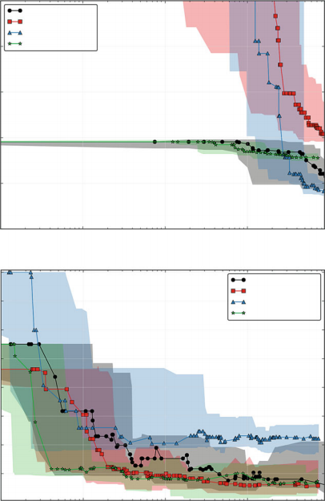{width="4.21501312335958in"
height="6.506665573053368in"}

{width="3.3597353455818024in"
height="0.10351377952755905in"}

{width="0.49266622922134734in"
height="8.719378827646544e-2in"}

[]{#_bookmark587 .anchor}**Fig.** **6.4** Performance of a subset of
classifiers compared to Auto-sklearn over time. (Top) MNIST (OpenML
dataset ID[554](http:/www.openml.org/d/554)). (Bottom) Promise pc4
(OpenML dataset ID[1049](http:/www.openml.org/d/1049)). We show median
test error rate and the fifth and 95th percentile over time for
optimizing three classifiers separately with optimizing the joint space.
A plot with all classifiers can be found in Fig. 4 in the supplementary
material of the original publication \[[20](#_bookmark555)\]. While
Auto-sklearn is inferior in the beginning, in the end its performance is
close to the best method

> **Table** **6.5** Like Table [6.4](#_bookmark586), but instead
> optimizing subspaces for each preprocessing method (and all
> classifiers)

  ---------------------------------------- ----------------- ------------------------------ ------------ --------- ------------------- -------------- ----------------- ------------- ------------- -------------------- --------- ---------------- ---------------- ------------------------------ ------------ ------------------
  > OpenML dataset                         > AUTO- SKLEARN   > Densi-                       > Extreml.   > Fast    > Feature           > Kernel PCA   > Rand.           > Linear      > No          > Nystroem sampler   > PCA     > Poly- nomial   > Random         > Select                       > Select     > Truncated- SVD
  >                                                          >                              >            >         >                                  >                 >             >                                                             >                >                              >            
  > ID                                                       > fier                          > rand.      > ICA     > agglom- eration                  > kitchen sinks   > SVM         > preproc.                                                    > trees embed.   > percentile classifica- tion   > rates      
                                                                                            >                                                                           >                                                                                                                                        
                                                                                            > trees                                                                     > prepr.                                                                                                                                 
                                                                                            >                                                                                                                                                                                                                    
                                                                                            > prepr.                                                                                                                                                                                                             

  > [38](http:/www.openml.org/d/38)       > **2.15**        > –                            > 4.03       > 7.27    > 2.24              > 5.84         > 8.57            > 2.28        > 2.28        > 7.70               > 7.23    > 2.90           > 18.50          > 2.20                         > 2.28       > –

  > [46](http:/www.openml.org/d/46)       > **3.76**        > –                            > 4.98       > 7.95    > 4.40              > 8.74         > 8.41            > 4.25        > 4.52        > 8.48               > 8.40    > 4.21           > 7.51           > 4.17                         > 4.68       > –

  > [179](http:/www.openml.org/d/179)     > 16.99           > –                            > 17.83      > 17.24   > 16.92             > 100.00       > 17.34           > **16.84**   > 16.97       > 17.30              > 17.64   > 16.94          > 17.05          > 17.09                        > 16.86      > –

  > [184](http:/www.openml.org/d/184)     > 10.32           > –                            > 55.78      > 19.96   > 11.31             > 36.52        > 28.05           > **9.92**    > 11.43       > 25.53              > 21.15   > 10.54          > 12.68          > 45.03                        > 10.47      > –

  > [554](http:/www.openml.org/d/554)     > 1.55            > –                            > 1.56       > 2.52    > 1.65              > 100.00       > 100.00          > 2.21        > 1.60        > 2.21               > 1.65    > 100.00         > 3.48           > **1.46**                     > 1.70       > –

  > [772](http:/www.openml.org/d/772)     > **46.85**       > –                            > 47.90      > 48.65   > 48.62             > 47.59        > 47.68           > 47.72       > 48.34       > 48.06              > 47.30   > 48.00          > 47.84          > 47.56                        > 48.43      > –

  > [917](http:/www.openml.org/d/917)     > 10.22           > –                            > **8.33**   > 16.06   > 10.33             > 20.94        > 35.44           > 8.67        > 9.44        > 37.83              > 22.33   > 9.11           > 17.67          > 10.00                        > 10.44      > –

  > [1049](http:/www.openml.org/d/1049)   > 12.93           > []{#_bookmark588 .anchor}–   > 20.36      > 19.92   > 13.14             > 19.57        > 20.06           > 13.28       > 15.84       > 18.96              > 17.22   > 12.95          > 18.52          > **11.94**                    > 14.38      > –

  > [1111](http:/www.openml.org/d/1111)   > 23.70           > –                            > 23.36      > 24.69   > 23.73             > 100.00       > 25.25           > 23.43       > **22.27**   > 23.95              > 23.25   > 26.94          > 26.68          > 23.53                        > 23.33      > –

  > [1120](http:/www.openml.org/d/1120)   > 13.81           > –                            > 16.29      > 14.22   > 13.73             > 14.57        > 14.82           > 14.02       > 13.85       > 14.66              > 14.23   > **13.22**      > 15.03          > 13.65                        > 13.67      > –

  > [1128](http:/www.openml.org/d/1128)   > 4.21            > –                            > 4.90       > 4.96    > 4.76              > 4.21         > 5.08            > 4.52        > 4.59        > **4.08**           > 4.59    > 50.00          > 9.23           > 4.33                         > **4.08**   > –

  > [293](http:/www.openml.org/d/293)     > 2.86            > 24.40                        > 3.41       > –       > –                 > 100.00       > 19.30           > 3.01        > **2.66**    > 20.94              > –       > –              > 8.05           > 2.86                         > 2.74       > 4.05

  > [389](http:/www.openml.org/d/389)     > 19.65           > 20.63                        > 21.40      > –       > –                 > **17.50**    > 19.66           > 19.89       > 20.87       > 18.46              > –       > –              > 44.83          > 20.17                        > 19.18      > 21.58
  ---------------------------------------- ----------------- ------------------------------ ------------ --------- ------------------- -------------- ----------------- ------------- ------------- -------------------- --------- ---------------- ---------------- ------------------------------ ------------ ------------------

{width="4.606665573053369in"
height="6.944444444444444e-3in"}{width="4.606665573053369in"
height="6.944444444444444e-3in"}

> 130 M. Feurer et al.

addition to the auto-tracks, in particular Table[10.5](#_bookmark589),
phases Final 0–4). As such, we believe that Auto-sklearn is a promising
system for use by both machine learning novices and experts.

Since the publication of the original NeurIPS paper
\[[20](#_bookmark555)\], Auto-sklearn has become a standard baseline for
new approaches to automated machine learning, such as FLASH
\[[46](#_bookmark590)\], RECIPE \[[39](#_bookmark591)\], Hyperband
\[[32](#_bookmark592)\], AutoPrognosis \[[3](#_bookmark593)\], ML- PLAN
\[[34](#_bookmark594)\], Auto-Stacker \[[11](#_bookmark595)\] and
AlphaD3M \[[13](#_bookmark596)\].

> ***6.8.2*** ***Usage***
>
> One important outcome of the research on Auto-sklearn is the
> *auto-sklearn* Python package. It is a drop-in replacement for any
> scikit-learn classifier or regressor, similar to the classifier provided
> by HYPEROPT-SKLEARN \[[30](#_bookmark561)\] and can be used as
> follows:
>
> import autosklearn .classification
>
> cls = autosklearn .classification .AutoSklearnClassifier()
>
> cls.fit (X\_train, y\_train)
>
> predictions = cls .predict(X\_test)
>
> Auto-sklearn can be used with any loss function and resampling
> strategy to estimate the validation loss. Furthermore, it is possible
> to extend the classifiers and preprocessors Auto-sklearn can choose
> from. Since the initial publication we also added regression support
> to Auto-sklearn. We develop the package on
> [*https:/github.com/automl/auto-sklearn*](https:/github.com/automl/auto-sklearn)and
> it is available via the Python packaging index
> [*pypi.org*](https:/pypi.org). We provide documentation on
> [automl.github.io/auto-sklearn](https:/automl.github.io/auto-sklearn/stable/).
>
> ***6.8.3*** ***Extensions*** ***in*** ***PoSH*** ***Auto-sklearn***
>
> While Auto-sklearn as described in this chapter is limited to handling
> datasets of relatively modest size, in the context of the most recent
> AutoML challenge (AutoML 2, run in 2018; see Chap.[10](#_bookmark13)),
> we have extended it towards also handling large datasets effectively.
> Auto-sklearn was able to handle datasets of several hundred thousand
> datapoints by using a cluster of 25 CPUs for two days, but not within
> the 20 min time budget required by the AutoML 2 challenge. As
> described in detail in a recent workshop paper
> \[[18](#_bookmark597)\], this implied opening up the methods
> considered to also include extreme gradient boosting (in particular,
> XGBoost \[[12](#_bookmark598)\]), using the multi- fidelity approach of
> successive halving \[[28](#_bookmark599)\] (also described in
> Chap.[1](#_bookmark2)) to solve the CASH problem, and changing our
> meta-learning approach. We now briefly describe the resulting system,
> **PoSH** **Auto-sklearn** (short for *Portfolio* *Successive*
> *Halving*, combined with Auto-sklearn), which obtained the best
> performance in the 2018 challenge.
>
> 6 Auto-sklearn: Efficient and Robust Automated Machine Learning 131
>
> PoSH Auto-sklearn starts by running successive halving with a fixed
> portfolio of 16 machine learning pipeline configurations, and if there
> is time left, it uses the outcome of these runs to warmstart a
> combination of Bayesian optimization and successive halving. The fixed
> portfolio of 16 pipelines was obtained by running greedy submodular
> function maximization to select a strong set of complementary
> configurations to optimize the performance obtained on a set of 421
> datasets; the candidate configurations configured for this optimization
> were the 421 configura- tions found by running SMAC
> \[[27](#_bookmark558)\] on each of these 421 datasets.
>
> The combination of Bayesian optimization and successive halving we
> used to yield robust results within a short time window is an
> adaptation of the multi- fidelity hyperparameter optimization method
> BOHB (Bayesian Optimization and HyperBand) \[[17](#_bookmark600)\]
> discussed in Chap.[1](#_bookmark2). As budgets for this multifidelity
> approach, we used the number of iterations for all iterative
> algorithms, except for the SVM, where we used dataset size as a
> budget.
>
> Another extension for large datasets that is currently ongoing is our
> work on automated deep learning; this is discussed in the following
> chapter on Auto-Net.
>
> ***6.8.4*** ***Conclusion*** ***and*** ***Future*** ***Work***

Following the AutoML approach taken by Auto-WEKA, we introduced Auto-
sklearn, which performs favorably against the previous state of the art
in AutoML. We also showed that our meta-learning and ensemble mechanisms
improve its efficiency and robustness further.

While Auto-sklearn handles the hyperparameter tuning for a user,
Auto-sklearn has hyperparameters on its own which influence its
performance for a given time budget, such as the time limits discussed
in Sects.[6.5](#_bookmark552),[6.6](#_bookmark553),
and[6.7](#_bookmark554), or the resampling strategy used to calculate
the loss function. We demonstrated in preliminary work that the choice
of the resampling strategy and the selection of timeouts can be cast as
a meta-learning problem itself \[[19](#_bookmark601)\], but we would
like to extend this to other possible design choices Auto-sklearn users
face.

Since the time of writing the original paper, the field of meta-learning
has progressed a lot, giving access to multiple new methods to include
meta information into Bayesian optimization. We expect that using one of
the newer methods discussed in Chap.[2](#_bookmark3)could substantially
improve the optimization procedure.

Finally, having a fully automated procedure that can test hundreds of
hyperpa- rameter configurations puts us at increased risk of overfitting
to the validation set. To avoid this overfitting, we would like to
combine Auto-sklearn with one of the techniques discussed in
Chap.[1](#_bookmark2), techniques from differential privacy
\[[14](#_bookmark602)\], or other techniques yet to be developed.

> 132 M. Feurer et al.

**Acknowledgements** This work was supported by the German Research
Foundation (DFG), under Priority Programme Autonomous Learning (SPP
1527, grant HU 1900/3- 1), under Emmy Noether grant HU 1900/2- 1, and
under the BrainLinks-BrainTools Cluster of Excellence (grant number EXC
1086).

> []{#_bookmark581 .anchor}**Bibliography**
>
> 1\. Auto-WEKA website, <http:/www.cs.ubc.ca/labs/beta/Projects/autoweka>
>
> []{#_bookmark593 .anchor}2. Proc. of NeurIPS’15 (2015)
>
> 3\. Ahmed, A., van der Schaar, M.: AutoPrognosis: Automated clinical
> prognostic modeling via Bayesian optimization with structured kernel
> learning. In: Proc. of ICML’18. pp. 139– 148
>
> []{#_bookmark564 .anchor}(2018)
>
> 4\. Bardenet, R., Brendel, M., Kégl, B., Sebag, M.: Collaborative
> hyperparameter tuning. In: Proc. []{#_bookmark557 .anchor}of ICML’13.
> pp. 199–207 (2014)
>
> 5\. Bergstra, J., Bardenet, R., Bengio, Y., Kégl, B.: Algorithms for
> hyper-parameter optimization. In: Proc. of NIPS’11. pp. 2546–2554 (2011)
>
> [[]{#_bookmark562 .anchor}]{#_bookmark543 .anchor}6. Breiman, L.:
> Random forests. MLJ 45, 5–32 (2001)
>
> 7\. Brochu, E., Cora, V., de Freitas, N.: A tutorial on Bayesian
> optimization of expensive cost functions, with application to active
> user modeling and hierarchical reinforcement learning. []{#_bookmark577
> .anchor}arXiv:1012.2599v1 \[cs.LG\] (2010)
>
> 8\. Bürger, F., Pauli, J.: A holistic classification optimization
> framework with feature selection, preprocessing, manifold learning and
> classifiers. In: Proc. of ICPRAM’15. pp. 52–68 (2015)
>
> 9\. Caruana, R., Munson, A., Niculescu-Mizil, A.: Getting the most out of
> ensemble selection. In: [[]{#_bookmark573 .anchor}]{#_bookmark574
> .anchor}Proc. of ICDM’06. pp. 828–833 (2006)
>
> 10\. Caruana, R., Niculescu-Mizil, A., Crew, G., Ksikes, A.: Ensemble
> selection from libraries of []{#_bookmark595 .anchor}models. In: Proc.
> of ICML’04. p. 18 (2004)
>
> 11\. Chen, B., Wu, H., Mo, W., Chattopadhyay, I., Lipson, H.:
> Autostacker: A compositional evolutionary learning system. In: Proc. of
> GECCO’18 (2018)
>
> 12\. Chen, T., Guestrin, C.: XGBoost: A scalable tree boosting system.
> In: Proc. of KDD’16. pp. [[]{#_bookmark596 .anchor}]{#_bookmark598
> .anchor}785–794 (2016)
>
> 13\. Drori, I., Krishnamurthy, Y., Rampin, R., Lourenco, R., One, J.,
> Cho, K., Silva, C., Freire, J.: AlphaD3M: Machine learning pipeline
> synthesis. In: ICML AutoML workshop (2018)
>
> []{#_bookmark602 .anchor}14. Dwork, C., Feldman, V., Hardt, M.,
> Pitassi, T., Reingold, O., Roth, A.: Generalization in adaptive data
> analysis and holdout reuse. In: Proc. of NIPS’15
> \[[2](#_bookmark581)\], pp. 2350–2358
>
> []{#_bookmark560 .anchor}15. Eggensperger, K., Feurer, M., Hutter, F.,
> Bergstra, J., Snoek, J., Hoos, H., Leyton-Brown, K.: Towards an
> empirical foundation for assessing Bayesian optimization of
> hyperparameters. In: NIPS Workshop on Bayesian Optimization in Theory
> and Practice (2013)
>
> 16\. Escalante, H., Montes, M., Sucar, E.: Ensemble particle swarm model
> selection. In: Proc. of [[]{#_bookmark576 .anchor}]{#_bookmark600
> .anchor}IJCNN’10. pp. 1–8. IEEE (Jul 2010)
>
> 17\. Falkner, S., Klein, A., Hutter, F.: BOHB: Robust and Efficient
> Hyperparameter Optimization []{#_bookmark597 .anchor}at Scale. In: Proc.
> of ICML’18. pp. 1437– 1446 (2018)
>
> 18\. Feurer, M., Eggensperger, K., Falkner, S., Lindauer, M., Hutter, F.:
> Practical automated machine learning for the automl challenge 2018. In:
> ICML AutoML workshop (2018)
>
> 19\. Feurer, M., Hutter, F.: Towards further automation in automl. In:
> ICML AutoML workshop
>
> [[]{#_bookmark601 .anchor}]{#_bookmark555 .anchor}(2018)
>
> 20\. Feurer, M., Klein, A., Eggensperger, K., Springenberg, J., Blum, M.,
> Hutter, F.: Efficient and robust automated machine learning. In: Proc. of
> NIPS’15 \[[2](#_bookmark581)\], pp. 2962–2970
>
> []{#_bookmark545 .anchor}21. Feurer, M., Springenberg, J., Hutter, F.:
> Initializing Bayesian hyperparameter optimization via meta-learning.
> In: Proc. of AAAI’15. pp. 1128– 1135 (2015)
>
> 6 Auto-sklearn: Efficient and Robust Automated Machine Learning 133
>
> []{#_bookmark546 .anchor}22. Gomes, T., Prudêncio, R., Soares, C.,
> Rossi, A., Carvalho, A.: Combining meta-learning and search techniques
> to select parameters for support vector machines. Neurocomputing
> 75(1), []{#_bookmark541 .anchor}3– 13 (2012)
>
> 23\. Guyon, I., Bennett, K., Cawley, G., Escalante, H., Escalera, S., Ho,
> T., N.Macià, Ray, B., Saeed, M., Statnikov, A., Viegas, E.: Design of
> the 2015 ChaLearn AutoML Challenge. In: Proc. of []{#_bookmark571
> .anchor}IJCNN’15 (2015)
>
> 24\. Guyon, I., Saffari, A., Dror, G., Cawley, G.: Model selection:
> Beyond the Bayesian/Frequentist []{#_bookmark556 .anchor}divide. JMLR
> 11, 61–87 (2010)
>
> 25\. Hall, M., Frank, E., Holmes, G., Pfahringer, B., Reutemann, P.,
> Witten, I.: The WEKA data mining software: An update. ACM SIGKDD
> Exploratians Newsletter 11(1), 10– 18 (2009)
>
> []{#_bookmark584 .anchor}26. Hamerly, G., Elkan, C.: Learning the k in
> k-means. In: Proc. of NIPS’04. pp. 281–288 (2004)
>
> []{#_bookmark558 .anchor}27. Hutter, F., Hoos, H., Leyton-Brown, K.:
> Sequential model-based optimization for general []{#_bookmark599
> .anchor}algorithm configuration. In: Proc. of LION’11. pp. 507–523
> (2011)
>
> 28\. Jamieson, K., Talwalkar, A.: Non-stochastic best arm identification
> and hyperparameter optimization. In: Proc. of AISTATS’16. pp. 240–248
> (2016)
>
> 29\. Kalousis, A.: Algorithm Selection via Meta-Learning. Ph.D. thesis,
> University of Geneve
>
> [[]{#_bookmark567 .anchor}]{#_bookmark561 .anchor}(2002)
>
> 30\. Komer, B., Bergstra, J., Eliasmith, C.: Hyperopt-sklearn: Automatic
> hyperparameter configu- []{#_bookmark572 .anchor}ration for scikit-learn.
> In: ICML workshop on AutoML (2014)
>
> 31\. Lacoste, A., Marchand, M., Laviolette, F., Larochelle, H.: Agnostic
> Bayesian learning of []{#_bookmark592 .anchor}ensembles. In: Proc. of
> ICML’14. pp. 611–619 (2014)
>
> 32\. Li, L., Jamieson, K., DeSalvo, G., Rostamizadeh, A., Talwalkar, A.:
> Hyperband: A novel bandit-based approach to hyperparameter optimization.
> JMLR 18(185), 1–52 (2018)
>
> 33\. Michie, D., Spiegelhalter, D., Taylor, C., Campbell, J.: Machine
> Learning, Neural and [[]{#_bookmark594 .anchor}]{#_bookmark568
> .anchor}Statistical Classification. Ellis Horwood (1994)
>
> 34\. Mohr, F., Wever, M., Hüllermeier, E.: Ml-plan: Automated machine
> learning via hierarchical []{#_bookmark580 .anchor}planning. Machine
> Learning (2018)
>
> 35\. Niculescu-Mizil, A., Perlich, C., Swirszcz, G., Sindhwani, V., Liu,
> Y., Melville, P., Wang, D., Xiao, J., Hu, J., Singh, M., Shang, W., Zhu,
> Y.: Winning the KDD cup orange challenge with ensemble selection. The
> 2009 Knowledge Discovery in Data Competition pp. 23–34 (2009)
>
> []{#_bookmark550 .anchor}36. Pedregosa, F., Varoquaux, G., Gramfort,
> A., Michel, V., Thirion, B., Grisel, O., Blondel, M., Prettenhofer,
> P., Weiss, R., Dubourg, V., Vanderplas, J., Passos, A., Cournapeau,
> D., Brucher, M., Perrot, M., Duchesnay, E.: Scikit-learn: Machine
> learning in Python. JMLR 12, 2825–2830
>
> []{#_bookmark569 .anchor}(2011)
>
> 37\. Pfahringer, B., Bensusan, H., Giraud-Carrier, C.: Meta-learning by
> landmarking various []{#_bookmark547 .anchor}learning algorithms. In:
> Proc. of ICML’00. pp. 743–750 (2000)
>
> 38\. Reif, M., Shafait, F., Dengel, A.: Meta-learning for evolutionary
> parameter optimization of []{#_bookmark591 .anchor}classifiers. Machine
> Learning 87, 357–380 (2012)
>
> 39\. de Sá, A., Pinto, W., Oliveira, L., Pappa, G.: RECIPE: a
> grammar-based framework for automatically evolving classification
> pipelines. In: Proc. of ECGP’17. pp. 246–261 (2017)

[]{#_bookmark544 .anchor}40. Shahriari, B., Swersky, K., Wang, Z.,
Adams, R., de Freitas, N.: Taking the human out of the loop: A review of
Bayesian optimization. Proceedings of the IEEE 104(1), 148– 175 (2016)

[]{#_bookmark559 .anchor}41. Snoek, J., Larochelle, H., Adams, R.:
Practical Bayesian optimization of machine learning []{#_bookmark542
.anchor}algorithms. In: Proc. of NIPS’12. pp. 2960–2968 (2012)

42\. Thornton, C., Hutter, F., Hoos, H., Leyton-Brown, K.: Auto-WEKA:
combined selection and hyperparameter optimization of classification
algorithms. In: Proc. of KDD’13. pp. 847–855

> (2013)
>
> 134 M. Feurer et al.
>
> []{#_bookmark566 .anchor}43. Vanschoren, J., van Rijn, J., Bischl, B.,
> Torgo, L.: OpenML: Networked science in machine []{#_bookmark575
> .anchor}learning. SIGKDD Explorations 15(2), 49–60 (2013)
>
> []{#_bookmark565 .anchor}44. Wolpert, D.: Stacked generalization.
> Neural Networks 5, 241–259 (1992)
>
> 45\. Yogatama, D., Mann, G.: Efficient transfer learning method for
> automatic hyperparameter []{#_bookmark590 .anchor}tuning. In: Proc. of
> AISTATS’14. pp. 1077– 1085 (2014)
>
> 46\. Zhang, Y., Bahadori, M., Su, H., Sun, J.: FLASH: Fast Bayesian
> Optimization for Data Analytic Pipelines. In: Proc. of KDD’16. pp.
> 2065–2074 (2016)
>
> **Open** **Access** This chapter is licensed under the terms of the
> Creative Commons Attribution 4.0 International License
> [(http:/creativecommons.org/licenses/by/4.0/](http:/creativecommons.org/licenses/by/4.0/)),
> which permits use, sharing, adaptation, distribution and reproduction
> in any medium or format, as long as you give appropriate credit to the
> original author(s) and the source, provide a link to the Creative
> Commons licence and indicate if changes were made.
>
> The images or other third party material in this chapter are included
> in the chapter’s Creative Commons licence, unless indicated otherwise
> in a credit line to the material. If material is not included in the
> chapter’s Creative Commons licence and your intended use is not
> permitted by statutory regulation or exceeds the permitted use, you
> will need to obtain permission directly from the copyright holder.

{width="0.787415791776028in"
height="0.275582895888014in"}

{width="0.42962489063867015in"
height="0.42963801399825025in"}{width="1.418332239720035in"
height="6.944444444444444e-3in"}

> []{#_bookmark10 .anchor}**Chapter** **7**
>
> **Towards** **Automatically-Tuned** **Deep**
>
> **Neural** **Networks**

> **Hector** **Mendoza,** **Aaron** **Klein,** **Matthias** **Feurer,**
> **Jost** **Tobias** **Springenberg,** **Matthias** **Urban,**
> **Michael** **Burkart,** **Maximilian** **Dippel,** **Marius**
> **Lindauer,** **and** **Frank** **Hutter**
>
> **Abstract** Recent advances in AutoML have led to automated tools
> that can

compete with machine learning experts on supervised learning tasks. In
this work, we present two versions of Auto-Net, which provide
automatically-tuned deep neural networks without any human intervention.
The first version, Auto-Net 1.0, builds upon ideas from the
competition-winning system Auto-sklearn by using the Bayesian
Optimization method SMAC and uses Lasagne as the underlying deep
learning (DL) library. The more recent Auto-Net 2.0 builds upon a recent
combination of Bayesian Optimization and HyperBand, called BOHB, and
uses PyTorch as DL library. To the best of our knowledge, Auto-Net 1.0
was the first automatically-tuned neural network to win competition
datasets against human experts (as part of the first AutoML challenge).
Further empirical results show that ensembling Auto-Net 1.0 with
Auto-sklearn can perform better than either approach alone, and that
Auto-Net 2.0 can perform better yet.

> **7.1** **Introduction**

Neural networks have significantly improved the state of the art on a
variety of benchmarks in recent years and opened many new promising
research avenues \[[22](#_bookmark603), [27](#_bookmark604),
[36](#_bookmark605), [39](#_bookmark606), [41](#_bookmark607)\].
However, neural networks are not easy to use for non-experts since their
performance crucially depends on proper settings of a large set of
hyperparameters (e.g., learning rate and weight decay) and architecture
choices (e.g., number of layers and type of activation functions). Here,
we present work

> H. Mendoza · A. Klein · M. Feurer · J. T. Springenberg · M. Urban · M.
> Burkart · M. Dippel
>
> M. Lindauer
>
> Department of Computer Science, University of Freiburg, Freiburg,
> Baden-Württemberg, Germany
>
> e-mail: <fh@informatik.uni-freiburg.de>
>
> F. Hutter (凶)
>
> Department of Computer Science, University of Freiburg, Freiburg,
> Germany
>
> © The Author(s) 2019
>
> F. Hutter et al. (eds.), *Automated* *Machine* *Learning*, The
> Springer Series on Challenges in Machine Learning,
> <https:/doi.org/10.1007/978-3-030-05318-5_7>
>
> 136 H. Mendoza et al.
>
> towards effective off-the-shelf neural networks based on approaches
> from automated
>
> machine learning (AutoML).

AutoML aims to provide effective off-the-shelf learning systems to free
experts and non-experts alike from the tedious and time-consuming tasks
of selecting the right algorithm for a dataset at hand, along with the
right preprocessing method and the various hyperparameters of all
involved components. Thornton et al. \[[43](#_bookmark608)\] phrased
this AutoML problem as a combined algorithm selection and hyperpa-
rameter optimization (CASH) problem, which aims to identify the
combination of algorithm components with the best (cross-)validation
performance.

One powerful approach for solving this CASH problem treats this cross-
validation performance as an expensive blackbox function and uses
Bayesian optimization \[[4](#_bookmark609), [35](#_bookmark610)\] to
search for its optimizer. While Bayesian optimization typically uses
Gaussian processes \[[32](#_bookmark611)\], these tend to have problems
with the special characteristics of the CASH problem (high
dimensionality; both categorical and continuous hyperparameters; many
conditional hyperparameters, which are only relevant for some
instantiations of other hyperparameters). Adapting GPs to handle these
characteristics is an active field of research \[[40](#_bookmark612),
[44](#_bookmark613)\], but so far Bayesian optimization methods using
tree-based models \[[2](#_bookmark614), [17](#_bookmark615)\] work best
in the CASH setting \[[9](#_bookmark616), [43](#_bookmark608)\].

Auto-Net is modelled after the two prominent AutoML systems Auto- WEKA
\[[43](#_bookmark608)\] and Auto-sklearn \[[11](#_bookmark617)\],
discussed in Chaps.[4](#_bookmark6) and [6](#_bookmark8) of this book,
respectively. Both of these use the random forest-based Bayesian
optimization method SMAC \[[17](#_bookmark615)\] to tackle the CASH
problem – to find the best instantiation of classifiers in WEKA
\[[16](#_bookmark618)\] and scikit-learn \[[30](#_bookmark619)\],
respectively. Auto-sklearn employs two additional methods to boost
performance. Firstly, it uses meta-learning \[[3](#_bookmark620)\] based
on experience on previous datasets to start SMAC from good configurations
\[[12](#_bookmark621)\]. Secondly, since the eventual goal is to make
the best predictions, it is wasteful to try out dozens of machine
learning models and then only use the single best model; instead,
Auto-sklearn saves all models evaluated by SMAC and constructs an
ensemble of these with the ensemble selection technique
\[[5](#_bookmark622)\]. Even though both Auto-WEKA and Auto-sklearn
include a wide range of supervised learning methods, neither includes
modern neural networks.

> Here, we introduce two versions of a system we dub *Auto-Net* to fill
> this gap. Auto-Net 1.0 is based on Theano and has a relatively simple
> search space, while the more recent Auto-Net 2.0 is implemented in
> PyTorch and uses a more complex space and more recent advances in DL.
> A further difference lies in their respective search procedure:
> Auto-Net 1.0 automatically configures neural networks with SMAC
> \[[17](#_bookmark615)\], following the same AutoML approach as
> Auto-WEKA and Auto- sklearn, while Auto-Net 2.0 builds upon BOHB
> \[[10](#_bookmark623)\], a combination of Bayesian Optimization (BO)
> and efficient racing strategies via HyperBand (HB)
> \[[23](#_bookmark624)\].

Auto-Net 1.0 achieved the best performance on two datasets in the human
expert track of the recent *ChaLearn* *AutoML* *Challenge*
\[[14](#_bookmark625)\]. To the best of our knowledge, this is the first
time that a fully-automatically-tuned neural network won a competition
dataset against human experts. Auto-Net 2.0 further improves upon
Auto-Net 1.0 on large data sets, showing recent progress in the field.

{width="1.418332239720035in"
height="6.944444444444444e-3in"}

> 7 Towards Automatically-Tuned Deep Neural Networks 137
>
> We describe the configuration space and implementation of Auto-Net 1.0
> in Sect.[7.2](#_bookmark626) and of Auto-Net 2.0 in
> Sect.[7.3](#_bookmark627). We then study their performance empirically
> in Sect.[7.4](#_bookmark628) and conclude in
> Sect.[7.5](#_bookmark629). We omit a thorough discussion of related
> work and refer to Chap.[3](#_bookmark4) of this book for an overview
> on the extremely active field of neural architecture search.
> Nevertheless, we note that several other recent tools follow
> Auto-Net’s goal of automating deep learning, such as Auto- Keras
> \[[20](#_bookmark630)\], Photon-AI, H2O.ai, DEvol or Google’s Cloud
> AutoML service.
>
> This chapter is an extended version of our 2016 paper introducing
> Auto-Net, presented at the *2016* *ICML* *Workshop* *on* *AutoML*
> \[[26](#_bookmark631)\].
>
> []{#_bookmark626 .anchor}**7.2** **Auto-Net** **1.0**
>
> We now introduce Auto-Net 1.0 and describe its implementation. We
> chose to implement this first version of Auto-Net as an extension of
> Auto-sklearn \[[11](#_bookmark617)\] by adding a new classification
> (and regression) component; the reason for this choice was that it
> allows us to leverage existing parts of the machine learning pipeline:
> feature preprocessing, data preprocessing and ensemble construction.
> Here, we limit Auto-Net to fully-connected feed-forward neural
> networks, since they apply to a wide range of different datasets; we
> defer the extension to other types of neural networks, such as
> convolutional or recurrent neural networks, to future work. To have
> access to neural network techniques we use the Python deep learning
> library Lasagne \[[6](#_bookmark632)\], which is built around Theano
> \[[42](#_bookmark633)\]. However, we note that in general our approach
> is independent of the neural network implementation.

Following \[[2](#_bookmark614)\] and \[[7](#_bookmark634)\], we
distinguish between layer-independent *network* *hyper-* *parameters*
that control the architecture and training procedure and *per-layer*
*hyperparameters* that are set for each layer. In total, we optimize 63
hyperparame- ters (see Table [7.1](#_bookmark635)), using the same
configuration space for all types of supervised learning (binary,
multiclass and multilabel classification, as well as regression). Sparse
datasets also share the same configuration space. (Since neural networks
cannot handle datasets in sparse representation out of the box, we
transform the data into a dense representation on a per-batch basis
prior to feeding it to the neural network.)

> The per-layer hyperparameters of layer k are conditionally dependent
> on the number of layers being at least k . For practical reasons, we
> constrain the number of layers to be between one and six: firstly, we
> aim to keep the training time of a single configuration
> low,[1](#_bookmark636) and secondly each layer adds eight per-layer
> hyperparameters to the configuration space, such that allowing
> additional layers would further complicate the configuration process.
>
> The most common way to optimize the internal weights of neural
> networks is via stochastic gradient descent (SGD) using partial
> derivatives calculated with back- propagation. Standard SGD crucially
> depends on the correct setting of the learning
>
> 1We aimed to be able to afford the evaluation of several dozens of
> configurations within a time []{#_bookmark636 .anchor}budget of two
> days on a single CPU.
>
> **Table** **7.1** Configuration space of Auto-Net. The configuration
> space for the preprocessing methods can be found in
> \[[11](#_bookmark617)\]

  ------------------------------ ------------------------- -------------------------------------------------------------- ------------- ------------- -------- ---------------
                                 > Name                    > Range                                                        > Default     > log scale   > Type   > Conditional

  > Network hyperparameters      > Batch size              > \[32, 4096\]                                                 > 32          > /           > float   > –

                                 > Number of updates       > \[50, 2500\]                                                 > 200         > /           > int    > –

                                 > Number of layers        > \[1, 6\]                                                     > 1           > –           > int    > –

                                 > Learning rate           > \[10−6 , 1.0\]                                               > 10−2        > /           > float   > –

                                 > L2 regularization       > \[10−7 , 10−2\]                                              > 10−4        > /           > float   > –

                                 > Dropout output layer    > \[0.0, 0.99\]                                                > 0.5         > /           > float   > –

                                 > Solver type             > {SGD, Momentum, Adam, Adadelta, Adagrad, smorm, Nesterov }   > smorm3s     > –           > cat    > –

                                 > lr-policy               > {Fixed, Inv, Exp, Step}                                      > Fixed       > –           > cat    > –

  > Conditioned on solver type   > 1                       > \[10−4 , 10−1\]                                              > 10−1        > /           > float   > /

                                 > 2                       > \[10−4 , 10−1\]                                              > 10−1        > /           > float   > /

                                 > ρ                       > \[0.05, 0.99\]                                               > 0.95        > /           > float   > /

                                 > Momentum                > \[0.3, 0.999\]                                               > 0.9         > /           > float   > /

  > Conditioned on lr-policy     > γ                       > \[10−3 , 10−1\]                                              > 10−2        > /           > float   > /

                                 > k                       > \[0.0, 1.0\]                                                 > 0.5         > –           > float   > /

                                 > s                       > []{#_bookmark635 .anchor}\[2, 20\]                           > 2           > –           > int    > /

  > Per-layer hyperparameters    > Activation-type         > {Sigmoid, TanH, ScaledTanH, ELU, ReLU, Leaky, Linear}        > ReLU        > –           > cat    > /

                                 > Number of units         > \[64, 4096\]                                                 > 128         > /           > int    > /

                                 > Dropout in layer        > \[0.0, 0.99\]                                                > 0.5         > –           > float   > /

                                 > Weight initialization   > {Constant, Normal, Uniform, Glorot-Uniform, Glorot-Normal,   > He-Normal   > –           > cat    > /
                                                           >                                                                                                   
                                                           > He-Normal, He-Uniform, Orthogonal, Sparse}                                                        

                                 > Std. normal init.       > \[10−7 , 0. 1\]                                              > 0.0005      > –           > float   > /

                                 > Leakiness               > \[0.01, 0.99\]                                               > 1           > –           > float   > /
                                                                                                                          >                                    
                                                                                                                          > 3                                  

                                 > tanh scale in           > \[0.5, 1.0\]                                                 > 2/3         > –           > float   > /

                                 > tanh scale out          > \[1. 1, 3.0\]                                                > 1.7159      > /           > float   > /
  ------------------------------ ------------------------- -------------------------------------------------------------- ------------- ------------- -------- ---------------

> 7 Towards Automatically-Tuned Deep Neural Networks 139

rate hyperparameter. To lessen this dependency, various algorithms
(solvers) for stochastic gradient descent have been proposed. We include
the following well- known methods from the literature in the
configuration space of Auto-Net: vanilla stochastic gradient descent
(SGD), stochastic gradient descent with momentum (Momentum), Adam
\[[21](#_bookmark637)\], Adadelta \[[48](#_bookmark638)\], Nesterov
momentum \[[28](#_bookmark639)\] and Adagrad \[[8](#_bookmark640)\].
Additionally, we used a variant of the vSGD optimizer
\[[33](#_bookmark641)\], dubbed “smorm”, in which the estimate of the
Hessian is replaced by an estimate of the squared gradient (calculated
as in the RMSprop procedure). Each of these methods comes with a
learning rate α and an own set of hyperparameters, for example Adam’s
momentum vectors β 1 and β2 . Each solver’s hyperparameter(s) are only
active if the corresponding solver is chosen.

> We also decay the learning rate α over time, using the following
> policies (which multiply the initial learning rate by a factor αdecay
> after each epoch t = 0 . . . T ):
>
> • Fixed: αdecay = 1
>
> • Inv: αdecay = (1 + γt)(−k)
>
> • Exp: αdecay = γ t
>
> • Step: αdecay = γ「t/s1
>
> Here, the hyperparameters k, s and γ are conditionally dependent on
> the choice of the policy.
>
> To search for a strong instantiation in this conditional search space
> of Auto-Net 1.0, as in Auto-WEKA and Auto-sklearn, we used the
> random-forest based Bayesian optimization method SMAC
> \[[17](#_bookmark615)\]. SMAC is an anytime approach that keeps track
> of the best configuration seen so far and outputs this when terminated.
>
> []{#_bookmark627 .anchor}**7.3** **Auto-Net** **2.0**
>
> AutoNet 2.0 differs from AutoNet 1.0 mainly in the following three
> aspects:
>
> • it uses PyTorch \[[29](#_bookmark642)\] instead of Lasagne as a deep
> learning library
>
> • it uses a larger configuration space including up-to-date deep
> learning techniques, modern architectures (such as ResNets) and
> includes more compact representa- tions of the search space, and
>
> • it applies BOHB \[[10](#_bookmark623)\] instead of SMAC to obtain a
> well-performing neural network more efficiently.
>
> In the following, we will discuss these points in more detail.

Since the development and maintenance of Lasagne ended last year, we
chose a different Python library for Auto-Net 2.0. The most popular deep
learning libraries right now are PyTorch \[[29](#_bookmark642)\] and
Tensorflow \[[1](#_bookmark643)\]. These come with quite similar features
and mostly differ in the level of detail they give insight into. For
example, PyTorch offers the user the possibility to trace all
computations during training. While there are advantages and
disadvantages for each of these libraries, we decided

> 140 H. Mendoza et al.
>
> to use PyTorch because of its ability to dynamically construct
> computational graphs. For this reason, we also started referring to
> Auto-Net 2.0 as Auto-PyTorch.

The search space of AutoNet 2.0 includes both hyperparameters for module
selection (e.g. scheduler type, network architecture) and
hyperparameters for each of the specific modules. It supports different
deep learning modules, such as network type, learning rate scheduler,
optimizer and regularization technique, as described below. Auto-Net 2.0
is also designed to be easily extended; users can add their own modules
to the ones listed below.

> Auto-Net 2.0 currently offers four different network types:
>
> **Multi-Layer** **Perceptrons** This is a standard implementation of
> conventional MLPs extended by dropout layers \[[38](#_bookmark644)\].
> Similar as in AutoNet 1.0, each layer of the MLP is parameterized
> (e.g., number of units and dropout rate).
>
> **Residual** **Neural** **Networks** These are deep neural networks
> that learn residual functions \[[47](#_bookmark645)\], with the
> difference that we use fully connected layers instead of convolutional
> ones. As is standard with ResNets, the architecture consists of M
> groups, each of which stacks N residual blocks in sequence. While the
> architecture of each block is fixed, the number M of groups, the number
> of blocks N per group, as well as the width of each group is
> determined by hyperparameters, as shown in Table [7.2](#_bookmark646).
>
> **Shaped** **Multi-Layer** **Perceptrons** To avoid that every layer
> has its own hyper- parameters (which is an inefficient representation
> to search), in shaped MLPs the overall shape of the layers is
> predetermined, e.g. as a funnel, long funnel, diamond, hexagon, brick,
> or triangle. We followed the shapes from
> [https:/](https:/mikkokotila.github.io/slate/#shapes)
> [mikkokotila.github.io/slate/\#shapes](https:/mikkokotila.github.io/slate/#shapes);
> Ilya Loshchilov also proposed parameteri- zation by such shapes to us
> before \[[25](#_bookmark647)\].
>
> **Shaped** **Residual** **Networks** A ResNet where the overall shape
> of the layers is predetermined (e.g. funnel, long funnel, diamond,
> hexagon, brick, triangle).

The network types of ResNets and ShapedResNets can also use any of the
regularization methods of Shake-Shake \[[13](#_bookmark648)\] and
ShakeDrop \[[46](#_bookmark649)\]. MixUp \[[49](#_bookmark650)\] can be
used for all networks.

> The optimizers currently supported in Auto-Net 2.0 are Adam
> \[[21](#_bookmark637)\] and SGD with momentum. Moreover, Auto-Net 2.0
> currently offers five different schedulers that change the optimizer’s
> learning rate over time (as a function of the number of epochs):
>
> **Exponential** This multiplies the learning rate with a constant
> factor in each
>
> epoch.
>
> **Step** This decays the learning rate by a multiplicative factor
> after a constant number of steps.
>
> **Cyclic** This modifies the learning rate in a certain range,
> alternating between increasing and decreasing \[[37](#_bookmark651)\].
>
> **Cosine** **Annealing** **with** **Warm** **Restarts**
> \[[24](#_bookmark652)\] This learning rate schedule imple- ments
> multiple phases of convergence. It cools down the learning rate to
> zero following a cosine decay \[[24](#_bookmark652)\], and after each
> convergence phase heats it up to start a next phase of convergence,
> often to a better optimum. The network weights

7 Towards Automatically-Tuned Deep Neural Networks 141

> []{#_bookmark646 .anchor}**Table** **7.2** Configuration space of
> Auto-Net 2.0. There are 112 hyperparameters in total

  -------------------- ----------------------------------------------------------------------------------------------------------------------------------------------------- ------------------------------------------------------------------- -------------------------- ------------- -------- ---------------
                       > Name                                                                                                                                                > Range                                                             > Default                  > Log scale   > Type   > Conditional

  > General            > Batch size                                                                                                                                          > \[32, 500\]                                                       > 32                       > /           > int    > −
  >                    >                                                                                                                                                     >                                                                   >                          >             >        >
  > hyperparameters    > Use mixup                                                                                                                                           > {True, False}                                                     > True                     > −           > bool   > −
                       >                                                                                                                                                     >                                                                   >                          >             >        >
                       > Mixup alpha                                                                                                                                         > \[0.0, 1.0\]                                                      > 1.0                      > −           > float   > /
                       >                                                                                                                                                     >                                                                   >                          >             >        >
                       > Network                                                                                                                                             > {MLP, ResNet, ShapedMLP, ShapedResNet}                            > MLP                      > −           > cat    > −
                       >                                                                                                                                                     >                                                                   >                          >             >        >
                       > Optimizer                                                                                                                                           > {Adam, SGD}                                                       > Adam                     > −           > cat    > −
                       >                                                                                                                                                     >                                                                   >                          >             >        >
                       > Preprocessor                                                                                                                                        > {nystroem, kernel pca, fast ica, kitchen sinks, truncated svd}    > Nystroem Most frequent   > −           > cat    > −
                       >                                                                                                                                                     >                                                                   >                          >             >        >
                       > Imputation                                                                                                                                          > {most frequent, median, mean}                                     > True                     > −           > cat    > −
                       >                                                                                                                                                     >                                                                   >                          >             >        >
                       > Use loss weight strategy Learning rate scheduler                                                                                                    > {True, False}                                                     > Step                     > −           > cat    > −
                                                                                                                                                                             >                                                                                              >             >        >
                                                                                                                                                                             > {Step, Exponential, OnPlateau, Cyclic, CosineAnnealing}                                      > −           > cat    > −

  > **Preprocessor**                                                                                                                                                                                                                                                                               

  > Nystroem           > Coef                                                                                                                                                > \[−1.0, 1.0\]                                                     > 0.0                      > −           > float   > /
                       >                                                                                                                                                     >                                                                   >                          >             >        >
                       > Degree                                                                                                                                              > \[2, 5\]                                                          > 3                        > −           > int    > /
                       >                                                                                                                                                     >                                                                   >                          >             >        >
                       > Gamma                                                                                                                                               > \[0.00003, 8.0\]                                                  > 0.1                      > /           > float   > /
                       >                                                                                                                                                     >                                                                   >                          >             >        >
                       > Kernel                                                                                                                                              > {poly, rbf, sigmoid, cosine}                                      > rbf                      > −           > cat    > /
                       >                                                                                                                                                     >                                                                   >                          >             >        >
                       > Num components                                                                                                                                      > \[50, 10000\]                                                     > 100                      > /           > int    > /

  > Kitchen sinks      > Gamma                                                                                                                                               > \[0.00003, 8.0\]                                                  > 1.0                      > /           > float   > /
                       >                                                                                                                                                     >                                                                   >                          >             >        >
                       > Num components                                                                                                                                      > \[50, 10000\]                                                     > 100                      > /           > int    > /

  > Truncated SVD      > Target dimension                                                                                                                                    > \[10, 256\]                                                       > 128                      > −           > int    > /

  > Kernel PCA         > Coef                                                                                                                                                > \[−1.0, 1.0\]                                                     > 0.0                      > −           > float   > /
                       >                                                                                                                                                     >                                                                   >                          >             >        >
                       > Degree                                                                                                                                              > \[2, 5\]                                                          > 3                        > −           > int    > /
                       >                                                                                                                                                     >                                                                   >                          >             >        >
                       > Gamma                                                                                                                                               > \[0.00003, 8.0\]                                                  > 0.1                      > /           > float   > /
                       >                                                                                                                                                     >                                                                   >                          >             >        >
                       > Kernel                                                                                                                                              > {poly, rbf, sigmoid, cosine}                                      > rbf                      > −           > cat    > /
                       >                                                                                                                                                     >                                                                   >                          >             >        >
                       > Num components                                                                                                                                      > \[50, 10000\]                                                     > 100                      > /           > int    > /

  > Fast ICA           > Algorithm                                                                                                                                           > {parallel, deflation}                                              > Parallel                 > −           > cat    > /
                       >                                                                                                                                                     >                                                                   >                          >             >        >
                       > Fun                                                                                                                                                 > {logcosh, exp, cube}                                              > Logcosh                  > −           > cat    > /
                       >                                                                                                                                                     >                                                                   >                          >             >        >
                       > Whiten                                                                                                                                              > {True, False}                                                     > True                     > −           > cat    > /
                       >                                                                                                                                                     >                                                                   >                          >             >        >
                       > Num components                                                                                                                                      > \[10, 2000\]                                                      > 1005                     > −           > int    > /

  > **Networks**                                                                                                                                                                                                                                                                                   

  > MLP                > Activation function Num layers Num units (for layer i) Dropout (for layer i)                                                                        > {Sigmoid, Tanh, ReLu}                                             > Sigmoid                  > −           > cat    > /
                                                                                                                                                                             >                                                                   >                          >             >        >
                                                                                                                                                                             > \[1, 15\]                                                         > 9                        > −           > int    > /
                                                                                                                                                                             >                                                                   >                          >             >        >
                                                                                                                                                                             > \[10, 1024\]                                                      > 100                      > /           > int    > /
                                                                                                                                                                             >                                                                   >                          >             >        >
                                                                                                                                                                             > \[0.0, 0.5\]                                                      > 0.25                     > −           > int    > /

  > ResNet             > Activation function Residual block groups Blocks per group Num units (for group i) Use dropout                                                      > {Sigmoid, Tanh, ReLu}                                             > Sigmoid                  > −           > cat    > /
                       >                                                                                                                                                     >                                                                   >                          >             >        >
                       > Dropout (for group i) Use shake drop Use shake shake Shake drop βmax                                                                                > \[1, 9\]                                                          > 4                        > −           > int    > /
                                                                                                                                                                             >                                                                   >                          >             >        >
                                                                                                                                                                             > \[1, 4\]                                                          > 2                        > −           > int    > /
                                                                                                                                                                             >                                                                   >                          >             >        >
                                                                                                                                                                             > \[128, 1024\]                                                     > 200                      > /           > int    > /
                                                                                                                                                                             >                                                                   >                          >             >        >
                                                                                                                                                                             > {True, False}                                                     > True                     > −           > bool   > /
                                                                                                                                                                             >                                                                   >                          >             >        >
                                                                                                                                                                             > \[0.0, 0.9\]                                                      > 0.5                      > −           > int    > /
                                                                                                                                                                             >                                                                   >                          >             >        >
                                                                                                                                                                             > {True, False}                                                     > True                     > −           > bool   > /
                                                                                                                                                                             >                                                                   >                          >             >        >
                                                                                                                                                                             > {True, False}                                                     > True                     > −           > bool   > /
                                                                                                                                                                             >                                                                   >                          >             >        >
                                                                                                                                                                             > \[0.0, 1.0\]                                                      > 0.5                      > −           > float   > /

  > ShapedMLP          > Activation function Num layers Max units per layer Network shape Max dropout per layer Dropout shape                                                > {Sigmoid, Tanh, ReLu}                                             > Sigmoid                  > −           > cat    > /
                                                                                                                                                                             >                                                                   >                          >             >        >
                                                                                                                                                                             > \[3, 15\]                                                         > 9                        > −           > int    > /
                                                                                                                                                                             >                                                                   >                          >             >        >
                                                                                                                                                                             > \[10, 1024\]                                                      > 200                      > /           > int    > /
                                                                                                                                                                             >                                                                   >                          >             >        >
                                                                                                                                                                             > {Funnel, LongFunnel, Diamond, Hexagon, Brick, Triangle, Stairs}   > Funnel                   > −           > cat    > /
                                                                                                                                                                             >                                                                   >                          >             >        >
                                                                                                                                                                             > \[0.0, 0.6                                                        > 0.2                      > −           > float   > /
                                                                                                                                                                             >                                                                   >                          >             >        >
                                                                                                                                                                             > {Funnel, LongFunnel, Diamond, Hexagon, Brick, Triangle, Stairs}   > Funnel                   > −           > cat    > /

  > Shaped ResNet      > Activation function                                                                                                                                 > {Sigmoid, Tanh, ReLu}                                             > Sigmoid                  > −           > cat    > /
                       >                                                                                                                                                     >                                                                   >                          >             >        >
                       > Num layers                                                                                                                                          > \[3, 9\]                                                          > 4                        > −           > int    > /
                       >                                                                                                                                                     >                                                                   >                          >             >        >
                       > Blocks per layer Use dropout Max units per layer Network shape Max dropout per layer Dropout shape Use shake drop Use shake shake Shake drop βmax   > \[1, 4\]                                                          > 2                        > −           > int    > /
                                                                                                                                                                             >                                                                   >                          >             >        >
                                                                                                                                                                             > {True, False}                                                     > True                     > −           > bool   > /
                                                                                                                                                                             >                                                                   >                          >             >        >
                                                                                                                                                                             > \[10, 1024\]                                                      > 200                      > /           > int    > /
                                                                                                                                                                             >                                                                   >                          >             >        >
                                                                                                                                                                             > {Funnel, LongFunnel, Diamond, Hexagon, Brick, Triangle, Stairs}   > Funnel                   > −           > cat    > /
                                                                                                                                                                             >                                                                   >                          >             >        >
                                                                                                                                                                             > \[0.0, 0.6                                                        > 0.2                      > −           > float   > /
                                                                                                                                                                             >                                                                   >                          >             >        >
                                                                                                                                                                             > {Funnel, LongFunnel, Diamond, Hexagon, Brick, Triangle, Stairs}   > Funnel                   > −           > cat    > /
                                                                                                                                                                             >                                                                   >                          >             >        >
                                                                                                                                                                             > {True, False}                                                     > True                     > −           > bool   > /
                                                                                                                                                                             >                                                                   >                          >             >        >
                                                                                                                                                                             > {True, False}                                                     > True                     > −           > bool   > /
                                                                                                                                                                             >                                                                   >                          >             >        >
                                                                                                                                                                             > \[0.0, 1.0\]                                                      > 0.5                      > −           > float   > /

  > **Optimizers**                                                                                                                                                                                                                                                                                 

  > Adam               > Learning rate                                                                                                                                       > \[0.0001, 0.1\]                                                   > 0.003                    > /           > float   > /
                       >                                                                                                                                                     >                                                                   >                          >             >        >
                       > Weight decay                                                                                                                                        > \[0.0001, 0.1\]                                                   > 0.05                     > −           > float   > /

  > SGD                > Learning rate                                                                                                                                       > \[0.0001, 0.1\]                                                   > 0.003                    > /           > float   > /
                       >                                                                                                                                                     >                                                                   >                          >             >        >
                       > Weight decay                                                                                                                                        > \[0.0001, 0.1\]                                                   > 0.05                     > −           > float   > /
                       >                                                                                                                                                     >                                                                   >                          >             >        >
                       > Momentum                                                                                                                                            > \[0.1, 0.9\]                                                      > 0.3                      > /           > float   > /

  > **Schedulers**                                                                                                                                                                                                                                                                                 

  > Step               > V                                                                                                                                                   > \[0.001, 0.9\]                                                    > 0.4505                   > −           > float   > /
                       >                                                                                                                                                     >                                                                   >                          >             >        >
                       > Step size                                                                                                                                           > \[1, 10\]                                                         > 6                        > −           > int    > /

  > Exponential        > V                                                                                                                                                   > \[0.8, 0.9999\]                                                   > 0.89995                  > −           > float   > /

  > OnPlateau          > V                                                                                                                                                   > \[0.05, 0.5\]                                                     > 0.275                    > −           > float   > /
                       >                                                                                                                                                     >                                                                   >                          >             >        >
                       > Patience                                                                                                                                            > \[3, 10\]                                                         > 6                        > −           > int    > /

  > Cyclic             > Cycle length                                                                                                                                        > \[3, 10\]                                                         > 6                        > −           > int    > /
                       >                                                                                                                                                     >                                                                   >                          >             >        >
                       > Max factor                                                                                                                                          > \[1.0, 2.0\]                                                      > 1.5                      > −           > float   > /
                       >                                                                                                                                                     >                                                                   >                          >             >        >
                       > Min factor                                                                                                                                          > \[0.001, 1.0\]                                                    > 0.5                      > −           > float   > /

  > Cosine             > T0                                                                                                                                                  > \[1, 20\]                                                         > 10                       > −           > int    > /
  >                    >                                                                                                                                                     >                                                                   >                          >             >        >
  > annealing          > Tmult                                                                                                                                               > \[1.0, 2.0\]                                                      > 1.5                      > −           > float   > /
  -------------------- ----------------------------------------------------------------------------------------------------------------------------------------------------- ------------------------------------------------------------------- -------------------------- ------------- -------- ---------------

> 142 H. Mendoza et al.
>
> are not modified when heating up the learning rate, such that the next
> phase of convergence is warm-started.
>
> **OnPlateau** [This scheduler2](#_bookmark653) changes the learning
> rate whenever a metric stops improving; specifically, it multiplies the
> current learning rate with a factor γ if there was no improvement
> after p epochs.
>
> Similar to Auto-Net 1.0, Auto-Net 2.0 can search over pre-processing
> techniques. Auto-Net 2.0 currently supports Nyström
> \[[45](#_bookmark654)\], Kernel principal component analysis
> \[[34](#_bookmark655)\], fast independent component analysis
> \[[18](#_bookmark656)\], random kitchen sinks \[[31](#_bookmark657)\]
> and trun- cated singular value decomposition \[[15](#_bookmark658)\].
> Users can specify a list of pre-processing techniques to be taken into
> account and can also choose between different balancing and
> normalization strategies (for balancing strategies only weighting the
> loss is available, and for normalization strategies, min-max
> normalization and standard- ization are supported). In contrast to
> Auto-Net 1.0, Auto-Net 2.0 does not build an ensemble at the end
> (although this feature will likely be added soon). All hyperparameters
> of Auto-Net 2.0 with their respective ranges and default values can be
> found in Table [7.2](#_bookmark646).
>
> As optimizer for this highly conditional space, we used BOHB
> (**B**ayesian **O**ptimization with **H**yper**B**and)
> \[[10](#_bookmark623)\], which combines conventional Bayesian opti-
> mization with the bandit-based strategy Hyperband
> \[[23](#_bookmark624)\] to substantially improve its efficiency. Like
> Hyperband, BOHB uses repeated runs of Successive Halving
> \[[19](#_bookmark659)\] to invest most runtime in promising neural
> networks and stops training neural networks with poor performance
> early. Like in Bayesian optimization, BOHB learns which kinds of
> neural networks yield good results. Specifically, like the BO method
> TPE \[[2](#_bookmark614)\], BOHB uses a kernel density estimator (KDE)
> to describe regions of high performance in the space of neural
> networks (architectures and hyperparameter settings) and trades off
> exploration versus exploitation using this KDE. One of the advantages
> of BOHB is that it is easily parallelizable, achieving almost linear
> speedups with an increasing number of workers \[[10](#_bookmark623)\].
>
> As a budget for BOHB we can either handle epochs or (wallclock) time
> in minutes; by default we use runtime, but users can freely adapt the
> different budget parameters. An example usage is shown in Algorithm
> [1](#_bookmark660). Similar to Auto-sklearn, Auto-Net is built as a
> plugin estimator for scikit-learn. Users have to provide a training
> set and a performance metric (e.g., accuracy). Optionally, they might

  ----------------------------------------------------------------------------------------------------------
  > []{#_bookmark660 .anchor}**Algorithm** **1** Example usage of Auto-Net 2.0

  > **from** autonet **import** AutoNetClassification
  >
  > cls = AutoNetClassification(min\_budget=5, max\_budget=20, max\_runtime=120) cls.fit(X\_train, Y\_train)
  >
  > predictions = cls.predict(X\_test)
  ----------------------------------------------------------------------------------------------------------

> 7 Towards Automatically-Tuned Deep Neural Networks 143
>
> specify a validation and testset. The validation set is used during
> training to get a measure for the performance of the network and to
> train the KDE models of BOHB.
>
> []{#_bookmark628 .anchor}**7.4** **Experiments**

We now empirically evaluate our methods. Our implementations of Auto-Net
run on both CPUs and GPUs, but since neural networks heavily employ
matrix operations they run much faster on GPUs. Our CPU-based
experiments were run on a compute cluster, each node of which has two
eight-core Intel Xeon E5-2650 v2 CPUs, running at 2.6 GHz, and a shared
memory of 64 GB. Our GPU-based experiments

> were run on a compute cluster, each node of which has four GeForce GTX
> TITAN X GPUs.
>
> []{#_bookmark661 .anchor}***7.4.1*** ***Baseline*** ***Evaluation***
> ***of*** ***Auto-Net*** ***1.0*** ***and*** ***Auto-sklearn***
>
> In our first experiment, we compare different instantiations of
> Auto-Net 1.0 on the five datasets of phase 0 of the AutoML challenge.
> First, we use the CPU-based and GPU-based versions to study the
> difference of running NNs on different hardware. Second, we allow the
> combination of neural networks with the models from Auto- sklearn.
> Third, we also run Auto-sklearn without neural networks as a baseline.
>
> On each dataset, we performed 10 one-day runs of each method, allowing
> up to 100 min for the evaluation of a single configuration by five-fold
> cross-validation on the training set. For each time step of each run,
> following \[[11](#_bookmark617)\] we constructed an ensemble from the
> models it had evaluated so far and plot the test error of that
> ensemble over time. In practice, we would either use a separate
> process to calculate the ensembles in parallel or compute them after
> the optimization process.

Fig. [7.1](#_bookmark662) shows the results on two of the five datasets.
First, we note that the GPU-based version of Auto-Net was consistently
about an order of magnitude faster than the CPU-based version. Within
the given fixed compute budget, the CPU-based version consistently
performed worst, whereas the GPU-based version performed best on the
newsgroups dataset (see Fig.[7.1](#_bookmark662)a), tied with
Auto-sklearn on 3 of the other datasets, and performed worse on one.
Despite the fact that the CPU-based Auto-Net was very slow, in 3/5 cases
the combination of Auto-sklearn and CPU- based Auto-Net still improved
over Auto-sklearn; this can, for example, be observed for the dorothea
dataset in Fig.[7.1](#_bookmark662)b.

> ***7.4.2*** ***Resultsfor*** ***AutoML*** ***Competition***
> ***Datasets***
>
> Having developed Auto-Net 1.0 during the first AutoML challenge, we
> used a combination of Auto-sklearn and GPU-based Auto-Net for the last
> two phases
>
> 144 H. Mendoza et al.

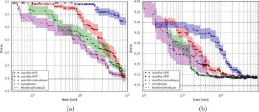{width="4.586665573053368in"
height="1.99in"}

> []{#_bookmark662 .anchor}**Fig.** **7.1** Results for the four methods
> on two datasets from *Tweakathon0* of the AutoML challenge. We show
> errors on the competition’s validation set (not the test set since its
> true labels are not available), with our methods only having access to
> the training set. To avoid clutter, we plot mean error ± 1/4 standard
> deviations over the 10 runs of each method. (**a**) newsgroups
> dataset. (**b**) dorothea dataset

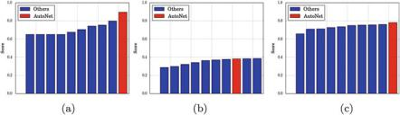{width="4.6in"
height="1.3183333333333334in"}

> []{#_bookmark663 .anchor}**Fig.** **7.2** Official AutoML human expert
> track competition results for the three datasets for which we used
> Auto-Net. We only show the top 10 entries. (**a**) alexis dataset.
> (**b**) yolanda dataset.
>
> (**c**) tania dataset

to win the respective human expert tracks. Auto-sklearn has been
developed for much longer and is much more robust than Auto-Net, so for
4/5 datasets in the 3rd phase and 3/5 datasets in the 4th phase
Auto-sklearn performed best by itself and we only submitted its results.
Here, we discuss the three datasets for which we used Auto-Net. Fig.
[7.2](#_bookmark663)shows the official AutoML human expert track
competition results for the three datasets for which we used Auto-Net.
The alexis dataset was part of the 3rd phase (“advanced phase”) of the
challenge. For this, we ran Auto-Net on five GPUs in parallel (using SMAC
in shared-model mode) for 18 h. Our submission included an
automatically-constructed ensemble of 39 models and clearly outperformed
all human experts, reaching an AUC score of 90%, while the best human
competitor (Ideal Intel Analytics) only reached 80%. To our best
knowledge, this is the first time an automatically-constructed neural
network won a competition dataset. The yolanda and tania datasets were
part of the 4th phase (“expert phase”) of the challenge. For yolanda, we
ran Auto-Net for 48 h

{width="5.912401574803149e-2in"
height="0.19937554680664918in"}{width="0.3473753280839895in"
height="4.574912510936133e-2in"}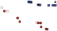{width="0.7494991251093613in"
height="0.4078740157480315in"}

> []{#_bookmark20 .anchor}7 Towards Automatically-Tuned Deep Neural
> Networks 145

  --------------------------------------------------------------------------------------------------------------------------------------------------------------------------------------------------------------------------------------------------------------------------------------------------------- ----------------------------------------------------------------------------------------------------- --------------- ---------- -------- ----- -- -- -- -- -- -- -- -- -- -- -- -- --
                                                                                                                                                                                                                                                                                                                                                                                                                                                                                          

                                                                                                                                                                                                                                                                                                                                                                                                                                                                                          

                                                                                                                                                                                                                                                                                                                                                                                                                                                                                          

                                                                                                                                                                                                                                                                                                                                                                                                                                                                                          

                                                                                                                                                                                                                                                                                                                                                                                                                                                                                          

  > 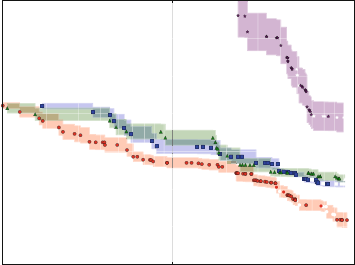{width="3.683969816272966in" height="2.7527909011373577in"}{width="3.6291557305336834e-2in" height="3.631889763779528e-2in"} {width="3.6304680664916884e-2in" height="3.631889763779528e-2in"} Aut   oNet-GP                                                                                               U                                                                       

  {width="3.8429571303587054e-2in" height="3.8429571303587054e-2in"}                                                                                                                                                                                                       {width="3.6304680664916884e-2in" height="3.6291557305336834e-2in"}   > Aut Aut Aut   oNet-CP    U        arn                                 
                                                                                                                                                                                                                                                                                                                                                                                                                                                                                          
                                                                                                                                                                                                                                                                                                            {width="3.844378827646544e-2in" height="3.8429571303587054e-2in"}                    oNet+Au    toskle                                       
                                                                                                                                                                                                                                                                                                                                                                                                                                                                                          
                                                                                                                                                                                                                                                                                                                                                                                                                                  osklearn                                                
  --------------------------------------------------------------------------------------------------------------------------------------------------------------------------------------------------------------------------------------------------------------------------------------------------------- ----------------------------------------------------------------------------------------------------- --------------- ---------- -------- ----- -- -- -- -- -- -- -- -- -- -- -- -- --

> 104
>
> time \[sec\]
>
> []{#_bookmark664 .anchor}**Fig.** **7.3** Performance on the tania
> dataset over time. We show cross-validation performance on the
> training set since the true labels for the competition’s validation or
> test set are not available. To avoid clutter, we plot mean error ± 1/4
> standard deviations over the 10 runs of each method
>
> on eight GPUs and automatically constructed an ensemble of five neural
> networks, achieving a close third place. For tania, we ran Auto-Net
> for 48 h on eight GPUs along with Auto-sklearn on 25 CPUs, and in the
> end our automated ensembling script constructed an ensemble of eight
> 1-layer neural networks, two 2-layer neural networks, and one logistic
> regression model trained with SGD. This ensemble won the first place on
> the tania dataset.

For the tania dataset, we also repeated the experiments from
Sect.[7.4.1](#_bookmark661). Fig. [7.3](#_bookmark664) shows that for
this dataset Auto-Net performed clearly better than Auto- sklearn, even
when only running on CPUs. The GPU-based variant of Auto-Net performed
best.

> ***7.4.3*** ***Comparing*** ***AutoNet*** ***1.0*** ***and***
> ***2.0***

Finally, we show an illustrative comparison between Auto-Net 1.0 and
2.0. We note that Auto-Net 2.0 has a much more comprehensive search
space than Auto-Net 1.0, and we therefore expect it to perform better on
large datasets given enough time. We also expect that searching the
larger space is harder than searching Auto-Net 1.0’s smaller space;
however, since Auto-Net 2.0 uses the efficient multi-fidelity optimizer
BOHB to terminate poorly-performing neural networks early on, it may
nevertheless obtain strong anytime performance. On the other hand,
Auto-Net 2.0

> 146 H. Mendoza et al.
>
> []{#_bookmark665 .anchor}**Table** **7.3** Error metric of different
> Auto-Net versions, run for different times, all on CPU. We compare
> Auto-Net 1.0, ensembles of Auto-Net 1.0 and Auto-sklearn, Auto-Net 2.0
> with one worker, and Auto-Net 2.0 with four workers. All results are
> means across 10 runs of each system. We show errors on the
> competition’s validation set (not the test set since its true labels
> are not available), with our methods only having access to the
> training set

  ------------------------------- -------------- ------------ --------- --------- --------- ---------
                                  > newsgroups   > dorothea
                                  > 103 s        > 104 s
  > Auto-Net 1.0                  > 0.99         > 0.98
  > Auto-sklearn + Auto-Net 1.0   > 0.94         > 0.76
  > Auto-Net 2.0: 1 worker        > 1.0          > 0.67
  > Auto-Net 2.0: 4 workers       > 0.89         > 0.57
  ------------------------------- -------------- ------------ --------- --------- --------- ---------

> so far does not implement ensembling, and due to this missing
> regularization component and its larger hypothesis space, it may be
> more prone to overfitting than
>
> Auto-Net 1.0.
>
> In order to test these expectations about performance on
> different-sized datasets, we used a medium-sized dataset (newsgroups,
> with 13k training data points) and a small one (dorothea, with 800
> training data points). The results are presented in Table
> [7.3](#_bookmark665).

On the medium-sized dataset newsgroups, Auto-Net 2.0 performed much
better than Auto-Net 1.0, and using four workers also led to strong
speedups on top of this, making Auto-Net 2.0 competitive to the ensemble
of Auto-sklearn and Auto-Net 1.0. We found that despite Auto-Net 2.0’s
larger search space its anytime performance (using the multi-fidelity
method BOHB) was better than that of Auto- Net 1.0 (using the blackbox
optimization method SMAC). On the small dataset dorothea, Auto-Net 2.0
also performed better than Auto-Net 1.0 early on, but given enough time
Auto-Net 1.0 performed slightly better. We attribute this to the lack of
ensembling in Auto-Net 2.0, combined with its larger search space.

> []{#_bookmark629 .anchor}**7.5** **Conclusion**
>
> We presented Auto-Net, which provides automatically-tuned deep neural
> networks without any human intervention. Even though neural networks
> show superior performance on many datasets, for traditional data sets
> with manually-defined features they do not always perform best.
> However, we showed that, even in cases where other methods perform
> better, combining Auto-Net with Auto-sklearn to an ensemble often
> leads to an equal or better performance than either approach alone.

Finally, we reported results on three datasets from the AutoML
challenge’s human expert track, for which Auto-Net won one third place
and two first places. We showed that ensembles of Auto-sklearn and
Auto-Net can get users the best of both worlds and quite often improve
over the individual tools. First experiments on the new Auto-Net 2.0
showed that using a more comprehensive search space, combined with BOHB
as an optimizer yields promising results.

> 7 Towards Automatically-Tuned Deep Neural Networks 147
>
> In future work, we aim to extend Auto-Net to more general neural
> network architectures, including convolutional and recurrent neural
> networks.

**Acknowledgements** This work has partly been supported by the European
Research Council (ERC) under the European Union’s Horizon 2020 research
and innovation programme under grant no. 716721.

> []{#_bookmark643 .anchor}**Bibliography**
>
> 1\. Abadi, M., Barham, P., Chen, J., Chen, Z., Davis, A., Dean, J.,
> Devin, M., Ghemawat, S., Irving, G., Isard, M., Kudlur, M., Levenberg,
> J., Monga, R., Moore, S., Murray, D., Steiner, B., Tucker, P.,
> Vasudevan, V., Warden, P., Wicke, M., Yu, Y., Zheng, X.: Tensorflow: A
> system for large-scale machine learning. In: 12th USENIX Symposium on
> Operating Systems Design and Implementation (OSDI 16). pp. 265–283
> (2016),
> [https:/www.usenix.org/system/](https:/www.usenix.org/system/files/conference/osdi16/osdi16-abadi.pdf)
> []{#_bookmark614
> .anchor}[files/conference/osdi16/osdi16-abadi.pdf](https:/www.usenix.org/system/files/conference/osdi16/osdi16-abadi.pdf)
>
> 2\. Bergstra, J., Bardenet, R., Bengio, Y., Kégl, B.: Algorithms for
> hyper-parameter optimization. In: Shawe-Taylor, J., Zemel, R., Bartlett,
> P., Pereira, F., Weinberger, K. (eds.) Proceedings of the 25th
> International Conference on Advances in Neural Information Processing
> Systems []{#_bookmark620 .anchor}(NIPS’11). pp. 2546–2554 (2011)
>
> 3\. Brazdil, P., Giraud-Carrier, C., Soares, C., Vilalta, R.:
> Metalearning: Applications to Data []{#_bookmark609 .anchor}Mining.
> Springer Publishing Company, Incorporated, 1 edn. (2008)
>
> 4\. Brochu, E., Cora, V., de Freitas, N.: A tutorial on Bayesian
> optimization of expensive cost functions, with application to active
> user modeling and hierarchical reinforcement learning. []{#_bookmark622
> .anchor}Computing Research Repository (CoRR) abs/1012.2599 (2010)
>
> 5\. Caruana, R., Niculescu-Mizil, A., Crew, G., Ksikes, A.: Ensemble
> selection from libraries of models. In: In Proceedings of the 21st
> International Conference on Machine Learning. pp. []{#_bookmark632
> .anchor}137– 144. ACM Press (2004)
>
> 6\. Dieleman, S., Schlüter, J., Raffel, C., Olson, E., Sønderby, S.,
> Nouri, D., Maturana, D., Thoma, M., Battenberg, E., Kelly, J., Fauw,
> J.D., Heilman, M., diogo149, McFee, B., Weideman, H., takacsg84,
> peterderivaz, Jon, instagibbs, Rasul, K., CongLiu, Britefury, Degrave,
> J.: Lasagne: []{#_bookmark634 .anchor}First release. (Aug 2015),
> <https:/doi.org/10.5281/zenodo.27878>
>
> 7\. Domhan, T., Springenberg, J.T., Hutter, F.: Speeding up automatic
> hyperparameter optimiza- tion of deep neural networks by extrapolation
> of learning curves. In: Yang, Q., Wooldridge,
>
> M. (eds.) Proceedings of the 25th International Joint Conference on
> Artificial Intelligence []{#_bookmark640 .anchor}(IJCAI’15). pp.
> 3460–3468 (2015)
>
> 8\. Duchi, J., Hazan, E., Singer, Y.: Adaptive subgradient methods for
> online learning and stochastic optimization. J. Mach. Learn. Res. 12,
> 2121–2159 (Jul 2011)
>
> []{#_bookmark616 .anchor}9. Eggensperger, K., Feurer, M., Hutter, F.,
> Bergstra, J., Snoek, J., Hoos, H., Leyton-Brown, K.: Towards an
> empirical foundation for assessing Bayesian optimization of
> hyperparameters. In: NIPS Workshop on Bayesian Optimization in Theory
> and Practice (BayesOpt’13) (2013)
>
> []{#_bookmark623 .anchor}10. Falkner, S., Klein, A., Hutter, F.:
> Combining hyperband and bayesian optimization. In: NIPS
>
> []{#_bookmark617 .anchor}2017 Bayesian Optimization Workshop (Dec
> 2017)
>
> 11\. Feurer, M., Klein, A., Eggensperger, K., Springenberg, J.T., Blum,
> M., Hutter, F.: Efficient and robust automated machine learning. In:
> Cortes, C., Lawrence, N., Lee, D., Sugiyama, M., Garnett, R. (eds.)
> Proceedings of the 29th International Conference on Advances in Neural
> []{#_bookmark621 .anchor}Information Processing Systems (NIPS’15) (2015)
>
> 12\. Feurer, M., Springenberg, T., Hutter, F.: Initializing Bayesian
> hyperparameter optimization via meta-learning. In: Bonet, B., Koenig, S.
> (eds.) Proceedings of the Twenty-nineth National Conference on Artificial
> Intelligence (AAAI’15). pp. 1128– 1135. AAAI Press (2015)
>
> []{#_bookmark648 .anchor}13. Gastaldi, X.: Shake-shake regularization.
> CoRR abs/1705.07485 (2017)
>
> 148 H. Mendoza et al.
>
> []{#_bookmark625 .anchor}14. Guyon, I., Bennett, K., Cawley, G.,
> Escalante, H.J., Escalera, S., Ho, T.K., Macià, N., Ray, B., Saeed,
> M., Statnikov, A., Viegas, E.: Design of the 2015 chalearn automl
> challenge. In: 2015 []{#_bookmark658 .anchor}International Joint
> Conference on Neural Networks (IJCNN). pp. 1–8 (July 2015)
>
> 15\. Halko, N., Martinsson, P., Tropp, J.: Finding structure with
> randomness: Stochastic algorithms []{#_bookmark618 .anchor}for
> constructing approximate matrix decompositions (2009)
>
> 16\. Hall, M., Frank, E., Holmes, G., Pfahringer, B., Reutemann, P.,
> Witten, I.: The WEKA data []{#_bookmark615 .anchor}mining software: An
> update. SIGKDD Explorations 11(1), 10– 18 (2009)
>
> 17\. Hutter, F., Hoos, H., Leyton-Brown, K.: Sequential model-based
> optimization for general algorithm configuration. In: Coello, C. (ed.)
> Proceedings of the Fifth International Conference on Learning and
> Intelligent Optimization (LION’11). Lecture Notes in Computer Science,
> vol. []{#_bookmark656 .anchor}6683, pp. 507–523. Springer-Verlag (2011)
>
> 18\. Hyvärinen, A., Oja, E.: Independent component analysis: algorithms
> and applications. Neural []{#_bookmark659 .anchor}networks 13(4–5),
> 411–430 (2000)
>
> 19\. Jamieson, K., Talwalkar, A.: Non-stochastic best arm identification
> and hyperparameter opti- mization. In: Gretton, A., Robert, C. (eds.)
> Proceedings of the 19th International Conference on Artificial
> Intelligence and Statistics, AISTATS. JMLR Workshop and Conference
> Proceedings, []{#_bookmark630 .anchor}vol. 51, pp. 240–248. JMLR.org
> (2016)

20\. Jin, H., Song, Q., Hu, X.: Efficient neural architecture search with
network morphism. CoRR []{#_bookmark637 .anchor}abs/1806. 10282 (2018)

21\. Kingma, D., Ba, J.: Adam: A method for stochastic optimization. In:
Proceedings of the []{#_bookmark603 .anchor}International Conference on
Learning Representations (2015)

22\. Krizhevsky, A., Sutskever, I., Hinton, G.: ImageNet classification
with deep convolutional neural networks. In: Bartlett, P., Pereira, F.,
Burges, C., Bottou, L., Weinberger, K. (eds.) Pro- ceedings of the 26th
International Conference on Advances in Neural Information Processing
[]{#_bookmark624 .anchor}Systems (NIPS’12). pp. 1097– 1105 (2012)

23\. Li, L., Jamieson, K., DeSalvo, G., Rostamizadeh, A., Talwalkar, A.:
Hyperband: A novel bandit-based approach to hyperparameter optimization.
Journal of Machine Learning Research []{#_bookmark652 .anchor}18, 185:1–
185:52 (2017)

24\. Loshchilov, I., Hutter, F.: Sgdr: Stochastic gradient descent with
warm restarts. In: International Conference on Learning Representations
(ICLR) 2017 Conference Track (2017)

[[]{#_bookmark647 .anchor}]{#_bookmark631 .anchor}25. Loshchilov, I.:
Personal communication (2017)

26\. Mendoza, H., Klein, A., Feurer, M., Springenberg, J., Hutter, F.:
Towards automatically-tuned []{#_bookmark604 .anchor}neural networks.
In: ICML 2016 AutoML Workshop (2016)

27\. Mnih, V., Kavukcuoglu, K., Silver, D., Rusu, A.A., Veness, J.,
Bellemare, M.G., Graves, A., Riedmiller, M., Fidjeland, A.K., Ostrovski,
G., Petersen, S., Beattie, C., Sadik, A., Antonoglou, I., King, H.,
Kumaran, D., Wierstra, D., Legg, S., Hassabis, D.: Human-level control
through []{#_bookmark639 .anchor}deep reinforcement learning. Nature
518, 529–533 (2015)

28\. Nesterov, Y.: A method of solving a convex programming problem with
convergence rate []{#_bookmark642 .anchor}O(1/sqr(k)). Soviet
Mathematics Doklady 27, 372–376 (1983)

29\. Paszke, A., Gross, S., Chintala, S., Chanan, G., Yang, E., DeVito,
Z., Lin, Z., Desmaison, A., Antiga, L., Lerer, A.: Automatic
differentiation in pytorch. In: Autodiff Workshop at NIPS

> []{#_bookmark619 .anchor}(2017)
>
> 30\. Pedregosa, F., Varoquaux, G., Gramfort, A., Michel, V., Thirion, B.,
> Grisel, O., Blondel, M., Prettenhofer, P., Weiss, R., Dubourg, V.,
> Vanderplas, J., Passos, A., Cournapeau, D., Brucher, M., Perrot, M.,
> Duchesnay, E.: Scikit-learn: Machine learning in Python. Journal of
> Machine []{#_bookmark657 .anchor}Learning Research 12, 2825–2830 (2011)
>
> 31\. Rahimi, A., Recht, B.: Weighted sums of random kitchen sinks:
> Replacing minimization with randomization in learning. In: Advances in
> neural information processing systems. pp. 1313– [[]{#_bookmark641
> .anchor}]{#_bookmark611 .anchor}1320 (2009)
>
> 32\. Rasmussen, C., Williams, C.: Gaussian Processes for Machine
> Learning. The MIT Press (2006)
>
> 33\. Schaul, T., Zhang, S., LeCun, Y.: No More Pesky Learning Rates. In:
> Dasgupta, S., McAllester,
>
> D. (eds.) Proceedings of the 30th International Conference on Machine
> Learning (ICML’13). []{#_bookmark655 .anchor}Omnipress (2014)
>
> 34\. Schölkopf, B., Smola, A., Müller, K.: Kernel principal component
> analysis. In: International Conference on Artificial Neural Networks. pp.
> 583–588. Springer (1997)
>
> 7 Towards Automatically-Tuned Deep Neural Networks 149
>
> []{#_bookmark610 .anchor}35. Shahriari, B., Swersky, K., Wang, Z.,
> Adams, R., de Freitas, N.: Taking the human out of the
> []{#_bookmark605 .anchor}loop: A Review of Bayesian Optimization.
> Proc. of the IEEE 104(1) (12/2015 2016)
>
> 36\. Silver, D., Huang, A., Maddison, C.J., Guez, A., Sifre, L., van den
> Driessche, G., Schrittwieser, J., Antonoglou, I., Panneershelvam, V.,
> Lanctot, M., Dieleman, S., Grewe, D., Nham, J., Kalchbrenner, N.,
> Sutskever, I., Lillicrap, T., Leach, M., Kavukcuoglu, K., Graepel, T.,
> Hassabis, D.: Mastering the game of go with deep neural networks and
> tree search. Nature []{#_bookmark651 .anchor}529, 484–503 (2016)
>
> 37\. Smith, L.N.: Cyclical learning rates for training neural networks.
> In: Applications of Computer []{#_bookmark644 .anchor}Vision (WACV),
> 2017 IEEE Winter Conference on. pp. 464–472. IEEE (2017)
>
> 38\. Srivastava, N., Hinton, G., Krizhevsky, A., Sutskever, I.,
> Salakhutdinov, R.: Dropout: a simple way to prevent neural networks from
> overfitting. The Journal of Machine Learning Research []{#_bookmark606
> .anchor}15(1), 1929– 1958 (2014)
>
> 39\. Sutskever, I., Vinyals, O., Le, Q.V.: Sequence to sequence learning
> with neural networks. CoRR []{#_bookmark612 .anchor}abs/1409.3215
> (2014), <http:/arxiv.org/abs/1409.3215>
>
> 40\. Swersky, K., Duvenaud, D., Snoek, J., Hutter, F., Osborne, M.:
> Raiders of the lost architecture: Kernels for Bayesian optimization in
> conditional parameter spaces. In: NIPS Workshop on []{#_bookmark607
> .anchor}Bayesian Optimization in Theory and Practice (BayesOpt’13)
> (2013)
>
> 41\. Taigman, Y., Yang, M., Ranzato, M., Wolf, L.: Deepface: Closing the
> gap to human-level performance in face verification. In: Proceedings of
> the International Conference on Computer Vision and Pattern Recognition
> (CVPR’14). pp. 1701– 1708. IEEE Computer Society Press
>
> []{#_bookmark633 .anchor}(2014)
>
> 42\. Theano Development Team: Theano: A Python framework for fast
> computation of mathemat- ical expressions. Computing Research Repository
> (CoRR) abs/1605.02688 (may 2016)
>
> []{#_bookmark608 .anchor}43. Thornton, C., Hutter, F., Hoos, H.,
> Leyton-Brown, K.: Auto-WEKA: combined selection and hyperparameter
> optimization of classification algorithms. In: I.Dhillon, Koren, Y.,
> Ghani, R., Senator, T., Bradley, P., Parekh, R., He, J., Grossman, R.,
> Uthurusamy, R. (eds.) The 19th ACM SIGKDD International Conference on
> Knowledge Discovery and Data Mining (KDD’13). pp. []{#_bookmark613
> .anchor}847–855. ACM Press (2013)
>
> 44\. Wang, Z., Hutter, F., Zoghi, M., Matheson, D., de Feitas, N.:
> Bayesian optimization in a billion dimensions via random embeddings.
> Journal of Artificial Intelligence Research 55, 361–387
>
> []{#_bookmark654 .anchor}(2016)
>
> 45\. Williams, C., Seeger, M.: Using the nyström method to speed up
> kernel machines. In: Advances []{#_bookmark649 .anchor}in neural
> information processing systems. pp. 682–688 (2001)
>
> 46\. Yamada, Y., Iwamura, M., Kise, K.: Shakedrop regularization. CoRR
> abs/1802.02375 (2018)
>
> []{#_bookmark645 .anchor}47. Zagoruyko, S., Komodakis, N.: Wide
> residual networks. CoRR abs/1605.07146 (2016)
>
> 48\. Zeiler, M.: ADADELTA: an adaptive learning rate method. CoRR
> abs/1212.5701 (2012),[http:/](http:/arxiv.org/abs/1212.5701)
> [[]{#_bookmark650 .anchor}]{#_bookmark638
> .anchor}[arxiv.org/abs/1212.5701](http:/arxiv.org/abs/1212.5701)
>
> 49\. Zhang, H., Cissé, M., Dauphin, Y., Lopez-Paz, D.: mixup: Beyond
> empirical risk minimization. CoRR abs/1710.09412 (2017)
>
> **Open** **Access** This chapter is licensed under the terms of the
> Creative Commons Attribution 4.0 International License
> [(http:/creativecommons.org/licenses/by/4.0/](http:/creativecommons.org/licenses/by/4.0/)),
> which permits use, sharing, adaptation, distribution and reproduction
> in any medium or format, as long as you give appropriate credit to the
> original author(s) and the source, provide a link to the Creative
> Commons licence and indicate if changes were made.
>
> The images or other third party material in this chapter are included
> in the chapter’s Creative Commons licence, unless indicated otherwise
> in a credit line to the material. If material is not included in the
> chapter’s Creative Commons licence and your intended use is not
> permitted by statutory regulation or exceeds the permitted use, you
> will need to obtain permission directly from the copyright holder.

{width="0.787415791776028in"
height="0.275582895888014in"}

{width="0.42962489063867015in"
height="0.42963801399825025in"}{width="1.418332239720035in"
height="6.944444444444444e-3in"}

> []{#_bookmark11 .anchor}**Chapter** **8**
>
> **TPOT:** **A** **Tree-Based** **Pipeline**

> **Optimization** **Tool** **for** **Automating**
>
> **Machine** **Learning**
>
> **Randal** **S.** **Olson** **and** **Jason** **H.** **Moore**
>
> **Abstract** As data science becomes increasingly mainstream, there
> will be an ever-growing demand for data science tools that are more
> accessible, flexible, and scalable. In response to this demand,
> automated machine learning (AutoML) researchers have begun building
> systems that automate the process of designing and optimizing machine
> learning pipelines. In this chapter we present TPOT v0.3, an open
> source genetic programming-based AutoML system that optimizes a series
> of feature preprocessors and machine learning models with the goal of
> maximizing classification accuracy on a supervised classification task.
> We benchmark TPOT on a series of 150 supervised classification tasks
> and find that it significantly outperforms a basic machine learning
> analysis in 21 of them, while experiencing minimal degradation in
> accuracy on 4 of the benchmarks—all without any domain knowledge nor
> human input. As such, genetic programming-based AutoML systems show
> considerable promise in the AutoML domain.
>
> **8.1** **Introduction**
>
> Machine learning is commonly described as a “field of study that gives
> computers the ability to learn without being explicitly programmed”
> \[[19](#_bookmark666)\]. Despite this common claim, experienced
> machine learning practitioners know that designing effective machine
> learning pipelines is often a tedious endeavor, and typically requires
> considerable experience with machine learning algorithms, expert
> knowledge of the problem domain, and time-intensive brute force search
> to accomplish \[[13](#_bookmark667)\]. Thus, contrary to what machine
> learning enthusiasts would have us believe, machine learning still
> requires considerable explicit programming.
>
> R. S. Olson (凶)
>
> Life Epigenetics, Minneapolis, MN, USA
>
> e-mail: <rso@randalolson.com>
>
> J. H. Moore
>
> Institute for Biomedical Informatics, University of Pennsylvania,
> Philadelphia, PA, USA
>
> © The Author(s) 2019
>
> F. Hutter et al. (eds.), *Automated* *Machine* *Learning*, The
> Springer Series on Challenges in Machine Learning,
> <https:/doi.org/10.1007/978-3-030-05318-5_8>
>
> 152 R. S. Olson and J. H. Moore

In response to this challenge, several automated machine learning
methods have been developed over the years \[[10](#_bookmark668)\]. Over
the past several years, we have been developing a Tree-based Pipeline
Optimization Tool (TPOT) that automatically designs and optimizes
machine learning pipelines for a given problem domain
\[[16](#_bookmark669)\], without any need for human intervention. In
short, TPOT optimizes machine learning pipelines using a version of
genetic programming (GP), a well-known evolutionary computation
technique for automatically constructing computer pro- grams
\[[1](#_bookmark670)\]. Previously, we demonstrated that combining GP
with Pareto optimization enables TPOT to automatically construct
high-accuracy *and* compact pipelines that consistently outperform basic
machine learning analyses \[[13](#_bookmark667)\]. In this chapter, we
extend that benchmark to include 150 supervised classification tasks and
evaluate TPOT in a wide variety of application domains ranging from
genetic analyses to image classification and more.

This chapter is an extended version of our 2016 paper introducing TPOT,
presented at the *2016* *ICML* *Workshop* *on* *AutoML*
\[[15](#_bookmark671)\].

> **8.2** **Methods**

In the following sections, we provide an overview of the Tree-based
Pipeline Optimization Tool (TPOT) v0.3, including the machine learning
operators used as genetic programming (GP) primitives, the tree-based
pipelines used to combine the primitives into working machine learning
pipelines, and the GP algorithm used to evolve said tree-based
pipelines. We follow with a description of the datasets used to evaluate
the latest version of TPOT in this chapter. TPOT is an open source
project on GitHub, and the underlying Python code can be found at
[https:/github.com/](https:/github.com/rhiever/tpot)
[rhiever/tpot](https:/github.com/rhiever/tpot).

***8.2.1*** ***Machine*** ***Learning*** ***Pipeline*** ***Operators***

At its core, TPOT is a wrapper for the Python machine learning package,
scikit- learn \[[17](#_bookmark672)\]. Thus, each machine learning
pipeline operator (i.e., GP primitive) in TPOT corresponds to a machine
learning algorithm, such as a supervised classification model or standard
feature scaler. All implementations of the machine learning algorithms
listed below are from scikit-learn (except XGBoost), and we refer to the
scikit-learn documentation \[[17](#_bookmark672)\] and
\[[9](#_bookmark673)\] for detailed explanations of the machine learning
algorithms used in TPOT.

**Supervised** **Classification** **Operators** DecisionTree,
RandomForest, eXtreme Gradient Boosting Classifier (from XGBoost,
\[[3](#_bookmark674)\]), LogisticRegression, and
KNearestNeighborClassifier. Classification operators store the classifier’s
predictions as a new feature as well as the classification for the
pipeline.

{width="0.25090879265091864in"
height="4.552712160979878e-2in"}{width="0.846832895888014in"
height="6.355533683289588e-2in"}{width="0.5888877952755905in"
height="6.355533683289588e-2in"}{width="0.7461318897637795in"
height="0.7461275153105862in"}{width="0.2661450131233596in"
height="4.552712160979878e-2in"}{width="0.26613188976377955in"
height="4.552712160979878e-2in"}{width="0.283423009623797in"
height="4.551399825021872e-2in"}{width="0.6665824584426947in"
height="6.355533683289588e-2in"}{width="0.6698326771653543in"
height="8.07217847769029e-2in"}

> 8 TPOT: A Tree-Based Pipeline Optimization Tool for Automating Machine
> Learning 153

> []{#_bookmark675 .anchor}**Fig.** **8.1** An example tree-based
> pipeline from TPOT. Each circle corresponds to a machine learning
> operator, and the arrows indicate the direction of the data flow
>
> **Feature** **Preprocessing** **Operators** StandardScaler,
> RobustScaler, MinMaxScaler, MaxAbsScaler, RandomizedPCA
> \[[12](#_bookmark676)\], Binarizer, and PolynomialFeatures. Prepro-
> cessing operators modify the dataset in some way and return the
> modified dataset.

**Feature** **Selection** **Operators** VarianceThreshold, SelectKBest,
SelectPercentile, SelectFwe, and Recursive Feature Elimination (RFE).
Feature selection operators reduce the number of features in the dataset
using some criteria and return the modified dataset.

We also include an operator that combines disparate datasets, as
demonstrated in Fig.[8.1](#_bookmark675), which allows multiple modified
variants of the dataset to be combined into a single dataset.
Additionally, TPOT v0.3 does not include missing value imputation
operators, and therefore does not support datasets with missing data.
Lastly, we provide integer and float terminals to parameterize the
various operators, such as the number of neighbors k in the k-Nearest
Neighbors Classifier.

***8.2.2*** ***Constructing*** ***Tree-Based*** ***Pipelines***

To combine these operators into a machine learning pipeline, we treat
them as GP primitives and construct GP trees from them. Fig.
[8.1](#_bookmark675) shows an example tree-based pipeline, where two
copies of the dataset are provided to the pipeline, modified in a
successive manner by each operator, combined into a single dataset, and
finally used to make classifications. Other than the restriction that
every pipeline must have a classifier as its final operator, it is
possible to construct arbitrarily shaped machine learning pipelines that
can act on multiple copies of the dataset. Thus, GP trees provide an
inherently flexible representation of machine learning pipelines.

{width="1.418332239720035in"
height="6.944444444444444e-3in"}

> 154 R. S. Olson and J. H. Moore

In order for these tree-based pipelines to operate, we store three
additional variables for each record in the dataset. The “class”
variable indicates the true label for each record, and is used when
evaluating the accuracy of each pipeline. The “guess” variable indicates
the pipeline’s latest guess for each record, where the predictions from
the final classification operator in the pipeline are stored as the
“guess” . Finally, the “group” variable indicates whether the record is
to be used as a part of the internal training or testing set, such that
the tree-based pipelines are only trained on the training data and
evaluated on the testing data. We note that the dataset provided to TPOT
as training data is further split into an internal stratified 75%/25%
training/testing set.

> ***8.2.3*** ***Optimizing*** ***Tree-Based*** ***Pipelines***
>
> To automatically generate and optimize these tree-based pipelines, we
> use a genetic programming (GP) algorithm \[[1](#_bookmark670)\] as
> implemented in the Python package DEAP \[[7](#_bookmark677)\]. The
> TPOT GP algorithm follows a standard GP process: To begin, the GP
> algorithm generates 100 random tree-based pipelines and evaluates
> their balanced cross- validation accuracy on the dataset. For every
> generation of the GP algorithm, the algorithm selects the top 20
> pipelines in the population according to the NSGA- II selection scheme
> \[[4](#_bookmark678)\], where pipelines are selected to simultaneously
> maximize classification accuracy on the dataset while minimizing the
> number of operators in the pipeline. Each of the top 20 selected
> pipelines produce five copies (i.e., offspring) into the next
> generation’s population, 5% of those offspring cross over with another
> offspring using one-point crossover, then 90% of the remaining
> unaffected offspring are randomly changed by a point, insert, or
> shrink mutation (1/3 chance of each). Every generation, the algorithm
> updates a Pareto front of the non-dominated solutions
> \[[4](#_bookmark678)\] discovered at any point in the GP run. The
> algorithm repeats this evaluate-select-crossover-mutate process for
> 100 generations—adding and tuning pipeline operators that improve
> classification accuracy and pruning operators that degrade
> classification accuracy—at which point the algorithm selects the
> highest-accuracy pipeline from the Pareto front as the representative
> “best” pipeline from the run.
>
> ***8.2.4*** ***Benchmark*** ***Data***
>
> We compiled 150 supervised classification benchmarks[1](#_bookmark679)
> from a wide variety of sources, including the UCI machine learning
> repository \[[11](#_bookmark680)\], a large preexisting benchmark
> repository from \[[18](#_bookmark681)\], and simulated genetic
> analysis datasets from \[[20](#_bookmark682)\].
>
> []{#_bookmark679 .anchor}1Benchmark data
> at<https:/github.com/EpistasisLab/penn-ml-benchmarks>

{width="1.418332239720035in"
height="6.944444444444444e-3in"}

> 8 TPOT: A Tree-Based Pipeline Optimization Tool for Automating Machine
> Learning 155
>
> These benchmark datasets range from 60 to 60,000 records, few to
> hundreds of features, and include binary as well as multi-class
> supervised classification problems. We selected datasets from a wide
> range of application domains, including genetic analysis, image
> classification, time series analysis, and many more. Thus, this
> benchmark—called the Penn Machine Learning Benchmark (PMLB)
> \[[14](#_bookmark683)\]— represents a comprehensive suite of tests
> with which to evaluate automated machine learning systems.
>
> **8.3** **Results**
>
> To evaluate TPOT, we ran 30 replicates of it on each of the 150
> benchmarks, where each replicate had 8 h to complete 100 generations
> of optimization (i.e., 100 × 100 = 10,000 pipeline evaluations). In
> each replicate, we divided the dataset into a stratified 75%/25%
> training/testing split and used a distinct random number generator
> seed for each split and subsequent TPOT run.
>
> In order to provide a reasonable control as a baseline comparison, we
> similarly evaluated 30 replicates of a Random Forest with 500 trees on
> the 150 benchmarks, which is meant to represent a basic machine
> learning analysis that a novice practitioner would perform. We also
> ran 30 replicates of a version of TPOT that randomly generates and
> evaluates the same number of pipelines (10,000), which is meant to
> represent a random search in the TPOT pipeline space. In all cases, we
> measured accuracy of the resulting pipelines or models as balanced
> accuracy \[[21](#_bookmark684)\], which corrects for class frequency
> imbalances in datasets by computing the accuracy on a per-class basis
> then averaging the per-class accuracies. In the remainder of this
> chapter, we refer to “balanced accuracy” as simply “accuracy.”
>
> Shown in Fig.[8.2](#_bookmark685), the average performance of TPOT and
> a Random Forest with 500 trees is similar on most of the datasets.
> Overall, TPOT discovered pipelines that perform statistically
> significantly better than a Random Forest on 21 benchmarks,
> significantly worse on 4 benchmarks, and had no statistically
> significant difference on 125 benchmarks. (We determined statistical
> significance using a Wilcoxon rank- sum test, where we used a
> conservative Bonferroni-corrected p-value threshold of &lt; 0.000333
> (0.05{width="0.0in"
> height="6.665573053368329e-3in"}150) for significance.) In
> Fig.[8.3](#_bookmark686), we show the distributions of accuracies on
> the 25 benchmarks that had significant differences, where the
> benchmarks are sorted by the difference in median accuracy between the
> two experiments.
>
> Notably, the majority of TPOT’s improvements on the benchmarks are
> quite large, with several ranging from 10% to 60% median accuracy
> improvement over a Random Forest analysis. In contrast, the 4
> benchmarks where TPOT experienced a degradation in median accuracy
> ranged from only 2–5% accuracy degradation. In some cases, TPOT’s
> improvements were made by discovering useful feature preprocessors
> that allow the models to better classify the data,[2](#_bookmark687)
> e.g., TPOT
>
> []{#_bookmark687 .anchor}2Full
> list:<https:/gist.github.com/rhiever/578cc9c686ffd873f46bca29406dde1d>

{width="7.888232720909886e-3in"
height="3.4349857830271215in"}{width="7.888232720909886e-3in"
height="3.4349857830271215in"}{width="7.888232720909886e-3in"
height="3.4349857830271215in"}{width="7.888232720909886e-3in"
height="3.4349857830271215in"}{width="7.888232720909886e-3in"
height="3.4349857830271215in"}{width="7.888232720909886e-3in"
height="3.4349857830271215in"}{width="7.152230971128609e-3in"
height="7.610454943132109e-3in"}{width="7.2353455818022746e-3in"
height="6.944444444444444e-3in"}{width="1.042979002624672e-2in"
height="6.944444444444444e-3in"}{width="6.944444444444444e-3in"
height="6.944444444444444e-3in"}{width="7.902449693788276e-3in"
height="6.944444444444444e-3in"}{width="9.693788276465443e-3in"
height="1.2054899387576553e-2in"}{width="1.2430008748906386e-2in"
height="1.163713910761155e-2in"}{width="0.2949989063867017in"
height="1.0416666666666666e-2in"}{width="7.888232720909886e-3in"
height="3.4349857830271215in"}{width="6.944444444444444e-3in"
height="0.3247637795275591in"}{width="0.6631244531933508in"
height="0.7806802274715661in"}{width="1.064679571303587in"
height="1.5448326771653544in"}{width="0.8155686789151356in"
height="0.7348611111111111in"}{width="0.27283245844269466in"
height="0.3922626859142607in"}{width="0.5124715660542433in"
height="0.4804440069991251in"}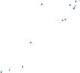{width="1.7061526684164479in"
height="1.5599300087489063in"}{width="0.5710269028871391in"
height="0.6294160104986877in"}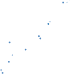{width="1.4337904636920384in"
height="1.5142497812773403in"}{width="1.157179571303587in"
height="1.027762467191601in"}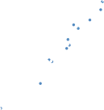{width="1.3393186789151357in"
height="1.408082895888014in"}{width="1.0298458005249345in"
height="1.1652766841644795in"}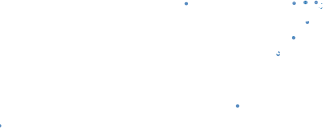{width="3.3583048993875764in"
height="1.3199989063867017in"}{width="0.9951935695538058in"
height="1.0171522309711285in"}{width="1.7516940069991251in"
height="1.7295548993875764in"}{width="3.3818897637795275e-2in"
height="2.5389326334208224e-2in"}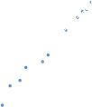{width="1.0525131233595801in"
height="1.218956692913386in"}{width="0.2545548993875765in"
height="3.527668416447944e-2in"}{width="1.665734908136483in"
height="1.6742913385826772in"}{width="3.390201224846894e-2in"
height="3.527668416447944e-2in"}{width="1.256943350831146in"
height="1.3211526684164479in"}{width="3.6846248906386703in"
height="3.498360673665792in"}{width="8.809711286089239e-2in"
height="8.879155730533683e-2in"}{width="9.855533683289588e-2in"
height="9.197178477690289e-2in"}{width="4.17082239720035e-2in"
height="4.1944444444444444e-2in"}{width="0.10830489938757655in"
height="0.10584645669291338in"}{width="0.20834755030621172in"
height="0.2095275590551181in"}{width="2.476268591426072e-2in"
height="3.322287839020122e-2in"}{width="0.24149934383202099in"
height="0.24304133858267715in"}{width="0.10830489938757655in"
height="0.10920713035870516in"}{width="3.8416447944007e-2in"
height="3.580380577427821e-2in"}{width="3.323600174978128e-2in"
height="3.2236439195100615e-2in"}{width="1.6180008748906387e-2in"
height="1.6333114610673667e-2in"}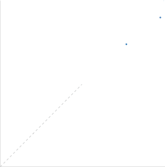{width="3.40163823272091in"
height="3.4377351268591427in"}{width="0.15233267716535434in"
height="0.3212915573053368in"}{width="0.18799978127734032in"
height="0.3212915573053368in"}{width="0.18799978127734032in"
height="0.3212915573053368in"}{width="0.295in"
height="0.3212915573053368in"}{width="1.5900688976377952in"
height="2.6282469378827646in"}{width="0.5803182414698163in"
height="0.3247637795275591in"}{width="0.10830489938757655in"
height="0.1092082239720035in"}{width="0.10830489938757655in"
height="0.1092082239720035in"}{width="0.5930271216097988in"
height="3.4349989063867015in"}{width="8.026356080489938e-2in"
height="8.645778652668416e-2in"}{width="0.1696380139982502in"
height="0.175916447944007in"}{width="0.17474956255468066in"
height="0.1763046806649169in"}{width="0.5908048993875765in"
height="2.6043471128608924in"}{width="0.12701334208223972in"
height="7.126312335958006e-2in"}{width="0.18086067366579178in"
height="7.126312335958006e-2in"}{width="0.18002734033245843in"
height="7.126312335958006e-2in"}{width="0.1797211286089239in"
height="7.126312335958006e-2in"}{width="0.18237423447069118in"
height="7.126312335958006e-2in"}

> 156 R. S. Olson and J. H. Moore

{width="3.4056528871391074in"
height="0.6001935695538058in"}

{width="8.138888888888889e-2in"
height="1.2995133420822398in"}

{width="0.22594488188976378in"
height="7.126312335958006e-2in"}

{width="1.6659995625546806in"
height="8.025043744531933e-2in"}

> []{#_bookmark685 .anchor}**Fig.** **8.2** Scatter plot showing the
> median balanced accuracies of TPOT and a Random Forest with 500 trees
> on the 150 benchmark datasets. Each dot represents the accuracies on
> one benchmark dataset, and the diagonal line represents the line of
> parity (i.e., when both algorithms achieve the same accuracy score).
> Dots above the line represent datasets where TPOT performed better
> than the Random Forest, and dots below the line represent datasets
> where Random Forests performed better
>
> discovered that applying a RandomizedPCA feature preprocessor prior to
> modeling the “Hill\_valley” benchmarks allows Random Forests to
> classify the dataset with near-perfect accuracy. In other cases,
> TPOT’s improvements were made by applying a different model to the
> benchmark, e.g., TPOT discovered that a k-nearest-neighbor classifier
> with k = 10 neighbors can classify the “parity5” benchmark, whereas a
> Random Forest consistently achieved 0% accuracy on the same benchmark.

When we compared TPOT to a version of TPOT that uses random search
(“TPOT Random” in Fig.[8.3](#_bookmark686)), we found that random search
typically discovered pipelines that achieve comparable accuracy to
pipelines discovered by TPOT, except in the “dis” benchmark where TPOT
consistently discovered better-performing pipelines. For 17 of the
presented benchmarks, none of the random search runs finished within

> 8 TPOT: A Tree-Based Pipeline Optimization Tool for Automating Machine
> Learning 157

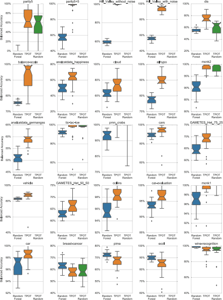{width="4.583333333333333in"
height="6.145985345581802in"}

[]{#_bookmark686 .anchor}**Fig.** **8.3** Box plots showing the
distribution of balanced accuracies for the 25 benchmarks with a
significant difference in median accuracy between TPOT and a Random
Forest with 500 trees. Each box plot represents 30 replicates, the inner
line shows the median, the notches represent the bootstrapped 95%
confidence interval of the median, the ends of the box represent the first
and third quartiles, and the dots represent outliers

> 158 R. S. Olson and J. H. Moore

24 h, which we indicated by leaving the box plot blank in
Fig.[8.3](#_bookmark686). We found that random search often generated
needlessly complex pipelines for the benchmark problems, even when a
simple pipeline with a tuned model was sufficient to classify the
benchmark problem. Thus, even if random search can sometimes perform as
well as TPOT in terms of accuracy, performing a guided search for
pipelines that achieve high accuracy with as few pipeline operations as
possible still offers considerable advantages in terms of search
run-time, model complexity, and model interpretability.

> **8.4** **Conclusions** **and** **Future** **Work**

We benchmarked the Tree-based Pipeline Optimization Tool (TPOT) v0.3 on
150 supervised classification datasets and found that it discovers
machine learning pipelines that can outperform a basic machine learning
analysis on several bench- marks. In particular, we note that TPOT
discovered these pipelines without any domain knowledge nor human input.
As such, TPOT shows considerable promise in the automated machine
learning (AutoML) domain and we will continue to refine TPOT until it
consistently discovers human-competitive machine learning pipelines.

We discuss some of these future refinements below.

First, we will explore methods to provide sensible initialization
\[[8](#_bookmark688)\] for genetic programming (GP)-based AutoML systems
such as TPOT. For example, we can use meta-learning techniques to
intelligently match pipeline configurations that may work well on the
particular problem being solved \[[6](#_bookmark689)\]. In brief,
meta-learning harnesses information from previous machine learning runs
to predict how well each pipeline configuration will work on a particular
dataset. To place datasets on a standard scale, meta-learning algorithms
compute meta-features from the datasets, such as dataset size, the
number of features, and various aspects about the features, which are
then used to map dataset meta-features to corresponding pipeline
configurations that may work well on datasets with those meta-features.
Such an intelligent meta-learning algorithm is likely to improve the
TPOT sensible initialization process.

Furthermore, we will attempt to characterize the ideal “shape” of a
machine learning pipeline. In auto-sklearn, \[[5](#_bookmark690)\]
imposed a short and fixed pipeline structure of a data preprocessor, a
feature preprocessor, and a model. In another GP- based AutoML system,
\[[22](#_bookmark691)\] allowed the GP algorithm to design
arbitrarily-shaped pipelines and found that complex pipelines with
several preprocessors and models were useful for signal processing
problems. Thus, it may be vital to allow AutoML systems to design
arbitrarily-shaped pipelines if they are to achieve human-level
competitiveness.

> Finally, genetic programming (GP) optimization methods are typically
> criticized for optimizing a large population of solutions, which can
> sometimes be slow and wasteful for certain optimization problems.
> Instead, it is possible to turn GP’s purported weakness into a
> strength by creating an ensemble out of the GP
>
> 8 TPOT: A Tree-Based Pipeline Optimization Tool for Automating Machine
> Learning 159

populations. Bhowan et al. \[[2](#_bookmark692)\] explored one such
population ensemble method previously with a standard GP algorithm and
showed that it significantly improved performance, and it is a natural
extension to create ensembles out of TPOT’s population of machine
learning pipelines.

In conclusion, these experiments demonstrate that there is much to be
gained from taking a model-agnostic approach to machine learning and
allowing the machine to automatically discover what series of
preprocessors and models work best for a given problem domain. As such,
AutoML stands to revolutionize data science by automating some of the
most tedious—yet most important—aspects of machine learning.

> []{#_bookmark670 .anchor}**Bibliography**
>
> 1\. Banzhaf, W., Nordin, P., Keller, R.E., Francone, F.D.: Genetic
> Programming: An Introduction. []{#_bookmark692 .anchor}Morgan Kaufmann,
> San Meateo, CA, USA (1998)
>
> 2\. Bhowan, U., Johnston, M., Zhang, M., Yao, X.: Evolving diverse
> ensembles using genetic programming for classification with unbalanced
> data. Trans. Evol. Comp 17(3), 368–386 (Jun []{#_bookmark674
> .anchor}2013)
>
> 3\. Chen, T., Guestrin, C.: Xgboost: A scalable tree boosting system. In:
> Proceedings of the 22Nd ACM SIGKDD International Conference on Knowledge
> Discovery and Data Mining. pp. 785–
>
> []{#_bookmark678 .anchor}794. KDD ’16, ACM, New York, NY, USA (2016)
>
> 4\. Deb, K., Pratap, A., Agarwal, S., Meyarivan, T.: A fast and elitist
> multiobjective genetic algorithm: NSGA-II. IEEE Transactions on
> Evolutionary Computation 6, 182– 197 (2002)
>
> []{#_bookmark690 .anchor}5. Feurer, M., Klein, A., Eggensperger, K.,
> Springenberg, J., Blum, M., Hutter, F.: Efficient and robust automated
> machine learning. In: Cortes, C., Lawrence, N., Lee, D., Sugiyama, M.,
> Garnett, R. (eds.) Advances in Neural Information Processing Systems
> 28, pp. 2944–2952. []{#_bookmark689 .anchor}Curran Associates, Inc.
> (2015)
>
> 6\. Feurer, M., Springenberg, J.T., Hutter, F.: Initializing bayesian
> hyperparameter optimization via meta-learning. In: Proceedings of the
> 29th AAAI Conference on Artificial Intelligence, []{#_bookmark677
> .anchor}January 25–30, 2015, Austin, Texas, USA. pp. 1128– 1135 (2015)
>
> 7\. Fortin, F.A., De Rainville, F.M., Gardner, M.A., Parizeau, M., Gagné,
> C.: DEAP: Evolutionary Algorithms Made Easy. Journal of Machine Learning
> Research 13, 2171–2175 (2012)
>
> []{#_bookmark688 .anchor}8. Greene, C.S., White, B.C., Moore, J.H.: An
> expert knowledge-guided mutation operator for genome-wide genetic
> analysis using genetic programming. In: Pattern Recognition in
> []{#_bookmark673 .anchor}Bioinformatics, pp. 30–40. Springer Berlin
> Heidelberg (2007)
>
> 9\. Hastie, T.J., Tibshirani, R.J., Friedman, J.H.: The Elements of
> Statistical Learning: Data []{#_bookmark668 .anchor}Mining, Inference,
> and Prediction. Springer, New York, NY, USA (2009)
>
> 10\. Hutter, F., Lücke, J., Schmidt-Thieme, L.: Beyond Manual Tuning of
> Hyperparameters. KI - []{#_bookmark680 .anchor}Künstliche Intelligenz
> 29, 329–337 (2015)
>
> 11\. Lichman, M.: UCI machine learning repository (2013),
> <http:/archive.ics.uci.edu/ml>
>
> []{#_bookmark676 .anchor}12. Martinsson, P.G., Rokhlin, V., Tygert,
> M.: A randomized algorithm for the decomposition of matrices. Applied
> and Computational Harmonic Analysis 30, 47–68 (2011)
>
> []{#_bookmark667 .anchor}13. Olson, R.S., Bartley, N., Urbanowicz,
> R.J., Moore, J.H.: Evaluation of a tree-based pipeline optimization
> tool for automating data science. In: Proceedings of the Genetic and
> Evolutionary Computation Conference 2016. pp. 485–492. GECCO ’16, ACM,
> New York, NY, USA (2016)
>
> []{#_bookmark683 .anchor}14. Olson, R.S., La Cava, W., Orzechowski,
> P., Urbanowicz, R.J., Moore, J.H.: PMLB: A Large Benchmark Suite for
> Machine Learning Evaluation and Comparison. arXiv e-print.
> [https:/](https:/arxiv.org/abs/1703.00512)
> [arxiv.org/abs/1703.00512](https:/arxiv.org/abs/1703.00512) (2017)
>
> 160 R. S. Olson and J. H. Moore
>
> []{#_bookmark671 .anchor}15. Olson, R.S., Moore, J.H.: Tpot: A
> tree-based pipeline optimization tool for automating machine learning.
> In: Hutter, F., Kotthoff, L., Vanschoren, J. (eds.) Proceedings of the
> Workshop on Automatic Machine Learning. Proceedings of Machine
> Learning Research, vol. 64, pp. 66–74. PMLR, New York, New York, USA
> (24 Jun 2016),
> [http:/proceedings.mlr.press/v64/olson\_](http:/proceedings.mlr.press/v64/olson_tpot_2016.html)
> []{#_bookmark669
> .anchor}[tpot\_2016.html](http:/proceedings.mlr.press/v64/olson_tpot_2016.html)
>
> 16\. Olson, R.S., Urbanowicz, R.J., Andrews, P.C., Lavender, N.A., Kidd,
> L.C., Moore, J.H.: Applications of Evolutionary Computation: 19th
> European Conference, EvoApplications 2016, Porto, Portugal, March 30 —
> April 1, 2016, Proceedings, Part I, chap. Automating Biomedical Data
> Science Through Tree-Based Pipeline Optimization, pp. 123– 137. Springer
> International []{#_bookmark672 .anchor}Publishing (2016)
>
> 17\. Pedregosa, F., Varoquaux, G., Gramfort, A., Michel, V., Thirion, B.,
> Grisel, O., Blondel, M., Prettenhofer, P., Weiss, R., Dubourg, V.,
> Vanderplas, J., Passos, A., Cournapeau, D., Brucher, M., Perrot, M.,
> Duchesnay, E.: Scikit-learn: Machine learning in Python. Journal of
> Machine []{#_bookmark681 .anchor}Learning Research 12, 2825–2830 (2011)
>
> 18\. Reif, M.: A comprehensive dataset for evaluating approaches of
> various meta-learning tasks. In: First International Conference on
> Pattern Recognition and Methods (ICPRAM) (2012)
>
> 19\. Simon, P.: Too big to ignore: the business case for big data. Wiley
> & SAS Business Series, [[]{#_bookmark682 .anchor}]{#_bookmark666
> .anchor}Wiley, New Delhi (2013)
>
> 20\. Urbanowicz, R.J., Kiralis, J., Sinnott-Armstrong, N.A., Heberling,
> T., Fisher, J.M., Moore, J.H.: GAMETES: a fast, direct algorithm for
> generating pure, strict, epistatic models with []{#_bookmark684
> .anchor}random architectures. BioData Mining 5 (2012)
>
> 21\. Velez, D.R., White, B.C., Motsinger, A.A., Bush, W.S., Ritchie,
> M.D., Williams, S.M., Moore, J.H.: A balanced accuracy function for
> epistasis modeling in imbalanced datasets using multifactor
> dimensionality reduction. Genetic Epidemiology 31(4), 306–315 (2007)
>
> []{#_bookmark691 .anchor}22. Zutty, J., Long, D., Adams, H., Bennett,
> G., Baxter, C.: Multiple objective vector-based genetic programming
> using human-derived primitives. In: Proceedings of the 2015 Annual
> Conference on Genetic and Evolutionary Computation. pp. 1127– 1134.
> GECCO ’15, ACM, New York, NY, USA (2015)
>
> **Open** **Access** This chapter is licensed under the terms of the
> Creative Commons Attribution 4.0 International License
> [(http:/creativecommons.org/licenses/by/4.0/](http:/creativecommons.org/licenses/by/4.0/)),
> which permits use, sharing, adaptation, distribution and reproduction
> in any medium or format, as long as you give appropriate credit to the
> original author(s) and the source, provide a link to the Creative
> Commons licence and indicate if changes were made.
>
> The images or other third party material in this chapter are included
> in the chapter’s Creative Commons licence, unless indicated otherwise
> in a credit line to the material. If material is not included in the
> chapter’s Creative Commons licence and your intended use is not
> permitted by statutory regulation or exceeds the permitted use, you
> will need to obtain permission directly from the copyright holder.

{width="0.787415791776028in"
height="0.275582895888014in"}

{width="0.42962489063867015in"
height="0.42963801399825025in"}{width="1.418332239720035in"
height="6.944444444444444e-3in"}

> []{#_bookmark12 .anchor}**Chapter** **9**
>
> **The** **Automatic** **Statistician**

> **Christian** **Steinruecken,** **Emma** **Smith,** **David**
> **Janz,** **James** **Lloyd,** **and** **Zoubin** **Ghahramani**
>
> **Abstract** The Automatic Statistician project aims to automate data
> science, pro- ducing predictions and human-readable reports from raw
> datasets with minimal human intervention. Alongside basic graphs and
> statistics, the generated reports contain a curation of high-level
> insights about the dataset that are obtained from (1) an automated
> construction of models for the dataset, (2) a comparison of these
> models, and (3) a software component that turns these results into
> natural language descriptions. This chapter describes the common
> architecture of such Automatic Statistician systems, and discusses
> some of the design decisions and technical challenges.
>
> **9.1** **Introduction**
>
> Machine Learning (ML) and data science are closely related fields of
> research, that are focused on the development of algorithms for
> automated learning from data. These algorithms also underpin many of
> the recent advances in artificial intelligence (AI), which have had a
> tremendous impact in industry, ushering in a new golden age of AI.
> However, many of the current approaches to machine learning, data
> science,
>
> and AI, suffer from a set of important but related limitations.

Firstly, many of the approaches used are complicated black-boxes that
are difficult to interpret, understand, debug, and trust. This lack of
interpretability hampers the deployment of ML systems. For example,
consider the major legal, technical and ethical consequences of using an
uninterpretable black-box system that arrives at a prediction or
decision related to a medical condition, a criminal justice setting, or
in a self-driving car. The realisation that black-box ML methods are
severely limited in such settings has led to major efforts to develop
“explainable AI”, and systems that offer interpretability, trust, and
transparency.

> C. Steinruecken (凶) · E. Smith · D. Janz · J. Lloyd · Z. Ghahramani
>
> Department of Engineering, University of Cambridge, Cambridge, UK
>
> e-mail: <tcs27@cam.ac.uk>
>
> © The Author(s) 2019
>
> F. Hutter et al. (eds.), *Automated* *Machine* *Learning*, The
> Springer Series on Challenges in Machine Learning,
> <https:/doi.org/10.1007/978-3-030-05318-5_9>
>
> 162 C. Steinruecken et al.

Secondly, the development of ML systems has turned into a cottage
industry where ML experts tackle problems by hand-designing solutions
that often reflect a set of ad-hoc manual decisions, or the preferences
and biases of the expert. It is ironic that machine learning, a field
dedicated to building systems that automatically learn from data, is so
dependent on human experts and manual tuning of models and learning
algorithms. Manual search over possible models and methods can result in
solutions that are sub-optimal across any number of metrics. Moreover,
the tremendous imbalance between the supply of experts and the demand
for data science and ML solutions is likely resulting in many missed
opportunities for applications that could have a major benefit for
society.

> The vision of the Automatic Statistician is to automate many aspects
> of data analysis, model discovery, and explanation. In a sense, the
> goal is to develop an *AI* *for* *data* *science* – a system that can
> reason about patterns in data and explain them to the user. Ideally,
> given some raw data, such a system should be able to:
>
> • automate the process of feature selection and transformation,
>
> • deal with the messiness of real data, including missing values,
> outliers, and different types and encodings of variables,
>
> • search over a large space of models so as to automatically discover
> a good model that captures any reliable patterns in the data,
>
> • find such a model while avoiding both overfitting and underfitting,
>
> • explain the patterns that have been found to the user, ideally by
> having a conversation with the user about the data, and
>
> • do all of this in a manner that is efficient and robust with respect
> to constraints on compute time, memory, amount of data, and other
> relevant resources.

While this agenda is obviously a very ambitious one, the work to date on
the Automatic Statistician project has made progress on many of the
above desiderata. In particular, the ability to discover plausible
models from data and to explain these discoveries in plain English, is
one of the distinguishing features of the Automatic Statistician
\[[18](#_bookmark693)\]. Such a feature could be useful to almost any
field or endeavour that is reliant on extracting knowledge from data.

In contrast to much of the machine learning literature that has been
focused on extracting increasing performance improvements on pattern
recognition problems (using techniques such as kernel methods, random
forests, or deep learning), the Automatic Statistician needs to build
models that are composed of interpretable components, and to have a
principled way of representing uncertainty about model structures given
data. It also needs to be able to give reasonable answers not just for
big data sets, but also for small ones.

{width="9.119313210848644e-2in"
height="6.651356080489938e-2in"}{width="0.46592957130358703in"
height="0.2229582239720035in"}{width="8.693022747156605e-2in"
height="6.322178477690289e-2in"}{width="8.691601049868766e-2in"
height="6.322178477690289e-2in"}{width="0.10448490813648294in"
height="0.22219378827646544in"}{width="9.31900699912511e-2in"
height="0.22219378827646544in"}{width="8.692913385826771e-2in"
height="6.322178477690289e-2in"}{width="0.48270778652668417in"
height="0.23087379702537184in"}{width="8.691601049868766e-2in"
height="6.322178477690289e-2in"}{width="0.4842082239720035in"
height="0.23155402449693788in"}

> 9 The Automatic Statistician 163

{width="6.322178477690289e-2in"
height="8.35323709536308e-2in"}

[]{#_bookmark694 .anchor}**Fig.** **9.1** A simplified flow diagram
outlining the operation of a report-writing Automatic Statisti- cian.
Models for the data are automatically constructed (from the open-ended
language of models), and evaluated on the data. This evaluation is done
in a way that allows models to be compared to each other. The best
models are then inspected to produce a report. Each model can be used to
make extrapolations or predictions from the data, and the construction
blue-print of the model can be turned into a human-readable description.
For some models, it is also possible to generate *model* *criticism*,
and report on where the modelling assumptions do not match the data well

> **9.2** **Basic** **Anatomy** **of** **an** **Automatic**
> **Statistician**
>
> At the heart of the Automatic Statistician is the idea that a good
> solution to the above challenges can be obtained by working in the
> framework of *model-based* *machine* *learning* \[[2](#_bookmark695),
> [9](#_bookmark696)\]. In model-based ML, the basic idea is that
> probabilistic models are explanations for patterns in data, and that
> the probabilistic framework (or Bayesian Occam’s razor) can be used to
> discover models that avoid both overfitting and underfitting
> \[[21](#_bookmark697)\]. Bayesian approaches provide an elegant way of
> trading off the complexity of the model and the complexity of the
> data, and probabilistic models are compositional and interpretable as
> described previously. Moreover, the model-based philosophy maintains
> that tasks such as data pre-processing and transformation are all
> parts of the model and should ideally all be conducted at once
> \[[35](#_bookmark698)\].
>
> An Automatic Statistician contains the following key ingredients:
>
> 1\. **An** **open-ended** **language** **of** **models** – expressive
> enough to capture real-world phenomena, and to allow applying the
> techniques used by human statisticians and data scientists.
>
> 2\. **A** **search** **procedure** to efficiently explore the language of
> models.
>
> 3\. **A** **principled** **method** **of** **evaluating** **models**,
> trading off complexity, fit to data, []{#_bookmark699 .anchor}and
> resource usage.
>
> 4\. **A** **procedure** **to** **automatically** **explain** **the**
> **models**, making the assumptions of the models explicit in a way that
> is simultaneously accurate and intelligible to non-experts.

Fig. [9.1](#_bookmark694) shows a high-level overview of how these
components could be used to produce a basic version of a report-writing
Automatic Statistician.

> As will be discussed later in this chapter, it is possible to build
> Automatic [Statistician systems that exchange ingredient
> (4](#_bookmark699)) for procedures that produce other
>
> 164 C. Steinruecken et al.
>
> desirable outputs, for example raw predictions or decisions. In such
> cases, the language, search, and evaluation components may be modified
> appropriately to prioritise the chosen objective.
>
> ***9.2.1*** ***Related*** ***Work***

Important earlier work includes statistical expert systems
\[[11](#_bookmark700), [37](#_bookmark701)\], and equation learning
\[[26](#_bookmark702),[27](#_bookmark703)\]. The *Robot* *Scientist*
\[[16](#_bookmark704)\] integrates machine learning and scientific
discovery in a closed loop with an experimental platform in microbiology
to automate the design and execution of new experiments. *Auto-WEKA*
\[[17](#_bookmark705), [33](#_bookmark706)\] and *Auto-sklearn*
\[[6](#_bookmark707)\] are projects that automate learning classifiers,
making heavy use of Bayesian optimisation techniques. Efforts to
automate the application of machine learning methods to data have
recently gained momentum, and may ultimately result in practical AI
systems for data science.

> **9.3** **An** **Automatic** **Statistician** **for** **Time**
> **Series** **Data**
>
> Automatic Statistician systems can be defined for a variety of
> different objectives, and can be based on different underlying model
> families. We’ll start by describing one such system, and discuss the
> wider taxonomy later, with notes on common design elements and general
> architecture.
>
> An early Automatic Statistician for one-dimensional regression tasks
> was described by Lloyd et al. \[[18](#_bookmark693)\]. Their system,
> called *Automatic* *Bayesian* *Covariance* *Discovery* *(ABCD)*, uses
> an open-ended language of Gaussian process models through a
> compositional grammar over kernels. A Gaussian process (GP) defines a
> distribution over functions, and the parameters of the GP – its mean
> and its kernel – determine the properties of the functions
> \[[25](#_bookmark708)\]. There is a broad choice of available kernels
> that induce function distributions with particular properties; for
> example distributions over functions that are linear, polynomial,
> periodic, or uncorrelated noise. A pictorial overview of this system
> is shown in Fig.[9.2](#_bookmark709).
>
> ***9.3.1*** ***The*** ***Grammar*** ***over*** ***Kernels***
>
> As mentioned above, a grammar over GP kernels makes it possible to
> represent many interesting properties of functions, and gives a
> systematic way of constructing distributions over such functions. This
> grammar over kernels is compositional: it comprises a set of fixed
> *base* *kernels*, and *kernel* *operators* that make it possible to
> compose new kernels from existing ones. This grammar was carefully
> chosen to be *interpretable*: each expression in the grammar defines a
> kernel that can be described with a simple but descriptive set of
> words in human language.
>
> 9 The Automatic Statistician 165

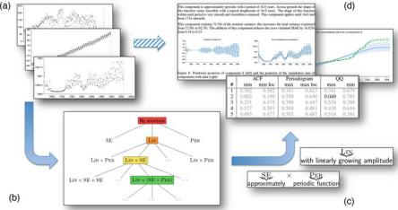{width="4.606665573053369in"
height="2.425in"}

> []{#_bookmark709 .anchor}**Fig.** **9.2** A flow diagram describing a
> report-writing Automatic Statistician for time-series data. (**a**)
> The input to the system is data, in this case represented as time
> series. (**b**) The system searches over a grammar of models to
> discover a good interpretation of the data, using Bayesian inference
> to score models. (**c**) Components of the model discovered are
> translated into English phrases. (**d**) The end result is a report
> with text, figures and tables, describing in detail what has been
> inferred about the data, including a section on model checking and
> criticism \[[8](#_bookmark710), [20](#_bookmark711)\]
>
> The base kernels in the grammar are: C (constant), LIN (linear), SE
> (squared exponential), PER (periodic), and WN (white noise). The
> kernel operators are: + (addition), × (multiplication), and CP (a
> change point operator), defined as follows:
>
> (k1 + k2)(x, x\\) = k1 (x, x\\) + k2 (x, x\\)
>
> (k1 × k2)(x, x )\\ = k1 (x, x\\) × k2 (x, x )\\
>
> CP (k1 ,k2) (x, x\\) = k1 (x, x\\)σ(x)σ(x\\) + k2 (x, x\\)(1 − σ(x))
> (1 − σ(x\\))
>
> where σ(x) =
> 1{width="4.110126859142607e-2in"
> height="6.665573053368329e-3in"}2 (1 + tanh
> {width="0.13615048118985126in"
> height="0.2047976815398075in"}) is a sigmoidal function, and l and s
> are parameters of the change point. The base kernels can be
> arbitrarily combined using the above operators to produce new kernels.
>
> The infinite space of kernels defined by this grammar allows a large
> class of interesting distributions over functions to be searched,
> evaluated, and described in an automated way. This type of grammar was
> first described in \[[10](#_bookmark712)\] for matrix factorization
> problems, and then refined in \[[5](#_bookmark713)\] and
> \[[18](#_bookmark693)\] for GP models.

***9.3.2*** ***The*** ***Search*** ***and*** ***Evaluation***
***Procedure***

> ABCD performs a greedy search over the space of models (as defined by
> the grammar). The kernel parameters of each proposed model are
> optimised by a
>
> 166 C. Steinruecken et al.
>
> conjugate-gradient method; the model with optimised parameters is then
> evaluated using the Bayesian Information Criterion
> \[[29](#_bookmark714)\]:

BIC (M) = −2log p (D | M) + |M|log N (9. 1)

> where M is the optimised model, p (D | M) is the marginal likelihood
> of the model integrating out the latent GP function, |M| is the number
> of kernel parameters in M , and N is the size of the dataset. The
> Bayesian Information Criterion trades off model complexity and fit to
> the data, and approximates the full marginal likelihood (which
> integrates out latent functions and hyperparameters).
>
> The best-scoring model in each round is used to construct new proposed
> models, either by: (1) expanding the kernel with production rules from
> the grammar, such as introducing a sum, product, or change point; or
> (2) mutating the kernel by swapping out a base kernel for a different
> one. The new set of proposed kernels is then evaluated in the next
> round. It is possible with the above rules that a kernel expression
> gets proposed several times, but a well-implemented system will keep
> records and only ever evaluate each expression once. The search and
> evaluation procedure stops either when the score of all newly proposed
> models is worse than the best model from the previous round, or when a
> pre-defined search depth is exceeded.
>
> This greedy search procedure is not guaranteed to find the best model
> in the language for any given dataset: a better model might be hiding
> in one of the subtrees that weren’t expanded out. Finding the globally
> best model isn’t usually essential, as long as a good interpretable
> models is found in a reasonable amount of time. There are other ways
> of conducting the search and evaluation of models. For example,
> Malkomes et al. \[[22](#_bookmark715)\] describe a kernel search
> procedure based on Bayesian optimisation. Janz et al.
> \[[14](#_bookmark716)\] implemented a kernel search method using
> particle filtering and Hamiltonian Monte Carlo.

***9.3.3*** ***Generating*** ***Descriptions*** ***in*** ***Natural***
***Language***

> When the search procedure terminates, it produces a list of kernel
> expressions and their scores on the dataset. The expression with the
> best score is then used to generate a natural-language description. To
> convert a kernel to a description in natural language, the kernel is
> first converted to a canonical form, using the following process:
>
> 1\. Nested sums and products are flattened into a sum of products form.
>
> 2\. Some products of kernels can be simplified into base kernels with
> modified parameters, for example: SE × SE → SE∗ , C × k → k∗ for any k,
> and WN × k → WN∗ for any k ∈ {C, SE, WN, PER}.

{width="8.333333333333333e-3in"
height="0.533332239720035in"}

> 9 The Automatic Statistician 167

After applying these rules, the kernel expression is a sum of product
terms, where each product term has the following canonical form:

k ×uLIN(m) ×u**σ** (n) (9.2)

> m n
>
> where **σ** (x, x\\) = σ(x) σ(x\\) is a product of two sigmoid
> functions, and k has one of the following forms: 1, WN, C, SE, ujPER(j
> ), or SE ×uj PER(j ) . The notation uj k(j ) stands for products of
> kernels, each with separate parameters.

In this canonical form, the kernel is a sum of products, and the number
of terms in the sum is described first: “The structure search algorithm
has identified N additive components in the data.” This sentence is then
followed by a description of each additive component (i.e. each product
in the sum), using the following algorithm:

> 1\. Choose *one* of the kernels in the product to be the noun descriptor.
> A heuristic recommended by Lloyd et al. \[[18](#_bookmark693)\] is to
> pick according to the following preference: PER &gt; {C, SE, WN}
> &gt;ujLIN(j ) &gt;uj**σ**(j ), where PER is the most preferred.
>
> 2\. Convert the chosen kernel type to a string using this table:
>
> WN “uncorrelated noise”
>
> PER “periodic function”
>
> C “constant”
>
> SE

LIN

> uj LIN(j )

“smooth function”

“linear function”

“polynomial”

> 3\. The other kernels in the product are converted to *post-modifier*
> expressions that are appended to the noun descriptor. The post modifiers
> are converted using this table:

  ----------------- ------------------------------------------------
  > SE              > “whose shape changes smoothly”
  PER               > “modulated by a periodic function”
  LIN               > “with linearly varying amplitude”
  > uj LIN(j )      > “with polynomially varying amplitude”
  > uj **σ** (j )   > “which applies from / until \[changepoint\]”
  ----------------- ------------------------------------------------

4\. Further refinements to the description are possible, including
insights from kernel parameters, or extra information calculated from
the data. Some of these refinements are described in
\[[18](#_bookmark693)\].

More details on the translation of kernel expressions to natural
language can be found in \[[18](#_bookmark693)\] and
\[[19](#_bookmark717)\]. An example extract from a generated report is
shown in Fig.[9.3](#_bookmark718).

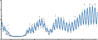{width="2.019430227471566in"
height="0.8301935695538057in"}

> 168 C. Steinruecken et al.
>
> This component is approximately periodic with a period of 10.8 years.
> Across periods the shape of this function varies smoothly with a
> typical lengthscale of 36.9 years. The shape of this function within
> each period is very smooth and resembles a sinusoid. This component
> applies until 1643 and
>
> from 1716 onwards.
>
> This component explains 71.5% of the residual variance; this increases
> the total variance explained from 72.8% to 92.3%. The addition of this
> component reduces the cross validated MAE by 16.82% from 0.18 to 0.15.
>
> 0.6
>
> 0.4
>
> 0.2
>
> 0
>
> −0.2
>
> −0.4
>
> −0.6
>
> −0.8
>
> Posterior of component 4

  --
  --

> 1650 1700 1750 1800 1850 1900 1950 2000
>
> Sum of components up to component 4
>
> 1362

1361.5

> 1361

1360.5

> 1360
>
> 1650 1700 1750 1800 1850 1900 1950 2000
>
> []{#_bookmark718 .anchor}**Fig.** **9.3** Extract from an
> automatically generated report that describes the model components
> discovered by ABCD. This part of the report isolates and describes the
> approximately 11-year sunspot cycle, also noting its disappearance
> during the sixteenth century, a time period known as the Maunder
> minimum. (This figure is reproduced from \[[18](#_bookmark693)\])
>
> ***9.3.4*** ***Comparison*** ***with*** ***Humans***
>
> An interesting question to consider is to what extent predictions made
> by an Automated Statistician (such as the ABCD algorithm) are
> human-like, and how they compare to predictions made with other
> methods that are also based on Gaussian processes. To answer that
> question, Schulz et al. \[[28](#_bookmark719)\] presented participants
> with the task of extrapolating from a given set of data, and choosing
> a preferred extrapolation from a given set. The results were
> encouraging for composite kernel search in two ways: Firstly, the
> participants preferred the extrapolations made by ABCD over those made
> with Spectral Kernels \[[36](#_bookmark720)\], and over those made
> with a simple RBF (radial basis function) kernel. Secondly, when human
> participants were asked to extrapolate the data themselves, their
> predictions were most similar to those given by ABCD’s composite
> search procedure.
>
> One of the design goals of a report-writing Automatic Statistician is
> the ability to explain its findings in terms that are understandable by
> humans. The system described earlier restricts itself to a space of
> models that can be explained in human language using simple terms,
> even though this design choice may come at the cost of predictive
> accuracy. In general, it is not straight-forward to measure the
> interpretability of machine learning systems; one possible framework
> is suggested by Doshi-Velez and Kim \[[4](#_bookmark721)\]. We note in
> passing that not all machine learning systems require such
> functionality. For example, when the results of a system have little
> impact on society, especially in terms of social norms and
> interactions, it is acceptable to optimise for performance or accuracy
> instead (e.g. recognising post codes for automatic mail sorting).
>
> 9 The Automatic Statistician 169
>
> **9.4** **Other** **Automatic** **Statistician** **Systems**
>
> The ability to generate human-readable reports is perhaps one of the
> distinguishing features of Automatic Statistician systems. But, as
> mentioned earlier, software of this nature can serve other purposes as
> well. For example, users might be interested in raw predictions from
> the data (with or without explanations), or they might want the system
> to make data-driven decisions directly on their behalf.
>
> Also, it is possible to build Automatic Statistician systems for model
> families that are different from Gaussian processes or grammars. For
> example, we built Automated Statistician systems for regression
> \[[5](#_bookmark713), [18](#_bookmark693)\], classification
> \[[12](#_bookmark722), [23](#_bookmark723)\], univariate and
> multivariate data; systems based on various different model classes,
> and systems with and without intelligent resource control. This
> section discusses some of the design elements that are shared across
> many Automatic Statistician systems.

***9.4.1*** ***Core*** ***Components***

> One of the key tasks that an Automatic Statistician has to perform is
> to select, evaluate, and compare models. These types of task can be
> run concurrently, but they have interdependencies. For example, the
> evaluation of one set of models might influence the selection of the
> next set of models.
>
> Most generally, the **selection** **strategy** component in our system
> is responsible for choosing models to evaluate: it might choose from a
> fixed or open-ended family of models, or it might generate and refine
> models based on the evaluation and comparison of previously chosen
> models. Sometimes, the *types* of the variables in the dataset
> (whether inferred from the data or annotated by the user) influence
> which models might be chosen by the selection strategy. For example,
> one might want to distinguish continuous and discrete data, and to use
> different treatments for categorical and ordinal data.
>
> The **model** **evaluation** task trains a given model on part of the
> user-supplied dataset, and then produces a score by testing the model
> on held-out data. Some models do not require a separate training phase
> and can produce a log-likelihood for the entire dataset directly.
> Model evaluation is probably one of the most important tasks to
> parallelise: at any given time, multiple selected models can be
> evaluated simultaneously, on multiple CPUs or even multiple computers.
>
> The **report** **curator** component is the piece of software that
> decides which results to include in the final report. For example, it
> might include sections that describe the best fitting models, along
> with extrapolations, graphs, or data tables. Depending on the
> evaluation results, the report curator might choose to include
> additional material, such as data falsification/model criticism
> sections, recommendations, or a summary. In some systems the
> deliverable might be something other than a report, such as raw
> predictions, parameter settings, or model source code.
>
> 170 C. Steinruecken et al.
>
> In interactive systems, a **data** **loading** **stage** provides an
> instant summary about the uploaded dataset, and allows the user to
> correct any assumptions about the format of the data. The user can
> make type annotations, remove columns from the dataset, choose an
> output variable (e.g. for classification), and specify the analyses
> that should be run.

***9.4.2*** ***Design*** ***Challenges***

> **9.4.2.1** **User** **Interaction**
>
> While the aim of an Automatic Statistician is to automate *all*
> aspects of data handling (from low-level tasks such as formatting and
> clean-up, to high-level tasks such as model construction, evaluation,
> and criticism), it is also useful to give users the option to interact
> with the system and influence the choices it makes. For example, users
> might want to specify which parts or which aspects of the data they
> are interested in, and which parts can be ignored. Some users might
> want to choose the family of models that the system will consider in
> the model construction or evaluation phase. Finally, the system may
> want to engage in a dialogue with the user to explore or explain what
> it found in the data. Such interactivity needs to be supported by the
> underlying system.
>
> **9.4.2.2** **Missing** **and** **Messy** **Data**
>
> A common problem with real-world datasets is that they may have
> missing or corrupt entries, unit or formatting inconsistencies, or
> other kinds of defects. These kinds of defects may require some
> pre-processing of the data, and while many decisions could be made
> automatically, some might benefit from interaction with the user. Good
> models can handle missing data directly, and as long as the missing
> data is detected correctly by the data loading stage, everything
> should be fine. But there are some data models that cannot handle
> missing data natively. In such cases, it might be useful to perform
> *data* *imputation* to feed these models a version of the dataset that
> has the missing values filled in. This imputation task itself is
> performed by a model that is trained on the data. Examples of such
> techniques include e.g. MissForest \[[31](#_bookmark724)\],
> MissPaLasso \[[30](#_bookmark725)\], mice \[[3](#_bookmark726)\],
> KNNimpute \[[34](#_bookmark727)\], and Bayesian approaches
> \[[1](#_bookmark728), [7](#_bookmark729)\].
>
> **9.4.2.3** **Resource** **Allocation**
>
> Another important aspect of an Automatic Statistician is *resource*
> *usage*. For example, a user might only have a limited number of CPU
> cores available, or might be interested to get the best possible
> report within a fixed time limit,
>
> 9 The Automatic Statistician 171
>
> e.g. before a given deadline. To make good model selection and
> evaluation choices, an intelligent system might take into account such
> resource constraints. The ability to do so will affect the overall
> usability of the system.

Even when there are no direct constraints on computation time, CPU
cores, or memory usage, an intelligent system might benefit from
allocating resources to models whose evaluation is promising for the
chosen deliverable. Such functionality can be implemented for models
that support some form of gradual evaluation, for example by training
incrementally on increasingly large subsets of the dataset. One of our
systems used a variant of Freeze-thaw Bayesian optimisation
\[[32](#_bookmark730)\] for this purpose.

> **9.5** **Conclusion**
>
> Our society has entered an era of abundant data. Analysis and
> exploration of the data is essential for harnessing the benefits of
> this growing resource. Unfortunately, the growth of data currently
> outpaces our ability to analyse it, especially because this task still
> largely rests on human experts. But many aspects of machine learning
> and data analysis can be automated, and one guiding principle in
> pursuit of this goal is to “apply machine learning to itself” .

The Automatic Statistician project aims to automate data science by
taking care of all aspects of data analysis, from data pre-processing,
modelling and evaluation, to the generation of useful and transparent
results. All these tasks should be performed in a way that requires
little user expertise, minimises the amount of user interaction, and
makes intelligent and controlled use of computational resources.

While this aim is ambitious, and a lot of the work still needs to
happen, encouraging progress has been made towards the creation of such
automated systems. Multiple Automatic Statistician systems have been
built, each with slight differences in purpose and underlying
technology, but they all share the same intent and much of the same
design philosophy. We hope that the creation of such instruments will
bring the ability to gain insights from data to a larger group of
people, and help empower society to make great use of our data
resources.

**Acknowledgements** The authors would like to thank Tameem Adel Hesham,
Lars Kotthoff, and Frank Hutter for helpful feedback.

> []{#_bookmark728 .anchor}**Bibliography**
>
> 1\. Allingham, J.U.: Unsupervised automatic dataset repair. Master’s
> thesis in advanced computer science, Computer Laboratory, University of
> Cambridge (2018)
>
> 2\. Bishop, C.M.: Pattern recognition and machine learning. Information
> science and statistics, [[]{#_bookmark726 .anchor}]{#_bookmark695
> .anchor}Springer (2006)
>
> 3\. van Buuren, S., Groothuis-Oudshoorn, K.: mice: Multivariate
> imputation by chained equa- []{#_bookmark721 .anchor}tions in R. Journal
> of Statistical Software 45(3) (2011)
>
> 4\. Doshi-Velez, F., Kim, B.: Towards a rigorous science of interpretable
> machine learning (Mar 2017), <http:/arxiv.org/abs/1702.08608>
>
> 172 C. Steinruecken et al.
>
> []{#_bookmark713 .anchor}5. Duvenaud, D., Lloyd, J.R., Grosse, R.,
> Tenenbaum, J.B., Ghahramani, Z.: Structure discovery in nonparametric
> regression through compositional kernel search. In: Proceedings of the
> 30th []{#_bookmark707 .anchor}International Conference on Machine
> Learning (Jun 2013)
>
> 6\. Feurer, M., Klein, A., Eggensperger, K., Springenberg, J., Blum, M.,
> Hutter, F.: Efficient and robust automated machine learning. In: Cortes,
> C., Lawrence, N.D., Lee, D.D., Sugiyama, M., Garnett, R. (eds.) Advances
> in Neural Information Processing Systems 28, pp. 2962–2970.
> []{#_bookmark729 .anchor}Curran Associates, Inc. (2015)
>
> 7\. Garriga Alonso, A.: Probability density imputation of missing data
> with Gaussian Mixture []{#_bookmark710 .anchor}Models. MSc thesis,
> University of Oxford (2017)
>
> 8\. Gelman, A., Carlin, J.B., Stern, H.S., Dunson, D.B., Vehtari, A.,
> Rubin, D.B.: Bayesian Data Analysis, Third Edition. Chapman & Hall/CRC
> Texts in Statistical Science. Taylor & Francis
>
> []{#_bookmark696 .anchor}(2013)
>
> 9\. Ghahramani, Z.: Probabilistic machine learning and artificial
> intelligence. Nature 521, 452– []{#_bookmark712 .anchor}459 (2015)
>
> 10\. Grosse, R.B., Salakhutdinov, R., Tenenbaum, J.B.: Exploiting
> compositionality to explore a large space of model structures. In:
> Uncertainty in Artificial Intelligence (2012)
>
> 11\. Hand, D.J.: Patterns in statistical strategy. In: Gale, W.A. (ed.)
> Artificial intelligence and [[]{#_bookmark722 .anchor}]{#_bookmark700
> .anchor}statistics (1986)
>
> 12\. He, Q.: The Automatic Statistician for Classification. Master’s
> thesis, Department of Engineer- ing, University of Cambridge (May 2016)
>
> 13\. Hwang, Y., Tong, A., Choi, J.: Automatic construction of
> nonparametric relational regression models for multiple time series. In:
> Balcan, M.F., Weinberger, K.Q. (eds.) ICML 2016: Proceedings of the 33rd
> International Conference on Machine Learning. Proceedings of
> []{#_bookmark716 .anchor}Machine Learning Research, vol. 48, pp.
> 3030–3039. PLMR (2016)
>
> 14\. Janz, D., Paige, B., Rainforth, T., van de Meent, J.W., Wood, F.:
> Probabilistic structure discovery in time series data (2016),
> <https:/arxiv.org/abs/1611.06863>
>
> 15\. Kim, H., Teh, Y.W.: Scaling up the Automatic Statistician: Scalable
> structure discovery using Gaussian processes. In: Storkey, A.,
> Perez-Cruz, F. (eds.) Proceedings of the 21st International Conference
> on Artificial Intelligence and Statistics. Proceedings of Machine
> []{#_bookmark704 .anchor}Learning Research, vol. 84, pp. 575–584. PLMR
> (2018)
>
> 16\. King, R.D., Whelan, K.E., Jones, F.M., Reiser, P.G.K., Bryant, C.H.,
> Muggleton, S.H., Kell, D.B., Oliver, S.G.: Functional genomic hypothesis
> generation and experimentation by a robot []{#_bookmark705
> .anchor}scientist. Nature 427(6971), 247–252 (2004)
>
> 17\. Kotthoff, L., Thornton, C., Hoos, H.H., Hutter, F., Leyton-Brown,
> K.: Auto-WEKA 2.0: Automatic model selection and hyperparameter
> optimization in WEKA. Journal of Machine []{#_bookmark693
> .anchor}Learning Research 18(25), 1–5 (2017)
>
> 18\. Lloyd, J.R., Duvenaud, D., Grosse, R., Tenenbaum, J.B., Ghahramani,
> Z.: Automatic construc- tion and natural-language description of
> nonparametric regression models. In: Twenty-Eighth []{#_bookmark717
> .anchor}AAAI Conference on Artificial Intelligence (AAAI-14) (2014)
>
> 19\. Lloyd, J.R.: Representation, learning, description and criticism of
> probabilistic models with applications to networks, functions and
> relational data. Ph.D. thesis, Department of Engineer- []{#_bookmark711
> .anchor}ing, University of Cambridge (Dec 2014)

20\. Lloyd, J.R., Ghahramani, Z.: Statistical model criticism using
kernel two sample tests. In: Cortes, C., Lawrence, N.D., Lee, D.D.,
Sugiyama, M., Garnett, R. (eds.) Advances in Neural Information
Processing Systems 28. pp. 829–837. Curran Associates, Inc. (2015)

[]{#_bookmark697 .anchor}21. MacKay, D.J.C.: Bayesian interpolation.
Neural Computation 4(3), 415–447 (1992), see \[[24](#_bookmark731)\]
[]{#_bookmark715 .anchor}for additional discussion and illustration.

22\. Malkomes, G., Schaff, C., Garnett, R.: Bayesian optimization for
automated model selection. In: Lee, D.D., Sugiyama, M., von Luxburg, U.,
Guyon, I., Garnett, R. (eds.) Advances in Neural Information Processing
Systems 29, pp. 2900–2908. Curran Associates, Inc. (2016)

[]{#_bookmark723 .anchor}23.
Mrkši{width="5.2796369203849516e-2in"
height="0.1329265091863517in"}, N.: Kernel Structure Discovery for
Gaussian Process Classification. Master’s thesis, []{#_bookmark731
.anchor}Computer Laboratory, University of Cambridge (Jun 2014)

24\. Murray, I., Ghahramani, Z.: A note on the evidence and Bayesian
Occam’s razor. Tech. Rep. GCNU-TR 2005-003, Gatsby Computational
Neuroscience Unit, University College London

> (2005)
>
> 9 The Automatic Statistician 173
>
> []{#_bookmark708 .anchor}25. Rasmussen, C.E., Williams, C.K.I.:
> Gaussian Processes for Machine Learning. MIT Press
>
> []{#_bookmark702 .anchor}(2006),
> <http:/www.gaussianprocess.org/gpml/>
>
> 26\. Schmidt, M., Lipson, H.: Distilling free-form natural laws from
> experimental data. Science []{#_bookmark703 .anchor}324(5923), 81–85
> (2009)
>
> 27\. Schmidt, M., Lipson, H.: Symbolic regression of implicit equations.
> In: Riolo, R., O’Reilly, U.M., McConaghy, T. (eds.) Genetic Programming
> Theory and Practice VII, pp. 73–85. []{#_bookmark719 .anchor}Springer,
> Boston, MA (2010)
>
> 28\. Schulz, E., Tenenbaum, J., Duvenaud, D.K., Speekenbrink, M.,
> Gershman, S.J.: Probing the compositionality of intuitive functions. In:
> Lee, D.D., Sugiyama, M., von Luxburg, U., Guyon, I., Garnett, R. (eds.)
> Advances in Neural Information Processing Systems 29, pp. 3729–3737.
> []{#_bookmark714 .anchor}Curran Associates, Inc. (2016)
>
> 29\. Schwarz, G.: Estimating the dimension of a model. The Annals of
> Statistics 6(2), 461–464
>
> []{#_bookmark725 .anchor}(1978)
>
> 30\. Städler, N., Stekhoven, D.J., Bühlmann, P.: Pattern alternating
> maximization algorithm for missing data in high-dimensional problems.
> Journal of Machine Learning Research 15, 1903– []{#_bookmark724
> .anchor}1928 (Jun 2014)
>
> 31\. Stekhoven, D.J., Bühlmann, P.: MissForest – non-parametric missing
> value imputation for mixed-type data. Bioinformatics 28(1), 112– 118
> (Nov 2011)
>
> 32\. Swersky, K., Snoek, J., Adams, R.P.: Freeze-thaw Bayesian
> optimization (Jun 2014), [http:/](http:/arxiv.org/abs/1406.3896)
> [[]{#_bookmark706 .anchor}]{#_bookmark730
> .anchor}[arxiv.org/abs/1406.3896](http:/arxiv.org/abs/1406.3896)
>
> 33\. Thornton, C., Hutter, F., Hoos, H.H., Leyton-Brown, K.: Auto-WEKA:
> Combined selection and hyperparameter optimization of classification
> algorithms. In: Proceedings of the 19th ACM SIGKDD International
> Conference on Knowledge Discovery and Data Mining. pp. 847–855.
> []{#_bookmark727 .anchor}KDD ’13, ACM, New York, NY, USA (2013)
>
> 34\. Troyanskaya, O., Cantor, M., Sherlock, G., Brown, P., Hastie, T.,
> Tibshirani, R., Botstein, D., Altman, R.B.: Missing value estimation
> methods for DNA microarrays. Bioinformatics pp. []{#_bookmark698
> .anchor}520–525 (Jun 2001)
>
> 35\. Valera, I., Ghahramani, Z.: Automatic discovery of the statistical
> types of variables in a dataset. In: Precup, D., Teh, Y.W. (eds.) ICML
> 2017: Proceedings of the 34th International Conference on Machine
> Learning. Proceedings of Machine Learning Research, vol. 70, pp.
> 3521–3529. []{#_bookmark720 .anchor}PLMR (2017)
>
> 36\. Wilson, A.G., Adams, R.P.: Gaussian process kernels for pattern
> discovery and extrapolation. In: Dasgupta, S., McAllester, D. (eds.)
> ICML 2013: Proceedings of the 30th International Conference on Machine
> Learning. JLMR Proceedings, vol. 28, pp. 1067– 1075. JLMR.org (Jun
> []{#_bookmark701 .anchor}2013)
>
> 37\. Wolstenholme, D.E., O’Brien, C.M., Nelder, J.A.: GLIMPSE: a
> knowledge-based front end for statistical analysis. Knowledge-Based
> Systems 1(3), 173– 178 (1988)
>
> **Open** **Access** This chapter is licensed under the terms of the
> Creative Commons Attribution 4.0 International License
> [(http:/creativecommons.org/licenses/by/4.0/](http:/creativecommons.org/licenses/by/4.0/)),
> which permits use, sharing, adaptation, distribution and reproduction
> in any medium or format, as long as you give appropriate credit to the
> original author(s) and the source, provide a link to the Creative
> Commons licence and indicate if changes were made.
>
> The images or other third party material in this chapter are included
> in the chapter’s Creative Commons licence, unless indicated otherwise
> in a credit line to the material. If material is not included in the
> chapter’s Creative Commons licence and your intended use is not
> permitted by statutory regulation or exceeds the permitted use, you
> will need to obtain permission directly from the copyright holder.

{width="0.787415791776028in"
height="0.275582895888014in"}

[]{#_bookmark9 .anchor}**Part** **III**

**AutoML** **Challenges**

{width="0.42962489063867015in"
height="0.42963801399825025in"}{width="1.418332239720035in"
height="6.944444444444444e-3in"}

> []{#_bookmark13 .anchor}**Chapter** **10**
>
> **Analysis** **of** **the** **AutoML** **Challenge** **Series**
>
> **2015–2018**

> **Isabelle** **Guyon,** **Lisheng** **Sun-Hosoya,** **Marc**
> **Boullé,** **Hugo** **Jair** **Escalante,** **Sergio** **Escalera**
> [{width="0.13655621172353455in"
> height="0.12270778652668417in"}](https:/orcid.org/0000-0003-0617-8873)**,**
> **Zhengying** **Liu,** **Damir** **Jajetic,** **Bisakha** **Ray,**
> **Mehreen** **Saeed,** **Michèle** **Sebag,** **Alexander**
> **Statnikov,** **Wei-Wei** **Tu,** **and** **Evelyne** **Viegas**

**Abstract** The ChaLearn AutoML Challenge (The authors are in
alphabetical order of last name, except the first author who did most of
the writing and the second author who produced most of the numerical
analyses and plots.) (NIPS 2015 – ICML 2016) consisted of six rounds of
a machine learning competition of progressive difficulty, subject to
limited computational resources. It was followed by

> I. Guyon (凶)
>
> University of Paris-Sud, Orsay, France
>
> INRIA, University of Paris-Saclay, Paris, France
>
> ChaLearn and ClopiNet, Berkeley, CA, USA
>
> e-mail: <guyon@chalearn.org>
>
> L. Sun-Hosoya · Z. Liu
>
> Laboratoire de Recherche en Informatique, University of Paris-Sud,
> Orsay, France University of Paris-Saclay, Paris, France
>
> M. Boullé
>
> Machine Learning Group, Orange Labs, Lannion, France
>
> H. J. Escalante
>
> Computational Sciences Department, INAOE and ChaLearn, Tonantzintla,
> Mexico
>
> S. Escalera
>
> Computer Vision Center, University of Barcelona, Barcelona, Spain
>
> D. Jajetic
>
> IN2, Zagreb, Croatia
>
> B. Ray
>
> Langone Medical Center, New York University, New York, NY, USA
>
> M. Saeed
>
> Department of Computer Science, National University of Computer and
> Emerging Sciences, Islamabad, Pakistan
>
> M. Sebag
>
> Laboratoire de Recherche en Informatique, CNRS, Paris, France
>
> University of Paris-Saclay, Paris, France
>
> © The Author(s) 2019
>
> F. Hutter et al. (eds.), *Automated* *Machine* *Learning*, The
> Springer Series on Challenges in Machine Learning,
> <https:/doi.org/10.1007/978-3-030-05318-5_10>

{width="1.418332239720035in"
height="6.944444444444444e-3in"}

> 178 I. Guyon et al.

a one-round AutoML challenge (PAKDD 2018). The AutoML setting differs
from former model selection/hyper-parameter selection challenges, such
as the one we previously organized for NIPS 2006: the participants aim
to develop fully automated and computationally efficient systems, capable
of being trained and tested without human intervention, with code
submission. This chapter analyzes the results of these competitions and
provides details about the datasets, which were not revealed to the
participants. The solutions of the winners are systematically
benchmarked over all datasets of all rounds and compared with canonical
machine learning algorithms available in scikit-learn. All materials
discussed in this chapter (data and code) have been made publicly
available at <http:/automl.chalearn.org/>.

> **10.1** **Introduction**
>
> Until about 10 years ago, machine learning (ML) was a discipline
> little known to the public. For ML scientists, it was a “seller’s
> market”: they were producing hosts of algorithms in search for
> applications and were constantly looking for new interesting datasets.
> Large internet corporations accumulating massive amounts of data such
> as Google, Facebook, Microsoft and Amazon have popularized the use of
> ML and data science competitions have engaged a new generation of
> young scientists in this wake. Nowadays, government and corporations
> keep identifying new applications of ML and with the increased
> availability of open data, we have switched to a “buyer’s market”:
> everyone seems to be in need of a learning machine. Unfortunately
> however, learning machines are not yet fully automatic: it is still
> difficult to figure out which software applies to which problem, how to
> horseshoe-fit data into a software and how to select (hyper-)parameters
> properly. The ambition of the ChaLearn AutoML challenge series is to
> channel the energy of the ML community to reduce step by step the need
> for human intervention in applying ML to a wide variety of practical
> problems.
>
> Full automation is an unbounded problem since there can always be
> novel settings, which have never been encountered before. Our first
> challenges AutoML1 were limited to:
>
> • **Supervised** **learning** problems (classification and regression).
>
> • **Feature** **vector** representations.
>
> • **Homogeneous** **datasets** (same distribution in the training,
> validation, and test set).
>
> A. Statnikov
>
> SoFi San Francisc, California, USA
>
> W.-W. Tu
>
> 4Paradigm, Beijing, Republic of China
>
> E. Viegas
>
> Microsoft Research, Redmond, WA, USA
>
> 10 Analysis of the AutoML Challenge Series 2015–2018 179
>
> • **Medium** **size** **datasets** of less than 200 MBytes.
>
> • **Limited** **computer** **resources** with execution times of less
> than 20 min per dataset on an 8 core x86\_64 machine with 56 GB RAM.
>
> We excluded unsupervised learning, active learning, transfer learning,
> and causal discovery problems, which are all very dear to us and have
> been addressed in past ChaLearn challenges \[[31](#_bookmark732)\],
> but which require each a different evaluation setting, thus making
> result comparisons very difficult. We did not exclude the treatment of
> video, images, text, and more generally time series and the selected
> datasets actually contain several instances of such modalities.
> However, they were first preprocessed in a feature representation, thus
> de-emphasizing feature learning. Still, learning from data
> pre-processed in feature-based representations already covers a lot of
> grounds and a fully automated method resolving this restricted problem
> would already be a major advance in the field.
>
> Within this constrained setting, we included a variety of difficulties:
>
> • **Different** **data** **distributions:** the intrinsic/geometrical
> complexity of the dataset.
>
> • **Different** **tasks:** regression, binary classification,
> multi-class classification, multi-label classification.
>
> • **Different** **scoring** **metrics:** AUC, BAC, MSE, F1, etc. (see
> Sect.[10.4.2](#_bookmark733)).
>
> • **Class** **balance:** Balanced or unbalanced class proportions.
>
> • **Sparsity:** Full matrices or sparse matrices.
>
> • **Missing** **values:** Presence or absence of missing values.
>
> • **Categorical** **variables:** Presence or absence of categorical
> variables.
>
> • **Irrelevant** **variables:** Presence or absence of additional
> irrelevant variables (distractors).
>
> • **Number** Ptr **of** **training** **examples:** Small or large
> number of training examples.
>
> • **Number** N **of** **variables/features:** Small or large number of
> variables.
>
> • **Ratio** Ptr/N **of** **the** **training** **data** **matrix:** Ptr
> &gt; N, Ptr = N or Ptr &lt; N .

In this setting, the participants had to face many
modeling/hyper-parameter choices. Some other, equally important, aspects
of automating machine learning were not addressed in this challenge and
are left for future research. Those include data “ingestion” and
formatting, pre-processing and feature/representation learning,
detection and handling of skewed/biased data, inhomogeneous, drifting,
multi- modal, or multi-view data (hinging on transfer learning),
matching algorithms to problems (which may include supervised,
unsupervised, or reinforcement learning, or other settings), acquisition
of new data (active learning, query learning, rein- forcement learning,
causal experimentation), management of large volumes of data including
the creation of appropriately-sized and stratified training, validation,
and test sets, selection of algorithms that satisfy arbitrary resource
constraints at training and run time, the ability to generate and reuse
workflows, and generating meaningful reports.

{width="1.418332239720035in"
height="6.944444444444444e-3in"}

> 180 I. Guyon et al.
>
> This challenge series started with the NIPS 2006 “model selection
> game”[1](#_bookmark734) \[[37](#_bookmark735)\], where the
> participants were provided with a machine learning toolbox based on
> the Matlab toolkit CLOP \[[1](#_bookmark736)\] built on top of the
> “Spider” package \[[69](#_bookmark737)\]. The toolkit provided a
> flexible way of building models by combining preprocessing, feature
> selection, classification and post-processing modules, also enabling
> the building of ensembles of classifiers. The goal of the game was to
> build the best hyper- model: the focus was on model selection, not on
> the development of new algorithms. All problems were feature-based
> binary classification problems. Five datasets were provided. The
> participants had to submit the schema of their model. The model
> selection game confirmed the effectiveness of cross-validation (the
> winner invented a new variant called cross-indexing) and emphasized
> the need to focus more on search effectiveness with the deployment of
> novel search techniques such as particle swarm optimization.

New in the 2015/2016 AutoML challenge, we introduced the notion of
“task”: each dataset was supplied with a particular scoring metric to be
optimized and a time budget. We initially intended to vary widely the
time budget from dataset to dataset in an arbitrary way. We ended up
fixing it to 20 min for practical reasons (except for Round 0 where the
time budget ranged from 100 to 300 s). However, because the datasets
varied in size, this put pressure on the participants to manage their
allotted time. Other elements of novelty included the freedom of
submitting any Linux executable. This was made possible by using
automatic execution on the open-source platform
Codalab.[2](#_bookmark738) To help the participants we provided a
starting kit in Python based on the scikit-learn library
\[[55](#_bookmark739)\].[3](#_bookmark740) This induced many of them to
write a wrapper around scikit-learn. This has been the strategy of the
winning entry “auto-sklearn”
\[[25](#_bookmark741)–[28](#_bookmark742)\].[4](#_bookmark743) Following
the AutoML challenge, we organized a “beat auto-sklearn” game on a
single dataset (madeline), in which the participants could provide
hyper-parameters “by hand” to try to beat auto-sklearn. But nobody could
beat auto-sklearn! Not even their designers. The participants could
submit a json file which describes a sklearn model and hyper-parameter
settings, via a GUI interface. This interface allows researchers who
want to compare their search methods with auto-sklearn to use the exact
same set of hyper-models.

> A large number of satellite events including bootcamps, summer
> schools, and workshops have been organized in 2015/2016 around the
> AutoML challenge.[5](#_bookmark744)The AutoML challenge was part of
> the official selection of the competition program of
>
> IJCNN 2015 and 2016 and the results were discussed at the AutoML and
> CiML
>
> workshops at ICML and NIPS in 2015 and 2016. Several publications
> accompanied these events: in \[[33](#_bookmark745)\] we describe the
> details of the design of the AutoML challenge.[6](#_bookmark746)
>
> [[]{#_bookmark738 .anchor}]{#_bookmark734
> .anchor}1<http:/clopinet.com/isabelle/Projects/NIPS2006/>
>
> []{#_bookmark740 .anchor}2<http:/competitions.codalab.org>
>
> []{#_bookmark743 .anchor}3<http:/scikit-learn.org/>
>
> []{#_bookmark744
> .anchor}4<https:/automl.github.io/auto-sklearn/stable/>
>
> []{#_bookmark746 .anchor}5 See<http:/automl.chalearn.org>
>
> 6<http:/codalab.org/AutoML>

{width="1.418332239720035in"
height="6.944444444444444e-3in"}

> 10 Analysis of the AutoML Challenge Series 2015–2018 181
>
> In \[[32](#_bookmark747)\] and \[[34](#_bookmark748)\] we review
> milestone and final results presented at the ICML 2015 and 2016 AutoML
> workshops. The 2015/2016 AutoML challenge had 6 rounds introducing 5
> datasets each. We also organized a follow-up event for the PAKDD
> [conference 20187](#_bookmark749) in only 2 phases, with 5 datasets in
> the development phase and 5 datasets in the final “blind test” round.
>
> Going beyond the former published analyses, this chapter presents
> systematic studies of the winning solutions on all the datasets of the
> challenge and conducts comparisons with commonly used learning
> machines implemented in scikit-learn. It provides unpublished details
> about the datasets and reflective analyses.
>
> This chapter is in part based on material that has appeared previously
> \[[32](#_bookmark747)–[34](#_bookmark748),[36](#_bookmark750)\]. This
> chapter is complemented by a 46-page online appendix that can be
> accessed from the book’s webpage: <http:/automl.org/book>.
>
> []{#_bookmark751 .anchor}**10.2** **Problem** **Formalization**
> **and** **Overview**
>
> ***10.2.1*** ***Scope*** ***of*** ***the*** ***Problem***
>
> This challenge series focuses on supervised learning in ML and, in
> particular, solv- ing classification and regression problems, without
> any further human intervention, within given constraints. To this end,
> we released a large number of datasets pre- formatted in given feature
> representations (i.e., each example consists of a fixed number of
> numerical coefficients; more in Sect.[10.3](#_bookmark752)).
>
> The distinction between input and output variables is not always made
> in ML applications. For instance, in recommender systems, the problem
> is often stated as making predictions of missing values for every
> variable rather than predicting the values of a particular variable
> \[[58](#_bookmark753)\]. In unsupervised learning
> \[[30](#_bookmark754)\], the purpose is to explain data in a simple
> and compact way, eventually involving inferred latent variables (e.g.,
> class membership produced by a clustering algorithm).
>
> We consider only the strict supervised learning setting where data
> present them- selves as identically and independently distributed
> input-output pairs. The models used are limited to fixed-length
> vectorial representations, excluding problems of time series
> prediction. Text, speech, and video processing tasks included in the
> chal- lenge have been preprocessed into suitable fixed-length vectorial
> representations.
>
> The difficulty of the proposed tasks lies in the data complexity (class
> imbalance, sparsity, missing values, categorical variables). The
> testbed is composed of data from a wide variety of domains. Although
> there exist ML toolkits that can tackle all of these problems, it
> still requires considerable human effort to find, for a given dataset,
> task, evaluation metric, the methods and hyper-parameter settings that
> maximize performance subject to a computational constraint. The
> participant challenge is to create the *perfect* *black* *box* that
> removes human interaction, alleviating the shortage of data scientists
> in the coming decade.
>
> []{#_bookmark749
> .anchor}7<https:/www.4paradigm.com/competition/pakdd2018>
>
> 182 I. Guyon et al.

***10.2.2*** ***Full*** ***Model*** ***Selection***

We refer to participant solutions as *hyper-models* to indicate that
they are built from simpler components. For instance, for classification
problems, participants might consider a hyper-model that combines
several classification techniques such as nearest neighbors, linear
models, kernel methods, neural networks, and random forests. More
complex hyper-models may also include preprocessing, feature
construction, and feature selection modules.

> Generally, a predictive model of the form y = f(**x**;**α**) has:
>
> • a set of parameters **α** = \[α0 ,α 1 ,α2 , . . . , αn\];
>
> • a learning algorithm (referred to as trainer), which serves to
> optimize the parameters using training data;
>
> • a trained model (referred to as predictor) of the form y = f(**x**)
> produced by the trainer;
>
> • a clear objective function J(f), which can be used to assess the
> model’s performance on test data.

Consider now the model hypothesis space defined by a vector **θ** = \[θ1
,θ2 , . . . , θn\] of hyper-parameters. The hyper-parameter vector may
include not only parameters corresponding to switching between
alternative models, but also modeling choices such as preprocessing
parameters, type of kernel in a kernel method, number of units and
layers in a neural network, or training algorithm regularization
parameters \[[59](#_bookmark755)\]. Some authors refer to this problem
as *full* *model* *selection* \[[24](#_bookmark756),
[62](#_bookmark757)\], others as the CASH problem (Combined Algorithm
Selection and Hyperparameter optimization) \[[65](#_bookmark758)\]. We
will denote hyper-models as

y = f(**x**; **θ**) = f(**x**; **α**(**θ**), **θ**), (10. 1)

> where the model parameter vector **α** is an implicit function of the
> hyper-parameter vector **θ** obtained by using a trainer for a fixed
> value of **θ**, and training data composed of input-output pairs
> {**x**i,yi}. The participants have to devise algorithms capable of
> training the hyper-parameters **θ** . This may require intelligent
> sampling of the hyper-parameter space and splitting the available
> training data into subsets for both training and evaluating the
> predictive power of solutions—one or multiple times.

As an optimization problem, model selection is a bi-level optimization
pro- gram \[[7](#_bookmark759), [18](#_bookmark760),
[19](#_bookmark761)\]; there is a lower objective J1 to train the
parameters **α** of the model, and an upper objective J2 to train the
hyper-parameters **θ**, both optimized simultaneously (see
Fig.[10.1](#_bookmark762)). As a statistics problem, model selection is
a problem of multiple testing in which error bars on performance
prediction e degrade with the number of models/hyper-parameters tried
or, more generally, the complexity of the hyper-model C2(**θ**). A key
aspect of AutoML is to avoid overfitting the upper-level objective J2 by
regularizing it, much in the same way as lower level objectives J1 are
regularized.

{width="0.25397200349956256in"
height="0.1287357830271216in"}{width="0.25397200349956256in"
height="0.12872156605424323in"}

> 10 Analysis of the AutoML Challenge Series 2015–2018 183
>
> Hyperparameters
> ({width="4.8664698162729655e-2in"
> height="6.865266841644795e-2in"})
>
> 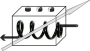{width="1.853332239720035in"
> height="1.0483464566929135in"}Hyperparameters

argmin {width="6.51334208223972e-2in"
height="7.157042869641295e-2in"}1tr \[f( . ;
{width="5.709645669291338e-2in"
height="4.726377952755906e-2in"} ,
{width="4.3013998250218725e-2in"
height="6.865266841644795e-2in"})\]

> {width="4.472222222222222e-2in"
> height="1.3631889763779527e-2in"}

  --------------------------------------------------------------------------------------------------------------------------------------------------------------------------------------------------
  > 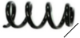{width="1.025in" height="0.4931233595800525in"}Parameters ({width="6.284995625546806e-2in" height="4.726377952755906e-2in"})
  --------------------------------------------------------------------------------------------------------------------------------------------------------------------------------------------------

> (b)

[]{#_bookmark762 .anchor}**Fig.** **10.1** **Bi-level**
**optimization.** (**a**) Representation of a learning machine with
parameters and hyper-parameters to be adjusted. (**b**) De-coupling of
parameter and hyper-parameter adjustment in two levels. The upper level
objective J2 optimizes the hyper-parameters **θ** ; the lower objective
J1 optimizes the parameters **α**

The problem setting also lends itself to using ensemble methods, which
let several “simple” models vote to make the final decision
\[[15](#_bookmark763), [16](#_bookmark764), [29](#_bookmark765)\]. In
this case, the parameters **θ** may be interpreted as voting weights.
For simplicity we lump all parameters in a single vector, but more
elaborate structures, such as trees or graphs can be used to define the
hyper-parameter space \[[66](#_bookmark766)\].

***10.2.3*** ***Optimization*** ***of*** ***Hyper-parameters***

Everyone who has worked with data has had to face some common modeling
choices: scaling, normalization, missing value imputation, variable
coding (for categorical variables), variable discretization, degree of
nonlinearity and model architecture, among others. ML has managed to
reduce the number of hyper- parameters and produce *black-boxes* to
perform tasks such as classification and regression
\[[21](#_bookmark767), [40](#_bookmark768)\]. Still, any real-world
problem requires at least some preparation of the data before it can be
fitted into an “automatic” method, hence requiring some modeling choices.
There has been much progress on end-to-end automated ML for more complex
tasks such as text, image, video, and speech processing with deep-
learning methods \[[6](#_bookmark769)\]. However, even these methods
have many modeling choices and hyper-parameters.

While producing models for a diverse range of applications has been a
focus of the ML community, little effort has been devoted to the
optimization of hyper- parameters. Common practices that include *trial*
*and* *error* and grid search may lead to overfitting models for small
datasets or underfitting models for large datasets. By overfitting we mean
producing models that perform well on training data but perform poorly
on unseen data, i.e., models that do not generalize. By underfitting

> 184 I. Guyon et al.

we mean selecting too simple a model, which does not capture the
complexity of the data, and hence performs poorly both on training and
test data. Despite well- optimized off-the-shelf algorithms for
optimizing parameters, end-users are still responsible for organizing
their numerical experiments to identify the best of a number of models
under consideration. Due to lack of time and resources, they often
perform model/hyper-parameter selection with ad hoc techniques.
Ioannidis and Langford \[[42](#_bookmark770), [47](#_bookmark771)\]
examine fundamental, common mistakes such as poor con- struction of
training/test splits, inappropriate model complexity, hyper-parameter
selection using test sets, misuse of computational resources, and
misleading test metrics, which may invalidate an entire study.
Participants must avoid these flaws and devise systems that can be
blind-tested.

> An additional twist of our problem setting is that code is tested with
> limited computational resources. That is, for each task an arbitrary
> limit on execution time is fixed and a maximum amount of memory is
> provided. This places a constraint on the participant to produce a
> solution in a given time, and hence to optimize the model search from
> a computational point of view. In summary, participants have to
> jointly address the problem of over-fitting/under-fitting and the
> problem of efficient search for an optimal solution, as stated in
> \[[43](#_bookmark772)\]. In practice, the computational constraints
> have turned out to be far more challenging to challenge participants
> than the problem of overfitting. Thus the main contributions have been
> to devise novel efficient search techniques with cutting-edge
> optimization methods.

***10.2.4*** ***Strategies*** ***of*** ***Model*** ***Search***

> Most practitioners use heuristics such as grid search or uniform
> sampling to sample **θ** space, and use k-fold cross-validation as the
> upper-level objective J2 \[[20](#_bookmark773)\]. In

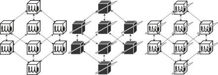

> \(a) Filter (b) Wrapper (c) Embedded

**Fig.** **10.2** **Approaches** **to** **two-level** **inference.**
(**a**) **Filter** **methods** select the hyper-parameters
[]{#_bookmark774 .anchor}without adjusting the learner parameters. (No
arrows indicates no parameter training.) (**b**) **Wrapper** **methods**
select the hyper-parameters using trained learners, treating them as
black- boxes. (**c**) **Embedded** **methods** use knowledge of the
learner structure and/or parameters to guide the hyper-parameter search

> 10 Analysis of the AutoML Challenge Series 2015–2018 185

this framework, the optimization of **θ** is not performed sequentially
\[[8](#_bookmark775)\]. All the parameters are sampled along a regular
scheme, usually in linear or log scale. This leads to a number of
possibilities that exponentially increases with the dimension of **θ** .
k-fold cross-validation consists of splitting the dataset into k folds;
(k − 1) folds are used for training and the remaining fold is used for
testing; eventually, the average of the test scores obtained on the k
folds is reported. Note that some ML toolkits currently support
cross-validation. There is a lack of principled guidelines to determine
the number of grid points and the value of k (with the exception of
\[[20](#_bookmark773)\]), and there is no guidance for regularizing J2,
yet this simple method is a good baseline approach.

> Efforts have been made to optimize continuous hyper-parameters with
> bilevel optimization methods, using either the k-fold cross-validation
> estimator \[[7](#_bookmark759), [50](#_bookmark776)\] or the
> leave-one-out estimator as the upper-level objective J2 . The
> leave-one-out estimator may be efficiently computed, in closed form, as
> a by-product of training only one predictor on all the training
> examples (e.g., virtual-leave-one-out \[[38](#_bookmark777)\]). The
> method was improved by adding a regularization of J2
> \[[17](#_bookmark778)\]. Gradient descent has been used to accelerate
> the search, by making a local quadratic approximation of J2
> \[[44](#_bookmark779)\]. In some cases, the full J2(**θ** ) can be
> computed from a few key examples \[[39](#_bookmark780),
> [54](#_bookmark781)\]. Other approaches minimize an *approximation* or
> an *upper* *bound* of the leave-one-out error, instead of its exact
> form \[[53](#_bookmark782), [68](#_bookmark783)\]. Nevertheless, these
> methods are still limited to specific models and continuous
> hyper-parameters.

An early attempt at full model selection was the *pattern* *search*
method that uses k-fold cross-validation for J2 . It explores the
hyper-parameter space by steps of the same magnitude, and when no change
in any parameter further decreases J2, the step size is halved and the
process repeated until the steps are deemed sufficiently small
\[[49](#_bookmark784)\]. Escalante et al. \[[24](#_bookmark756)\]
addressed the full model selection problem using Particle Swarm
Optimization, which optimizes a problem by having a population of
candidate solutions (particles), and moving these particles around the
hyper- parameter space using the particle’s position and velocity.
k-fold cross-validation is also used for J2 . This approach retrieved
the winning model in ∼76% of the cases. Overfitting was controlled
heuristically with early stopping and the proportion of training and
validation data was not optimized. Although progress has been made in
experimental design to reduce the risk of overfitting
\[[42](#_bookmark770), [47](#_bookmark771)\], in particular by splitting
data in a principled way \[[61](#_bookmark785)\], to our knowledge, no
one has addressed the problem of optimally splitting data.

> While regularizing the second level of inference is a recent addition
> to the frequentist ML community, it has been an intrinsic part of
> Bayesian modeling via the notion of hyper-prior. Some methods of
> multi-level optimization combine importance sampling and Monte-Carlo
> Markov Chains \[[2](#_bookmark786)\]. The field of Bayesian
> hyper-parameter optimization has rapidly developed and yielded
> promising results, in particular by using Gaussian processes to model
> generalization performance \[[60](#_bookmark787),
> [63](#_bookmark788)\]. But Tree-structured Parzen Estimator (TPE)
> approaches modeling P(**x**|y) and P(y) rather than modeling
> P(y|**x**) directly \[[9](#_bookmark789), [10](#_bookmark790)\] have
> been found to outperform GP-based Bayesian optimization for structured
> optimization problems with many hyperparameters including discrete
> ones \[[23](#_bookmark791)\]. The central idea of these methods is to
> fit J2(**θ** ) to a smooth function in an attempt to reduce variance
> and to estimate the
>
> 186 I. Guyon et al.
>
> variance in regions of the hyper-parameter space that are
> under-sampled to guide the search towards regions of high variance.
> These methods are inspirational and some of the ideas can be adopted
> in the frequentist setting. For instance, the random- forest-based
> SMAC algorithm \[[41](#_bookmark792)\], which has helped speed up both
> local search and tree search algorithms by orders of magnitude on
> certain instance distributions, has also been found to be very
> effective for the hyper-parameter optimization of machine learning
> algorithms, scaling better to high dimensions and discrete input
> dimensions than other algorithms \[[23](#_bookmark791)\]. We also
> notice that Bayesian optimization methods are often combined with
> other techniques such as meta-learning and ensemble methods
> \[[25](#_bookmark741)\] in order to gain advantage in some challenge
> settings with a time limit \[[32](#_bookmark747)\]. Some of these
> methods consider jointly the two-level optimization and take time cost
> as a critical guidance for hyper-parameter search
> \[[45](#_bookmark793), [64](#_bookmark794)\].
>
> Besides Bayesian optimization, several other families of approaches
> exist in the literature and have gained much attention with the recent
> rise of deep learning. Ideas borrowed from *reinforcement* *learning*
> have recently been used to construct optimal neural network
> architectures \[[4](#_bookmark795),[70](#_bookmark796)\]. These
> approaches formulate the hyper- parameter optimization problem in a
> reinforcement learning flavor, with for example states being the actual
> hyper-parameter setting (e.g., network architecture), actions being
> adding or deleting a module (e.g., a CNN layer or a pooling layer),
> and reward being the validation accuracy. They can then apply
> off-the-shelf reinforcement learning algorithms (e.g., RENFORCE,
> Q-learning, Monte-Carlo Tree Search) to solve the problem. Other
> architecture search methods use *evolutionary* algorithms
> \[[3](#_bookmark797), [57](#_bookmark798)\]. These approaches consider
> a set (population) of hyper-parameter settings (individuals), modify
> (mutate and reproduce) and eliminate unpromising settings according to
> their cross-validation score (fitness). After several generations, the
> global quality of the population increases. One important common point
> of rein- forcement learning and evolutionary algorithms is that they
> both deal with the exploration-exploitation trade-off. Despite the
> impressive results, these approaches require a huge amount of
> computational resources and some (especially evolution- ary
> algorithms) are hard to scale. Pham et al. \[[56](#_bookmark799)\]
> recently proposed weight sharing among child models to speed up the
> process considerably \[[70](#_bookmark796)\] while achieving
> comparable results.
>
> Note that splitting the problem of parameter fitting into two levels
> can be extended to more levels, at the expense of extra
> complexity—i.e., need for a hier- archy of data splits to perform
> multiple or nested cross-validation \[[22](#_bookmark800)\],
> insufficient data to train and validate at the different levels, and
> increase of the computational load.

Table [10.1](#_bookmark801) shows a typical example of multi-level
parameter optimization in a frequentist setting. We assume that we are
using an ML toolbox with two learning machines: Kridge (kernel ridge
regression) and Neural (a neural network a.k.a. “deep learning” model).
At the top level we use a test procedure to assess the performance of
the final model (this is not an inference level). The top-level inference
algorithm Validation({GridCV(Kridge, MSE), GridCV(Neural, MSE)}, MSE) is
decomposed into its elements recursively. Validation uses the data split
D = \[DTr,DVa \] to compare the learning machines Kridge and Neural
(trained

> 10 Analysis of the AutoML Challenge Series 2015–2018 187
>
> []{#_bookmark801 .anchor}**Table** **10.1** **Typical** **example**
> **of** **multi-level** **inference** **algorithm.** The top-level
> algorithm Vali- dation({GridCV(Kridge, MSE), GridCV(Neural, MSE)},
> MSE) is decomposed into its elements recursively. Calling the method
> “train” on it using data DTrV a results in a function f , then tested
> with test(f,MSE,DTe ). The notation \[.\]CV indicates that results are
> averages over multiple data splits (cross-validation). NA means “not
> applicable” . A model family F of parameters **α** and
> hyper-parameters **θ** is represented as f(**θ** , **α**). We derogate
> to the usual convention of putting hyper-parameters last, the
> hyper-parameters are listed in decreasing order of inference level. F,
> thought of as a bottom level algorithm, does not perform any training:
> train(f(**θ** , **α**)) just returns the function f(**x**; **θ** ,
> **α**)

  --------- --------------------------------------------------- ----------------- -------------------------- --------------------------------------------------- -----------------------------------------------------------------------------------------------------------------
  > Level   > Algorithm                                         > Parameters      > Optimization performed   > Data split

                                                                > Fixed           > Varying                  

  > NA      > f                                                 > All             > All                      > Performance assessment
                                                                                                             >
                                                                                                             > (no inference)

  > 4       > Validation                                        > None            > All                      > Final algorithm
                                                                                                             >
                                                                                                             > selection using
                                                                                                             >
                                                                                                             > validation data

  > 3       > GridCV                                            > Model index i   > **θ** ,γ, **α**          > 10-fold CV on regularly sampled values of **θ**

  > 2       > Kridge(**θ** )                                    > i, **θ**        > γ, **α**                 > Virtual LOO CV to
            >                                                                                                >
            > Neural(**θ** )                                                                                 > select regularization parameter γ

  > 1       > Kridge(**θ** ,γ ) Neural(**θ** ,γ )               > i, **θ**,γ      > **α**                    > Matrix inversion of
                                                                                                             >
                                                                                                             > gradient descent to
                                                                                                             >
                                                                                                             > compute **α**

  > 0       > Kridge(**θ** ,γ, **α**) Neural(**θ** ,γ, **α**)   > All             > None                     > NA
  --------- --------------------------------------------------- ----------------- -------------------------- --------------------------------------------------- -----------------------------------------------------------------------------------------------------------------

using DTr on the validation set DVa, using the mean-square error) (MSE)
evaluation function. The algorithm GridCV, a grid search with 10-fold
cross-validation (CV) MSE evaluation function, then optimizes the
hyper-parameters **θ** . Internally, both Kridge and Neural use virtual
leave-one-out (LOO) cross-validation to adjust γ and a classical L2
regularized risk functional to adjust **α** .

Borrowing from the conventional classification of feature selection
methods \[[11](#_bookmark802), [38](#_bookmark777),
[46](#_bookmark803)\], model search strategies can be categorized into
filters, wrappers, and embedded methods (see Fig.[10.2](#_bookmark774)).
**Filters** are methods for narrowing down the model space, without
training the learner. Such methods include prepro- cessing, feature
construction, kernel design, architecture design, choice of prior or
regularizers, choice of noise model, and filter methods for feature
selection. Although some filters use training data, many incorporate
human prior knowledge of the task or knowledge compiled from previous
tasks. Recently, \[[5](#_bookmark804)\] proposed to apply collaborative
filtering methods to model search. **Wrapper** **methods** consider
learners as a black-box capable of learning from examples and making
predictions once trained. They operate with a search algorithm in the
hyper-parameter space (grid search or stochastic search) and an
evaluation function assessing the trained learner’s performance
(cross-validation error or Bayesian evidence). **Embedded** **methods**
are similar to wrappers, but they exploit the knowledge of the machine

> 188 I. Guyon et al.
>
> learning algorithm to make the search more efficient. For instance,
> some embedded methods compute the leave-one-out solution in a closed
> form, without leaving anything out, i.e., by performing a single model
> training on all the training data (e.g., \[[38](#_bookmark777)\]).
> Other embedded methods jointly optimize parameters and
> hyper-parameters \[[44](#_bookmark779), [50](#_bookmark776),
> [51](#_bookmark805)\].

In summary, many authors focus only on the efficiency of search, ignoring
the problem of overfitting the second level objective J2, which is often
chosen to be k-fold cross-validation with an arbitrary value for k .
Bayesian methods introduce techniques of overfitting avoidance via the
notion of hyper-priors, but at the expense of making assumptions on how
the data were generated and without providing guarantees of performance.
In all the prior approaches to full model selection we know of, there is
no attempt to treat the problem as the optimization of a regularized
functional J2 with respect to both (1) modeling choices and (2) data
split. Much remains to be done to jointly address statistical and
computational issues. The AutoML challenge series offers benchmarks to
compare and contrast methods addressing these problems, free of the
inventor/evaluator bias.

> []{#_bookmark752 .anchor}**10.3** **Data**

We gathered a first pool of 70 datasets during the summer 2014 with the
help of numerous collaborators and ended up selecting 30 datasets for
the 2015/2016 challenge (see Table [10.2](#_bookmark806) and the online
appendix), chosen to illustrate a wide variety of domains of
applications: biology and medicine, ecology, energy and sustainability
management, image, text, audio, speech, video and other sensor data
processing, internet social media management and advertising, market
analysis and financial prediction. We preprocessed data to obtain feature
representations (i.e., each example consists of a fixed number of
numerical coefficients). Text, speech, and video processing tasks were
included in the challenge, but not in their native variable-length
representations.

> For the 2018 challenge, three datasets from the first pool (but unused
> in the first challenge) were selected and seven new datasets collected
> by the new organizers and sponsors were added (see Table
> [10.3](#_bookmark807)and the online appendix).
>
> Some datasets were obtained from public sources, but they were
> reformatted into new representations to conceal their identity, except
> for the final round of the 2015/2016 challenge and the final phase of
> the 2018 challenge, which included completely new data.
>
> In the 2015/2016 challenge, data difficulty progressively increased
> from round to round. Round 0 introduced five (public) datasets from
> previous challenges illustrating the various difficulties encountered
> in subsequent rounds:
>
> **Novice** Binary classification problems only. No missing data; no
> categorical features; moderate number of features (&lt;2,000);
> balanced classes. Challenge
>
> **Table** **10.2** **Datasets** **of** **the** **2015/2016**
> **AutoML** **challenge.** *C* number of classes, *Cbal* class balance,
> *Sparse* sparsity, *Miss* fraction of missing values, *Cat*
> categorical variables, *Irr* fraction of irrelevant variables, *Pte,*
> *Pva,* *Ptr* number of examples of the test, validation, and training
> sets, respectively, *N* number of features, *Ptr/N* aspect ratio of
> the dataset

  ------- ---------------- ----------------------------------------------------------------------------------- ---------- ----------------------------------------------------------------------------------------------------- ------- ---------------------- ---------------------------------- --------- ------- -------- ---------- ---------- ----------- ----------- --------------------------------
  > Rnd   > DATASET        > Task                                                                              > Metric   > Time                                                                                                > C     > Cbal                 > Sparse                           > Miss    > Cat   > Irr    > Pte      > Pva      > Ptr       > N         > Ptr/N

  > 0     > 1 ADULT        > multilabel regression multiclass binary multiclass                                > F1       > 300                                                                                                 > 3     > 1                    > 0.16                             > 0.011   > 1     > 0.5    > 9768     > 4884     > 34,190    > 24        > 1424.58 312.5 9.57 0.01 0.21
  >       >                                                                                                    >          >                                                                                                     >       >                      >                                  >         >       >        >          >          >           >           
  > 0     > 2 CADATA                                                                                           > R2       > 200                                                                                                 > 0     > NaN                  > 0                                > 0       > 0     > 0.5    > 10,640   > 5000     > 5000      > 16        
  >       >                                                                                                    >          >                                                                                                     >       >                      >                                  >         >       >        >          >          >           >           
  > 0     > 3 DIGITS                                                                                           > BAC      > 300                                                                                                 > 10    > 1                    > 0.42                             > 0       > 0     > 0.5    > 35,000   > 20,000   > 15,000    > 1568      
  >       >                                                                                                    >          >                                                                                                     >       >                      >                                  >         >       >        >          >          >           >           
  > 0     > 4 DOROTHEA                                                                                         > AUC      > 100                                                                                                 > 2     > 0.46                 > 0.99                             > 0       > 0     > 0.5    > 800      > 350      > 800       > 100,000   
  >       >                                                                                                    >          >                                                                                                     >       >                      >                                  >         >       >        >          >          >           >           
  > 0     > 5 NEWSGROUPS                                                                                       > PAC      > 300                                                                                                 > 20    > 1                    > 1                                > 0       > 0     > 0      > 3755     > 1877     > 13,142    > 61,188    

  > 1     > 1 CHRISTINE    > binary                                                                            > BAC      > {width="0.3708880139982502in" height="0.5616940069991251in"}1200   > 2     > 1                    > 0.071 0.78 1.2e-06 0.0012 0.01   > 0       > 0     > 0.5    > 2084     > 834      > 5418      > 1636      > 3.31
  >       >                >                                                                                   >          >                                                                                                     >       >                                                         >         >       >        >          >          >           >           >
  > 1     > 2 JASMINE      > binary                                                                            > BAC      > 1200                                                                                                > 2     > 1                                                       > 0       > 0     > 0.5    > 1756     > 526      > 2984      > 144       > 20.72
  >       >                >                                                                                   >          >                                                                                                     >       >                                                         >         >       >        >          >          >           >           >
  > 1     > 3 MADELINE     > binary                                                                            > BAC      > 1200                                                                                                > 2     > 1                                                       > 0       > 0     > 0.92   > 3240     > 1080     > 3140      > 259       > 12.12
  >       >                >                                                                                   >          >                                                                                                     >       >                                                         >         >       >        >          >          >           >           >
  > 1     > 4 PHILIPPINE   > binary                                                                            > BAC      > 1200                                                                                                > 2     > 1                                                       > 0       > 0     > 0.5    > 4664     > 1166     > 5832      > 308       > 18.94
  >       >                >                                                                                   >          >                                                                                                     >       >                                                         >         >       >        >          >          >           >           >
  > 1     > 5 SYLVINE      > binary                                                                            > BAC      > 1200                                                                                                > 2     > 1                                                       > 0       > 0     > 0.5    > 10,244   > 5124     > 5124      > 20        > 256.2

  > 2     > 1 ALBERT       > binary multiclass multiclass multiclass multiclass                                > F1       > {width="0.3708880139982502in" height="0.5617082239720035in"}1200   > 2     > 1                    > 0.049                            > 0.14    > 1     > 0.5    > 51,048   > 25,526   > 425,240   > 78        > 5451.79
  >       >                                                                                                    >          >                                                                                                     >       >                      >                                  >         >       >        >          >          >           >           >
  > 2     > 2 DILBERT                                                                                          > PAC      > 1200                                                                                                > 5     > 1                    > 0                                > 0       > 0     > 0.16   > 9720     > 4860     > 10,000    > 2000      > 5
  >       >                                                                                                    >          >                                                                                                     >       >                      >                                  >         >       >        >          >          >           >           >
  > 2     > 3 FABERT                                                                                           > PAC      > 1200                                                                                                > 7     > 0.96                 > 0.99                             > 0       > 0     > 0.5    > 2354     > 1177     > 8237      > 800       > 10.3
  >       >                                                                                                    >          >                                                                                                     >       >                      >                                  >         >       >        >          >          >           >           >
  > 2     > 4 ROBERT                                                                                           > BAC      > 1200                                                                                                > 10    > 1                    > 0.01                             > 0       > 0     > 0      > 5000     > 2000     > 10,000    > 7200      > 1.39
  >       >                                                                                                    >          >                                                                                                     >       >                      >                                  >         >       >        >          >          >           >           >
  > 2     > 5 VOLKERT                                                                                          > PAC      > 1200                                                                                                > 10    > 0.89                 > 0.34                             > 0       > 0     > 0      > 7000     > 3500     > 58,310    > 180       > 323.94

  > 3     > 1 ALEXIS       > multilabel multiclass multilabel []{#_bookmark806 .anchor}multiclass multiclass   > AUC      > 1200                                                                                                > 18    > 0.92                 > 0.98                             > 0       > 0     > 0      > 15,569   > 7784     > 54,491    > 5000      > 10.9
  >       >                                                                                                    >          >                                                                                                     >       >                      >                                  >         >       >        >          >          >           >           >
  > 3     > 2 DIONIS                                                                                           > BAC      > 1200                                                                                                > 355   > 1                    > 0.11                             > 0       > 0     > 0      > 12,000   > 6000     > 416,188   > 60        > 6936.47
  >       >                                                                                                    >          >                                                                                                     >       >                      >                                  >         >       >        >          >          >           >           >
  > 3     > 3 GRIGORIS                                                                                         > AUC      > 1200                                                                                                > 91    > 0.87                 > 1 7.3e-05 1                      > 0       > 0     > 0      > 9920     > 6486     > 45,400    > 301,561   > 0.15
  >       >                                                                                                    >          >                                                                                                     >       >                                                         >         >       >        >          >          >           >           >
  > 3     > 4 JANNIS                                                                                           > BAC      > 1200                                                                                                > 4     > 0.8                                                     > 0       > 0     > 0.5    > 9851     > 4926     > 83,733    > 54        > 1550.61
  >       >                                                                                                    >          >                                                                                                     >       >                                                         >         >       >        >          >          >           >           >
  > 3     > 5 WALLIS                                                                                           > AUC      > 1200                                                                                                > 11    > 0.91                                                    > 0       > 0     > 0      > 8196     > 4098     > 10,000    > 193,731   > 0.05

  > 4     > 1 EVITA        > binary regression multiclass multilabel regression                                > AUC      > 1200                                                                                                > 2     > 0.21                 > 0.91                             > 0       > 0     > 0.46   > 14,000   > 8000     > 20,000    > 3000      > 6.67
  >       >                                                                                                    >          >                                                                                                     >       >                      >                                  >         >       >        >          >          >           >           >
  > 4     > 2 FLORA                                                                                            > ABS      > 1200                                                                                                > 0     > NaN                  > 0.99                             > 0       > 0     > 0.25   > 2000     > 2000     > 15,000    > 200,000   > 0.08
  >       >                                                                                                    >          >                                                                                                     >       >                      >                                  >         >       >        >          >          >           >           >
  > 4     > 3 HELENA                                                                                           > BAC      > 1200                                                                                                > 100   > 0.9                  > 6e-05                            > 0       > 0     > 0      > 18,628   > 9314     > 65,196    > 27        > 2414.67
  >       >                                                                                                    >          >                                                                                                     >       >                      >                                  >         >       >        >          >          >           >           >
  > 4     > 4 TANIA                                                                                            > PAC      > 1200                                                                                                > 95    > 0.79                 > 1                                > 0       > 0     > 0      > 44,635   > 22,514   > 157,599   > 47,236    > 3.34
  >       >                                                                                                    >          >                                                                                                     >       >                      >                                  >         >       >        >          >          >           >           >
  > 4     > 5 YOLANDA                                                                                          > R2       > 1200                                                                                                > 0     > NaN                  > 1e-07                            > 0       > 0     > 0.1    > 30,000   > 30,000   > 400,000   > 100       > 4000

  > 5     > 1 ARTURO       > multiclass binary multilabel regression multiclass                                > F1       > 1200                                                                                                > 20    > 1 0.097 0.76 NaN 1   > 0.82                             > 0       > 0     > 0.5    > 2733     > 1366     > 9565      > 400       > 23.91
  >       >                                                                                                    >          >                                                                                                     >                              >                                  >         >       >        >          >          >           >           >
  > 5     > 2 CARLO                                                                                            > PAC      > 1200                                                                                                > 2                            > 0.0027                           > 0       > 0     > 0.5    > 10,000   > 10,000   > 50,000    > 1070      > 46.73
  >       >                                                                                                    >          >                                                                                                     >                              >                                  >         >       >        >          >          >           >           >
  > 5     > 3 MARCO                                                                                            > AUC      > 1200                                                                                                > 24                           > 0.99                             > 0       > 0     > 0      > 20,482   > 20,482   > 163,860   > 15,299    > 10.71
  >       >                                                                                                    >          >                                                                                                     >                              >                                  >         >       >        >          >          >           >           >
  > 5     > 4 PABLO                                                                                            > ABS      > 1200                                                                                                > 0                            > 0.11                             > 0       > 0     > 0.5    > 23,565   > 23,565   > 188,524   > 120       > 1571.03
  >       >                                                                                                    >          >                                                                                                     >                              >                                  >         >       >        >          >          >           >           >
  > 5     > 5 WALDO                                                                                            > BAC      > 1200                                                                                                > 4                            > 0.029                            > 0       > 1     > 0.5    > 2430     > 2430     > 19,439    > 270       > 72
  ------- ---------------- ----------------------------------------------------------------------------------- ---------- ----------------------------------------------------------------------------------------------------- ------- ---------------------- ---------------------------------- --------- ------- -------- ---------- ---------- ----------- ----------- --------------------------------

{width="1.418332239720035in"
height="6.944444444444444e-3in"}

> 190 I. Guyon et al.
>
> []{#_bookmark807 .anchor}**Table** **10.3** **Datasets** **of**
> **the** **2018** **AutoML** **challenge.** All tasks are binary
> classification problems. The metric is the AUC for all tasks. The time
> budget is also the same for all datasets (1200 s). Phase 1 was the
> development phase and phase 2 the final “blind test” phase

  --------- --------------- ----------------------------- ---------- -------- ------- ------- ---------- -------- ---------- ---------- ----------
  > Phase   > DATASET       > Cbal                        > Sparse   > Miss   > Cat   > Irr   > Pte      > Pva    > Ptr      > N        > Ptr/N

  > 1       > 1 ADA         > 1                           > 0.67     > 0      > 0     > 0     > 41,471   > 415    > 4147     > 48       > 86.39
  >         >               >                             >          >        >       >       >          >        >          >          >
  > 1       > 2 ARCENE      > 0.22                        > 0.54     > 0      > 0     > 0     > 700      > 100    > 100      > 10,000   > 0.01
  >         >               >                             >          >        >       >       >          >        >          >          >
  > 1       > 3 GINA        > 1                           > 0.03     > 0.31   > 0     > 0     > 31,532   > 315    > 3153     > 970      > 3.25
  >         >               >                             >          >        >       >       >          >        >          >          >
  > 1       > 4 GUILLERMO   > 0.33                        > 0.53     > 0      > 0     > 0     > 5000     > 5000   > 20,000   > 4296     > 4.65
  >         >               >                             >          >        >       >       >          >        >          >          >
  > 1       > 5 RL          > 0.10                        > 0        > 0.11   > 1     > 0     > 24,803   > 0      > 31,406   > 22       > 1427.5

  > 2       > 1 PM          > 0.01 0.04 0.02 0.67 0.001   > 0        > 0.11   > 1     > 0     > 20,000   > 0      > 29,964   > 89       > 224.71
  >         >                                             >          >        >       >       >          >        >          >          >
  > 2       > 2 RH                                        > 0.41     > 0      > 1     > 0     > 28,544   > 0      > 31,498   > 76       > 414.44
  >         >                                             >          >        >       >       >          >        >          >          >
  > 2       > 3 RI                                        > 0.09     > 0.26   > 1     > 0     > 26,744   > 0      > 30,562   > 113      > 270.46
  >         >                                             >          >        >       >       >          >        >          >          >
  > 2       > 4 RICCARDO                                  > 0.51     > 0      > 0     > 0     > 5000     > 5000   > 20,000   > 4296     > 4.65
  >         >                                             >          >        >       >       >          >        >          >          >
  > 2       > 5 RM                                        > 0        > 0.11   > 1     > 0     > 26,961   > 0      > 28,278   > 89       > 317.73
  --------- --------------- ----------------------------- ---------- -------- ------- ------- ---------- -------- ---------- ---------- ----------

> lies in dealing with sparse and full matrices, presence of irrelevant
> variables, and various Ptr/N .
>
> **Intermediate** Binary and multi-class classification problems.
> Challenge lies in dealing with unbalanced classes, number of classes,
> missing values, categorical variables, and up to 7,000 features.
>
> **Advanced** Binary, multi-class, and multi-label classification
> problems. Challenge lies in dealing with up to 300,000 features.
>
> **Expert** Classification and regression problems. Challenge lies in
> dealing with the entire range of data complexity.
>
> **Master** Classification and regression problems of all difficulties.
> Challenge lies in learning from completely new datasets.
>
> The datasets of the 2018 challenge were all binary classification
> problems. Validation partitions were not used because of the design of
> this challenge, even when they were available for some tasks. The
> three reused datasets had similar difficulty as those of rounds 1 and 2
> of the 2015/2016 challenge. However, the seven new data sets
> introduced difficulties that were not present in the former challenge.
> Most notably an extreme class imbalance, presence of categorical
> features and a temporal dependency among instances that could be
> exploited by participants to develop their methods.[8](#_bookmark808)
> The datasets from both challenges are downloadable from
> <http:/automl.chalearn.org/data>.
>
> **10.4** **Challenge** **Protocol**
>
> In this section, we describe design choices we made to ensure the
> thoroughness and fairness of the evaluation. As previously indicated,
> we focus on supervised learning tasks (classification and regression
> problems), without any human intervention,
>
> []{#_bookmark808 .anchor}8In RL, PM, RH, RI and RM datasets instances
> were chronologically sorted, this information was made available to
> participants and could be used for developing their methods.
>
> 10 Analysis of the AutoML Challenge Series 2015–2018 191

within given time and computer resource constraints
(Sect.[10.4.1](#_bookmark809)), and given a particular metric
(Sect.[10.4.2](#_bookmark733)), which varies from dataset to dataset.
During the challenges, the identity and description of the datasets is
concealed (except in the very first round or phase where sample data is
distributed) to avoid the use of domain knowledge and to push
participants to design fully automated ML solutions. In the 2015/2016
AutoML challenge, the datasets were introduced in a series of rounds
(Sect.[10.4.3](#_bookmark810)), alternating periods of code development
(Tweakathon phases) and blind tests of code without human intervention
(AutoML phases). Either results or code could be submitted during
development phases, but code had to be submitted to be part of the
AutoML “blind test” ranking. In the 2018 edition of the AutoML
challenge, the protocol was simplified. We had only one round in two
phases: a development phase in which 5 datasets were released for
practice purposes, and a final “blind test” phase with 5 new datasets
that were never used before.

[]{#_bookmark809 .anchor}***10.4.1*** ***Time*** ***Budget*** ***and***
***Computational*** ***Resources***

The Codalab platform provides computational resources shared by all
participants. We used up to 10 compute workers processing in parallel
the queue of submissions made by participants. Each compute worker was
equipped with 8 cores x86\_64. Memory was increased from 24 to 56 GB
after round 3 of the 2015/2016 AutoML challenge. For the 2018 AutoML
challenge computing resources were reduced, as we wanted to motivate the
development of more efficient yet effective AutoML solutions. We used 6
compute workers processing in parallel the queue of submissions. Each
compute worker was equipped with 2 cores x86\_64 and 8 GB of memory.

To ensure fairness, when a code submission was evaluated, a compute
worker was dedicated to processing that submission only, and its
execution time was limited to a given time budget (which may vary from
dataset to dataset). The time budget was provided to the participants
with each dataset in its *info* file. It was generally set to 1200 s (20
min) per dataset, for practical reasons, except in the first phase of the
first round. However, the participants did not know this ahead of time
and therefore their code had to be capable to manage a given time
budget. The participants who submitted results instead of code were not
constrained by the time budget since their code was run on their own
platform. This was potentially advantageous for entries counting towards
the Final phases (immediately following a Tweakathon). Participants
wishing to also enter the AutoML (blind testing) phases, which required
submitting code, could submit both results and code (simultaneously).
When results were submitted, they were used as entries in the on-going
phase. They did not need to be produced by the submitted code; i.e., if
a participant did not want to share personal code, he/she could submit
the sample code provided by the organizers together with his/her
results. The code was automatically forwarded to the AutoML phases for
“blind testing” . In AutoML phases, result submission was not possible.

> 192 I. Guyon et al.
>
> The participants were encouraged to save and submit intermediate
> results so we could draw learning curves. This was not exploited
> during the challenge. But we study learning curves in this chapter to
> evaluate the capabilities of algorithms to quickly attain good
> performances.

[]{#_bookmark733 .anchor}***10.4.2*** ***Scoring*** ***Metrics***

The scores are computed by comparing submitted predictions to reference
target values. For each sample i, i = 1 : P (where P is the size of the
validation set or of the test set), the target value is a continuous
numeric coefficient yi for regression problems, a binary indicator in {0,
1} for two-class problems, or a vector of binary indicators \[yil\] in
{0, 1} for multi-class or multi-label classification problems (one per
class l). The participants had to submit prediction values matching as
closely as possible the target values, in the form of a continuous
numeric coefficient qi for regression problems and a vector of numeric
coefficients \[qil\] in the range \[0, 1\] for multi-class or multi-label
classification problems (one per class l).

The provided starting kit contains an implementation in Python of all
scoring metrics used to evaluate the entries. Each dataset has its own
scoring criterion specified in its *info* file. All scores are normalized
such that the expected value of the score for a random prediction, based
on class prior probabilities, is 0 and the optimal score is 1.
Multi-label problems are treated as multiple binary classification
problems and are evaluated using the average of the scores of each
binary classification subproblem.

> We first define the notation ( · ) for the average over all samples P
> indexed by i .
>
> That is,
>
> P
>
> (yi) = (1/P )对(yi).
>
> i=1
>
> The score metrics are defined as follows:
>
> **R2** The coefficient of determination is used for regression problems
> only. The metric is based on the mean squared error (MSE) and the
> variance (VAR), and computed as

R2 = 1 − *MSE*/*VAR*, (10.3)

> where *MSE* = ((yi − qi)2 ) and *VAR* = ((yi − m)2 ), with m = (yi) .
>
> **ABS** This coefficient is similar to R2 but based on the mean
> absolute error (MAE) and the mean absolute deviation (MAD), and
> computed as

*ABS* = 1 − *MAE*/*MAD*, (10.4)

> 10 Analysis of the AutoML Challenge Series 2015–2018 193
>
> where *MAE* = (abs(yi − qi)) and *MAD* = (abs(yi − m)) .

**BAC** Balanced accuracy is the average of class-wise accuracy for
classification problems—and the average of *sensitivity* (true positive
rate) and *specificity* (true negative rate) for binary classification:

> {width="1.7682633420822397e-2in"
> height="0.1625459317585302in"}1{width="1.4562554680664917e-2in"
> height="6.447944006999125e-3in"}2
> \[*TP*{width="3.367672790901138e-2in"
> height="6.447944006999125e-3in"}*P* *BAC* =
> {width="5.0702099737532806e-2in"
> height="0.2834514435695538in"}1{width="4.7898075240594924e-2in"
> height="6.447944006999125e-3in"}C

( i =1

+ *TN*{width="4.8118985126859146e-5in"
height="6.665573053368329e-3in"}*N*\],

> *TP*i
>
> *N*i ,

for binary

for multi-class

> (10.5)
>
> where *P* (*N*) is the number of positive (negative) examples, *TP*
> (*TN*) is the number of well classified positive (negative) examples, C
> is the number of classes, *TP*i is the number of well classified
> examples of class i and Ni the number of examples of class i .

For binary classification problems, the class-wise accuracy is the
fraction of correct class predictions when qi is thresholded at 0.5, for
each class. For multi- label problems, the class-wise accuracy is
averaged over all classes. For multi-class problems, the predictions are
binarized by selecting the class with maximum prediction value arg maxl
qil before computing the class-wise accuracy.

> We normalize the metric as follows:

|*BAC*| = (*BAC* − R)/(1 − R), (10.6)

where R is the expected value of BAC for random predictions (i.e., R =
0.5 for binary classification and R = (1/C) for C -class problems).

**AUC** The area under the ROC curve is used for ranking and binary
classification problems. The ROC curve is the curve of *sensitivity* vs.
*1-specificity* at various prediction thresholds. The AUC and BAC values
are the same for binary predictions. The AUC is calculated for each
class separately before averaging over all classes.

We normalize the metric as

> |AUC| = 2AUC − 1.
>
> (10.7)
>
> **F1** **score** The harmonic mean of precision and recall is computed
> as F1 = 2 ∗ (*precision* ∗ *recall*)/(*precision* + *recall*),
>
> *precision* = *true* *positive*/(*true* *positive* +*false*
> *positive*)
>
> *recall* = *true* *positive*/(*true* *positive* +*false* *negative*)
>
> (10.8) (10.9)
>
> (10. 10)
>
> Prediction thresholding and class averaging is handled similarly as in
> BAC. We normalize the metric as follows:
>
> 194 I. Guyon et al.

|F 1| = (F 1 − R)/(1 − R), (10. 11)

> where R is the expected value of F1 for random predictions (see BAC).

**PAC** Probabilistic accuracy is based on the cross-entropy (or log
loss) and com- puted as

> *PAC* = exp(−*CE*),
>
> {width="6.475612423447069e-2in"
> height="0.2096981627296588in"}average对l log(qil), for multi-class
>
> *CE* = −(yi log(qi),
>
> {width="6.475612423447069e-2in"
> height="0.20937992125984253in"}+(1 − yi) log(1 − qi)) , for binary and
> multi-label
>
> (10. 12)
>
> (10. 13)
>
> Class averaging is performed after taking the exponential in the
> multi-label case.

We normalize the metric as follows:

|*PAC*| = (*PAC* − R)/(1 − R), (10. 14)

> where R is the score obtained using qi = (yi) or qil = (yil) (i.e.,
> using as predictions the fraction of positive class examples, as an
> estimate of the prior probability).

Note that the normalization of R2, ABS, and PAC uses the average target
value qi = (yi) or qil = (yil) . In contrast, the normalization of BAC,
AUC, and F1 uses a random prediction of one of the classes with uniform
probability.

> Only R2 and ABS are meaningful for regression; we compute the other
> metrics for completeness by replacing the target values with binary
> values after thresholding them in the mid-range.

[]{#_bookmark810 .anchor}***10.4.3*** ***Rounds*** ***and***
***Phases*** ***in*** ***the*** ***2015/2016*** ***Challenge***

> The 2015/2016 challenge was run in multiple phases grouped in six
> rounds. Round 0 (Preparation) was a practice round using publicly
> available datasets. It was followed by five rounds of progressive
> difficulty (Novice, Intermediate, Advanced, Expert, and Master). Except
> for rounds 0 and 5, all rounds included three phases that alternated
> AutoML and Tweakathons contests. These phases are described in Table
> [10.4](#_bookmark811).

Submissions were made in Tweakathon phases only. The results of the
latest submission were shown on the leaderboard and such submission
automatically migrated to the following phase. In this way, the code of
participants who abandoned before the end of the challenge had a chance
to be tested in subsequent rounds and phases. New participants could
enter at any time. Prizes were awarded in phases marked with a \* during
which there was no submission. To participate in phase AutoML\[n\], code
had to be submitted in Tweakathon\[n- 1\].

> 10 Analysis of the AutoML Challenge Series 2015–2018 195
>
> []{#_bookmark811 .anchor}**Table** **10.4** **Phases** **of**
> **round** **n** **in** **the** **2015/2016** **challenge.** For each
> dataset, one labeled training set is provided and two unlabeled sets
> (validation set and test set) are provided for testing

  ------------------- -------------- ------------ --------------- ---------------------------------- ----------------------- ----------
  > Phase in round    > Goal         > Duration   > Submissions   > Data                             > Leader-board scores   > Prizes
  >                                                                                                                          
  > \[n\]                                                                                                                    

  > \* AutoML\[n\]    > Blind        > Short      > NONE          > New datasets, not downloadable   > Test                  > Yes
                      >                           >                                                  >                       
                      > test                      > (code                                            > set                   
                      >                           >                                                  >                       
                      > of code                   > migrated)                                        > results               

  > Tweakathon\[n\]   > Manual       > Months     > Code and/     > Datasets                         > Validation            > No
                      >                           >               >                                  >                       
                      > tweaking                  > or results    > downloadable                     > set results           

  > \* Final\[n\]     > Results of   > Short      > NONE          > NA                               > Test                  > Yes
                      >                           >                                                  >                       
                      > Tweakathon                > (results                                         > set                   
                      >                           >                                                  >                       
                      > revealed                  > migrated)                                        > results               
  ------------------- -------------- ------------ --------------- ---------------------------------- ----------------------- ----------

> In order to encourage participants to try GPUs and deep learning, a
> GPU track sponsored by NVIDIA was included in Round 4.
>
> To participate in the Final\[n\], code or results had to be submitted
> in Tweakathon\[n\]. If both code and (well-formatted) results were
> submitted, the results were used for scoring rather than rerunning the
> code in Tweakathon\[n\] and Final\[n\]. The code was executed when
> results were unavailable or not well formatted. Thus, there was no
> disadvantage in submitting both results and code. If a participant
> submitted both results and code, different methods could be used to
> enter the Tweakathon/Final phases and the AutoML phases. Submissions
> were made only during Tweakathons, with a maximum of five submissions
> per day. Immediate feedback was provided on the leaderboard on
> validation data. The participants were
>
> ranked on the basis of test performance during the Final and AutoML
> phases.
>
> We provided baseline software using the ML library scikit-learn
> \[[55](#_bookmark739)\]. It uses ensemble methods, which improve over
> time by adding more base learners. Other than the number of base
> learners, the default hyper-parameter settings were used. The
> participants were not obliged to use the Python language nor the main
> Python script we gave as an example. However, most participants found
> it convenient to use the main python script, which managed the sparse
> format, the any-time learning settings and the scoring metrics. Many
> limited themselves to search for the best model in the scikit-learn
> library. This shows the importance of providing a good starting kit,
> but also the danger of biasing results towards particular solutions.
>
> ***10.4.4*** ***Phases*** ***in*** ***the*** ***2018***
> ***Challenge***

The 2015/2016 AutoML challenge was very long and few teams participated
in all rounds. Further, even though there was no obligation to
participate in previous rounds to enter new rounds, new potential
participants felt they would be at a disadvantage. Hence, we believe it
is preferable to organize recurrent yearly events, each with their own
workshop and publication opportunity. This provides a good balance
between competition and collaboration.

> 196 I. Guyon et al.
>
> In 2018, we organized a single round of AutoML competition in two
> phases. In this simplified protocol, the participants could practice on
> five datasets during the first (development) phase, by either submitting
> code or results. Their performances were revealed immediately, as they
> became available, on the leaderboard.

The last submission of the development phase was automatically forwarded
to the second phase: the AutoML “blind test” phase. In this second
phase, which was the only one counting towards the prizes, the
participants’ code was automatically evaluated on five new datasets on
the Codalab platform. The datasets were not revealed to the
participants. Hence, submissions that did not include code capable of
being trained and tested automatically were not ranked in the final phase
and could not compete towards the prizes.

> We provided the same starting kit as in the AutoML 2015/2016
> challenge, but the participants also had access to the code of the
> winners of the previous challenge.
>
> **10.5** **Results**
>
> This section provides a brief description of the results obtained
> during both challenges, explains the methods used by the participants
> and their elements of novelty, and provides the analysis of
> post-challenge experiments conducted to answer specific questions on
> the effectiveness of model search techniques.

***10.5.1*** ***Scores*** ***Obtained*** ***in*** ***the***
***2015/2016*** ***Challenge***

> The 2015/2016 challenge lasted 18 months (December 8, 2014 to May 1,
> 2016). By the end of the challenge, practical solutions were obtained
> and open-sourced, such as the solution of the winners
> \[[25](#_bookmark741)\].

Table[10.5](#_bookmark589)presents the results on the test set in the
AutoML phases (blind testing) and the Final phases (one time testing on
the test set revealed at the end of the Tweakathon phases). Ties were
broken by giving preference to the participant who submitted first. The
table only reports the results of the top-ranking participants. We also
show in Fig.[10.3](#_bookmark812)a comparison of the leaderboard
performances of all participants. We plot in Fig.[10.3](#_bookmark812)a
the Tweakathon performances on the final test set vs. those on the
validation set, which reveals no significant overfitting to the validation
set, except for a few outliers. In Fig.[10.3](#_bookmark812)b we report
the performance in AutoML result (blind testing) vs. Tweakathon final
test results (manual adjustments possible). We see that many entries
were made in phase 1 (binary classification) and then participation
declined as the tasks became harder. Some participants put a lot of
effort in Tweakathons and far exceeded their AutoML performances (e.g.
Djajetic and AAD Freiburg).

There is still room for improvement by manual tweaking and/or additional
com- putational resources, as revealed by the significant differences
remaining between Tweakathon and AutoML (blind testing) results (Table
[10.5](#_bookmark589) and Fig.[10.3](#_bookmark812)b). In

> 10 Analysis of the AutoML Challenge Series 2015–2018 197
>
> []{#_bookmark589 .anchor}**Table** **10.5** **Results** **of** **the**
> **2015/2016** **challenge** **winners.** &lt; R &gt; is the average
> rank over all five data sets of the round and it was used to rank the
> participants. &lt; S &gt; is the average score over the five data sets
> of the round. UP is the percent increase in performance between the
> average perfor- mance of the winners in the AutoML phase and the Final
> phase of the same round. The GPU track was run in round 4. Team names
> are abbreviated as follows: *aad* aad\_freiburg, *djaj* djajetic,
> *marc* marc.boulle, *tadej* tadejs, *abhi* abhishek4, *ideal*
> ideal.intel.analytics, *mat* matthias.vonrohr, *lisheng* lise\_sun,
> *asml* amsl.intel.com, *jlr44* backstreet.bayes, *post*
> postech.mlg\_exbrain, *ref* reference

  ------- -- ----------------------------------------- ------------- ----------------------------------- ------------------------ ------------ ------------- -------- ------------------------ -- -------
  > Rnd      > **AutoML**                              > Ended       > **Final**                                                  > UP (%)
             >                                                       >                                                            
             > Ended Winners &lt; R &gt; &lt; S &gt;                 > Winners &lt; R &gt; &lt; S &gt;                            

  > 0        > NA                                      > NA          > NA                                > NA                     > 02/14/15

  > 1        > 02/15/15                                > 1\. aad     > 2.80                              > 0.6401 0.6226 0.6456   > 06/14/15
                                                       >             >                                                            
                                                       > 2\. jrl44   > 3.80                                                       
                                                       >             >                                                            
                                                       > 3\. tadej   > 4.20                                                       

  > 2        > 06/15/15                                > 1\. jrl44   > 1.80                              > 0.4320 0.3529 0.3449   > 11/14/15
                                                       >             >                                                            
                                                       > 2\. aad     > 3.40                                                       
                                                       >             >                                                            
                                                       > 3\. mat     > 4.40                                                       

  > 3        > 11/15/15                                > 1\. djaj    > 2.40                              > 0.0901 NA NA           > 02/19/16
                                                       >             >                                                            
                                                       > 2\. NA      > NA                                                         
                                                       >             >                                                            
                                                       > 3\. NA      > NA                                                         

  > 4        > 02/20/16                                > 1\. aad     > 2.20                              > 0.3881 0.3841 0.3815   > 05/1/16
                                                       >             >                                                            
                                                       > 2\. djaj    > 2.20                                                       
                                                       >             >                                                            
                                                       > 3\. marc    > 2.60                                                       

  > G        > NA                                      > NA          > NA                                > NA                     > 05/1/16
  >                                                                                                                               
  > P                                                                                                                             
  >                                                                                                                               
  > U                                                                                                                             

  > 5        > 05/1/16                                 > 1\. aad     > 1.60                              > 0.5282 0.5379 0.4150   > NA
                                                       >             >                                                            
                                                       > 2\. djaj    > 2.60                                                       
                                                       >             >                                                            
                                                       > 3\. post    > 4.60                                                       
  ------- -- ----------------------------------------- ------------- ----------------------------------- ------------------------ ------------ ------------- -------- ------------------------ -- -------

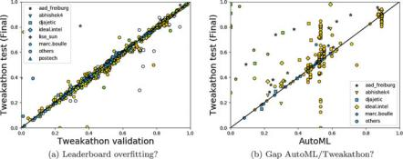{width="4.586665573053368in"
height="1.8049989063867016in"}

> **Fig.** **10.3** **Performances** **of** **all** **participants**
> **in** **the** **2015/2016** **challenge.** We show the last entry
> []{#_bookmark812 .anchor}of all participants in all phases of the
> 2015/2016 challenge on all datasets from the competition leaderboards.
> The symbols are color coded by round, as in Table
> [10.5](#_bookmark589). (**a**) **Overfitting** **in** **Tweakathons?**
> We plot the performance on the final test set vs. the performance on
> the validation set. The validation performances were visible to the
> participants on the leaderboard while they were tuning their models.
> The final test set performances were only revealed at the end of the
> Tweakathon. Except for a few outliers, most participants did not
> overfit the leaderboard. (**b**) **Gap** **between** **AutoML** **and**
> **Tweakathons?** We plot the Tweakathons vs. AutoML performance to
> visualize improvements obtained by manual tweaking and additional
> computational resources available in Tweakathons. Points above the
> diagonal indicate such improvements
>
> 198 I. Guyon et al.
>
> Round 3, all but one participant failed to turn in working solutions
> during blind testing, because of the introduction of sparse datasets.
> Fortunately, the participants recovered, and, by the end of the
> challenge, several submissions were capable of returning solutions on
> all the datasets of the challenge. But learning schemas can still be
> optimized because, even discarding Round 3, there is a 15–35%
> performance gap between AutoML phases (blind testing with
> computational constraints) and Tweakathon phases (human intervention
> and additional compute power). The GPU track offered (in round 4 only)
> a platform for trying Deep Learning methods. This allowed the
> participants to demonstrate that, given additional compute power, deep
> learning methods were competitive with the best solutions of the CPU
> track. However, no Deep Learning method was competitive with the
> limited compute power and time budget offered in the CPU track.
>
> ***10.5.2*** ***Scores*** ***Obtained*** ***in*** ***the*** ***2018***
> ***Challenge***
>
> The 2018 challenge lasted 4 months (November 30, 2017 to March 31,
> 2018). As in the previous challenge, top-ranked solutions were
> obtained and open sourced. Table [10.6](#_bookmark813) shows the
> results of both phases of the 2018 challenge. As a reminder, this
> challenge had a feedback phase and a blind test phase, the
> performances of the winners in each phase are reported.
>
> Performance in this challenge was slightly lower than that observed in
> the previous edition. This was due to the difficulty of the tasks (see
> below) and the fact that data sets in the feedback phase included
> three deceiving datasets (associated to tasks from previous
> challenges, but not necessarily similar to the data sets used in the
> blind test phase) out of five. We decided to proceed this way to
> emulate a realistic AutoML setting. Although harder, several teams
> succeeded at returning submissions performing better than chance.
>
> The winner of the challenge was the same team that won the 2015/2016
> AutoML challenge: AAD Freiburg \[[28](#_bookmark742)\]. The 2018
> challenge helped to incrementally improve the solution devised by this
> team in the previous challenge. Interestingly, the second- placed team
> in the challenge proposed a solution that is similar in spirit to that
> of the winning team. For this challenge, there was a triple tie in the
> third place, prizes

[]{#_bookmark813 .anchor}**Table** **10.6** **Results** **of** **the**
**2018** **challenge** **winners.** Each phase was run on five different
datasets. We show the winners of the AutoML (blind test) phase and for
comparison their performances in the Feedback phase. The full tables can
be found at
[https:/competitions.codalab.org/competitions/](https:/competitions.codalab.org/competitions/17767)
[17767](https:/competitions.codalab.org/competitions/17767)

  ---------------------------------------------------------------------------------------------------------- ------------------------------------------------------------------------------------------------------------------------ ---------------------------------------------------------------------------------------------------------------- -- ----------------------------------------------------------------------------------------------------------------------------------------------------------------------------------------------------------------------------------- ---------------------------------------------------------------------------------------------------------------- --
  > Ended {width="4.930008748906387e-3in" height="0.11733267716535432in"}   > **2.** **AutoML** **phase**                                                                                            > {width="4.930008748906387e-3in" height="0.11733267716535432in"} &lt; S &gt;      > **1.** **Feedback** **phase**                                                                                                                                                                                                     > {width="4.930008748906387e-3in" height="0.11733267716535432in"} &lt; S &gt;   
                                                                                                             >                                                                                                                                                                                                                                            >                                                                                                                                                                                                                                                                                                                                                    
                                                                                                             > Winners {width="4.930008748906387e-3in" height="0.11733267716535432in"} &lt; R &gt;                                                                                                                       > Ended {width="4.930008748906387e-3in" height="0.11598206474190727in"} Performance {width="4.930008748906387e-3in" height="0.11598206474190727in"} &lt; R &gt;                                                                                                                    
  ---------------------------------------------------------------------------------------------------------- ------------------------------------------------------------------------------------------------------------------------ ---------------------------------------------------------------------------------------------------------------- -- ----------------------------------------------------------------------------------------------------------------------------------------------------------------------------------------------------------------------------------- ---------------------------------------------------------------------------------------------------------------- --

  ------------ -------------------- -------- -------------------------------------- -- ------------ ---------------- -------- -------------------------------------- --
  > 03/31/18   > 1\. aad freiburg   > 2.80   > 0.4341 0.4180 0.3857 0.3874 0.3863      > 03/12/18   > aad freiburg   > 9.0    > 0.7422 0.7324 0.8029 0.6845 0.7116   
               >                    >                                                               >                >                                               
               > 2\. narnars0       > 3.80                                                          > narnars0       > 4.40                                          
               >                    >                                                               >                >                                               
               > 3\. wlWangl        > 5.40                                                          > wlWangl        > 4.40                                          
               >                    >                                                               >                >                                               
               > 3\. thanhdng       > 5.40                                                          > thanhdng       > 14.0                                          
               >                    >                                                               >                >                                               
               > 3\. Malik          > 5.40                                                          > Malik          > 13.8                                          
  ------------ -------------------- -------- -------------------------------------- -- ------------ ---------------- -------- -------------------------------------- --

> 10 Analysis of the AutoML Challenge Series 2015–2018 199

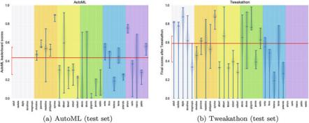{width="4.586665573053368in"
height="1.8283333333333334in"}

[]{#_bookmark814 .anchor}**Fig.** **10.4** **Distribution** **of**
**performance** **on** **the** **datasets** **of** **the** **2015/2016**
**challenge** **(violin** **plots).** We show for each dataset the
performances of participants at the end of AutoML and Tweakathon phases,
as revealed on the leaderboard. The median and quartiles are represented
by horizontal notches. The distribution profile (as fitted with a kernel
method) and its mirror image are represented vertically by the gray
shaded area. We show in red the median performance over all datasets and
the corresponding quartiles. (**a**) **AutoML** **(blind** **testing).**
The first 5 datasets were provided for development purpose only and were
not used for blind testing in an AutoML phase. In round 3, the code of
many participants failed because of computational limits. (**b**)
**Tweakathon** **(manual** **tweaking).** The last five datasets were
only used for final blind testing and the data were never revealed for a
Tweakathon. Round 3 was not particularly difficult with additional
compute power and memory

were split among the tied teams. Among the winners, two teams used the
starting kit. Most of the other teams used either the starting kit or
the solution open sourced by the AAD Freiburg team in the 2015/2016
challenge.

***10.5.3*** ***Difficulty*** ***of*** ***Datasets/Tasks***

> In this section, we assess dataset difficulty, or rather *task*
> *difficulty* since the par- ticipants had to solve prediction problems
> for given datasets, performance metrics, and computational time
> constraints. The tasks of the challenge presented a variety of
> difficulties, but those were not equally represented (Tables
> [10.2](#_bookmark806)and [10.3](#_bookmark807)):
>
> • **Categorical** **variables** **and** **missing** **data.** Few
> datasets had categorical variables in the 2015/2016 challenge (ADULT,
> ALBERT, and WALDO), and not very many variables were categorical in
> those datasets. Likewise, very few datasets had missing values (ADULT
> and ALBERT) and those included only a few missing values. So neither
> categorical variables nor missing data presented a real difficulty in
> this challenge, though ALBERT turned out to be one of the most
> difficult datasets because it was also one of the largest ones. This
> situation changed drastically for the 2018 challenge where five out of
> the ten datasets included categorical variables (RL, PM, RI, RH and
> RM) and missing values
>
> 200 I. Guyon et al.

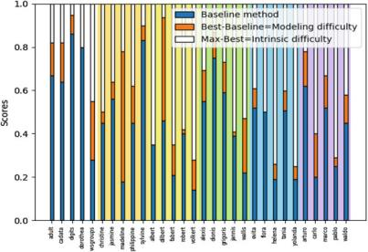{width="4.1866666666666665in"
height="2.866665573053368in"}

[]{#_bookmark815 .anchor}**Fig.** **10.5** **Difficulty** **of**
**tasks** **in** **the** **2015/2016** **challenge.** We consider two
indicators of task difficulty (dataset, metric, and time budget are
factored into the task): intrinsic difficulty (estimated by the
performance of the winners) and modeling difficulty (difference between
the performance of the winner and a baseline method, here Selective
Naive Bayes (SNB)). The best tasks should have a relatively low
intrinsic difficulty and a high modeling difficulty to separate
participants well

> (GINA, PM, RL, RI and RM). These were among the main aspects that
> caused the low performance of most methods in the blind test phase.
>
> • **Large** **number** **of** **classes.** Only one dataset had a
> large number of classes (DIONIS with 355 classes). This dataset turned
> out to be difficult for participants, particularly because it is also
> large and has unbalanced classes. However, datasets with large number
> of classes are not well represented in this challenge. HELENA, which
> has the second largest number of classes (100 classes), did not stand
> out as a particularly difficult dataset. However, in general,
> multi-class problems were found to be more difficult than binary
> classification problems.
>
> • **Regression.** We had only four regression problems: CADATA, FLORA,
> YOLANDA, PABLO.
>
> • **Sparse** **data.** A significant number of datasets had sparse data
> (DOROTHEA, FABERT, ALEXIS, WALLIS, GRIGORIS, EVITA, FLORA, TANIA,
> ARTURO, MARCO). Several of them turned out to be difficult,
> particularly ALEXIS, WALLIS, and GRIGORIS, which are large datasets in
> sparse format, which cause memory problems when they were introduced
> in round 3 of the 2015/2016 challenge. We later increased the amount
> of memory on the servers and similar datasets introduced in later
> phases caused less difficulty.
>
> • **Large** **datasets.** We expected the ratio of the number N of
> features over the number Ptr of training examples to be a particular
> difficulty (because of the risk
>
> 10 Analysis of the AutoML Challenge Series 2015–2018 201

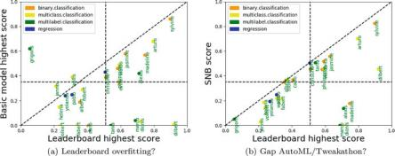{width="4.606665573053369in"
height="1.8216666666666668in"}

[]{#_bookmark816 .anchor}**Fig.** **10.6** **Modeling** **Difficulty**
**vs.** **intrinsic** **difficulty**. For the AutoML phases of the
2015/2016 challenge, we plot an indicator of modeling difficulty vs. and
indicator of intrinsic difficulty of datasets (leaderboard highest
score). (**a**) Modeling difficulty is estimated by the score of the best
untuned model (over KNN, NaiveBayes, RandomForest and SGD (LINEAR)).
(**b**) Modeling difficulty is estimated by the score of the Selective
Naive Bayes (SNB) model. In all cases, higher scores are better and
negative/NaN scores are replaced by zero. The horizontal and vertical
separation lines represent the medians. The lower right quadrant
represents the datasets with low intrinsic difficulty and high modeling
difficulty: those are the best datasets for benchmarking purposes

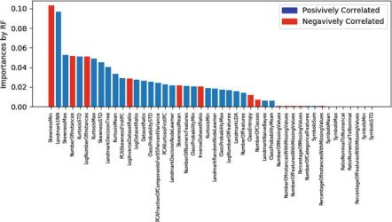{width="4.586665573053368in"
height="2.5899989063867017in"}

[]{#_bookmark817 .anchor}**Fig.** **10.7** **Meta-features** **most**
**predictive** **of** **dataset** **intrinsic** **difficulty**
**(2015/2016** **challenge** **data).** Meta-feature GINI importances
are computed by a random forest regressor, trained to predict the
highest participant leaderboard score using meta-features of datasets.
Description of these meta-features can be found in Table 1 of the
supplementary material of [\[25](#_bookmark741)\]. Blue and red colors
respectively correspond to positive and negative correlations (Pearson
correlations between meta features and score medians)

{width="1.418332239720035in"
height="6.944444444444444e-3in"}

> 202 I. Guyon et al.
>
> of overfitting), but modern machine learning algorithm are robust
> against over- fitting. The main difficulty was rather the PRODUCT N \*
> Ptr . Most participants attempted to load the entire dataset in memory
> and convert sparse matrices into full matrices. This took very long
> and then caused loss in performances or pro- gram failures. Large
> datasets with N \*Ptr &gt; 20. 106 include ALBERT, **ALEXIS**, DIONIS,
> **GRIGORIS,** **WALLIS,** **EVITA,** **FLORA,** **TANIA,** **MARCO**,
> GINA, GUILLERMO, PM, RH, RI, RICCARDO, RM. Those overlap significantly
> with the datasets with sparse data (in bold). For the 2018 challenge,
> all data sets in the final phase exceeded this threshold, and this was
> the reason of why the code from several teams failed to finish within
> the time budget. Only ALBERT and DIONIS were “truly” large (few
> features, but over 400,000 training examples).
>
> • **Presence** **of** **probes:** Some datasets had a certain
> proportion of distractor features or irrelevant variables (probes).
> Those were obtained by randomly permuting the values of real features.
> Two-third of the datasets contained probes ADULT, CADATA, DIGITS,
> DOROTHEA, CHRISTINE, JASMINE, MADELINE, PHILIPPINE, SYLVINE, ALBERT,
> DILBERT, FABERT, JAN- NIS, EVITA, FLORA, YOLANDA, ARTURO, CARLO,
> PABLO, WALDO. This allowed us in part to make datasets that were in
> the public domain less recognizable.
>
> • **Type** **of** **metric:** We used six metrics, as defined in
> Sect.[10.4.2](#_bookmark733). The distribution of tasks in which they
> were used was not uniform: BAC (11), AUC (6), F1 (3), and PAC (6) for
> classification, and R2 (2) and ABS (2) for regression. This is because
> not all metrics lend themselves naturally to all types of
> applications.
>
> • **Time** **budget:** Although in round 0 we experimented with giving
> different time budgets for the various datasets, we ended up assigning
> 1200 s (20 min) to all datasets in all other rounds. Because the
> datasets varied in size, this put more constraints on large datasets.
>
> • **Class** **imbalance:** This was not a difficulty found in the
> 2015/2016 datasets. However, extreme class imbalance was the main
> difficulty for the 2018 edition. Imbalance ratios lower or equal to 1–
> 10 were present in RL, PM, RH, RI, and **RM** datasets, in the latter
> data set class imbalance was as extreme as 1– 1000. This was the
> reason why the performance of teams was low.
>
> Fig. [10.4](#_bookmark814)gives a first view of dataset/task difficulty
> for the 2015/2016 challenge. It captures, in a schematic way, the
> distribution of the participants’ performance in all rounds on test
> data, in both AutoML and Tweakathon phases. One can see that the
> median performance over all datasets improves between AutoML and
> Tweakathon, as can be expected. Correspondingly, the average spread in
> performance (quartile)
>
> decreases. Let us take a closer look at the AutoML phases: The
> “accident” of round 3 in which many methods failed in blind testing is
> visible (introduction of sparse matrices and larger
> datasets).[9](#_bookmark818)Round 2 (multi-class classification)
> appears to have also introduced a significantly higher degree of
> difficulty than round 1 (binary
>
> []{#_bookmark818 .anchor}9Examples of sparse datasets were provided in
> round 0, but they were of smaller size.

{width="1.418332239720035in"
height="6.944444444444444e-3in"}

> 10 Analysis of the AutoML Challenge Series 2015–2018 203
>
> classification). In round 4, two regression problems were introduced
> (FLORA and YOLANDA), but it does not seem that regression was found
> significantly harder than multiclass classification. In round 5 no
> novelty was introduced. We can observe that, after round 3, the
> dataset median scores are scattered around the overall median. Looking
> at the corresponding scores in the Tweakathon phases, one can remark
> that, once the participants recovered from their surprise, round 3 was
> not particularly difficult for them. Rounds 2 and 4 were comparatively
> more difficult.

For the datasets used in the 2018 challenge, the tasks’ difficulty was
clearly associated with extreme class imbalance, inclusion of
categorical variables and high dimensionality in terms of N × Ptr .
However, for the 2015/2016 challenge data sets we found that it was
generally difficult to guess what makes a task easy or hard, except for
dataset size, which pushed participants to the frontier of the hardware
capabilities and forced them to improve the computational efficiency of
their methods. Binary classification problems (and multi-label problems)
are intrinsically “easier” than multiclass problems, for which
“guessing” has a lower probability of success. This partially explains
the higher median performance in rounds 1 and 3, which are dominated by
binary and multi-label classification problems. There is not a large
enough number of datasets illustrating each type of other difficulties to
draw other conclusions.

> We ventured however to try to find summary statistics capturing overall
> takes difficulty. If one assumes that data are generated from an
> *i.i.d.*[10](#_bookmark819)process of the type:
>
> y = F(**x**,noise)
>
> where y is the target value, **x** is the input feature vector, F is a
> function, and noise is some random noise drawn from an unknown
> distribution, then the difficulty of the learning problem can be
> separated in two aspects:
>
> 1\. **Intrinsic** **difficulty**, linked to the amount of noise or the
> signal to noise ratio. Given an infinite amount of data and an unbiased
> learning machine
> {width="8.81408573928259e-2in"
> height="0.13020450568678915in"} capable of identifying F , the
> prediction performances cannot exceed a given maximum value,
> corresponding to
> {width="8.81408573928259e-2in"
> height="0.13020450568678915in"} = F .
>
> 2\. **Modeling** **difficulty**, linked to the bias and variance of
> estimators
> {width="8.81408573928259e-2in"
> height="0.13020450568678915in"}, in connection with the limited amount
> of training data and limited computational resources, and the possibly
> large number or parameters and hyper-parameters to estimate.
>
> Evaluating the intrinsic difficulty is impossible unless we know F .
> Our best approximation of F is the winners’ solution. **We** **use**
> **therefore** **the** **winners’** **performance** **as** **an**
> **estimator** **of** **the** **best** **achievable** **performance.**
> This estimator may have both bias and variance: it is possibly biased
> because the winners may be under-fitting training data; it may have
> variance because of the limited amount of
>
> []{#_bookmark819 .anchor}10Independently and Identically Distributed
> samples.
>
> 204 I. Guyon et al.
>
> test data. Under-fitting is difficult to test. Its symptoms may be that
> the variance or the entropy of the predictions is less than those of
> the target values.

Evaluating the modeling difficulty is also impossible unless we know F
and the model class. In the absence of knowledge on the model class,
data scientists often use generic predictive models, agnostic with
respect to the data generating process. Such models range from very
basic models that are highly biased towards “simplicity” and smoothness
of predictions (e.g., regularized linear models) to highly versatile
unbiased models that can learn any function given enough data (e.g.,
ensembles of decision trees). To indirectly assess modeling difficulty,
we resorted to use the difference in performance between *the* *method*
*of* *the* *challenge* *winner* and that of (a) the best of four
“untuned” basic models (taken from classical techniques provided in the
scikit-learn library \[[55](#_bookmark739)\] with default
hyper-parameters) or (b) Selective Naive Bayes (SNB)
\[[12](#_bookmark820), [13](#_bookmark821)\], a highly regularized model
(biased towards simplicity), providing a very robust and simple
baseline.

> Figs. [10.5](#_bookmark815) and [10.6](#_bookmark816) give
> representations of our estimates of intrinsic and modeling difficulties
> for the 2015/2016 challenge datasets. It can be seen that the datasets
> of round 0 were among the easiest (except perhaps NEWSGROUP). Those
> were relatively small (and well-known) datasets. Surprisingly, the
> datasets of round 3 were also rather easy, despite the fact that most
> participants failed on them when they were introduced (largely because
> of memory limitations: scikit- learn algorithms were not optimized for
> sparse datasets and it was not possible to fit in memory the data
> matrix converted to a dense matrix). Two datasets have a small
> intrinsic difficulty but a large modeling difficulty: MADELINE and
> DILBERT. MADELINE is an artificial dataset that is very non-linear
> (clusters or 2 classes positioned on the vertices of a hyper-cube in a
> 5 dimensional space) and therefore very difficult for Naïve Bayes.
> DILBERT is an image recognition dataset with images of objects rotated
> in all sorts of positions, also very difficult for Naïve Bayes. The
> datasets of the last 2 phases seem to have a large intrinsic difficulty
> compared to the modeling difficulty. But this can be deceiving because
> the datasets are new to the machine learning community and the
> performances of the winners may still be far from the best attainable
> performance.
>
> We attempted to predict the intrinsic difficulty (as measured by the
> winners’ performance) from the set of meta features used by AAD
> Freiburg for meta- learning \[[25](#_bookmark741)\], which are part of
> OpenML \[[67](#_bookmark822)\], using a Random Forest classifier and
> ranked the meta features in order of importance (most selected by RF).
> The list of meta features is provided in the online appendix. The
> three meta-features that predict dataset difficulty best
> (Fig.[10.7](#_bookmark817)) are:
>
> • LandmarkDecisionTree: performance of a decision tree classifier.
>
> • Landmark1NN: performance of a nearest neighbor classifier.
>
> • SkewnessMin: min over skewness of all features. Skewness measures
> the symmetry of a distribution. A positive skewness value means that
> there is more weight in the left tail of the distribution.

{width="1.418332239720035in"
height="6.944444444444444e-3in"}

> 10 Analysis of the AutoML Challenge Series 2015–2018 205
>
> ***10.5.4*** ***Hyper-parameter*** ***Optimization***

Many participants used the scikit-learn (sklearn) package, including the
winning group AAD Freiburg, which produced the auto-sklearn software. We
used the auto-sklearn API to conduct post-challenge systematic studies
of the effectiveness of hyper-parameter optimization. We compared the
performances obtained with default hyper-parameter settings in
scikit-learn and with hyper-parameters opti- mized with
auto-sklearn,[11](#_bookmark823) both within the time budgets as imposed
during the challenge, for four “representative” basic methods: k-nearest
neighbors (KNN), naive Bayes (NB), Random Forest (RF), and a linear
model trained with stochastic gradient descent
(SGD-linear[12](#_bookmark824)). The results are shown in
Fig.[10.8](#_bookmark825). We see that hyper-parameter optimization
usually improves performance, but not always. The advantage of
hyper-parameter tuning comes mostly from its flexibility of switching the
optimization metric to the one imposed by the task and from finding
hyper- parameters that work well given the current dataset and metric.
However, in some cases it was not possible to perform hyper-parameter
optimization within the time budget due to the data set size (score ≤
0). Thus, there remains future work on how

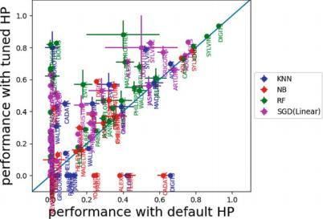{width="4.179998906386702in"
height="2.834998906386702in"}

> []{#_bookmark825 .anchor}**Fig.** **10.8** **Hyper-parameter**
> **tuning** **(2015/2016** **challenge** **data).** We compare the
> performances obtained with default hyper-parameters and those with
> hyper-parameters optimized with auto- sklearn, within the same time
> budgets as given during the challenge. The performances of predictors
> which failed to return results in the allotted time are replaced by
> zero. Note that returning a prediction of chance level also resulted
> in a score of zero
>
> [[]{#_bookmark824 .anchor}]{#_bookmark823 .anchor}11We use sklearn 0.
> 16. 1 and auto-sklearn 0.4.0 to mimic the challenge environment.
>
> 12We set the loss of SGD to be ‘log’ in scikit-learn for these
> experiments.
>
> 206 I. Guyon et al.
>
> to perform thorough hyper-parameter tuning given rigid time
> constraints and huge datasets (Fig.[10.8](#_bookmark825)).
>
> We also compared the performances obtained with different scoring
> metrics (Fig.[10.9](#_bookmark826)). Basic methods do not give a
> choice of metrics to be optimized, but auto- sklearn post-fitted the
> metrics of the challenge tasks. Consequently, when “common metrics”
> (BAC and R2) are used, the method of the challenge winners, which is
> not optimized for BAC/R2, does not usually outperform basic methods.
> Conversely, when the metrics of the challenge are used, there is often
> a clear gap between the basic methods and the winners, but not always
> (RF-auto usually shows a comparable performance, sometimes even
> outperforms the winners).
>
> ***10.5.5*** ***Meta-learning***

One question is whether meta-learning \[[14](#_bookmark827)\] is
possible, that is learning to predict whether a given classifier will
perform well on future datasets (without actually training it), based on
its past performances on other datasets. We investigated whether it is
possible to predict which basic method will perform best based on the
meta-learning features of auto-sklearn (see the online appendix). We
removed the “Landmark” features from the set of meta features because
those are performances of basic predictors (albeit rather poor ones with
many missing values), which would lead to a form of “data leakage” .

> We used four basic predictors:

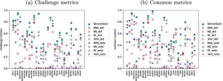{width="4.606665573053369in"
height="1.67in"}

> **Fig.** **10.9** **Comparison** **of** **metrics** **(2015/2016**
> **challenge).** (**a**) We used the metrics of the []{#_bookmark826
> .anchor}challenge. (**b**) We used the normalized balanced accuracy
> for all classification problems and the R2 metric for regression
> problems. By comparing the two figures, we can see that the winner
> remains top-ranking in most cases, regardless of the metric. There is
> no basic method that dominates all others. Although RF-auto (Random
> Forest with optimized HP) is very strong, it is sometimes outperformed
> by other methods. Plain linear model SGD-def sometimes wins when
> common metrics are used, but the winners perform better with the
> metrics of the challenge. Overall, the technique of the winners proved
> to be effective
>
> 10 Analysis of the AutoML Challenge Series 2015–2018 207

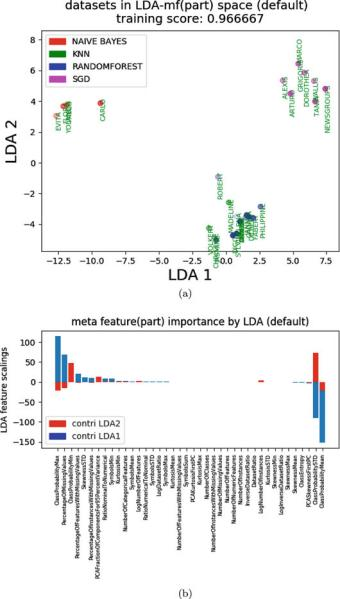{width="3.5327777777777776in"
height="6.222346894138233in"}

[]{#_bookmark828 .anchor}**Fig.** **10.10** **Linear** **discriminant**
**analysis.** (**a**) **Dataset** **scatter** **plot** **in**
**principal** **axes**. We have trained a LDA using X = meta features,
except landmarks; y = which model won of four basic models (NB,
SGD-linear, KNN, RF). The performance of the basic models is measured
using the common metrics. The models were trained with default
hyper-parameters. In the space of the two first LDA components, each
point represents one dataset. The colors denote the winning basic
models. The opacity reflects the scores of the corresponding winning
model (more opaque is better). (**b**) **Meta** **feature**
**importances** computed as scaling factors of each LDA component

> 208 I. Guyon et al.
>
> • NB: Naive Bayes
>
> • SGD-linear: Linear model (trained with stochastic gradient descent)
>
> • KNN: K-nearest neighbors
>
> • RF: Random Forest
>
> We used the implementation of the scikit-learn library with default
> hyper-parameter settings. In Fig.[10.10](#_bookmark828), we show the
> two first Linear Discriminant Analysis (LDA) components, when training
> an LDA classifier on the meta-features to predict which basic classifier
> will perform best. The methods separate into three distinct clusters,
> one of them grouping the non-linear methods that are poorly separated
> (KNN and RF) and the two others being NB and linear-SGD.
>
> The features that are most predictive all have to do with
> “ClassProbability” and “PercentageOfMissingValues”, indicating that
> the class imbalance and/or large number of classes (in a multi-class
> problem) and the percentage of missing values might be important, but
> there is a high chance of overfitting as indicated by an unstable
> ranking of the best features under resampling of the training data.
>
> ***10.5.6*** ***Methods*** ***Used*** ***in*** ***the***
> ***Challenges***

A brief **description** **of** **methods** used in both challenges is
provided in the online appendix, together with the results of a survey
on methods that we conducted after the challenges. In light of the
overview of Sect.[10.2](#_bookmark751) and the results presented in the
previous section, we may wonder whether a dominant methodology for
solving the AutoML problem has emerged and whether particular technical
solutions were widely adopted. In this section we call “model space” the
set of all models under consideration. We call “basic models” (also
called elsewhere “simple models”, “individual models”, “base learners”)
the member of a library of models from which our hyper-models of model
ensembles are built.

> **Ensembling:** **dealing** **with** **over-fitting** **and**
> **any-time** **learning** Ensembling is the big AutoML challenge
> series winner since it is used by over 80% of the participants and by
> all the top-ranking ones. While a few years ago the hottest issue in
> model selection and hyper-parameter optimization was over-fitting, in
> present days the problem seems to have been largely avoided by using
> ensembling techniques. In the 2015/2016 challenge, we varied the ratio
> of number of training examples over number of variables (Ptr/N) by
> several orders of magnitude. Five datasets had a ratio Ptr/N lower
> than one (dorothea, newsgroup, grigoris, wallis, and flora), which is a
> case lending itself particularly to over-fitting. Although Ptr/N is the
> most predictive variable of the median performance of the
> participants, there is no indication that the datasets with Ptr/N &lt;
> 1 were particularly difficult for the partic- ipants
> (Fig.[10.5](#_bookmark815)). Ensembles of predictors have the
> additional benefit of addressing in a simple way the “any-time
> learning” problem by growing progressively a bigger ensemble of
> predictors, improving performance over time. All trained predictors
> are usually incorporated in the ensemble. For instance, if
> cross-validation is used, the
>
> 10 Analysis of the AutoML Challenge Series 2015–2018 209

predictors of all folds are directly incorporated in the ensemble, which
saves the computational time of retraining a single model on the best HP
selected and may yield more robust solutions (though slightly more
biased due to the smaller sample size). The approaches differ in the way
they weigh the contributions of the various predictors. Some methods use
the same weight for all predictors (this is the case of bagging methods
such as Random Forest and of Bayesian methods that sample predictors
according to their posterior probability in model space). Some methods
assess the weights of the predictors as part of learning (this is the
case of boosting methods, for instance). One simple and effective method
to create ensembles of heterogeneous models was proposed by
\[[16](#_bookmark764)\]. It was used successfully in several past
challenges, e.g., \[[52](#_bookmark829)\] and is the method implemented
by the aad\_freibug team, one of the strongest participants in both
challenges \[[25](#_bookmark741)\]. The method consists in cycling
several times over all trained model and incorporating in the ensemble
at each cycle the model which most improves the performance of the
ensemble. Models vote with weight 1, but they can be incorporated
multiple times, which de facto results in weighting them. This method
permits to recompute very fast the weights of the models if
cross-validated predictions are saved. Moreover, the method allows
optimizing the ensemble for any metric by post-fitting the predictions of
the ensemble to the desired metric (an aspect which was important in
this challenge).

**Model** **evaluation:** **cross-validation** **or** **simple**
**validation** Evaluating the pre- dictive accuracy of models is a
critical and necessary building block of any model selection of
ensembling method. Model selection criteria computed from the predictive
accuracy of basic models evaluated from training data, by training a
single time on all the training data (possibly at the expense of minor
additional calculations), such as performance bounds, were not used at
all, as was already the case in previous challenges we organized
\[[35](#_bookmark830)\]. Cross-validation was widely used, particularly
K-fold cross-validation. However, basic models were often “cheaply”
evaluated on just one fold to allow quickly discarding non-promising
areas of model space. This is a technique used more and more frequently
to help speed up search. Another speed-up strategy is to train on a
subset of the training examples and monitor the learning curve. The
“freeze-thaw” strategy \[[64](#_bookmark794)\] halts training of models
that do not look promising on the basis of the learning curve, but may
restart training them at a later point. This was used, e.g., by
\[[48](#_bookmark831)\] in the 2015/2016 challenge.

**Model** **space:** **Homogeneous** **vs.** **heterogeneous** An
unsettled question is whether one should search a large or small model
space. The challenge did not allow us to give a definite answer to this
question. Most participants opted for searching a relatively large model
space, including a wide variety of models found in the scikit- learn
library. Yet, one of the strongest entrants (the Intel team) submitted
results simply obtained with a boosted decision tree (i.e., consisting
of a homogeneous set of weak learners/basic models). Clearly, it suffices
to use just one machine learning approach that is a universal
approximator to be able to learn anything, given enough training data.
So why include several? It is a question of rate of convergence: how
fast we climb the learning curve. Including stronger basic models is one
way to climb the learning curve faster. Our post-challenge experiments
(Fig.[10.9](#_bookmark826)) reveal

> 210 I. Guyon et al.
>
> that the scikit-learn version of Random Forest (an ensemble of
> homogeneous basic models—decision trees) does not usually perform as
> well as the winners’ version, hinting that there is a lot of know-how
> in the Intel solution, which is also based on ensembles of decision
> tree, that is not captured by a basic ensemble of decision trees such
> as RF. We hope that more principled research will be conducted on this
> topic in the future.

**Search** **strategies:** **Filter,** **wrapper,** **and** **embedded**
**methods** With the availability of powerful machine learning toolkits
like scikit-learn (on which the starting kit was based), the temptation
is great to implement **all-wrapper** **methods** to solve the CASH (or
“full model selection”) problem. Indeed, most participants went that
route. Although a number of ways of optimizing hyper-parameters with
**embedded** **methods** for several basic classifiers have been
published \[[35](#_bookmark830)\], they each require changing the
implementation of the basic methods, which is time-consuming and
error-prone compared to using already debugged and well-optimized
library version of the methods. Hence practitioners are reluctant to
invest development time in the implementation of embedded methods. A
notable exception is the software of marc .boulle, which offers a
self-contained hyper-parameter free solution based on Naive Bayes, which
includes re-coding of variables (grouping or discretization) and
variable selection. See the online appendix.

**Multi-level** **optimization** Another interesting issue is whether
multiple levels of hyper-parameters should be considered for reasons of
computational effectiveness or overfitting avoidance. In the Bayesian
setting, for instance, it is quite feasible to consider a hierarchy of
parameters/hyper-parameters and several levels of priors/hyper-priors.
However, it seems that for practical computational reasons, in the
AutoML challenges, the participants use a shallow organization of hyper-
parameter space and avoid nested cross-validation loops.

**Time** **management:** **Exploration** **vs.** **exploitation**
**tradeoff** With a tight time budget, efficient search strategies must
be put into place to monitor the explo- ration/exploitation tradeoff. To
compare strategies, we show in the online appendix learning curves for
two top ranking participants who adopted very different methods:
*Abhishek* and *aad\_freiburg*. The former uses heuristic methods based
on prior human experience while the latter initializes search with
models predicted to be best suited by meta-learning, then performs
Bayesian optimization of hyper- parameters. *Abhishek* seems to often
start with a better solution but explores less effectively. In contrast,
*aad\_freiburg* starts lower but often ends up with a better solution.
Some elements of randomness in the search are useful to arrive at better
solutions.

**Preprocessing** **and** **feature** **selection** The datasets had
intrinsic difficulties that could be in part addressed by preprocessing
or special modifications of algorithms: sparsity, missing values,
categorical variables, and irrelevant variables. Yet it appears that
among the top-ranking participants, preprocessing has not been a focus
of attention. They relied on the simple heuristics provided in the
starting kit: replacing missing values by the median and adding a
missingness indicator variable,

> 10 Analysis of the AutoML Challenge Series 2015–2018 211
>
> one-hot-encoding of categorical variables. Simple normalizations were
> used. The irrelevant variables were ignored by 2/3 of the participants
> and no use of feature selection was made by top-ranking participants.
> The methods used that involve ensembling seem to be intrinsically
> robust against irrelevant variables. More details from the fact sheets
> are found in the online appendix.
>
> **Unsupervised** **learning** Despite the recent regain of interest in
> unsupervised learning spurred by the Deep Learning community, in the
> AutoML challenge series, unsupervised learning is not widely used,
> except for the use of classical space dimensionality reduction
> techniques such as ICA and PCA. See the online appendix for more
> details.
>
> **Transfer** **learning** **and** **meta** **learning** To our
> knowledge, only *aad\_freiburg* relied on meta-learning to initialize
> their hyper-parameter search. To that end, they used datasets of
> OpenML.[13](#_bookmark832) The number of datasets released and the
> diversity of tasks did not allow the participants to perform effective
> transfer learning or meta learning.
>
> **Deep** **learning** The type of computations resources available in
> AutoML phases ruled out the use of Deep Learning, except in the GPU
> track. However, even in that track, the Deep Learning methods did not
> come out ahead. One exception is *aad\_freiburg*, who used Deep
> Learning in Tweakathon rounds three and four and found it to be
> helpful for the datasets Alexis, Tania and Yolanda.
>
> **Task** **and** **metric** **optimization** There were four types of
> tasks (regression, binary classification, multi-class classification,
> and multi-label classification) and six scoring metrics (R2, ABS, BAC,
> AUC, F1, and PAC). Moreover, class balance and number of classes
> varied a lot for classification problems. Moderate effort has been put
> into designing methods optimizing specific metrics. Rather, generic
> methods were used and the outputs post-fitted to the target metrics by
> cross-validation or through the ensembling method.
>
> **Engineering** One of the big lessons of the AutoML challenge series
> is that most methods fail to return results in all cases, not a “good”
> result, but “any” reasonable result. Reasons for failure include “out
> of time” and “out of memory” or various other failures (e.g.,
> numerical instabilities). We are still very far from having “basic
> models” that run on all datasets. One of the strengths of auto-sklearn
> is to ignore those models that fail and generally find at least one
> that returns a result.
>
> **Parallelism** The computers made available had several cores, so in
> principle, the participants could make use of parallelism. One common
> strategy was just to rely on numerical libraries that internally use
> such parallelism automatically. The *aad\_freiburg* team used the
> different cores to launch in parallel model search for different
> datasets (since each round included five datasets). These different
> uses of []{#_bookmark832 .anchor}computational resources are visible
> in the learning curves (see the online appendix).
>
> 212 I. Guyon et al.
>
> **10.6** **Discussion**

We briefly summarize the main questions we asked ourselves and the main
findings:

> 1\. **Was** **the** **provided** **time** **budget** **sufficient** **to**
> **complete** **the** **tasks** **of** **the** **challenge?** We drew
> learning curves as a function of time for the winning solution of
> aad\_freiburg (auto-sklearn, see the online appendix). This revealed
> that for most datasets, performances still improved well beyond the time
> limit imposed by the organizers. Although for about half the datasets
> the improvement is modest (no more that 20% of the score obtained at the
> end of the imposed time limit), for some datasets the improvement was
> very large (more than 2× the original score). The improvements are
> usually gradual, but sudden performance improvements occur. For
> instance, for Wallis, the score doubled suddenly at 3 × the time limit
> imposed in the challenge. As also noted by the authors of the auto-
> sklearn package \[[25](#_bookmark741)\], it has a slow start but in the
> long run gets performances close to the best method.
>
> 2\. **Are** **there** **tasks** **that** **were** **significantly**
> **more** **difficult** **than** **others** **for** **the**
> **participants?** Yes, there was a very wide range of difficulties for
> the tasks as revealed by the dispersion of the participants in terms of
> average (median) and variability (third quartile) of their scores.
> Madeline, a synthetic dataset featuring a very non-linear task, was very
> difficult for many participants. Other difficulties that caused failures
> to return a solution included large memory requirements (particularly
> for methods that attempted to convert sparse matrices to full matrices),
> and short time budgets for datasets with large number of training
> examples and/or features or with many classes or labels.
>
> 3\. **Are** **there** **meta-features** **of** **datasets** **and**
> **methods** **providing** **useful** **insight** **to** **recommend**
> **certain** **methods** **for** **certain** **types** **of**
> **datasets?** The *aad\_freiburg* team used a subset of 53 meta-features
> (a superset of the simple statistics provided with the challenge
> datasets) to measure similarity between datasets. This allowed them to
> conduct hyper-parameter search more effectively by initializing the
> search with settings identical to those selected for similar datasets
> previously processed (a form of meta-learning). Our own analysis
> revealed that it is very difficult to predict the predictors’
> performances from the meta- features, but it is possible to predict
> relatively accurately which “basic method” will perform best. With LDA,
> we could visualize how datasets recoup in two dimensions and show a
> clean separation between datasets “preferring” Naive Bayes, linear SGD,
> or KNN, or RF. This deserves further investigation.
>
> 4\. **Does** **hyper-parameter** **optimization** **really** **improve**
> **performance** **over** **using** **default** **values?** The
> comparison we conducted reveals that optimizing hyper- parameters rather
> than choosing default values for a set of four basic predictive models
> (K-nearest neighbors, Random Forests, linear SGD, and Naive Bayes) is
> generally beneficial. In the majority of cases (but not always),
> hyper-parameter optimization (hyper-opt) results in better performances
> than default values.
>
> 10 Analysis of the AutoML Challenge Series 2015–2018 213
>
> Hyper-opt sometimes fails because of time or memory limitations, which
> gives room for improvement.
>
> 5\. **How** **do** **winner’s** **solutions** **compare** **with**
> **basic** **scikit-learn** **models?** They compare favorably. For
> example, the results of basic models whose parameters have been
> optimized do not yield generally as good results as running auto-
> sklearn. However, a basic model with default HP sometimes outperforms
> this same model tuned by auto-sklearn.
>
> **10.7** **Conclusion**
>
> We have analyzed the results of several rounds of AutoML challenges.
>
> Our design of the first AutoML challenge (2015/2016) was satisfactory
> in many respects. In particular, we attracted a large number of
> participants (over 600), attained results that are statistically
> significant, and advanced the state of the art to automate machine
> learning. Publicly available libraries have emerged as a result of
> this endeavor, including auto-sklearn.

In particular, we designed a benchmark with a large number of diverse
datasets, with large enough test sets to separate top-ranking
participants. It is difficult to anticipate the size of the test sets
needed, because the error bars depend on the performances attained by
the participants, so we are pleased that we made reasonable guesses. Our
simple rule-of-thumb “N = 50/E” where N is the number of test samples
and E the error rate of the smallest class seems to be widely
applicable. We made sure that the datasets were neither too easy nor too
hard. This is important to be able to separate participants. To quantify
this, we introduced the notion of “intrinsic difficulty” and “modeling
difficulty” . Intrinsic difficulty can be quantified by the performance of
the best method (as a surrogate for the best attainable performance,
i.e., the Bayes rate for classification problems). Modeling difficulty can
be quantified by the spread in performance between methods. Our best
problems have relatively low “intrinsic difficulty” and high “modeling
difficulty” . However, the diversity of the 30 datasets of our first
2015/2016 challenge is both a feature and a curse: it allows us to test
the robustness of software across a variety of situations, but it makes
meta-learning very difficult, if not impossible. Consequently, external
meta-learning data must be used if meta-learning is to be explored. This
was the strategy adopted by the AAD Freiburg team, which used the OpenML
data for meta training. Likewise, we attached different metrics to each
dataset. This contributed to making the tasks more realistic and more
difficult, but also made meta-learning harder. In the second 2018
challenge, we diminished the variety of datasets and used a single
metric.

> With respect to task design, we learned that the devil is in the
> details. The challenge participants solve exactly the task proposed to
> the point that their solution may not be adaptable to seemingly
> similar scenarios. In the case of the AutoML challenge, we pondered
> whether the metric of the challenge should be the area under the
> learning curve or one point on the learning curve (the performance
> obtained after
>
> 214 I. Guyon et al.

a fixed maximum computational time elapsed). We ended up favoring the
second solution for practical reasons. Examining after the challenge the
learning curves of some participants, it is quite clear that the two
problems are radically different, particularly with respect to
strategies mitigating “exploration” and “exploitation” . This prompted
us to think about the differences between “fixed time” learning (the
participants know in advance the time limit and are judged only on the
solution delivered at the end of that time) and “any time learning” (the
participants can be stopped at any time and asked to return a solution).
Both scenarios are useful: the first one is practical when models must be
delivered continuously at a rapid pace, e.g. for marketing applications;
the second one is practical in environments when computational resources
are unreliable and interruption may be expected (e.g. people working
remotely via an unreliable connection). This will influence the design of
future challenges.

The two versions of AutoML challenge we have run differ in the difficulty
of transfer learning. In the 2015/2016 challenge, round 0 introduced a
sample of all types of data and difficulties (types of targets, sparse
data or not, missing data or not, categorical variables of not, more
examples than features or not). Then each round ramped up difficulty. The
datasets of round 0 were relatively easy. Then at each round, the code
of the participants was blind-tested on data that were one notch harder
than in the previous round. Hence transfer was quite hard. In the 2018
challenge, we had 2 phases, each with 5 datasets of similar difficulty
and the datasets of the first phase were each matched with one
corresponding dataset on a similar task. As a result, transfer was made
simpler.

Concerning the starting kit and baseline methods, we provided code that
ended up being the basis of the solution of the majority of participants
(with notable exceptions from industry such as Intel and Orange who used
their own “in house” packages). Thus, we can question whether the
software provided biased the approaches taken. Indeed, all participants
used some form of ensemble learning, similarly to the strategy used in
the starting kit. However, it can be argued that this is a “natural”
strategy for this problem. But, in general, the question of providing
enough starting material to the participants without biasing the
challenge in a particular direction remains a delicate issue.

From the point of view of challenge protocol design, we learned that it
is difficult to keep teams focused for an extended period of time and go
through many challenge phases. We attained a large number of
participants (over 600) over the whole course of the AutoML challenge,
which lasted over a year (2015/2016) and was punctuated by several
events (such as hackathons). However, it may be preferable to organize
yearly events punctuated by workshops. This is a natural way of
balancing competition and cooperation since workshops are a place of
exchange. Participants are naturally rewarded by the recognition they
gain via the system of scientific publications. As a confirmation of this
conjecture, the second instance of the AutoML challenge (2017/2018)
lasting only 4 months attracted nearly 300 participants.

> One important novelty of our challenge design was code submission.
> Having the code of the participants executed on the same platform
> under rigorously similar conditions is a great step towards fairness
> and reproducibility, as well as ensuring the
>
> 10 Analysis of the AutoML Challenge Series 2015–2018 215

viability of solution from the computational point of view. We required
the winners to release their code under an open source licence to win
their prizes. This was good enough an incentive to obtain several
software publications as the “product” of the challenges we organized.
In our second challenge (AutoML 2018), we used Docker. Distributing
Docker images makes it possible for anyone downloading the code of the
participants to easily reproduce the results without stumbling over
installation problems due to inconsistencies in computer environments
and libraries. Still the hardware may be different and we find that, in
post-challenge evaluations, changing computers may yield significant
differences in results. Hopefully, with the proliferation of affordable
cloud computing, this will become less of an issue.

> The AutoML challenge series is only beginning. Several new avenues are
> under study. For instance, we are preparing the NIPS 2018 Life Long
> Machine Learning challenge in which participants will be exposed to
> data whose distribution slowly drifts over time. We are also looking
> at a challenge of automated machine learning where we will focus on
> transfer from similar domains.

**Acknowledgements** Microsoft supported the organization of this
challenge and donated the prizes and cloud computing time on Azure. This
project received additional support from the Laboratoire d’Informatique
Fondamentale (LIF, UMR CNRS 7279) of the University of Aix Marseille,
France, via the LabeX Archimede program, the Laboratoire de Recheche en
Informa- tique of Paris Sud University, and INRIA-Saclay as part of the
TIMCO project, as well as the support from the Paris-Saclay Center for
Data Science (CDS). Additional computer resources were provided
generously by J. Buhmann, ETH Zürich. This work has been partially
supported by the Spanish project TIN2016-74946-P (MINECO/FEDER, UE) and
CERCA Programme/Generalitat de Catalunya. The datasets released were
selected among 72 datasets that were donated (or formatted using data
publicly available) by the co-authors and by: Y. Aphinyanaphongs, O.
Chapelle, Z. Iftikhar Malhi, V. Lemaire, C.-J. Lin, M. Madani, G.
Stolovitzky, H.-J. Thiesen, and I. Tsamardinos. Many people provided
feedback to early designs of the protocol and/or tested the challenge
platform, including: K. Bennett, C. Capponi, G. Cawley, R. Caruana, G.
Dror, T. K. Ho, B. Kégl, H. Larochelle, V. Lemaire, C.-J. Lin, V. Ponce
López, N. Macia, S. Mercer, F. Popescu, D. Silver, S. Treguer, and I.
Tsamardinos. The software developers who contributed to the
implementation of the Codalab platform and the sample code include E.
Camichael, I. Chaabane, I. Judson, C. Poulain, P. Liang, A. Pesah, L.
Romaszko, X. Baro Solé, E. Watson, F. Zhingri, M. Zyskowski. Some
initial analyses of the challenge results were performed by I. Chaabane,
J. Lloyd, N. Macia, and A. Thakur were incorporated in this paper.
Katharina Eggensperger, Syed Mohsin Ali and Matthias Feurer helped with
the organization of the Beat AutoSKLearn challenge. Matthias Feurer also
contributed to the simulations of running auto-sklearn on 2015– 2016
challenge datasets.

> []{#_bookmark736 .anchor}**Bibliography**
>
> 1\. Alamdari, A.R.S.A., Guyon, I.: Quick start guide for CLOP. Tech.
> rep., Graz University of []{#_bookmark786 .anchor}Technology and
> Clopinet (May 2006)
>
> 2\. Andrieu, C., Freitas, N.D., Doucet, A.: Sequential MCMC for Bayesian
> model selection. In: IEEE Signal Processing Workshop on Higher-Order
> Statistics. pp. 130– 134 (1999)
>
> []{#_bookmark797 .anchor}3. Assunção, F., Lourenço, N., Machado, P.,
> Ribeiro, B.: Denser: Deep evolutionary network structured
> representation. arXiv preprint arXiv:1801.01563 (2018)

216 I. Guyon et al.

> []{#_bookmark795 .anchor}4. Baker, B., Gupta, O., Naik, N., Raskar,
> R.: Designing neural network architectures using []{#_bookmark804
> .anchor}reinforcement learning. arXiv preprint arXiv:1611.02167 (2016)
>
> 5\. Bardenet, R., Brendel, M., Kégl, B., Sebag, M.: Collaborative
> hyperparameter tuning. In: 30th International Conference on Machine
> Learning. vol. 28, pp. 199–207. JMLR Workshop and []{#_bookmark769
> .anchor}Conference Proceedings (May 2013)
>
> 6\. Bengio, Y., Courville, A., Vincent, P.: Representation learning: A
> review and new perspectives. IEEE Transactions on Pattern Analysis and
> Machine Intelligence 35(8), 1798– 1828 (2013)
>
> []{#_bookmark759 .anchor}7. Bennett, K.P., Kunapuli, G., Jing Hu,
> J.S.P.: Bilevel optimization and machine learning. In: Computational
> Intelligence: Research Frontiers, Lecture Notes in Computer Science,
> vol. []{#_bookmark775 .anchor}5050, pp. 25–47. Springer (2008)
>
> 8\. Bergstra, J., Bengio, Y.: Random search for hyper-parameter
> optimization. Journal of Machine []{#_bookmark789 .anchor}Learning
> Research 13(Feb), 281–305 (2012)
>
> 9\. Bergstra, J., Yamins, D., Cox, D.D.: Making a science of model
> search: Hyperparameter opti- mization in hundreds of dimensions for
> vision architectures. In: 30th International Conference []{#_bookmark790
> .anchor}on Machine Learning. vol. 28, pp. 115– 123 (2013)
>
> 10\. Bergstra, J.S., Bardenet, R., Bengio, Y., Kégl, B.: Algorithms for
> hyper-parameter optimiza- tion. In: Advances in Neural Information
> Processing Systems. pp. 2546–2554 (2011)
>
> []{#_bookmark802 .anchor}11. Blum, A.L., Langley, P.: Selection of
> relevant features and examples in machine learning. []{#_bookmark820
> .anchor}Artificial Intelligence 97(1–2), 273–324 (December 1997)
>
> 12\. Boullé, M.: Compression-based averaging of selective naive bayes
> classifiers. Journal of Machine Learning Research 8, 1659– 1685 (2007),
> <http:/dl.acm.org/citation.cfm?id=1314554>
>
> []{#_bookmark821 .anchor}13. Boullé, M.: A parameter-free
> classification method for large scale learning. Journal of Machine
> Learning Research 10, 1367– 1385 (2009),
> <https:/doi.org/10.1145/1577069.1755829>
>
> []{#_bookmark827 .anchor}14. Brazdil, P., Carrier, C.G., Soares, C.,
> Vilalta, R.: Metalearning: Applications to data mining.
> []{#_bookmark763 .anchor}Springer Science & Business Media (2008)
>
> []{#_bookmark764 .anchor}15. Breiman, L.: Random forests. Machine
> Learning 45(1), 5–32 (2001)
>
> 16\. Caruana, R., Niculescu-Mizil, A., Crew, G., Ksikes, A.: Ensemble
> selection from libraries of models. In: 21st International Conference on
> Machine Learning. pp. 18– . ACM (2004)
>
> []{#_bookmark778 .anchor}17. Cawley, G.C., Talbot, N.L.C.: Preventing
> over-fitting during model selection via Bayesian regularisation of the
> hyper-parameters. Journal of Machine Learning Research 8, 841–861
> []{#_bookmark760 .anchor}(April 2007)
>
> 18\. Colson, B., Marcotte, P., Savard, G.: An overview of bilevel
> programming. Annals of []{#_bookmark761 .anchor}Operations Research 153,
> 235–256 (2007)
>
> 19\. Dempe, S.: Foundations of bilevel programming. Kluwer Academic
> Publishers (2002)

[]{#_bookmark773 .anchor}20. Dietterich, T.G.: Approximate statistical
test for comparing supervised classification learning []{#_bookmark767
.anchor}algorithms. Neural Computation 10(7), 1895– 1923 (1998)

21\. Duda, R.O., Hart, P.E., Stork, D.G.: Pattern Classification. Wiley,
2nd edn. (2001)

[]{#_bookmark800 .anchor}22. Efron, B.: Estimating the error rate of a
prediction rule: Improvement on cross-validation. Journal of the
American Statistical Association 78(382), 316–331 (1983)

[]{#_bookmark791 .anchor}23. Eggensperger, K., Feurer, M., Hutter, F.,
Bergstra, J., Snoek, J., Hoos, H., Leyton-Brown, K.: Towards an
empirical foundation for assessing bayesian optimization of
hyperparameters. In: NIPS workshop on Bayesian Optimization in Theory
and Practice (2013)

24\. Escalante, H.J., Montes, M., Sucar, L.E.: Particle swarm model
selection. Journal of Machine [[]{#_bookmark741 .anchor}]{#_bookmark756
.anchor}Learning Research 10, 405–440 (2009)

25\. Feurer, M., Klein, A., Eggensperger, K., Springenberg, J., Blum, M.,
Hutter, F.: Efficient and robust automated machine learning. In:
Proceedings of the Neural Information Processing Systems, pp. 2962–2970
(2015), <https:/github.com/automl/auto-sklearn>

26\. Feurer, M., Klein, A., Eggensperger, K., Springenberg, J., Blum, M.,
Hutter, F.: Methods for improving bayesian optimization for automl. In:
Proceedings of the International Conference on Machine Learning 2015,
Workshop on Automatic Machine Learning (2015)

27\. Feurer, M., Springenberg, J., Hutter, F.: Initializing bayesian
hyperparameter optimization via meta-learning. In: Proceedings of the
AAAI Conference on Artificial Intelligence. pp. 1128– 1135 (2015)

> 10 Analysis of the AutoML Challenge Series 2015–2018 217
>
> []{#_bookmark742 .anchor}28. Feurer, M., Eggensperger, K., Falkner,
> S., Lindauer, M., Hutter, F.: Practical automated machine learning for
> the automl challenge 2018. In: International Workshop on Automatic
> Machine Learning at ICML (2018),
> <https:/sites.google.com/site/automl2018icml/>
>
> 29\. Friedman, J.H.: Greedy function approximation: A gradient boosting
> machine. The Annals of [[]{#_bookmark754 .anchor}]{#_bookmark765
> .anchor}Statistics 29(5), 1189– 1232 (2001)
>
> 30\. Ghahramani, Z.: Unsupervised learning. In: Advanced Lectures on
> Machine Learning. Lecture Notes in Computer Science, vol. 3176, pp. 72–
> 112. Springer Berlin Heidelberg (2004)
>
> 31\. Guyon, I.: Challenges in Machine Learning book series. Microtome
> (2011–2016),
> [http:/www](http:/www.mtome.com/Publications/CiML/ciml.html).
> [[]{#_bookmark732 .anchor}]{#_bookmark747
> .anchor}[mtome.com/Publications/CiML/ciml.html](http:/www.mtome.com/Publications/CiML/ciml.html)
>
> 32\. Guyon, I., Bennett, K., Cawley, G., Escalante, H.J., Escalera, S.,
> Ho, T.K., Macià, N., Ray, B., Saeed, M., Statnikov, A., Viegas, E.:
> AutoML challenge 2015: Design and first results. In: Proc. of AutoML
> 2015@ICML (2015),
> [https:/drive.google.com/file/d/0BzRGLkqgrI-](https:/drive.google.com/file/d/0BzRGLkqgrI-qWkpzcGw4bFpBMUk/view)
> []{#_bookmark745
> .anchor}[qWkpzcGw4bFpBMUk/view](https:/drive.google.com/file/d/0BzRGLkqgrI-qWkpzcGw4bFpBMUk/view)
>
> 33\. Guyon, I., Bennett, K., Cawley, G., Escalante, H.J., Escalera, S.,
> Ho, T.K., Macià, N., Ray, B., Saeed, M., Statnikov, A., Viegas, E.:
> Design of the 2015 ChaLearn AutoML challenge. In: International Joint
> Conference on Neural Networks (2015),
> [http:/www.causality.inf.ethz.ch/](http:/www.causality.inf.ethz.ch/AutoML/automl_ijcnn15.pdf)
> []{#_bookmark748
> .anchor}[AutoML/automl\_ijcnn15.pdf](http:/www.causality.inf.ethz.ch/AutoML/automl_ijcnn15.pdf)
>
> 34\. Guyon, I., Chaabane, I., Escalante, H.J., Escalera, S., Jajetic, D.,
> Lloyd, J.R., Macía, N., Ray, B., Romaszko, L., Sebag, M., Statnikov, A.,
> Treguer, S., Vie- gas, E.: A brief review of the ChaLearn AutoML
> challenge. In: Proc. of AutoML 2016@ICML (2016),
> [https:/docs.google.com/a/chalearn.org/viewer?a=v&pid=sites&srcid=](https:/docs.google.com/a/chalearn.org/viewer?a=v&pid=sites&srcid=Y2hhbGVhcm4ub3JnfGF1dG9tbHxneDoyYThjZjhhNzRjMzI3MTg4)
> []{#_bookmark830
> .anchor}[Y2hhbGVhcm4ub3JnfGF1dG9tbHxneDoyYThjZjhhNzRjMzI3MTg4](https:/docs.google.com/a/chalearn.org/viewer?a=v&pid=sites&srcid=Y2hhbGVhcm4ub3JnfGF1dG9tbHxneDoyYThjZjhhNzRjMzI3MTg4)
>
> 35\. Guyon, I., Alamdari, A.R.S.A., Dror, G., Buhmann, J.: Performance
> prediction challenge. In: []{#_bookmark750 .anchor}the International
> Joint Conference on Neural Networks. pp. 1649– 1656 (2006)
>
> 36\. Guyon, I., Bennett, K., Cawley, G., Escalante, H.J., Escalera, S.,
> Ho, T.K., Ray, B., Saeed, M., []{#_bookmark735 .anchor}Statnikov, A.,
> Viegas, E.: Automl challenge 2015: Design and first results (2015)
>
> 37\. Guyon, I., Cawley, G., Dror, G.: Hands-On Pattern Recognition:
> Challenges in Machine []{#_bookmark777 .anchor}Learning, Volume 1.
> Microtome Publishing, USA (2011)
>
> 38\. Guyon, I., Gunn, S., Nikravesh, M., Zadeh, L. (eds.): Feature
> extraction, foundations and applications. Studies in Fuzziness and Soft
> Computing, Physica-Verlag, Springer (2006)
>
> []{#_bookmark780 .anchor}39. Hastie, T., Rosset, S., Tibshirani, R.,
> Zhu, J.: The entire regularization path for the support vector
> machine. Journal of Machine Learning Research 5, 1391– 1415 (2004)

[]{#_bookmark768 .anchor}40. Hastie, T., Tibshirani, R., Friedman, J.:
The elements of statistical learning: Data mining, []{#_bookmark792
.anchor}inference, and prediction. Springer, 2nd edn. (2001)

41\. Hutter, F., Hoos, H.H., Leyton-Brown, K.: Sequential model-based
optimization for general algorithm configuration. In: Proceedings of the
conference on Learning and Intelligent []{#_bookmark770
.anchor}OptimizatioN (LION 5) (2011)

42\. Ioannidis, J.P.A.: Why most published research findings are false.
PLoS Medicine 2(8), e124 []{#_bookmark772 .anchor}(August 2005)

43\. Jordan, M.I.: On statistics, computation and scalability. Bernoulli
19(4), 1378– 1390 (Septem- []{#_bookmark779 .anchor}ber 2013)

44\. Keerthi, S.S., Sindhwani, V., Chapelle, O.: An efficient method for
gradient-based adaptation of hyperparameters in SVM models. In: Advances
in Neural Information Processing Systems

> []{#_bookmark793 .anchor}(2007)

45\. Klein, A., Falkner, S., Bartels, S., Hennig, P., Hutter, F.: Fast
bayesian hyperparameter optimization on large datasets. In: Electronic
Journal of Statistics. vol. 11 (2017)

46\. Kohavi, R., John, G.H.: Wrappers for feature selection. Artificial
Intelligence 97(1–2), 273– [[]{#_bookmark771 .anchor}]{#_bookmark803
.anchor}324 (December 1997)

47\. Langford, J.: Clever methods of overfitting (2005), blog post
at<http:/hunch.net/?p=22>

> 218 I. Guyon et al.

48\. Lloyd, J.: Freeze Thaw Ensemble Construction.
[https:/github.com/jamesrobertlloyd/automl-](https:/github.com/jamesrobertlloyd/automl-phase-2)
[[]{#_bookmark784 .anchor}]{#_bookmark831
.anchor}[phase-2](https:/github.com/jamesrobertlloyd/automl-phase-2)
(2016)

49\. Momma, M., Bennett, K.P.: A pattern search method for model
selection of support vector regression. In: In Proceedings of the SIAM
International Conference on Data Mining. SIAM

> []{#_bookmark776 .anchor}(2002)
>
> 50\. Moore, G., Bergeron, C., Bennett, K.P.: Model selection for primal
> SVM. Machine Learning []{#_bookmark805 .anchor}85(1–2), 175–208 (October
> 2011)
>
> 51\. Moore, G.M., Bergeron, C., Bennett, K.P.: Nonsmooth bilevel
> programming for hyperparam- eter selection. In: IEEE International
> Conference on Data Mining Workshops. pp. 374–381
>
> []{#_bookmark829 .anchor}(2009)
>
> 52\. Niculescu-Mizil, A., Perlich, C., Swirszcz, G., Sindhwani, V., Liu,
> Y., Melville, P., Wang, D., Xiao, J., Hu, J., Singh, M., et al.: Winning
> the kdd cup orange challenge with ensemble selection. In: Proceedings of
> the 2009 International Conference on KDD-Cup 2009-Volume 7.
> []{#_bookmark782 .anchor}pp. 23–34. JMLR. org (2009)
>
> 53\. Opper, M., Winther, O.: Gaussian processes and SVM: Mean field
> results and leave-one-out, pp. 43–65. MIT (10 2000), massachusetts
> Institute of Technology Press (MIT Press) Available []{#_bookmark781
> .anchor}on Google Books
>
> 54\. Park, M.Y., Hastie, T.: L1-regularization path algorithm for
> generalized linear models. Journal of the Royal Statistical Society:
> Series B (Statistical Methodology) 69(4), 659–677 (2007)
>
> []{#_bookmark739 .anchor}55. Pedregosa, F., Varoquaux, G., Gramfort,
> A., Michel, V., Thirion, B., Grisel, O., Blondel, M., Prettenhofer,
> P., Weiss, R., Dubourg, V., Vanderplas, J., Passos, A., Cournapeau,
> D., Brucher, M., Perrot, M., Duchesnay, E.: Scikit-learn: Machine
> learning in Python. Journal of Machine []{#_bookmark799
> .anchor}Learning Research 12, 2825–2830 (2011)
>
> 56\. Pham, H., Guan, M.Y., Zoph, B., Le, Q.V., Dean, J.: Efficient neural
> architecture search via []{#_bookmark798 .anchor}parameter sharing.
> arXiv preprint arXiv:1802.03268 (2018)
>
> 57\. Real, E., Moore, S., Selle, A., Saxena, S., Suematsu, Y.L., Le, Q.,
> Kurakin, A.: Large-scale evolution of image classifiers. arXiv preprint
> arXiv:1703.01041 (2017)
>
> 58\. Ricci, F., Rokach, L., Shapira, B., Kantor, P.B. (eds.): Recommender
> Systems Handbook. [[]{#_bookmark755 .anchor}]{#_bookmark753
> .anchor}Springer (2011)
>
> 59\. Schölkopf, B., Smola, A.J.: Learning with Kernels: Support Vector
> Machines, Regularization, []{#_bookmark787 .anchor}Optimization, and
> Beyond. MIT Press (2001)
>
> 60\. Snoek, J., Larochelle, H., Adams, R.P.: Practical Bayesian
> optimization of machine learning algorithms. In: Advances in Neural
> Information Processing Systems 25, pp. 2951–2959 (2012)
>
> []{#_bookmark785 .anchor}61. Statnikov, A., Wang, L., Aliferis, C.F.:
> A comprehensive comparison of random forests and support vector
> machines for microarray-based cancer classification. BMC Bioinformatics
> 9(1)
>
> []{#_bookmark757 .anchor}(2008)
>
> 62\. Sun, Q., Pfahringer, B., Mayo, M.: Full model selection in the space
> of data mining operators. In: Genetic and Evolutionary Computation
> Conference. pp. 1503– 1504 (2012)
>
> []{#_bookmark788 .anchor}63. Swersky, K., Snoek, J., Adams, R.P.:
> Multi-task Bayesian optimization. In: Advances in Neural Information
> Processing Systems 26. pp. 2004–2012 (2013)
>
> 64\. Swersky, K., Snoek, J., Adams, R.P.: Freeze-thaw bayesian
> optimization. arXiv preprint [[]{#_bookmark758 .anchor}]{#_bookmark794
> .anchor}arXiv:1406.3896 (2014)
>
> 65\. Thornton, C., Hutter, F., Hoos, H.H., Leyton-Brown, K.: Auto-weka:
> Automated selection and hyper-parameter optimization of classification
> algorithms. CoRR abs/1208.3719 (2012)
>
> []{#_bookmark766 .anchor}66. Thornton, C., Hutter, F., Hoos, H.H.,
> Leyton-Brown, K.: Auto-weka: Combined selection and hyperparameter
> optimization of classification algorithms. In: 19th ACM SIGKDD Interna-
> tional Conference on Knowledge Discovery and Data Mining. pp. 847–855.
> ACM (2013)
>
> []{#_bookmark822 .anchor}67. Vanschoren, J., Van Rijn, J.N., Bischl,
> B., Torgo, L.: Openml: networked science in machine learning. ACM
> SIGKDD Explorations Newsletter 15(2), 49–60 (2014)
>
> 10 Analysis of the AutoML Challenge Series 2015–2018 219
>
> 68\. Vapnik, V., Chapelle, O.: Bounds on error expectation for support
> vector machines. Neural [[]{#_bookmark783 .anchor}]{#_bookmark737
> .anchor}computation 12(9), 2013–2036 (2000)
>
> 69\. Weston, J., Elisseeff, A., BakIr, G., Sinz, F.: Spider (2007),
> <http:/mloss.org/software/view/29/>
>
> 70\. Zoph, B., Le, Q.V.: Neural architecture search with reinforcement
> learning. arXiv preprint []{#_bookmark796 .anchor}arXiv:1611.01578
> (2016)
>
> **Open** **Access** This chapter is licensed under the terms of the
> Creative Commons Attribution 4.0 International License
> [(http:/creativecommons.org/licenses/by/4.0/](http:/creativecommons.org/licenses/by/4.0/)),
> which permits use, sharing, adaptation, distribution and reproduction
> in any medium or format, as long as you give appropriate credit to the
> original author(s) and the source, provide a link to the Creative
> Commons licence and indicate if changes were made.
>
> The images or other third party material in this chapter are included
> in the chapter’s Creative Commons licence, unless indicated otherwise
> in a credit line to the material. If material is not included in the
> chapter’s Creative Commons licence and your intended use is not
> permitted by statutory regulation or exceeds the permitted use, you
> will need to obtain permission directly from the copyright holder.

{width="0.787415791776028in"
height="0.275582895888014in"}
